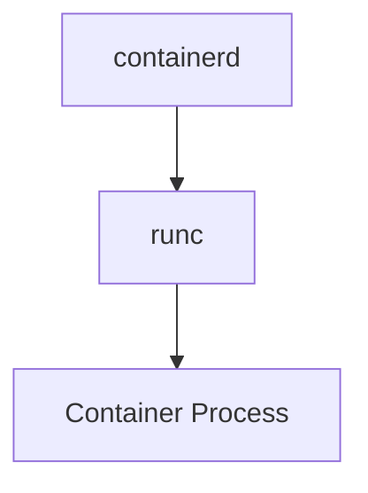

# Writing docs for kata-containers (mkdocs-materialx)

The site is built by `mkdocs-materialx` (fork of `mkdocs-material`) using `mkdocs.yaml` at the repo root and `docs/.nav.yml` (via `mkdocs-awesome-nav`) for navigation. Don't write Markdown that ignores these features — readers see a themed, JS-enhanced site, not raw GitHub.

References:
- mkdocs-materialx: https://jaywhj.github.io/mkdocs-materialx/
- mkdocs-material reference (upstream, applies unless overridden): https://squidfunk.github.io/mkdocs-material/reference/
- awesome-nav: https://lukasgeiter.github.io/mkdocs-awesome-nav/

## Hard rules

1. **Never write a "Table of Contents" section.** The right sidebar is generated automatically from headings (`toc` + `toc.follow` is enabled). A handwritten TOC duplicates it and goes stale.
2. **Never use `>` blockquotes for notes/warnings/tips.** Use admonitions (see below). Real quotes from a person/spec are still fine with `>`.
3. **Never add a "Navigation" / "See also page X / Y / Z" list at the bottom for navigation purposes.** The left/top nav is driven by `docs/.nav.yml`. Cross-references inside prose are fine; manual nav blocks are not.
4. **Don't move existing pages.** Page URLs map directly from file paths under `docs/`. Renames break inbound links. If you must rename, add an entry to a redirects config (the `mkdocs-redirects` plugin is in `docs/requirements.txt` — check whether it's wired into `mkdocs.yaml` before relying on it).
5. **New pages must be added to `docs/.nav.yml`** under the right section. A page not listed there will still be reachable by URL but won't appear in the navigation.
6. **Don't add a top-level `# Title` that duplicates the nav label** more than necessary — one `#` heading per page is the page title; subsequent sections use `##` and below.

## Admonitions (replace `>` notes)

Enabled via `admonition` + `pymdownx.details`. Use these instead of bolded "Note:" lines or blockquotes.

```markdown
!!! note
    Plain note. The blank-line + 4-space indent is required.

!!! warning "Custom title"
    Warning with a custom title.

!!! tip
    Tips, hints, pro-tips.

!!! danger
    Use for things that can destroy data / break a host.

??? note "Click to expand"
    Collapsed by default (`???`). Use for long aside content.

???+ note "Open by default, collapsible"
    Rendered open but the reader can collapse it (`???+`).
```

Supported types include: `note`, `abstract` (`summary`/`tldr`), `info`, `tip` (`hint`/`important`), `success` (`check`/`done`), `question` (`help`/`faq`), `warning` (`caution`/`attention`), `failure` (`fail`/`missing`), `danger` (`error`), `bug`, `example`, `quote`. Pick the type that matches the content — don't default everything to `note`.

## Code blocks

Always fence with a language identifier — `pymdownx.highlight` (with `auto_title`, `anchor_linenums`, `pygments_lang_class`) plus `content.code.copy` and `content.code.select` give syntax highlighting, a copy button, and selectable lines for free.

```markdown
```toml title="/etc/containerd/config.toml"
imports = ["/opt/kata/containerd/config.d/kata-deploy.toml"]
```
```

Useful attributes:
- `title="path/or/label"` — renders a header on the block (use this for files / file paths; see `docs/index.md` for the established pattern).
- `linenums="1"` — show line numbers.
- `hl_lines="2 4-6"` — highlight specific lines.

**Code annotations** are enabled (`content.code.annotate`). Drop `# (1)!` style markers in code and explain them in a list under the block:

```markdown
```bash
kata-runtime version  # (1)!
```

1. Prints the runtime build info and exits.
```

**Inline code highlighting** works too (`pymdownx.inlinehilite`): `` `#!python range(10)` `` renders syntax-highlighted inline.

## Tabbed content

Use for "different ways to do the same thing" (e.g. distro-specific install commands, hypervisor variants):

```markdown
=== "Ubuntu"
    ```bash
    sudo apt install kata-containers
    ```

=== "Fedora"
    ```bash
    sudo dnf install kata-containers
    ```
```

`content.tabs.link` is enabled, so choosing "Ubuntu" on one page sticks across the whole site. Use the same tab labels on every page for that to work.

## Diagrams

Mermaid is wired into `pymdownx.superfences`. Prefer mermaid over ASCII art for flows/architecture:

```markdown

```

See `docs/index.md` for an established example.

## Other enabled features worth using

- **Definition lists** (`def_list`): for term/definition pairs — cleaner than tables for short defs.
  ```markdown
  VMM
  :   Virtual Machine Monitor. Hypervisor process (QEMU, Cloud Hypervisor, Firecracker).
  ```
- **Footnotes**: `…some claim[^1].` with `[^1]: source` later. Tooltips are enabled (`content.footnote.tooltips`), so the text shows on hover.
- **Abbreviations** (`abbr`): define once with `*[VMM]: Virtual Machine Monitor`, and every `VMM` on the page gets a tooltip.
- **Keys** (`pymdownx.keys`): keyboard shortcuts — `++ctrl+c++` renders as <kbd>Ctrl</kbd>+<kbd>C</kbd>.
- **Marks/sub/super**: `==highlight==`, `H~2~O`, `X^2^`.
- **Magic links** (`pymdownx.magiclink`): bare URLs and `user/repo#123` style refs are auto-linked — don't bother wrapping them.
- **Emoji** (`pymdownx.emoji`): `:material-rocket:` etc. resolve to Material icons / Twemoji.
- **Tooltips on links**: `[term](url "tooltip text")` — second arg becomes a hover tooltip.
- **md_in_html**: you can use Markdown inside `<div markdown>` blocks if you need raw HTML wrappers.

## Navigation (`docs/.nav.yml`)

The nav is plugin-driven (`mkdocs-awesome-nav`), not declared in `mkdocs.yaml`. Shape:

```yaml
nav:
  - Section Name:
    - Subsection:
      - Display Label: path/to/file.md
      - other-file.md            # uses the file's H1 as the label
  - Another Section:
    - design/architecture/        # trailing slash includes the whole subtree
```

Rules:
- Add new pages here when you create them. Pick the section that matches the page's audience (`Guides > How To` for procedural, `Guides > Use Cases` for end-to-end scenarios, `Platform Support` for hardware/hypervisor reference, `Misc` for design/architecture).
- A bare path (no `Display Label:`) uses the file's first `#` heading — make sure that heading is the label you want shown.
- A trailing-slash directory entry pulls in the whole tree underneath.

## Style conventions for this repo

- Page filenames are kebab-case (`how-to-build-and-deploy-local-artifacts.md`), with occasional capitalized acronyms (`NVIDIA-GPU-passthrough-and-Kata.md`). Match the established neighbors in the same directory.
- One `# Page Title` per file, then `##` for sections.
- Prefer concrete shell snippets with `title="$ command"` framing over prose descriptions when the reader's next action is to run a command.
- Cross-reference other docs with relative Markdown links: `[Developer Guide](Developer-Guide.md)`. Don't hardcode the published site URL.
- For images / SVGs / favicons, put them under `docs/assets/` and reference with a relative path.

## When you finish a docs change

1. Built the page mentally — does it use admonitions instead of `>` for asides? No hand-written TOC? No manual "next page" links?
2. Added the new file to `docs/.nav.yml`?
3. Any moved/renamed files — did you update inbound links?
4. **Run `make docs-lint` from the repo root.** This runs spellcheck (`cspell` against `.cspell.yaml`) and the editorconfig checker. It's the same lint CI will enforce, so fixing it locally is cheaper than a round-trip.
   - Spellcheck failures: if a flagged word is a real project term (binary name, API name, acronym), add it to `tests/spellcheck/kata-dictionary.txt` rather than rewording. If it's a genuine typo, fix it. Code blocks and inline backticks are already ignored, so don't try to escape technical strings by reflowing them.
   - editorconfig failures: per `.editorconfig`, files must be UTF-8, LF line endings, end with a final newline, and have no trailing whitespace on any line.
5. If the user is reviewing the result visually, suggest `make docs-serve` from the repo root (binds to `http://0.0.0.0:8000/kata-containers/`) — that's the canonical preview command per `docs/doc-contributing.md`.
