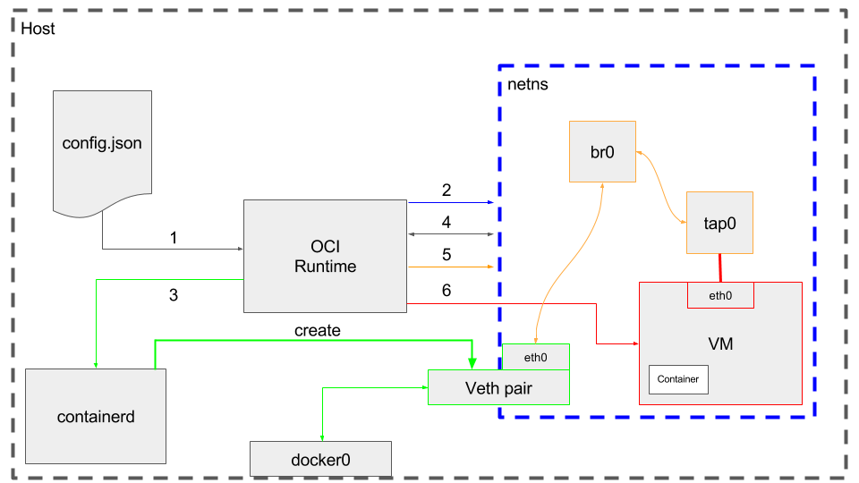

# Kata Containers Architecture

* [Overview](#overview)
    * [Hypervisor](#hypervisor)
      * [Assets](#assets)
        * [Guest kernel](#guest-kernel)
        * [Root filesystem image](#root-filesystem-image)
    * [Agent](#agent)
    * [Runtime](#runtime)
        * [Configuration](#configuration)
        * [Significant commands](#significant-commands)
            * [create](#create)
            * [start](#start)
            * [exec](#exec)
            * [kill](#kill)
            * [delete](#delete)
    * [Proxy](#proxy)
    * [Shim](#shim)
    * [Networking](#networking)
    * [Storage](#storage)
    * [Kubernetes Support](#kubernetes-support)
        * [Problem Statement](#problem-statemem)
        * [OCI Annotations](#oci-annotations)
        * [Generalization](#generalization)
        * [Mixing VM based and namespace based runtimes](#mixing-vm-based-and-namespace-based-runtimes)
* [Appendices](#appendices)
    * [DAX](#dax)
    * [Previous Releases](#previous-releases)
    * [Resources](#resources)

## Overview

This is an architectural overview of Kata Containers, based on the 1.0 release.

The two primary deliverables of the Kata Containers project are a container runtime
and a CRI friendly library API.

The [Kata Containers runtime (kata-runtime)](https://github.com/kata-containers/runtime)
is compatible with the [OCI](https://github.com/opencontainers) [runtime specification](https://github.com/opencontainers/runtime-spec)
and therefore works seamlessly with the
[Docker\* Engine](https://www.docker.com/products/docker-engine) pluggable runtime
architecture. It also supports the [Kubernetes\* Container Runtime Interface (CRI)](https://github.com/kubernetes/kubernetes/tree/master/pkg/kubelet/apis/cri/v1alpha1/runtime)
through the [CRI-O\*](https://github.com/kubernetes-incubator/cri-o) and
[CRI-containerd\*](url here) implementation. In other words, you can transparently
select between the [default Docker and CRI shim runtime (runc)](https://github.com/opencontainers/runc)
and `kata-runtime`.


`kata-runtime` creates a QEMU\*/KVM virtual machine for each container or pod
the Docker engine or Kubernetes' `kubelet` creates.

The container process is then spawned by an
[agent](https://github.com/kata-containers/agent) running as a daemon inside
the virtual machine. The agent runs a gRPC server in the guest.  This runs on a
virtio serial interface in the guest, and QEMU exposes them as a serial device on
the host. `kata-runtime` uses gRPC protocol the control device for sending container management
commands to the agent while the I/O serial device is used to pass I/O streams (`stdout`, `stderr`,
`stdin`) between the guest and the Docker Engine.

For any given container, both the init process and all potentially executed
commands within that container, together with their related I/O streams, need
to go through the virtio serial interface exported by QEMU. A [Kata Containers
proxy (`kata-proxy`)](https://github.com/kata-containers/proxy) instance is
launched for each virtual machine to handle multiplexing and demultiplexing
those commands and streams.

On the host, each container process's removal is handled by a reaper in the higher
layers of the container stack. In the case of Docker it is handled by `containerd-shim`.
In the case of CRI-O it is handled by `conmon`. For clarity, for the remainder
of this document the term "container process reaper" will be used to refer to
either reaper. As Kata Containers processes run inside their own  virtual machines,
the container process reaper cannot monitor, control
or reap them. `kata-runtime` fixes that issue by creating an [additional shim process
(`kata-shim`)](https://github.com/kata-containers/shim) between the container process
reaper and `kata-proxy`. A `kata-shim` instance will both forward signals and `stdin`
streams to the container process on the guest and pass the container `stdout`
and `stderr` streams back up the stack to the CRI shim or Docker via the container process
reaper. `kata-runtime` creates a `kata-shim` daemon for each container and for each
OCI command received to run within an already running container (example, `docker
exec`).

The container workload, that is, the actual OCI bundle rootfs, is exported from the
host to the virtual machine.  In the case where a block-based graph driver is
configured, virtio-scsi will be used. In all other cases a 9pfs virtio mount point
will be used. `kata-agent` uses this mount point as the root filesystem for the
container processes.


## Hypervisor

Kata Containers is designed to support multiple hypervisors.  For the 1.0 release,
Kata Containers uses just [QEMU](http://www.qemu-project.org/)/[KVM](http://www.linux-kvm.org/page/Main_Page)
to create virtual machines where containers will run:


Although Kata Containers can run with any recent QEMU release, Kata Containers
boot time and memory footprint are significantly optimized by using a specific QEMU
version called [`qemu-lite`](https://github.com/kata-containers/qemu/tree/qemu-lite-2.11.0).
Kata Containers supports various machine types, including `pc`, `pc-lite` and `q35`.
Kata Containers defaults to using the `pc` machine type. In the past
`pc-lite` was utilized which provided the following improvements:
- Removed many of the legacy hardware devices support so that the guest kernel
  does not waste time initializing devices of no use for containers.
- Skipped the guest BIOS/firmware and jumped straight to the Clear Containers
  kernel.

### Assets

## Hypervisor

Kata Containers are designed to support multiple hypervisors. For the 1.0 release, Kata Containers use just [QEMU](http://www.qemu-project.org/)/[KVM](http://www.linux-kvm.org/page/Main_Page) to create virtual machines where containers will run:


Depending of the host architecture, Kata Containers support various machine types, for example `pc` and `q35` on x86 systems and `virt` on ARM systems. Kata Containers default to use the `pc` machine type on x86 systems and `virt` on ARM systems, the default machine type and its [`Machine accelerators`](#Machine-accelerators) can be changed by editing the runtime [`configuration`](#Configuration) file.

Next QEMU features are used in Kata Containers to manage resource constraints, improve boot time and reduce memory footprint:

- Machine accelerators.
- Hot plug devices.

Each feature is documented below.

### Machine accelerators

Machine accelerators are architecture specific and can used to improve the performance and enable specific features of the machine types. Next machine accelerators are used in Kata Containers:

- nvdimm: This machine accelerator is x86 specific and only supported by `pc` and `q35` machine types. `nvdimm` is used to provide the root filesystem as persistent memory device to the Virtual Machine.

Although Kata Containers can run with any recent QEMU release, Kata Containers
boot time, memory footprint and 9p IO are significantly optimized by using a specific QEMU version called [`qemu-lite`](https://github.com/kata-containers/qemu/tree/qemu-lite-2.11.0) and custom machine accelerators that are not available in the upstream version of QEMU. These custom machine accelerators are described below.

- nofw: this machine accelerator is x86 specific and only supported by `pc` and `q35` machine types. `nofw` is used to boot an ELF format kernel by skipping the BIOS/firmware in the guest. This custom machine accelerator improves the boot time significantly.
- static-prt: this machine accelerator is x86 specific and only supported by `pc` and `q35` machine types. `static-prt` is used to reduce the interpretation burden for guest ACPI component.

### Hot plug devices

In order to improve boot time, reduce memory footprint and since running containers can be updated at any time, Kata Containers start with minimum amount of resources to attach devices when is needed. One example of this behavior is when a CPU constraint is specified, CPUs can be hot added or removed depending of the constraint specified.
Currently Kata Containers have support for hot adding next devices:

- Virtio block
- Virtio SCSI
- VFIO
- CPU

#### Guest kernel

The guest kernel is passed to the hypervisor and used to boot the virtual
machine. It is highly optimized for kernel boot time and minimal memory
footprint, providing only those services required by a container workload.

#### Root filesystem image

The root filesystem image, sometimes referred to as the "mini O/S", is a
highly optimised container bootstrap system based on [Clear Linux](https://clearlinux.org/).
It provides an extremely minimal environment and has a highly optimised boot
path.

TODO: enter section here about using initrd, and also about the customization..

The only services running in the context of the mini O/S are the init daemon
(`systemd`) and the [Agent](#agent). The real workload the user wishes to run
is created using libcontainer, creating a container in the same manner that is done
via runc.

For example, when `docker run -ti ubuntu date` is run:

- The hypervisor will boot the mini-OS image using the guest kernel.
- `systemd`, running inside the mini-OS context, will launch the `kata-agent` in
  the same context.
- The agent will create a new confined context to run the specified command in
  (`date` in this example).
- The agent will then execute the command (`date` in this example) inside this
  new context, first setting the root filesystem to the expected Ubuntu* root
  filesystem. <--talk more about how we are like a lightweight/stripped down runc here.

## Agent

[`kata-agent`](https://github.com/kata-containers/agent) is a daemon running in the
guest as a supervisor for managing containers and processes running within
those containers.

The `kata-agent` execution unit is the sandbox. A `kata-agent` sandbox is a container sandbox
defined by a set of namespaces (NS, UTS, IPC and PID). `kata-runtime` can run several
containers per pod to support container engines that require multiple containers
running inside a single VM. In the case of docker, `kata-runtime` creates a single
container per pod.

`kata-agent` uses a gRPC communication protocol defined at some URL. It also runs
a [`yamux`](https://github.com/hashicorp/yamux) server on the same URL.

The `kata-agent` API consists of:
* list Here
* more stuff

The `kata-agent` makes use of [`libcontainer`](https://github.com/opencontainers/runc/tree/master/libcontainer)
to manage the lifecycle of the container. This way the `kata-agent` reuses most
of the code used by [`runc`](https://github.com/opencontainers/runc).

## Runtime

`kata-runtime` is an OCI compatible container runtime and is responsible for handling
all commands specified by
[the OCI runtime specification](https://github.com/opencontainers/runtime-spec)
and launching `kata-shim` instances.

`kata-runtime` heavily utilizes the
[virtcontainers project](https://github.com/containers/virtcontainers), which
provides a generic, runtime-specification agnostic, hardware-virtualized containers
library.

### Configuration

The runtime uses a TOML format configuration file called `configuration.toml`. By
default this file is installed in the `/usr/share/defaults/kata-containers`
directory and contains various settings such as the paths to the hypervisor,
the guest kernel and the mini-OS image.

Most users will not need to modify the configuration file.

The file is well commented and provides a few "knobs" that can be used to modify
the behavior of the runtime.

The configuration file is also used to enable runtime debug output (see
some url to documentation on how to enable debug).

### Significant OCI commands

Here we will describe how `kata-runtime` handles the most important OCI commands.

#### [`create`](https://github.com/kata-containers/runtime/blob/master/cli/create.go)

When handling the OCI `create` command, `kata-runtime` goes through the following steps:

1. Create the network namespace where we will spawn VM and shims processes.
2. Call into the pre-start hooks. One of them should be responsible for creating the `veth` network pair between the host network namespace and the network namespace freshly created.
3. Scan the network from the new network namespace, and create the MACVTAP connection between the `veth` interface and a `tap` interface that we create.
4. Start the VM inside the network namespace by providing the `tap` interface previously created.
5. Wait for the VM to be ready, otherwise the next step spawning the proxy might fail by not being able to connect the VM.
6. Start `kata-proxy`, and it will take care of connecting to the VM. This process will take care of proxying all communications with the VM. We rely on an architecture model with one proxy per VM.
7. Communicate with `kata-agent` (connecting the proxy) to configure the sandbox inside the VM.
8. Communicate with `kata-agent` (connecting the proxy) to create the container, and relying on the OCI configuration file `config.json` initially provided to `kata-runtime`. This actually spawns the container process inside the VM, leveraging the `libcontainer` package.
9. Start `kata-shim`, which will connect to the gRPC server socket, the `kata-proxy` socket in this case. It will spawn a few Go routines to parallelize blocking calls `ReadStdout()` , `ReadStderr()` and `WaitProcess()`. Both `ReadStdout()` and `ReadStderr()` are run through infinite loops since `kata-shim` wants the output of those until the container process terminates. `WaitProcess()` is a unique call which returns the exit code of the container process when it terminates inside the VM. Note that `kata-shim` is started inside the network namespace, to allow upper layers to determine which network namespace has been created and by checking the `kata-shim` process. It also creates a new PID namespace by entering into it. This ensures that all `kata-shim` processes belonging to the same container will get killed when the `kata-shim` representing the container process terminates.

At this point, the VM is running and `kata-shim` process represents the container process running inside the VM. It is seen as the container process from an OCI perspective.

#### [`start`](https://github.com/kata-containers/runtime/blob/master/cli/start.go)

With namespaced containers, `start` launches a traditional Linux container process
in its own set of namespaces. With Kata Containers, the main task of `kata-runtime`
is to ask [`kata-agent`](#agent) to start the container workload inside the virtual machine.
In practice, this means `kata-runtime` will run through the following steps:

1. Communicate with `kata-agent` (connecting the proxy) to start the container workload inside the VM. For instance, if the command to execute is `top`, pending `kata-shim` call into `ReadStdout()` will start returning some outputs. And `WaitProcess()` will continue to block as long as this process runs.
2. Call into the post-start hooks. Usually, this is a no-op since nothing is provided.

#### [`exec`](https://github.com/kata-containers/runtime/blob/master/cli/exec.go)

OCI `exec` allows you to run an additional command within an already running
container through the following steps:

1. Communicate with `kata-agent` (connecting the proxy) to start a new process inside an existing container running inside the VM.
2. Start a new `kata-shim` inside the same network and PID namespaces as the `kata-shim` representing the container process.

Now the `exec`'ed process is running in the VM, sharing `uts`, `pid`, `mnt` and `ipc` namespaces with the container process.

#### [`kill`](https://github.com/kata-containers/runtime/blob/master/cli/kill.go)

When sending the OCI `kill` command, container runtime should send a [UNIX signal](https://en.wikipedia.org/wiki/Unix_signal) to the container process. But a `kill` sending a termination signal such as `SIGKILL` or `SIGTERM`, is expected to actually terminate the container process, which means stopping the container from a nameespaced container perspective.
Applying this to Kata Containers translates into stopping the container and the VM associated with it.

1. Communicate with `kata-agent` (connecting the proxy) to signal the container process inside the VM.
2. If the signal was not a termination signal (`SIGTERM` or `SIGKILL`), nothing else needs to be done.
3. Wait for `kata-shim` process to exit.
4. Force kill the container process if `kata-shim` process didn't return after a timeout. This is done by communicating with `kata-agent` (connecting the proxy), sending `SIGKILL` signal to the container process inside the VM.
5. Wait for `kata-shim` process to exit, and return an error if we reach the timeout again.
6. Communicate with `kata-agent` (connecting the proxy) to remove the container configuration from the VM.
7. Communicate with `kata-agent` (connecting the proxy) to destroy the sandbox configuration from the VM.
8. Stop the VM. This is not waiting for the end of the VM in order to save some time.
9. Remove all the network configuration inside the network namespace and delete it.
10. Execute post-stop hooks. Usually a no-op.

If `kill` was invoked with a non-termination signal, this simply signalled the container process.
Otherwise, everything has been torn down, and the VM has been shut down.

#### [`delete`](https://github.com/kata-containers/runtime/blob/master/cli/delete.go)

`delete` is about deleting all internal resources related to a container.
A running container cannot be deleted unless the OCI runtime is explicitly being
asked to, by using `--force` flag.

If the sandbox is not stopped, which could happen if `kill` was not called, but the process would have returned on his own instead, it would first go through most of the steps `kill` would go for a termination signal.

1. Wait for `kata-shim` process to exit.
2. Force kill the container process if `kata-shim` process didn't return after a timeout. This is done by communicating with `kata-agent` (connecting the proxy), sending `SIGKILL` signal to the container process inside the VM.
3. Wait for `kata-shim` process to exit, and return an error if we reach the timeout again.
4. Communicate with `kata-agent` (connecting the proxy) to remove the container configuration from the VM.
5. Communicate with `kata-agent` (connecting the proxy) to destroy the sandbox configuration from the VM.
6. Stop the VM. This is not waiting for the end of the VM in order to save some time.
7. Remove all the network configuration inside the network namespace and delete it.
8. Execute post-stop hooks. Usually a no-op.
9. Remove container resources. Every file kept under `/var/{lib,run}/virtcontainers/sandboxes/<sandboxID>/<containerID>`.
10. Remove sandbox resources. Every file kept under `/var/{lib,run}/virtcontainers/sandboxes/<sandboxID>`.

If the sandbox was already stopped, then it is very simple:

1. Remove container resources. Every file kept under `/var/{lib,run}/virtcontainers/sandboxes/<sandboxID>/<containerID>`.
2. Remove sandbox resources. Every file kept under `/var/{lib,run}/virtcontainers/sandboxes/<sandboxID>`.

At this point, everything related to the container should have been removed from the host system, and no related process should be running anymore.

#### [`state`](https://github.com/kata-containers/runtime/blob/master/cli/state.go)

`state` returns the status of the container. In Kata Containers context, this means being able to detect if the container is still running by looking at the state of `kata-shim` process representing this container process.

1. Ask the container status by checking information stored on disk.
2. Check `kata-shim` process representing the container.
3. In case the container status on disk was supposed to be `ready` or `running`, and the `kata-shim` process is not around, this involves the detection of a stopped container. This means that before returning the container status, the container has to be properly stopped. Here are the steps involved by this detection:
	1. Wait for `kata-shim` process to exit.
	2. Force kill the container process if `kata-shim` process didn't return after a timeout. This is done by communicating with `kata-agent` (connecting the proxy), sending `SIGKILL` signal to the container process inside the VM.
	3. Wait for `kata-shim` process to exit, and return an error if we reach the timeout again.
	4. Communicate with `kata-agent` (connecting the proxy) to remove the container configuration from the VM.
4. Return container status.


## Proxy

make sure we discuss that this is optional, and also describe no proxy operation

`kata-proxy` is a process offering access to the VM [`kata-agent`](https://github.com/kata-containers/agent)
to multiple `kata-shim` and `kata-runtime` clients associated with the VM. Its
main role is to route the I/O streams and signals between each `kata-shim`
instance and the `kata-agent`.
`kata-proxy` connects to `kata-agent` on a unix domain socket that `kata-runtime` provides
while spawning `kata-proxy`.
`kata-proxy` uses [`yamux`](https://github.com/hashicorp/yamux) to multplex gRPC
requests on its connection to the `kata-agent`.

When proxy type is configured as "proxyBuiltIn", we do not spawn a separate
process to proxy grpc connections. Instead a built-in yamux grpc dialer is used to connect
directly to `kata-agent`. This is used by CRI container runtime server `frakti` which
calls directly into `kata-runtime`.

## Shim

A container process reaper, such as Docker's `containerd-shim` or CRI-O's `conmon`,
is designed around the assumption that it can monitor and reap the actual container
process. As the container process reaper runs on the host, it cannot directly
monitor a process running within a virtual machine. At most it can see the QEMU
process, but that is not enough. With Kata Containers, `kata-shim` acts as the
container process that the container process reaper can monitor. Therefore
`kata-shim` needs to handle all container I/O streams (`stdout`, `stdin` and `stderr`)
and forward all signals the container process reaper decides to send to the container
process.

`kata-shim` has an implicit knowledge about which VM agent will handle those streams
and signals and thus acts as an encapsulation layer between the container process
reaper and the `kata-agent`. `kata-shim`:

- Connects to `kata-proxy` on a unix domain socket. The socket url is passed from
  `kata-runtime` to `kata-shim` when the former spawns the latter along with a
  `containerID` and `execID`. The `containerID` and `execID` are used to identify
  the true container process that the shim process will be shadowing or representing.
- Forwards the standard input stream from the container process reaper into
 `kata-proxy` using grpc `WriteStdin` gRPC API.
- Reads the standard output/error from the container process to the
- Forwards signals it receives from the container process reaper to `kata-proxy`
  using `SignalProcessRequest` API.
- Monitors terminal changes and forwards them to `kata-proxy` using grpc `TtyWinResize`
  API.


## Networking

Containers will typically live in their own, possibly shared, networking namespace.
At some point in a container lifecycle, container engines will set up that namespace
to add the container to a network which is isolated from the host network, but
which is shared between containers

In order to do so, container engines will usually add one end of a `virtual ethernet
(veth)` pair into the container networking namespace. The other end of the `veth`
pair
is added to the container network.

This is a very namespace-centric approach as QEMU cannot handle `veth` interfaces.
Instead it typically creates `TAP` interfaces for adding connectivity to a virtual
machine.

To overcome that incompatibility between typical container engines expectations
and virtual machines, `cc-runtime` networking transparently bridges `veth`
interfaces with `TAP` ones:


Clear Containers supports both
[CNM](https://github.com/docker/libnetwork/blob/master/docs/design.md#the-container-network-model)
and [CNI](https://github.com/containernetworking/cni) for networking management.

### CNM


__CNM lifecycle__

1.  RequestPool

2.  CreateNetwork

3.  RequestAddress

4.  CreateEndPoint

5.  CreateContainer

6.  Create `config.json`

7.  Create PID and network namespace

8.  ProcessExternalKey

9.  JoinEndPoint

10. LaunchContainer

11. Launch

12. Run container



__Runtime network setup with CNM__

1. Read `config.json`

2. Create the network namespace

3. Call the prestart hook (from inside the netns)

4. Scan network interfaces inside netns and get the name of the interface
  created by prestart hook

5. Create bridge, TAP, and link all together with network interface previously
  created

### CNI


__Runtime network setup with CNI__

1. Create the network namespace.

2. Get CNI plugin information.

3. Start the plugin (providing previously created network namespace) to add a network
  described into `/etc/cni/net.d/ directory`. At that time, the CNI plugin will
  create the `cni0` network interface and a veth pair between the host and the created
  netns. It links `cni0` to the veth pair before to exit.

4. Create network bridge, TAP, and link all together with network interface previously
  created.

5. Start VM inside the netns and start the container.

## Storage
Container workloads are shared with the virtualized environment through [9pfs](https://www.kernel.org/doc/Documentation/filesystems/9p.txt).
The devicemapper storage driver is a special case. The driver uses dedicated block
devices rather than formatted filesystems, and operates at the block level rather than the file
level. This knowledge is used to directly use the underlying block device
instead of the overlay file system for the container root file system. The block
device maps to the top read-write layer for the overlay. This approach gives much
better I/O performance compared to using 9pfs to share the container file system.

The approach above does introduce a limitation in terms of dynamic file copy
in/out of the container using the `docker cp` operations. The copy operation from
host to container accesses the mounted file system on the host-side. This is
not expected to work and may lead to inconsistencies as the block device will
be simultaneously written to from two different mounts. The copy operation from
container to host will work, provided the user calls `sync(1)` from within the
container prior to the copy to make sure any outstanding cached data is written
to the block device.

```
docker cp [OPTIONS] CONTAINER:SRC_PATH HOST:DEST_PATH
docker cp [OPTIONS] HOST:SRC_PATH CONTAINER:DEST_PATH
```

Clear Containers has the ability to hotplug and remove block devices, which makes it
possible to use block devices for containers started after the VM has been launched.

Users can check to see if the container uses the devicemapper block device as its
rootfs by calling `mount(8)` within the counter.  If the devicemapper block device
is used, `/` will be mounted on `/dev/vda`.  Users can disable direct mounting
of the underlying block device through the runtime configuration.

## Kubernetes support

[Kubernetes\*](https://github.com/kubernetes/kubernetes/) is a popular open source
container orchestration engine. In Kubernetes, a set of containers sharing resources
such as networking, storage, mount, PID, etc. is called a
[Pod](https://kubernetes.io/docs/user-guide/pods/).
A node can have multiple pods, but at a minimum, a node within a Kubernetes cluster
only needs to run a container runtime and a container agent (called a
[kubelet](https://kubernetes.io/docs/admin/kubelet/)).

A Kubernetes cluster runs a control plane where a scheduler (typically running on a
dedicated master node) calls into a compute kubelet. This kubelet instance is
responsible for managing the lifecycle of pods within the nodes and eventually relies
on a container runtime to handle execution. The kubelet architecture decouples
lifecycle management from container execution through the dedicated
[`gRPC`](https://github.com/kubernetes/kubernetes/blob/master/pkg/kubelet/apis/cri/v1alpha1/runtime/api.proto)
based [Container Runtime Interface (CRI)](https://github.com/kubernetes/community/blob/master/contributors/design-proposals/node/container-runtime-interface-v1.md).

In other words, a kubelet is a CRI client and expects a CRI implementation to
handle the server side of the interface.
[CRI-O\*](https://github.com/kubernetes-incubator/cri-o) is a CRI implementation
that relies on [OCI](https://github.com/opencontainers/runtime-spec) compatible
runtimes for managing container instances.

Clear Containers is an officially supported CRI-O runtime. It is OCI compatible and
therefore aligns with CRI-O architecture and requirements.
However, due to the fact that Kubernetes execution units are sets of containers (also
known as pods) rather than single containers, the Clear Containers runtime needs to
get extra information to seamlessly integrate with Kubernetes.

### Problem statement

The Kubernetes\* execution unit is a pod that has specifications detailing constraints
such as namespaces, groups, hardware resources, security contents, *etc* shared by all
the containers within that pod.
By default the kubelet will send a container creation request to its CRI runtime for
each pod and container creation. Without additional metadata from the CRI runtime,
the Clear Containers runtime will thus create one virtual machine for each pod and for
each containers within a pod. However the task of providing the Kubernetes pod semantics
when creating one virtual machine for each container within the same pod is complex given
the resources of these virtual machines (such as networking or PID) need to be shared.

The challenge with Clear Containers when working as a Kubernetes\* runtime is thus to know
when to create a full virtual machine (for pods) and when to create a new container inside
a previously created virtual machine. In both cases it will get called with very similar
arguments, so it needs the help of the Kubernetes CRI runtime to be able to distinguish a
pod creation request from a container one.

### OCI annotations

#### CRI-O

In order for the Clear Containers runtime (or any virtual machine  based OCI compatible
runtime) to be able to understand if it needs to create a full virtual machine or if it
has to create a new container inside an existing pod's virtual machine, CRI-O adds
specific annotations to the OCI configuration file (`config.json`) which is passed to
the OCI compatible runtime.

Before calling its runtime, CRI-O will always add a `io.kubernetes.cri-o.ContainerType`
annotation to the `config.json` configuration file it produces from the kubelet CRI
request. The `io.kubernetes.cri-o.ContainerType` annotation can either be set to `sandbox`
or `container`. Clear Containers will then use this annotation to decide if it needs to
respectively create a virtual machine or a container inside a virtual machine associated
with a Kubernetes pod:

```Go
	containerType, err := ociSpec.ContainerType()
	if err != nil {
		return err
	}

	switch containerType {
	case vc.PodSandbox:
		process, err = createPod(ociSpec, runtimeConfig, containerID, bundlePath, console, disableOutput)
		if err != nil {
			return err
		}
	case vc.PodContainer:
		process, err = createContainer(ociSpec, containerID, bundlePath, console, disableOutput)
		if err != nil {
			return err
		}
	}

```

#### CRI-containerd

We need to add a comparable section to detail how this is handled in containerd.
If it is indentical then we should make the annotations section more generic. looking
for help from Carlos here.

### Generalization

The Kata Containers runtime is based on the `virtcontainers` package whose API is
inspired by the Kubernetes CRI one. `virtcontainers` execution units are sandboxes,
an equivalent of pods and it does not create or manage any container outside of
an existing sandbox context, and thus so does the Kata Containers runtime.
To create a Docker container it will first create a pod which will represent the container
hardware virtualized context and then start an actual container inside that virtual machine.
Both the pod and its container have the same identifier and name.

### Mixing VM based and namespace based runtimes

**We will need to update this section in order to generalize how it is handled in
CRI-O as well as in containerd.**

One interesting evolution of the CRI-O support for the Clear Containers runtime is the ability
to run virtual machine based pods alongside namespace ones. With CRI-O and Clear Containers,
one can introduce the concept of workload trust inside a Kubernetes cluster.

A cluster operator can now tag (through Kubernetes annotations) container workloads as `trusted`
or `untrusted`. The former labels known to be safe workloads while the latter describes
potentially malicious or misbehaving workloads that need the highest degree of isolation.
In a software development context, an example of a `trusted` workload would be a containerized
continuous integration engine whereas all developers applications would be `untrusted` by default.
Developers workloads can be buggy, unstable or even include malicious code and thus from a
security perspective it makes sense to tag them as `untrusted`. A CRI-O and Clear Containers
based Kubernetes cluster handles this use case transparently as long as the deployed containers
are properly tagged. All `untrusted` containers will be handled by Clear Containers and thus run
in a hardware virtualized secure sandbox whilst `runc`, for example, could  handle the
`trusted` ones.

CRI-O's default behaviour is to trust all pods, except when they're annotated with
`io.kubernetes.cri-o.TrustedSandbox` set to `false`. The default CRI-O trust level is
set through its `configuration.toml` configuration file. Generally speaking, the CRI-O
runtime selection between its trusted runtime (typically `runc`) and its untrusted one
(Clear Containers) is a function of the pod `Privileged` setting, the `io.kubernetes.cri-o.TrustedSandbox`
annotation value, and the default CRI-O trust level. When a pod is `Privileged`, the
runtime will always be `runc`. However, when a pod is **not** `Privileged` the runtime
selection is done as follows:

|                                        | `io.kubernetes.cri-o.TrustedSandbox` not set   | `io.kubernetes.cri-o.TrustedSandbox` = `true` | `io.kubernetes.cri-o.TrustedSandbox` = `false` |
| :---                                   |     :---:                                      |     :---:                                     |     :---:                                             |
| Default CRI-O trust level: `trusted`   | runc                                           | runc                                          | Clear Containers |
| Default CRI-O trust level: `untrusted` | Clear Containers                               | Clear Containers                              | Clear Containers |

# Appendices

## DAX

Clear Containers utilises the Linux kernel DAX [(Direct Access filesystem)](https://git.kernel.org/cgit/linux/kernel/git/torvalds/linux.git/tree/Documentation/filesystems/dax.txt)
feature to efficiently map some host-side files into the guest VM space.
In particular, Clear Containers uses the QEMU nvdimm feature to provide a
memory-mapped virtual device that can be used to DAX map the virtual machine's
root filesystem into the guest memory address space.

Mapping files using DAX provides a number of benefits over more traditional VM
file and device mapping mechanisms:

- Mapping as a direct access devices allows the guest to directly access
  the host memory pages (such as via eXicute In Place (XIP)), bypassing the guest
  page cache. This provides both time and space optimisations.
- Mapping as a direct access device inside the VM allows pages from the
  host to be demand loaded using page faults, rather than having to make requests
  via a virtualised device (causing expensive VM exits/hypercalls), thus providing
a speed optimisation.
- Utilising `MAP_SHARED` shared memory on the host allows the host to efficiently
  share pages.

Clear Containers uses the following steps to set up the DAX mappings:
1. QEMU is configured with an nvdimm memory device, with a memory file
  backend to map in the host-side file into the virtual nvdimm space.
2. The guest kernel command line mounts this nvdimm device with the DAX
  feature enabled, allowing direct page mapping and access, thus bypassing the
  guest page cache.


Information on the use of nvdimm via QEMU is available in the [QEMU source code](http://git.qemu-project.org/?p=qemu.git;a=blob;f=docs/nvdimm.txt;hb=HEAD)
