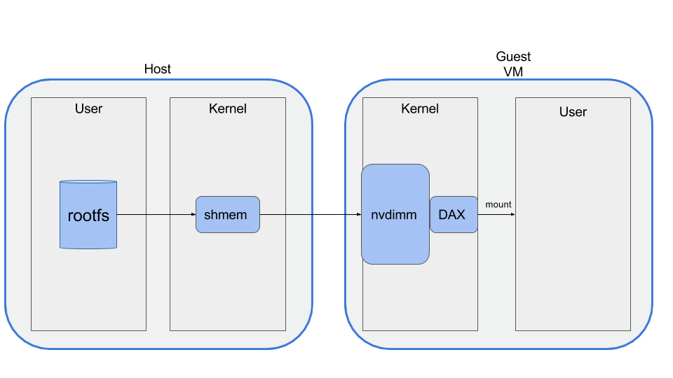

# Kata Containers Architecture


- [Kata Containers Architecture](#kata-containers-architecture)
  - [Overview](#overview)
  - [Virtualization](#virtualization)
  - [Guest assets](#guest-assets)
    - [Guest kernel](#guest-kernel)
    - [Guest image](#guest-image)
      - [Root filesystem image](#root-filesystem-image)
      - [Initrd image](#initrd-image)
  - [Agent](#agent)
  - [Runtime](#runtime)
    - [Configuration](#configuration)
  - [Networking](#networking)
    - [Network Hotplug](#network-hotplug)
  - [Storage](#storage)
  - [Kubernetes support](#kubernetes-support)
      - [OCI annotations](#oci-annotations)
      - [Mixing VM based and namespace based runtimes](#mixing-vm-based-and-namespace-based-runtimes)
- [Appendices](#appendices)
  - [DAX](#dax)

## Overview

This is an architectural overview of Kata Containers, based on the 2.0 release.

The primary deliverable of the Kata Containers project is a CRI friendly shim. There is also a CRI friendly library API behind them.

The [Kata Containers runtime](../../src/runtime)
is compatible with the [OCI](https://github.com/opencontainers) [runtime specification](https://github.com/opencontainers/runtime-spec)
and therefore works seamlessly with the [Kubernetes\* Container Runtime Interface (CRI)](https://github.com/kubernetes/community/blob/master/contributors/devel/sig-node/container-runtime-interface.md)
through the [CRI-O\*](https://github.com/kubernetes-incubator/cri-o) and
[Containerd\*](https://github.com/containerd/containerd) implementation.

Kata Containers creates a QEMU\*/KVM virtual machine for pod that `kubelet` (Kubernetes) creates respectively.

The [`containerd-shim-kata-v2` (shown as `shimv2` from this point onwards)](../../src/runtime/containerd-shim-v2) 
is the Kata Containers entrypoint, which
implements the [Containerd Runtime V2 (Shim API)](https://github.com/containerd/containerd/tree/master/runtime/v2) for Kata.

Before `shimv2` (as done in [Kata Containers 1.x releases](https://github.com/kata-containers/runtime/releases)), we need to create a `containerd-shim` and a [`kata-shim`](https://github.com/kata-containers/shim) for each container and the Pod sandbox itself, plus an optional [`kata-proxy`](https://github.com/kata-containers/proxy) when VSOCK is not available. With `shimv2`, Kubernetes can launch Pod and OCI compatible containers with one shim (the `shimv2`) per Pod instead of `2N+1` shims, and no standalone `kata-proxy` process even if no VSOCK is available.


The container process is then spawned by
[`kata-agent`](../../src/agent), an agent process running
as a daemon inside the virtual machine. `kata-agent` runs a [`ttRPC`](https://github.com/containerd/ttrpc-rust) server in
the guest using a VIRTIO serial or VSOCK interface which QEMU exposes as a socket
file on the host. `shimv2` uses a `ttRPC` protocol to communicate with
the agent. This protocol allows the runtime to send container management
commands to the agent. The protocol is also used to carry the I/O streams (stdout,
stderr, stdin) between the containers and the manage engines (e.g. CRI-O or containerd).

For any given container, both the init process and all potentially executed
commands within that container, together with their related I/O streams, need
to go through the VSOCK interface exported by QEMU.

The container workload, that is, the actual OCI bundle rootfs, is exported from the
host to the virtual machine.  In the case where a block-based graph driver is
configured, `virtio-scsi` will be used. In all other cases a `virtio-fs` VIRTIO mount point
will be used. `kata-agent` uses this mount point as the root filesystem for the
container processes.

## Virtualization

How Kata Containers maps container concepts to virtual machine technologies, and how this is realized in the multiple
hypervisors and VMMs that Kata supports is described within the [virtualization documentation](./virtualization.md)

## Guest assets

The hypervisor will launch a virtual machine which includes a minimal guest kernel
and a guest image.

### Guest kernel

The guest kernel is passed to the hypervisor and used to boot the virtual
machine. The default kernel provided in Kata Containers is highly optimized for
kernel boot time and minimal memory footprint, providing only those services
required by a container workload. This is based on a very current upstream Linux
kernel.

### Guest image

Kata Containers supports both an `initrd` and `rootfs` based minimal guest image.

#### Root filesystem image

The default packaged root filesystem image, sometimes referred to as the "mini O/S", is a
highly optimized container bootstrap system based on [Clear Linux](https://clearlinux.org/). It provides an extremely minimal environment and
has a highly optimized boot path.

The only services running in the context of the mini O/S are the init daemon
(`systemd`) and the [Agent](#agent). The real workload the user wishes to run
is created using libcontainer, creating a container in the same manner that is done
by `runc`.

For example, when `ctr run -ti ubuntu date` is run:

- The hypervisor will boot the mini-OS image using the guest kernel.
- `systemd`, running inside the mini-OS context, will launch the `kata-agent` in
  the same context.
- The agent will create a new confined context to run the specified command in
  (`date` in this example).
- The agent will then execute the command (`date` in this example) inside this
  new context, first setting the root filesystem to the expected Ubuntu\* root
  filesystem.

#### Initrd image

A compressed `cpio(1)` archive, created from a rootfs which is loaded into memory and used as part of the Linux startup process. During startup, the kernel unpacks it into a special instance of a `tmpfs` that becomes the initial root filesystem.

The only service running in the context of the initrd is the [Agent](#agent) as the init daemon. The real workload the user wishes to run is created using libcontainer, creating a container in the same manner that is done by `runc`.

## Agent

[`kata-agent`](../../src/agent) is a process running in the guest as a supervisor for managing containers and processes running within those containers.

For the 2.0 release, the `kata-agent` is rewritten in the [RUST programming language](https://www.rust-lang.org/) so that we can minimize its memory footprint while keeping the memory safety of the original GO version of [`kata-agent` used in Kata Container 1.x](https://github.com/kata-containers/agent). This memory footprint reduction is pretty impressive, from tens of megabytes down to less than 100 kilobytes, enabling Kata Containers in more use cases like functional computing and edge computing.

The `kata-agent` execution unit is the sandbox. A `kata-agent` sandbox is a container sandbox defined by a set of namespaces (NS, UTS, IPC and PID). `shimv2` can
run several containers per VM to support container engines that require multiple
containers running inside a pod.

`kata-agent` communicates with the other Kata components over `ttRPC`.

## Runtime

`containerd-shim-kata-v2` is a [containerd runtime shimv2](https://github.com/containerd/containerd/blob/v1.4.1/runtime/v2/README.md) implementation and is responsible for handling the `runtime v2 shim APIs`, which is similar to [the OCI runtime specification](https://github.com/opencontainers/runtime-spec) but simplifies the architecture by loading the runtime once and making RPC calls to handle the various container lifecycle commands. This refinement is an improvement on the OCI specification which requires the container manager call the runtime binary multiple times, at least once for each lifecycle command.

`containerd-shim-kata-v2` heavily utilizes the
[virtcontainers package](../../src/runtime/virtcontainers/), which provides a generic, runtime-specification agnostic, hardware-virtualized containers library.

### Configuration

The runtime uses a TOML format configuration file called `configuration.toml`. By default this file is installed in the `/usr/share/defaults/kata-containers` directory and contains various settings such as the paths to the hypervisor, the guest kernel and the mini-OS image.

The actual configuration file paths can be determined by running:
```
$ kata-runtime --show-default-config-paths
```
Most users will not need to modify the configuration file.

The file is well commented and provides a few "knobs" that can be used to modify the behavior of the runtime and your chosen hypervisor.

The configuration file is also used to enable runtime [debug output](../Developer-Guide.md#enable-full-debug).

## Networking

Containers will typically live in their own, possibly shared, networking namespace.
At some point in a container lifecycle, container engines will set up that namespace
to add the container to a network which is isolated from the host network, but
which is shared between containers

In order to do so, container engines will usually add one end of a virtual
ethernet (`veth`) pair into the container networking namespace. The other end of
the `veth` pair is added to the host networking namespace.

This is a very namespace-centric approach as many hypervisors/VMMs cannot handle `veth` 
interfaces. Typically, `TAP` interfaces are created for VM connectivity.

To overcome incompatibility between typical container engines expectations
and virtual machines, Kata Containers networking transparently connects `veth`
interfaces with `TAP` ones using Traffic Control:


With a TC filter in place, a redirection is created between the container network and the
virtual machine. As an example, the CNI may create a device, `eth0`, in the container's network
namespace, which is a VETH device. Kata Containers will create a tap device for the VM, `tap0_kata`,
and setup a TC redirection filter to mirror traffic from `eth0`'s ingress to `tap0_kata`'s egress,
and a second to mirror traffic from `tap0_kata`'s ingress to `eth0`'s egress.

Kata Containers maintains support for MACVTAP, which was an earlier implementation used in Kata. TC-filter
is the default because it allows for simpler configuration, better CNI plugin compatibility, and performance
on par with MACVTAP.

Kata Containers has deprecated support for bridge due to lacking performance relative to TC-filter and MACVTAP.

 Kata Containers supports both
[CNM](https://github.com/docker/libnetwork/blob/master/docs/design.md#the-container-network-model)
and [CNI](https://github.com/containernetworking/cni) for networking management.

### Network Hotplug

Kata Containers has developed a set of network sub-commands and APIs to add, list and
remove a guest network endpoint and to manipulate the guest route table.

The following diagram illustrates the Kata Containers network hotplug workflow.


## Storage
Container workloads are shared with the virtualized environment through [virtio-fs](https://virtio-fs.gitlab.io/).

The [devicemapper `snapshotter`](https://github.com/containerd/containerd/tree/master/snapshots/devmapper) is a special case. The `snapshotter` uses dedicated block devices rather than formatted filesystems, and operates at the block level rather than the file level. This knowledge is used to directly use the underlying block device instead of the overlay file system for the container root file system. The block device maps to the top read-write layer for the overlay. This approach gives much better I/O performance compared to using `virtio-fs` to share the container file system.

Kata Containers has the ability to hotplug and remove block devices, which makes it possible to use block devices for containers started after the VM has been launched.

Users can check to see if the container uses the devicemapper block device as its rootfs by calling `mount(8)` within the container.  If the devicemapper block device
is used, `/` will be mounted on `/dev/vda`.  Users can disable direct mounting of the underlying block device through the runtime configuration.

## Kubernetes support

[Kubernetes\*](https://github.com/kubernetes/kubernetes/) is a popular open source
container orchestration engine. In Kubernetes, a set of containers sharing resources
such as networking, storage, mount, PID, etc. is called a
[Pod](https://kubernetes.io/docs/user-guide/pods/).
A node can have multiple pods, but at a minimum, a node within a Kubernetes cluster
only needs to run a container runtime and a container agent (called a
[Kubelet](https://kubernetes.io/docs/admin/kubelet/)).

A Kubernetes cluster runs a control plane where a scheduler (typically running on a
dedicated master node) calls into a compute Kubelet. This Kubelet instance is
responsible for managing the lifecycle of pods within the nodes and eventually relies
on a container runtime to handle execution. The Kubelet architecture decouples
lifecycle management from container execution through the dedicated
`gRPC` based [Container Runtime Interface (CRI)](https://github.com/kubernetes/community/blob/master/contributors/design-proposals/node/container-runtime-interface-v1.md).

In other words, a Kubelet is a CRI client and expects a CRI implementation to
handle the server side of the interface.
[CRI-O\*](https://github.com/kubernetes-incubator/cri-o) and [Containerd\*](https://github.com/containerd/containerd/) are CRI implementations that rely on [OCI](https://github.com/opencontainers/runtime-spec)
compatible runtimes for managing container instances.

Kata Containers is an officially supported CRI-O and Containerd runtime. Refer to the following guides on how to set up Kata Containers with Kubernetes:

- [How to use Kata Containers and Containerd](../how-to/containerd-kata.md)
- [Run Kata Containers with Kubernetes](../how-to/run-kata-with-k8s.md)

####  OCI annotations

In order for the Kata Containers runtime (or any virtual machine  based OCI compatible
runtime) to be able to understand if it needs to create a full virtual machine or if it
has to create a new container inside an existing pod's virtual machine, CRI-O adds
specific annotations to the OCI configuration file (`config.json`) which is passed to
the OCI compatible runtime.

Before calling its runtime, CRI-O will always add a `io.kubernetes.cri-o.ContainerType`
annotation to the `config.json` configuration file it produces from the Kubelet CRI
request. The `io.kubernetes.cri-o.ContainerType` annotation can either be set to `sandbox`
or `container`. Kata Containers will then use this annotation to decide if it needs to
respectively create a virtual machine or a container inside a virtual machine associated
with a Kubernetes pod:

```Go
	containerType, err := ociSpec.ContainerType()
	if err != nil {
		return err
	}

	handleFactory(ctx, runtimeConfig)

	disableOutput := noNeedForOutput(detach, ociSpec.Process.Terminal)

	var process vc.Process
	switch containerType {
	case vc.PodSandbox:
		process, err = createSandbox(ctx, ociSpec, runtimeConfig, containerID, bundlePath, console, disableOutput, systemdCgroup)
		if err != nil {
			return err
		}
	case vc.PodContainer:
		process, err = createContainer(ctx, ociSpec, containerID, bundlePath, console, disableOutput)
		if err != nil {
			return err
		}
	}

```

#### Mixing VM based and namespace based runtimes

> **Note:** Since Kubernetes 1.12, the [`Kubernetes RuntimeClass`](https://kubernetes.io/docs/concepts/containers/runtime-class/)
> has been supported and the user can specify runtime without the non-standardized annotations.

With `RuntimeClass`, users can define Kata Containers as a `RuntimeClass` and then explicitly specify that a pod being created as a Kata Containers pod. For details, please refer to [How to use Kata Containers and Containerd](../../docs/how-to/containerd-kata.md).


# Appendices

## DAX

Kata Containers utilizes the Linux kernel DAX [(Direct Access filesystem)](https://git.kernel.org/cgit/linux/kernel/git/torvalds/linux.git/tree/Documentation/filesystems/dax.txt)
feature to efficiently map some host-side files into the guest VM space.
In particular, Kata Containers uses the QEMU NVDIMM feature to provide a
memory-mapped virtual device that can be used to DAX map the virtual machine's
root filesystem into the guest memory address space.

Mapping files using DAX provides a number of benefits over more traditional VM
file and device mapping mechanisms:

- Mapping as a direct access devices allows the guest to directly access
  the host memory pages (such as via Execute In Place (XIP)), bypassing the guest
  page cache. This provides both time and space optimizations.
- Mapping as a direct access device inside the VM allows pages from the
  host to be demand loaded using page faults, rather than having to make requests
  via a virtualized device (causing expensive VM exits/hypercalls), thus providing
  a speed optimization.
- Utilizing `MAP_SHARED` shared memory on the host allows the host to efficiently
  share pages.

Kata Containers uses the following steps to set up the DAX mappings:
1. QEMU is configured with an NVDIMM memory device, with a memory file
  backend to map in the host-side file into the virtual NVDIMM space.
2. The guest kernel command line mounts this NVDIMM device with the DAX
  feature enabled, allowing direct page mapping and access, thus bypassing the
  guest page cache.



Information on the use of NVDIMM via QEMU is available in the [QEMU source code](http://git.qemu-project.org/?p=qemu.git;a=blob;f=docs/nvdimm.txt;hb=HEAD)
