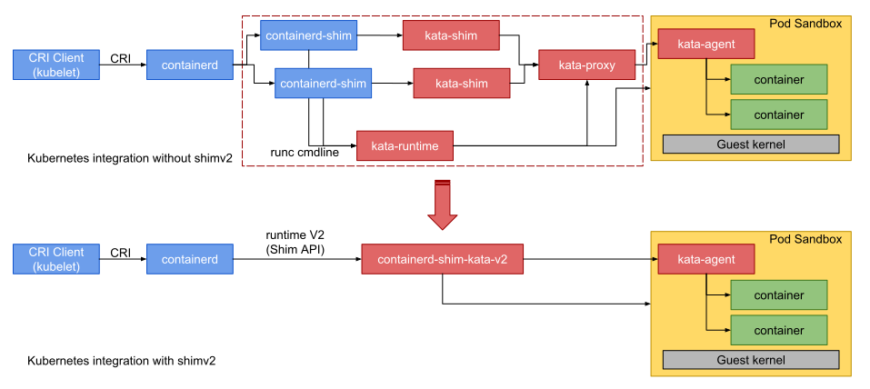

# History

## Kata 1.x architecture

In the old [Kata 1.x architecture](https://github.com/kata-containers/documentation/blob/master/design/architecture.md),
the Kata [runtime](README.md#runtime) was an executable called `kata-runtime`.
The container manager called this executable multiple times when
creating each container. Each time the runtime was called a different
OCI command-line verb was provided. This architecture was simple, but
not well suited to creating VM based containers due to the issue of
handling state between calls. Additionally, the architecture suffered
from performance issues related to continually having to spawn new
instances of the runtime binary, and
[Kata shim](https://github.com/kata-containers/shim) and
[Kata proxy](https://github.com/kata-containers/proxy) processes for systems
that did not provide VSOCK.

## Kata 2.x architecture

See the ["shimv2"](README.md#shim-v2-architecture) section of the
architecture document.

## Architectural comparison

| Kata version | Kata Runtime process calls | Kata shim processes | Kata proxy processes (if no VSOCK) |
|-|-|-|-|
| 1.x | multiple per container | 1 per container connection | 1 |
| 2.x | 1 per VM (hosting any number of containers) | 0 | 0 |

> **Notes:**
>
> - A single VM can host one or more containers.
>
> - The "Kata shim processes" column refers to the old
>   [Kata shim](https://github.com/kata-containers/shim) (`kata-shim` binary),
>   *not* the new shimv2 runtime instance (`containerd-shim-kata-v2` binary).

The diagram below shows how the original architecture was simplified
with the advent of shimv2.

