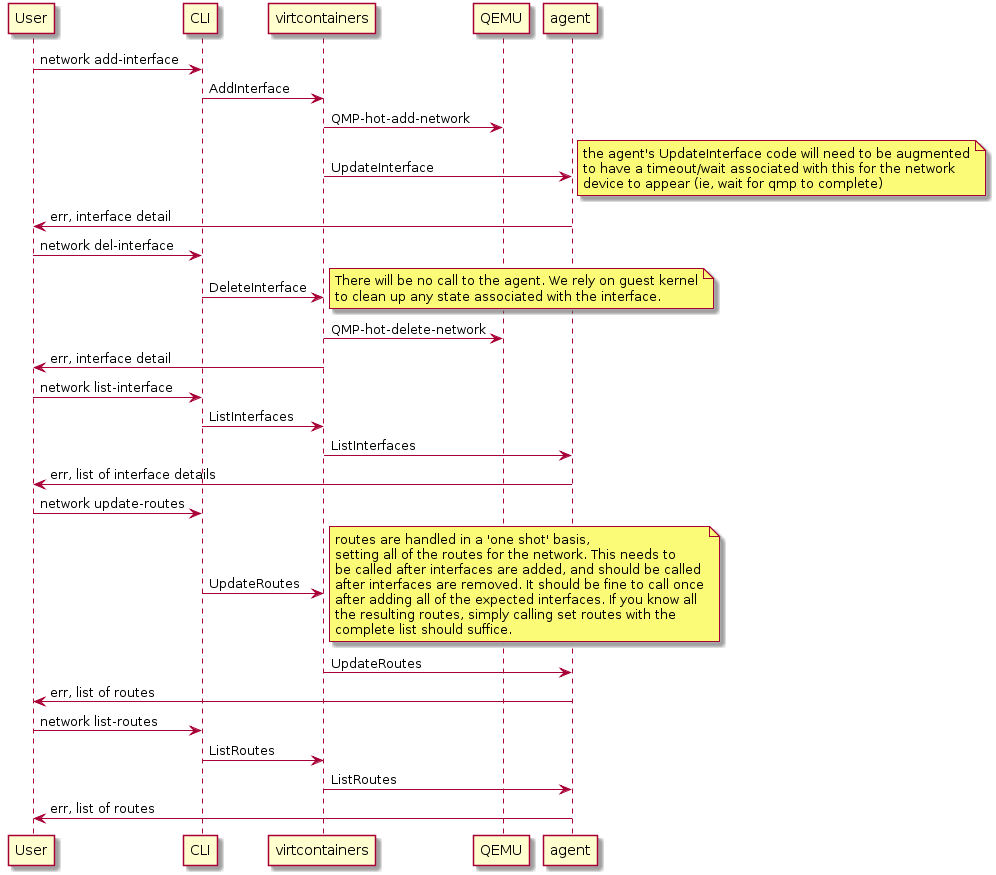

# Networking

Containers typically live in their own, possibly shared, networking namespace.
At some point in a container lifecycle, container engines will set up that namespace
to add the container to a network which is isolated from the host network.

In order to setup the network for a container, container engines call into a 
networking plugin. The network plugin will usually create a virtual
ethernet (`veth`) pair adding one end of the `veth` pair into the container 
networking namespace, while the other end of the `veth` pair is added to the 
host networking namespace.

This is a very namespace-centric approach as many hypervisors or VM
Managers (VMMs) such as `virt-manager` cannot handle `veth`
interfaces. Typically, [`TAP`](https://www.kernel.org/doc/Documentation/networking/tuntap.txt) 
interfaces are created for VM connectivity.

To overcome incompatibility between typical container engines expectations
and virtual machines, Kata Containers networking transparently connects `veth`
interfaces with `TAP` ones using [Traffic Control](https://man7.org/linux/man-pages/man8/tc.8.html):

With a TC filter rules in place, a redirection is created between the container network
 and the virtual machine. As an example, the network plugin may place a device, 
`eth0`, in the container's network namespace, which is one end of a VETH device. 
Kata Containers will create a tap device for the VM, `tap0_kata`,
and setup a TC redirection filter to redirect traffic from `eth0`'s ingress to `tap0_kata`'s egress,
and a second TC filter to redirect traffic from `tap0_kata`'s ingress to `eth0`'s egress.

Kata Containers maintains support for MACVTAP, which was an earlier implementation used in Kata. 
With this method, Kata created a MACVTAP device to connect directly to the `eth0` device. 
TC-filter is the default because it allows for simpler configuration, better CNI plugin 
compatibility, and performance on par with MACVTAP.

Kata Containers has deprecated support for bridge due to lacking performance relative to TC-filter and MACVTAP.

Kata Containers supports both
[CNM](https://github.com/moby/libnetwork/blob/master/docs/design.md#the-container-network-model)
and [CNI](https://github.com/containernetworking/cni) for networking management.

## Network Hotplug

Kata Containers has developed a set of network sub-commands and APIs to add, list and
remove a guest network endpoint and to manipulate the guest route table.

The following diagram illustrates the Kata Containers network hotplug workflow.

