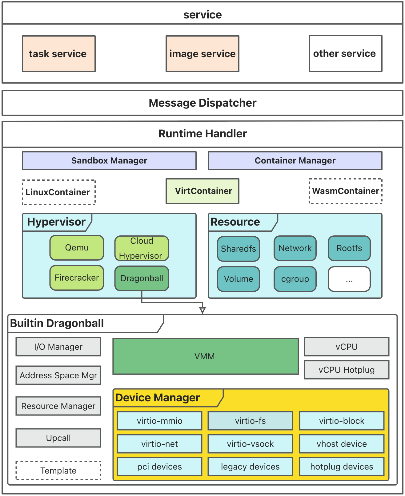
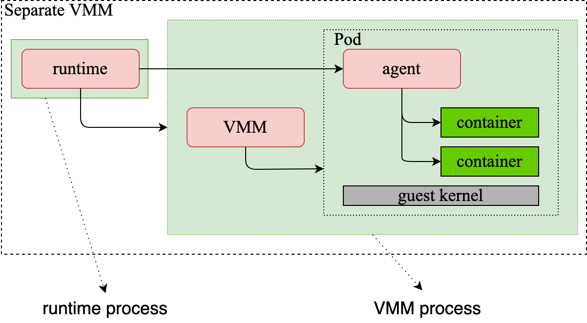
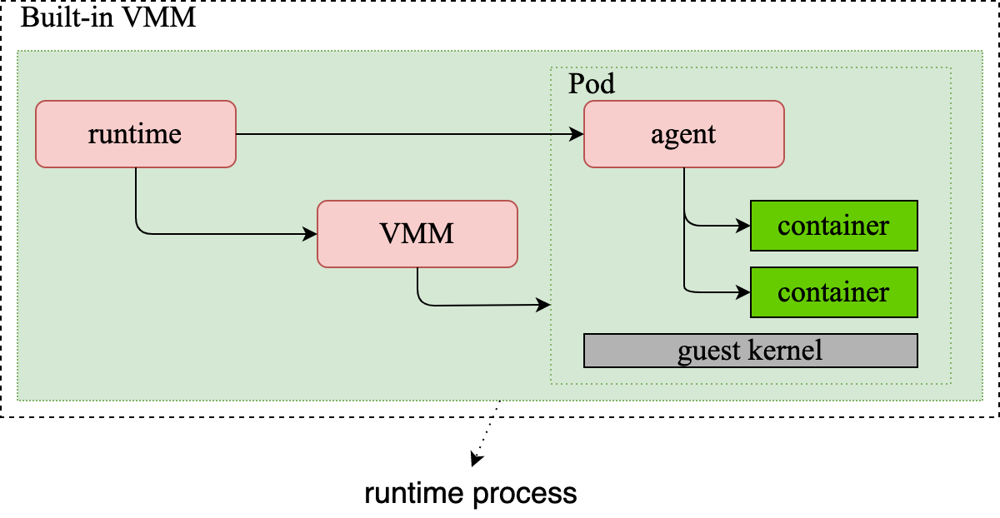
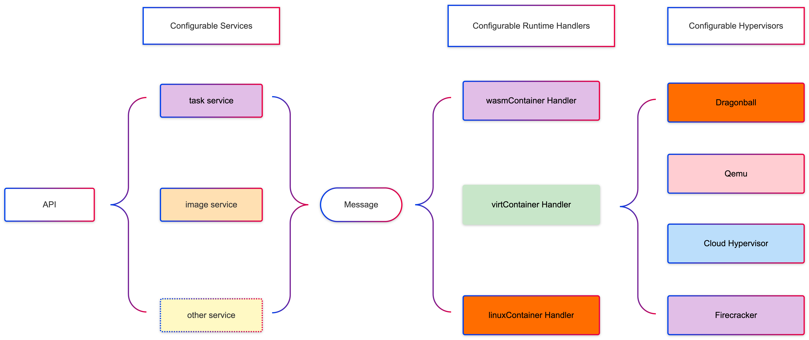
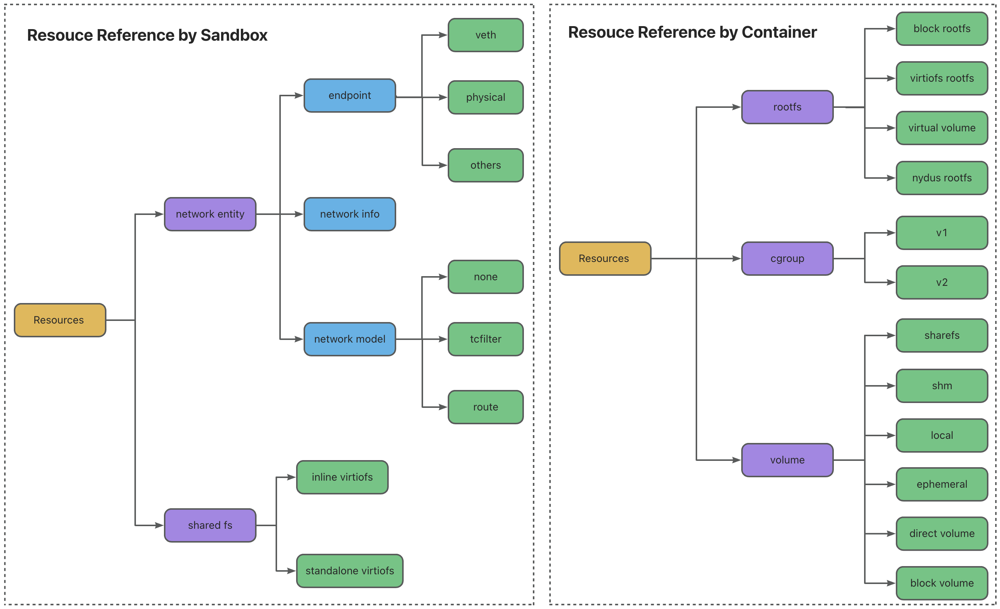

# Kata 3.0 Architecture

## Overview

In cloud-native environments, the demand for rapid container startup, minimal resource footprint, enhanced stability, and robust security continues to grow. These requirements pose challenges for existing container runtimes. To address these needs, we introduce a high-performance, secure, and production-tested Rust implementation of the Kata runtime.

Our architecture features:

- A "turn-key" solution featuring a built-in Dragonball Sandbox.
- Asynchronous I/O to minimize resource overhead.
- A highly extensible framework supporting diverse services, runtimes, and hypervisors.
- Granular lifecycle management for both sandboxes and their associated container resources.

### Rationale for choosing Rust

We selected Rust because it is a systems language engineered for high efficiency and memory safety. Unlike Go, Rust facilitates specific design trade-offs that favor deterministic execution performance. It provides robust protection against common memory vulnerabilities—such as buffer overflows, invalid pointers, and range errors—through its ownership model, while enforcing strict thread safety and comprehensive error handling at compile time.

These advantages were validated when we migrated the Kata Containers guest agent to Rust, which resulted in a substantial reduction in memory consumption.


## Design

### Layered Architecture



### Built-in VMM

#### The Kata 2.x Architecture (Legacy)



In the Kata 2.x architecture, the runtime and the VMM operate as separate, decoupled processes. The runtime forks the VMM process and interacts with it via inter-process RPC. This approach introduces overhead due to context switching and cross-process communication. Furthermore, managing resources across process boundaries—especially during abnormal conditions—introduces significant complexity in error detection and recovery.

#### The Built-in VMM Approach

We provide the Dragonball Sandbox to enable a "built-in" VMM model, where the VMM's core functionality is integrated as a library within the Rust runtime process. This eliminates the overhead of IPC, enabling lower-latency message processing and tight API synchronization. Moreover, it ensures the runtime and VMM share a unified lifecycle, simplifying exception handling and resource cleanup.



### Async Support

#### Why Async Rust?

**The Rust async ecosystem is stable and highly efficient, providing several key benefits:**

- Reduced Overhead: Significantly lower CPU and memory consumption, particularly for I/O-bound workloads.
- Zero-Cost Abstractions: Rust's async model allows developers to "pay only for what they use," avoiding heap allocations and dynamic dispatch where possible.
- For further reading, see [Why Async?](https://rust-lang.github.io/async-book/01_getting_started/02_why_async.html) and [The State of Asynchronous Rust](https://rust-lang.github.io/async-book/01_getting_started/03_state_of_async_rust.html).

**Limitations of Synchronous Rust in kata-runtime:**

- Thread Proliferation: Every TTRPC connection creates multiple threads (Reaper, Listener, Handler), and each container adds 3 additional I/O threads, leading to high thread count and memory pressure.
- Timeout Complexity: Implementing reliable, cross-platform timeout mechanisms in synchronous code is difficult, especially when aligning with Golang-based components.

#### Implementation

The kata-runtime utilizes Tokio to manage asynchronous tasks. By offloading TTRPC and container-related I/O to a unified Tokio executor and switching dependencies (Timer, File, Netlink) to their asynchronous counterparts, we achieve non-blocking I/O. The built-in VMM remains on a dedicated OS thread to ensure control and real-time performance.

**Comparison of OS Thread usage (for N tokio worker threads and M containers)**

- Sync Runtime: OS thread count scales as 4 + 12*M.
- Async Runtime: OS thread count scales as 2 + N.

```shell
├─ main(OS thread)
├─ async-logger(OS thread)
└─ tokio worker(N * OS thread)
  ├─ agent log forwarder(1 * tokio task)
  ├─ health check thread(1 * tokio task)
  ├─ TTRPC reaper thread(M * tokio task)
  ├─ TTRPC listener thread(M * tokio task)
  ├─ TTRPC client handler thread(7 * M * tokio task)
  ├─ container stdin io thread(M * tokio task)
  ├─ container stdout io thread(M * tokio task)
  └─ container stderr io thread(M * tokio task)
```

### Extensible Framework

The Kata Rust runtime features a modular design that supports diverse services, runtimes, and hypervisors. We utilize a registration mechanism to decouple service logic from the core runtime. At startup, the runtime resolves the required runtime handler and hypervisor types based on configuration.



### Resource Manager

`Virt-Container` environments involve complex resource hierarchies. We have abstracted resources into a common interface to manage subtypes (such as share-fs volumes, rootfs, and cgroup) uniformly. This allows for consistent operation, dependency tracking, and resource lifecycle management.



## Roadmap

- Stage 1: Core functionality.
- Stage 2: Feature parity with common container requirements.
- Stage 3: Full-featured production readiness.

| **Class**                  | **Sub-Class**       | **Development Stage** | **Status** |
| -------------------------- | ------------------- | --------------------- |------------|
| Service                    | task service        | Stage 1               |  ✅        |
|                            | extend service      | Stage 3               |  ✅        |
|                            | image service       | Stage 3               |  ✅        |
| Runtime handler            | `Virt-Container`    | Stage 1               |  ✅        |
| Endpoint                   | VETH Endpoint       | Stage 1               |  ✅        |
|                            | Physical Endpoint   | Stage 2               |  ✅        |
|                            | Tap Endpoint        | Stage 2               |  ✅        |
|                            | `Tuntap` Endpoint   | Stage 2               |  ✅        |
|                            | `IPVlan` Endpoint   | Stage 2               |  ✅        |
|                            | `MacVlan` Endpoint  | Stage 2               |  ✅        |
|                            | MACVTAP Endpoint    | Stage 3               |  ✅        |
|                            | `VhostUserEndpoint` | Stage 3               |  ✅        |
| Network Interworking Model | Tc filter            | Stage 1               |  ✅        |
|                            | `MacVtap`           | Stage 3               |  ✅        |
| Storage                    | Virtio-fs           | Stage 1               |  ✅        |
|                            | `nydus`             | Stage 2               |  ✅        |
|                            | `device mapper`     | Stage 2               |  ✅        |
| `Cgroup V2`                |                     | Stage 2               |  ✅        |
| Hypervisor                 | `Dragonball`        | Stage 1               |  ✅        |
|                            | QEMU                | Stage 2               |  ✅        |
|                            | Cloud Hypervisor    | Stage 3               |  ✅        |
|                            | Firecracker         | Stage 3               |  ✅        |

## FAQ

- Are the "service", "message dispatcher" and "runtime handler" all part of the single Kata 3.x runtime binary?

  Yes. They are components in Kata 3.x runtime. And they will be packed into one binary.
  1. Service is an interface, which is responsible for handling multiple services like task service, image service and etc.
  2. Message dispatcher, it is used to match multiple requests from the service module.
  3. Runtime handler is used to deal with the operation for sandbox and container.

- What is the name of the Kata 3.x runtime binary?

  Apparently we can't use `containerd-shim-v2-kata` because it's already used. We are facing the hardest issue of "naming" again. Any suggestions are welcomed.
  Internally we use `containerd-shim-v2-rund`.

- Is the Kata 3.x design compatible with the containerd shimv2 architecture?

  Yes. It is designed to follow the functionality of go version kata.  And it implements the `containerd shim v2` interface/protocol.

- How will users migrate to the Kata 3.x architecture?

  The migration plan will be provided before the Kata 3.x is merging into the main branch.

- Is `Dragonball` limited to its own built-in VMM? Can the `Dragonball` system be configured to work using an external `Dragonball` VMM/hypervisor?

  The `Dragonball` could work as an external hypervisor. However, stability and performance is challenging in this case. Built in VMM could optimise the container overhead, and it's easy to maintain stability.

  `runD(Runtime-rs + Dragonball)` is the `containerd-shim-v2` counterpart of `runC` and can run a pod/containers. `Dragonball` is a `microvm`/VMM that is designed to run container workloads. Instead of `microvm`/VMM, we sometimes refer to it as secure sandbox.

- QEMU, Cloud Hypervisor and Firecracker have been supported, but how that would work. Are they working in separate process?

  Yes. They are unable to work as built in VMM.

- What is `upcall`?

    The `upcall` is used to hotplug CPU/memory/MMIO devices, and it solves two issues.
    1. avoid dependency on PCI/ACPI
    2. avoid dependency on `udevd` within guest and get deterministic results for hotplug operations. So `upcall` is an alternative to ACPI based CPU/memory/device hotplug. And we may cooperate with the community to add support for ACPI based CPU/memory/device hotplug if needed.

    `Dbs-upcall` is a `vsock-based` direct communication tool between VMM and guests. The server side of the `upcall` is a driver in guest kernel (kernel patches are needed for this feature) and it'll start to serve the requests once the kernel has started. And the client side is in VMM , it'll be a thread that communicates with VSOCK through `uds`. We have accomplished device hotplug / hot-unplug directly through `upcall` in order to avoid virtualization of ACPI  to minimize virtual machine's overhead. And there could be many other usage through this direct communication channel. It's already open source.
   https://github.com/openanolis/dragonball-sandbox/tree/main/crates/dbs-upcall

- The URL below says the kernel patches work with 4.19, but do they also work with 5.15+ ?

  Forward compatibility should be achievable, we have ported it to 5.10 based kernel.

- Are these patches platform-specific or would they work for any architecture that supports VSOCK?

  It's almost platform independent, but some message related to CPU hotplug are platform dependent.

- Could the kernel driver be replaced with a userland daemon in the guest using loopback VSOCK?

  We need to create device nodes for hot-added CPU/memory/devices, so it's not easy for userspace daemon to do these tasks.

- The fact that `upcall` allows communication between the VMM and the guest suggests that this architecture might be incompatible with https://github.com/confidential-containers where the VMM should have no knowledge of what happens inside the VM.

  1. `TDX` doesn't support CPU/memory hotplug yet.
  2. For ACPI based device hotplug, it depends on ACPI `DSDT` table, and the guest kernel will execute `ASL` code to handle during handling those hotplug event. And it should be easier to audit VSOCK based communication than ACPI `ASL` methods.

- What is the security boundary for the monolithic / "Built-in VMM" case?

  It has the security boundary of virtualization. More details will be provided in next stage.
