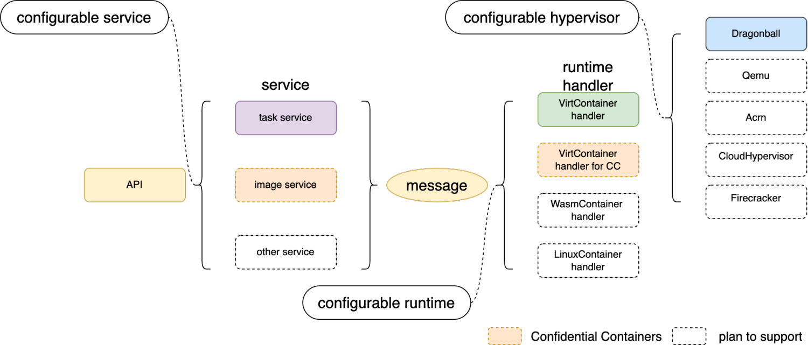
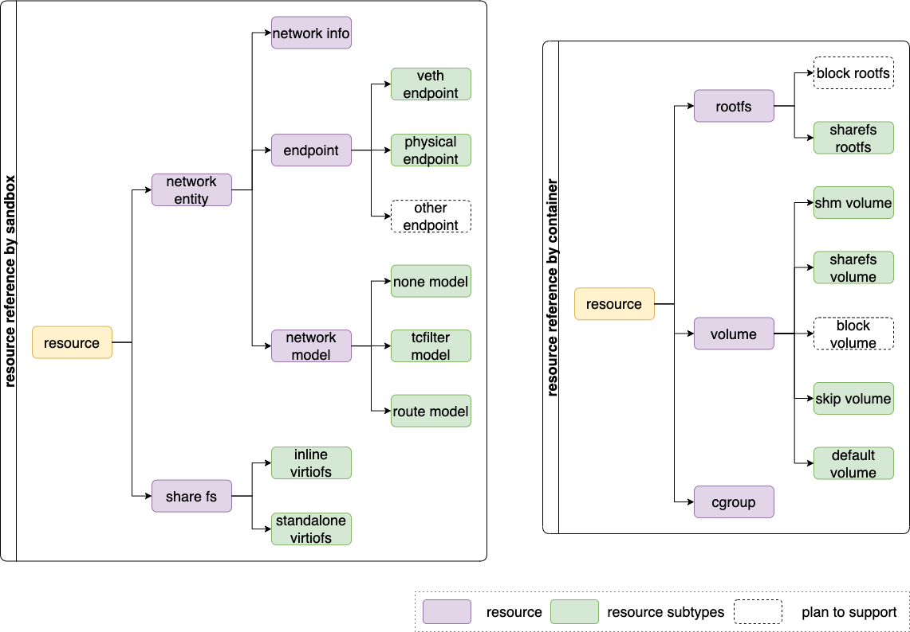

# Kata 3.0 Architecture
## Overview
In cloud-native scenarios, there is an increased demand for container startup speed, resource consumption, stability, and security, areas where the present Kata Containers runtime is challenged relative to other runtimes. To achieve this, we propose a solid, field-tested and secure Rust version of the kata-runtime.

Also, we provide the following designs:

- Turn key solution with builtin `Dragonball` Sandbox
- Async I/O to reduce resource consumption
- Extensible framework for multiple services, runtimes and hypervisors
- Lifecycle management for sandbox and container associated resources

### Rationale for choosing Rust

We chose Rust because it is designed as a system language with a focus on efficiency.
In contrast to Go, Rust makes a variety of design trade-offs in order to obtain
good execution performance, with innovative techniques that, in contrast to C or
C++, provide reasonable protection against common memory errors (buffer
overflow, invalid pointers, range errors), error checking (ensuring errors are
dealt with), thread safety, ownership of resources, and more.

These benefits were verified in our project when the Kata Containers guest agent
was rewritten in Rust. We notably saw a significant reduction in memory usage
with the Rust-based implementation.


## Design
### Architecture

### Built-in VMM
#### Current Kata 2.x architecture

As shown in the figure, runtime and VMM are separate processes. The runtime process forks the VMM process and interacts through the inter-process RPC. Typically, process interaction consumes more resources than peers within the process, and it will result in relatively low efficiency. At the same time, the cost of resource operation and maintenance should be considered. For example, when performing resource recovery under abnormal conditions, the exception of any process must be detected by others and activate the appropriate resource recovery process. If there are additional processes, the recovery becomes even more difficult.
#### How To Support Built-in VMM
We provide `Dragonball` Sandbox to enable built-in VMM by integrating VMM's function into the Rust library. We could perform VMM-related functionalities by using the library. Because runtime and VMM  are in the same process, there is a benefit in terms of message processing speed and API synchronization. It can also guarantee the consistency of the runtime and the VMM life cycle, reducing resource recovery and exception handling maintenance, as shown in the figure:

### Async Support
#### Why Need Async
**Async is already in stable Rust and allows us to write async code**

- Async provides significantly reduced CPU and memory overhead, especially for workloads with a large amount of IO-bound tasks
- Async is zero-cost in Rust, which means that you only pay for what you use. Specifically, you can use async without heap allocations and dynamic dispatch, which greatly improves efficiency
- For more (see [Why Async?](https://rust-lang.github.io/async-book/01_getting_started/02_why_async.html) and [The State of Asynchronous Rust](https://rust-lang.github.io/async-book/01_getting_started/03_state_of_async_rust.html)).

**There may be several problems if implementing kata-runtime with Sync Rust**

- Too many threads with a new TTRPC connection
   - TTRPC threads: reaper thread(1) + listener thread(1) + client handler(2)
- Add 3 I/O threads with a new container
- In Sync mode, implementing a timeout mechanism is challenging. For example, in TTRPC API interaction, the timeout mechanism is difficult to align with Golang
#### How To Support Async
The kata-runtime is controlled by TOKIO_RUNTIME_WORKER_THREADS to run the OS thread, which is 2 threads by default. For TTRPC and container-related threads run in the `tokio` thread in a unified manner, and related dependencies need to be switched to Async, such as Timer, File, Netlink, etc. With the help of Async, we can easily support no-block I/O and timer. Currently, we only utilize Async for kata-runtime. The built-in VMM keeps the OS thread because it can ensure that the threads are controllable.

**For N `tokio` worker threads and M containers**

- Sync runtime(both OS thread and `tokio` task are OS thread but without `tokio` worker thread)  OS thread number:  4 + 12*M
- Async runtime(only OS thread is OS thread) OS thread number: 2 + N
```shell
├─ main(OS thread)
├─ async-logger(OS thread)
└─ tokio worker(N * OS thread)
  ├─ agent log forwarder(1 * tokio task)
  ├─ health check thread(1 * tokio task)
  ├─ TTRPC reaper thread(M * tokio task)
  ├─ TTRPC listener thread(M * tokio task)
  ├─ TTRPC client handler thread(7 * M * tokio task)
  ├─ container stdin io thread(M * tokio task)
  ├─ container stdout io thread(M * tokio task)
  └─ container stderr io thread(M * tokio task)
```
### Extensible Framework
The Kata 3.x runtime is designed with the extension of service, runtime, and hypervisor, combined with configuration to meet the needs of different scenarios. At present, the service provides a register mechanism to support multiple services. Services could interact with runtime through messages. In addition, the runtime handler handles messages from services. To meet the needs of a binary that supports multiple runtimes and hypervisors, the startup must obtain the runtime handler type and hypervisor type through configuration.


### Resource Manager
In our case, there will be a variety of resources, and every resource has several subtypes. Especially for `Virt-Container`, every subtype of resource has different operations. And there may be dependencies, such as the share-fs rootfs and the share-fs volume will use share-fs resources to share files to the VM. Currently, network and share-fs are regarded as sandbox resources, while rootfs, volume, and cgroup are regarded as container resources. Also, we abstract a common interface for each resource and use subclass operations to evaluate the differences between different subtypes.


## Roadmap

- Stage 1 (June): provide basic features (current delivered)
- Stage 2 (September): support common features
- Stage 3: support full features

| **Class**                  | **Sub-Class**       | **Development Stage** | **Status** |
| -------------------------- | ------------------- | --------------------- |------------|
| Service                    | task service        | Stage 1               |  ✅        |
|                            | extend service      | Stage 3               |  🚫        |
|                            | image service       | Stage 3               |  🚫        |
| Runtime handler            | `Virt-Container`    | Stage 1               |  ✅        |
| Endpoint                   | VETH Endpoint       | Stage 1               |  ✅        |
|                            | Physical Endpoint   | Stage 2               |  ✅        |
|                            | Tap Endpoint        | Stage 2               |  ✅        |
|                            | `Tuntap` Endpoint   | Stage 2               |  ✅        |
|                            | `IPVlan` Endpoint   | Stage 2               |  ✅        |
|                            | `MacVlan` Endpoint  | Stage 2               |  ✅        |
|                            | MACVTAP Endpoint    | Stage 3               |  🚫        |
|                            | `VhostUserEndpoint` | Stage 3               |  🚫        |
| Network Interworking Model | Tc filter           | Stage 1               |  ✅        |
|                            | `MacVtap`           | Stage 3               |  🚧        |
| Storage                    | Virtio-fs           | Stage 1               |  ✅        |
|                            | `nydus`             | Stage 2               |  🚧        |
|                            | `device mapper`     | Stage 2               |  🚫        |
| `Cgroup V2`                |                     | Stage 2               |  🚧        |
| Hypervisor                 | `Dragonball`        | Stage 1               |  🚧        |
|                            | QEMU                | Stage 2               |  🚫        |
|                            | Cloud Hypervisor    | Stage 3               |  🚫        |
|                            | Firecracker         | Stage 3               |  🚫        |

## FAQ

- Are the "service", "message dispatcher" and "runtime handler" all part of the single Kata 3.x runtime binary?

  Yes. They are components in Kata 3.x runtime. And they will be packed into one binary.
  1. Service is an interface, which is responsible for handling multiple services like task service, image service and etc. 
  2. Message dispatcher, it is used to match multiple requests from the service module. 
  3. Runtime handler is used to deal with the operation for sandbox and container. 
- What is the name of the Kata 3.x runtime binary?
  
  Apparently we can't use `containerd-shim-v2-kata` because it's already used. We are facing the hardest issue of "naming" again. Any suggestions are welcomed.
  Internally we use `containerd-shim-v2-rund`.

- Is the Kata 3.x design compatible with the containerd shimv2 architecture? 
  
  Yes. It is designed to follow the functionality of go version kata.  And it implements the `containerd shim v2` interface/protocol.

- How will users migrate to the Kata 3.x architecture?
  
  The migration plan will be provided before the Kata 3.x is merging into the main branch.

- Is `Dragonball` limited to its own built-in VMM? Can the `Dragonball` system be configured to work using an external `Dragonball` VMM/hypervisor?

  The `Dragonball` could work as an external hypervisor. However, stability and performance is challenging in this case. Built in VMM could optimise the container overhead, and it's easy to maintain stability.

  `runD` is the `containerd-shim-v2` counterpart of `runC` and can run a pod/containers. `Dragonball` is a `microvm`/VMM that is designed to run container workloads. Instead of `microvm`/VMM, we sometimes refer to it as secure sandbox.

- QEMU, Cloud Hypervisor and Firecracker support are planned, but how that would work. Are they working in separate process?
 
  Yes. They are unable to work as built in VMM.

- What is `upcall`?
  
    The `upcall` is used to hotplug CPU/memory/MMIO devices, and it solves two issues.
    1. avoid dependency on PCI/ACPI
    2. avoid dependency on `udevd` within guest and get deterministic results for hotplug operations. So `upcall` is an alternative to ACPI based CPU/memory/device hotplug. And we may cooperate with the community to add support for ACPI based CPU/memory/device hotplug if needed.
   
    `Dbs-upcall` is a `vsock-based` direct communication tool between VMM and guests. The server side of the `upcall` is a driver in guest kernel (kernel patches are needed for this feature) and it'll start to serve the requests once the kernel has started. And the client side is in VMM , it'll be a thread that communicates with VSOCK through `uds`. We have accomplished device hotplug / hot-unplug directly through `upcall` in order to avoid virtualization of ACPI  to minimize virtual machine's overhead. And there could be many other usage through this direct communication channel. It's already open source.
   https://github.com/openanolis/dragonball-sandbox/tree/main/crates/dbs-upcall 

- The URL below says the kernel patches work with 4.19, but do they also work with 5.15+ ?
  
  Forward compatibility should be achievable, we have ported it to 5.10 based kernel.

- Are these patches platform-specific or would they work for any architecture that supports VSOCK?
  
  It's almost platform independent, but some message related to CPU hotplug are platform dependent.

- Could the kernel driver be replaced with a userland daemon in the guest using loopback VSOCK?
  
  We need to create device nodes for hot-added CPU/memory/devices, so it's not easy for userspace daemon to do these tasks.

- The fact that `upcall` allows communication between the VMM and the guest suggests that this architecture might be incompatible with https://github.com/confidential-containers where the VMM should have no knowledge of what happens inside the VM.
  
  1. `TDX` doesn't support CPU/memory hotplug yet.
  2. For ACPI based device hotplug, it depends on ACPI `DSDT` table, and the guest kernel will execute `ASL` code to handle during handling those hotplug event. And it should be easier to audit VSOCK based communication than ACPI `ASL` methods.

- What is the security boundary for the monolithic / "Built-in VMM" case?
  
  It has the security boundary of virtualization. More details will be provided in next stage.
