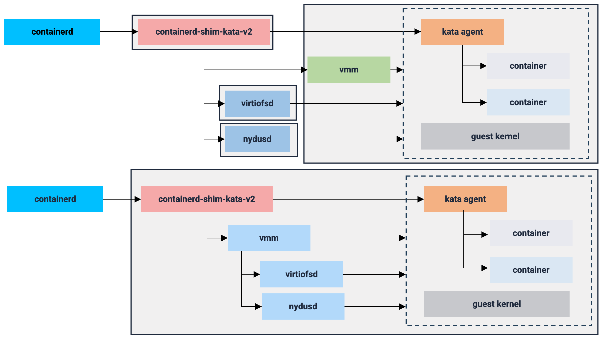

# Kata Containers 4.0 Architecture (Rust Runtime)

This repository contains the architecture and documentation for the **Kata Containers Rust Runtime**, a high-performance, memory-safe implementation of the Kata Containers runtime, featuring the `containerd-shim-kata-v2` as its core control hub.

---

## 1. Architecture Overview

The Kata Containers Rust Runtime is designed to minimize resource overhead and startup latency. It achieves this by shifting from traditional process-based management to a more integrated, Rust-native control flow.



The runtime employs a flexible VMM strategy, supporting both `built-in` and `optional` VMMs. This allows users to choose between a tightly integrated VMM (e.g., Dragonball) for peak performance, or external options (e.g., QEMU, Cloud-Hypervisor, Firecracker) for enhanced compatibility and modularity.

### A. Builtin VMM (Integrated Mode)

In this mode, the VMM is **deeply integrated** into the `shimv2`'s lifecycle.

*   **Integrated Management**: The `shimv2` directly controls the VMM and its critical helper services (`virtiofsd`, `nydusd`).
*   **Performance**: By eliminating external process overhead and complex inter-process communication (IPC), this mode achieves faster container startup and higher resource density.
*   **Core Technology**: Primarily utilizes **Dragonball**, the native Rust-based VMM optimized and dedicated for cloud-native scenarios.

### B. Optional VMM (External Mode)

In this mode, the `containerd-shim-kata-v2`(short of `shimv2`) manages the VMM as an **external process**.

*   **Decoupled Lifecycle**: The `shimv2` communicates with the VMM (e.g., QEMU, Cloud-Hypervisor, or Firecracker) via vsock/hybrid vsock.
*   **Flexibility**: Ideal for environments that require specific hypervisor hardware emulation or legacy compatibility.

---

## 2. Getting Started
To configure your preferred VMM strategy, locate the `[hypervisor]` block in your runtime configuration file:

- Install Kata Containers with the Rust Runtime and Dragonball as the builtin VMM by following the [containerd-kata](../../how-to/containerd-kata.md).
- Run a kata with builtin VMM Dragonball

```shell
$ sudo ctr run  --runtime io.containerd.kata.v2 -d docker.io/library/ubuntu:latest hello
```

As the VMM and its image service have been builtin, you should only see a single containerd-shim-kata-v2 process.
