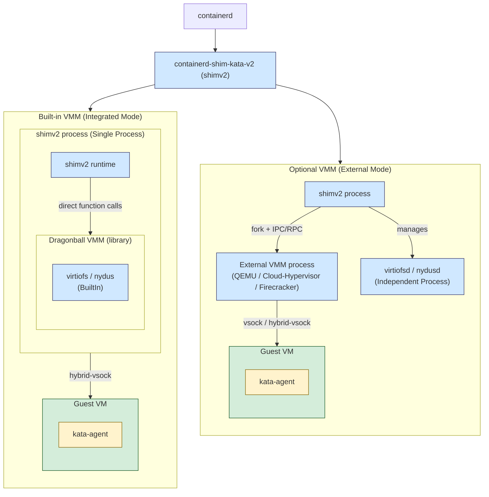
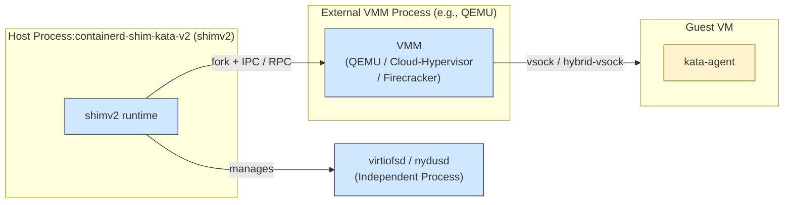
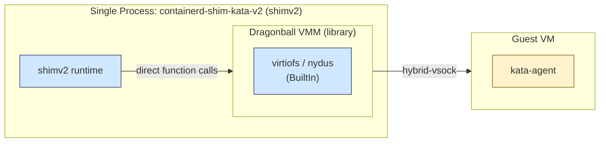
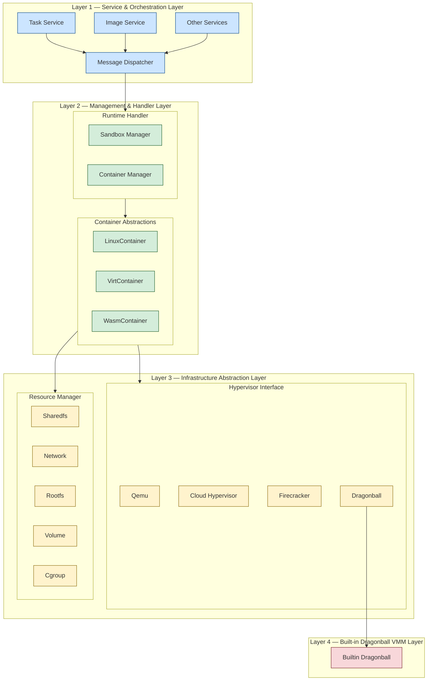
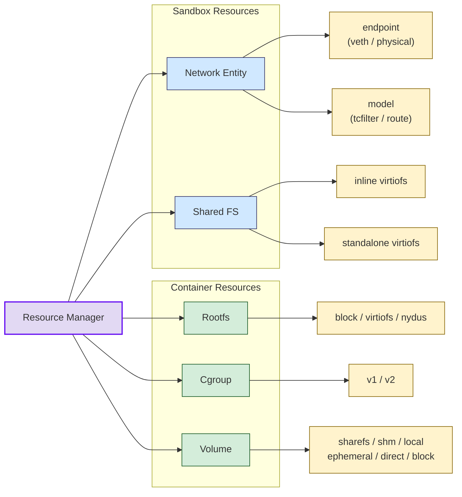

# Kata Containers 4.0 Architecture (Rust Runtime)

## Overview

Kata Containers 4.0 represents a significant architectural evolution, moving beyond the limitations of legacy multi-process container runtimes. Driven by a modern Rust-based stack, this release transitions to an asynchronous, unified architecture that drastically reduces resource consumption and latency.

By consolidating the entire runtime into a single, high-performance binary, Kata 4.0 eliminates the overhead of cross-process communication and streamlines the container lifecycle. The result is a secure, production-tested runtime capable of handling high-density workloads with efficiency. With built-in support for diverse container abstractions and optimized hypervisor integration, Kata 4.0 delivers the agility and robustness required by modern, cloud-native infrastructure.

---

## 1. Architecture Overview

The Kata Containers Rust Runtime is designed to minimize resource overhead and startup latency. It achieves this by shifting from traditional process-based management to a more integrated, Rust-native control flow.



The runtime employs a **flexible VMM strategy**, supporting both `built-in` and `optional` VMMs. This allows users to choose between a tightly integrated VMM (e.g., Dragonball) for peak performance, or external options (e.g., QEMU, Cloud-Hypervisor, Firecracker) for enhanced compatibility and modularity.

### A. Built-in VMM (Integrated Mode)

The built-in VMM mode is the default and recommended configuration for users, as it offers superior performance and resource efficiency.

In this mode, the VMM (`Dragonball`) is **deeply integrated** into the `shimv2`'s lifecycle. This eliminates the overhead of IPC, enabling lower-latency message processing and tight API synchronization. Moreover, it ensures the runtime and VMM share a unified lifecycle, simplifying exception handling and resource cleanup.

*   **Integrated Management**: The `shimv2` directly controls the VMM and its critical helper services (`virtiofsd` or `nydusd`).
*   **Performance**: By eliminating external process overhead and complex inter-process communication (IPC), this mode achieves faster container startup and higher resource density.
*   **Core Technology**: Primarily utilizes **Dragonball**, the native Rust-based VMM optimized and dedicated for cloud-native scenarios.

> **Note**: The built-in VMM mode is the default and recommended configuration for users, as it offers superior performance and resource efficiency.

### B. Optional VMM (External Mode)

The optional VMM mode is available for users with specific requirements that necessitate external hypervisor support.

In this mode, the runtime and the VMM operate as separate, decoupled processes. The runtime forks the VMM process and interacts with it via inter-process RPC. And the `containerd-shim-kata-v2`(short of `shimv2`) manages the VMM as an **external process**.

*   **Decoupled Lifecycle**: The `shimv2` communicates with the VMM (e.g., QEMU, Cloud-Hypervisor, or Firecracker) via vsock/hybrid vsock.
*   **Flexibility**: Ideal for environments that require specific hypervisor hardware emulation or legacy compatibility.

> **Note**:  This approach (Optional VMM) introduces overhead due to context switching and cross-process communication. Furthermore, managing resources across process boundaries—especially during abnormal conditions—introduces significant complexity in error detection and recovery.

---

## Core Architectural Principles

*   **Safety via Rust**: Leveraging Rust's ownership and type systems to eliminate memory-related vulnerabilities (buffer overflows, dangling pointers) by design.
*   **Performance via Async**: Utilizing Tokio to handle high-concurrency I/O, reducing the OS thread footprint by an order of magnitude.
*   **Built-in VMM**: A modular, library-based approach to virtualization, enabling tighter integration with the runtime.
*   **Pluggable Framework**: A clean abstraction layer allowing seamless swapping of hypervisors, network interfaces, and storage backends.

---

## Design Deep Dive

### Built-in VMM Integration (Dragonball)

The legacy Kata 2.x architecture relied on inter-process communication (IPC) between the runtime and the VMM. This introduced context-switching latency and complex error-recovery requirements across process boundaries. In contrast, the built-in VMM approach embeds the VMM directly within the runtime's process space. This eliminates IPC overhead, allowing for direct function calls and shared memory access, resulting in significantly reduced startup times and improved performance.





By integrating Dragonball directly as a library, we eliminate the need for heavy IPC.

*   **API Synchronization**: Direct function calls replace RPCs, reducing latency.
*   **Unified Lifecycle**: The runtime and VMM share a single process lifecycle, significantly simplifying resource cleanup and fault isolation.

### Layered Architecture

The Kata 4.0 runtime utilizes a highly modular, layered architecture designed to decouple high-level service requests from low-level infrastructure execution. This design facilitates extensibility, allowing the system to support diverse container types and dragonball within a single, unified Rust binary and also support other hypervisors  as optional VMMs.



#### Service & Orchestration Layer

*   **Service Layer**: The entry point for the runtime, providing specialized interfaces for external callers (e.g., `containerd`). It includes:
    *   **Task Service**: Manages the lifecycle of containerized processes.
    *   **Image Service**: Handles container image operations.
    *   **Other Services**: An extensible framework allowing for custom modules.

*   **Message Dispatcher**: Acts as a centralized traffic controller. It parses requests from the Service layer and routes them to the appropriate **Runtime Handler**, ensuring efficient message multiplexing.

#### Management & Handler Layer

*   **Runtime Handler**: The core processing engine. It abstracts the underlying workload, enabling the runtime to handle various container types through:
    *   **Sandbox Manager**: Orchestrates the lifecycle of the entire Pod (Sandbox).
    *   **Container Manager**: Manages individual containers within a Sandbox.

*   **Container Abstractions**: The framework is agnostic to the container implementation, with explicit support paths for:
    *   **LinuxContainer** (Standard/OCI)
    *   **VirtContainer** (Virtualization-based)
    *   **WasmContainer** (WebAssembly-based)

#### Infrastructure Abstraction Layer

This layer provides standardized interfaces for hardware and resource management, regardless of the underlying backend.

*   **Hypervisor Interface**: A pluggable architecture supporting multiple virtualization backends, including **Qemu**, **Cloud Hypervisor**, **Firecracker**, and **Dragonball**.

*   **Resource Manager**: A unified interface for managing critical infrastructure components:
    *   **Sharedfs, Network, Rootfs, Volume, and cgroup management**.

#### Built-in Dragonball VMM Layer

Representing the core of the high-performance runtime, the `Builtin Dragonball` block demonstrates deep integration between the runtime and the hypervisor.

#### Key Architectural Advantages

*   **Uniformity**: By consolidating these layers into a single binary, the runtime ensures a consistent state across all sub-modules, preventing the "split-brain" scenarios common in multi-process runtimes.
*   **Modularity**: The clear separation between the **Message Dispatcher** and the **Runtime Handler** allows developers to introduce new container types (e.g., WASM) or hypervisors without modifying existing core logic.
*   **Efficiency**: The direct integration of `Dragonball` as a library allows for "Zero-Copy" resource management and direct API access, which drastically improves performance compared to traditional RPC-based hypervisor interaction.

### Extensible Framework

The Kata Rust runtime features a modular design that supports diverse services, runtimes, and hypervisors. We utilize a registration mechanism to decouple service logic from the core runtime. At startup, the runtime resolves the required runtime handler and hypervisor types based on configuration.

```mermaid
graph LR
    API["API"]

    subgraph Services["Configurable Services"]
        TaskSvc["Task Service"]
        ImageSvc["Image Service"]
        OtherSvc["Other Service"]
    end

    Msg(["Message Dispatcher"])

    subgraph Handlers["Configurable Runtime Handlers"]
        WasmC["WasmContainer"]
        VirtC["VirtContainer"]
        LinuxC["LinuxContainer"]
    end

    subgraph HVs["Configurable Hypervisors"]
        DB["Dragonball"]
        QEMU["QEMU"]
        CH["Cloud Hypervisor"]
        FC["Firecracker"]
    end

    API --> Services
    Services --> Msg
    Msg --> Handlers
    Handlers --> HVs

    classDef api fill:#d0e8ff,stroke:#336,stroke-width:1px
    classDef svc fill:#e2d9f3,stroke:#6610f2,stroke-width:1px
    classDef msg fill:#fff3cd,stroke:#856404,stroke-width:1px
    classDef handler fill:#d4edda,stroke:#155724,stroke-width:1px
    classDef hv fill:#f8d7da,stroke:#721c24,stroke-width:1px
    class API api
    class TaskSvc,ImageSvc,OtherSvc svc
    class Msg msg
    class WasmC,VirtC,LinuxC handler
    class DB,QEMU,CH,FC hv
```



### Modular Resource Manager

Managing diverse resources—from Virtio-fs volumes to Cgroup V2—is handled by an abstracted resource manager. Each resource type implements a common trait, enabling uniform lifecycle hooks and deterministic dependency resolution.



### Asynchronous I/O Model

Synchronous runtimes are often limited by "thread bloat," where each container or connection spawns multiple OS threads.

#### Why Async Rust?

**The Rust async ecosystem is stable and highly efficient, providing several key benefits:**

- Reduced Overhead: Significantly lower CPU and memory consumption, particularly for I/O-bound workloads.
- Zero-Cost Abstractions: Rust's async model allows developers to "pay only for what they use," avoiding heap allocations and dynamic dispatch where possible.
- For further reading, see [Why Async?](https://rust-lang.github.io/async-book/01_getting_started/02_why_async.html) and [The State of Asynchronous Rust](https://rust-lang.github.io/async-book/01_getting_started/03_state_of_async_rust.html).

**Limitations of Synchronous Rust in kata-runtime:**

- Thread Proliferation: Every TTRPC connection creates multiple threads (Reaper, Listener, Handler), and each container adds 3 additional I/O threads, leading to high thread count and memory pressure.
- Timeout Complexity: Implementing reliable, cross-platform timeout mechanisms in synchronous code is difficult, especially when aligning with Golang-based components.

#### Implementation

The kata-runtime utilizes Tokio to manage asynchronous tasks. By offloading TTRPC and container-related I/O to a unified Tokio executor and switching dependencies (Timer, File, Netlink) to their asynchronous counterparts, we achieve non-blocking I/O. The built-in VMM remains on a dedicated OS thread to ensure control and real-time performance.

**Comparison of OS Thread usage (for N tokio worker threads and M containers)**

- Sync Runtime: OS thread count scales as 4 + 12*M.
- Async Runtime: OS thread count scales as 2 + N.

```shell
├─ main(OS thread)
├─ async-logger(OS thread)
└─ tokio worker(N * OS thread)
  ├─ agent log forwarder(1 * tokio task)
  ├─ health check thread(1 * tokio task)
  ├─ TTRPC reaper thread(M * tokio task)
  ├─ TTRPC listener thread(M * tokio task)
  ├─ TTRPC client handler thread(7 * M * tokio task)
  ├─ container stdin io thread(M * tokio task)
  ├─ container stdout io thread(M * tokio task)
  └─ container stderr io thread(M * tokio task)
```

The Async Advantage:
We move away from thread-per-task to a Tokio-driven task model.

*   **Scalability**: The OS thread count is reduced from 4 + 12*M (Sync) to 2 + N (Async), where N is the worker thread count.
*   **Efficiency**: Non-blocking I/O allows a single thread to handle multiplexed container operations, significantly lowering memory consumption for high-density pod deployments.

---

## 2. Getting Started
To configure your preferred VMM strategy, locate the `[hypervisor]` block in your runtime configuration file:

- Install Kata Containers with the Rust Runtime and Dragonball as the built-in VMM by following the [containerd-kata](../../how-to/containerd-kata.md).
- Run a kata with builtin VMM Dragonball

```shell
$ sudo ctr run  --runtime io.containerd.kata.v2 -d docker.io/library/ubuntu:latest hello
```

As the VMM and its image service have been builtin, you should only see a single containerd-shim-kata-v2 process.

---

## FAQ

* **Q1**: Is the architecture compatible with containerd?

Yes. It implements the containerd-shim-v2 interface, ensuring drop-in compatibility with standard cloud-native tooling.

* **Q2**: What is the security boundary for the "Built-in VMM" model?

The security boundary remains established by the hypervisor (hardware virtualization). The shift to a monolithic process model does not compromise isolation; rather, it improves the integrity of the control plane by reducing the attack surface typically associated with complex IPC mechanisms.

* **Q3**: What is the migration path?

Migration is managed via configuration policies. The containerd shim configuration will allow users to toggle between the legacy runtime and the runtime-rs (internally `RunD`) binary, facilitating canary deployments and gradual migration.

* **Q4**: Why upcall instead of ACPI?

Standard ACPI-based hotplugging requires heavy guest-side kernel emulation and udevd interaction. Dbs-upcall utilizes a vsock-based direct channel to trigger hotplug events, providing:

Deterministic execution: Bypassing complex guest-side ACPI state machines.
Lower overhead: Minimizing guest kernel footprint.

* **Q5**: How upcall works?

The `Dbs-upcall` architecture consists of a server-side driver in the guest kernel and a client-side thread within the VMM. Once the guest kernel initializes, it establishes a communication channel via vsock (using uds). This allows the VMM to directly request device hot-add/hot-remove operations. We have already open-sourced this implementation: [dbs-upcall](https://github.com/openanolis/dragonball-sandbox/tree/main/crates/dbs-upcall).
