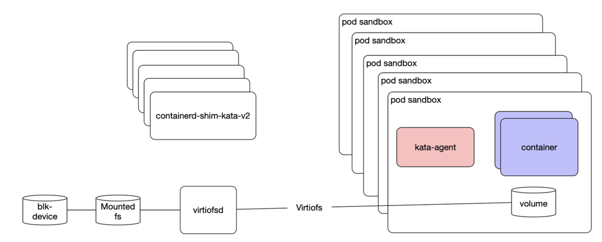
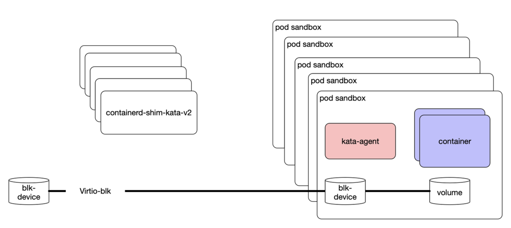
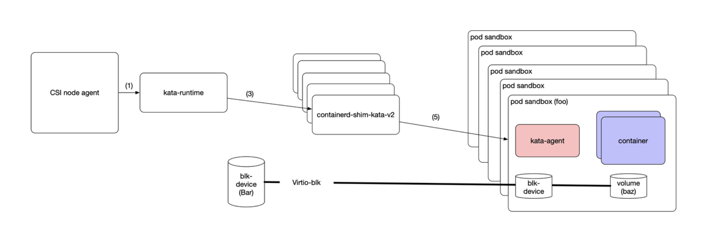
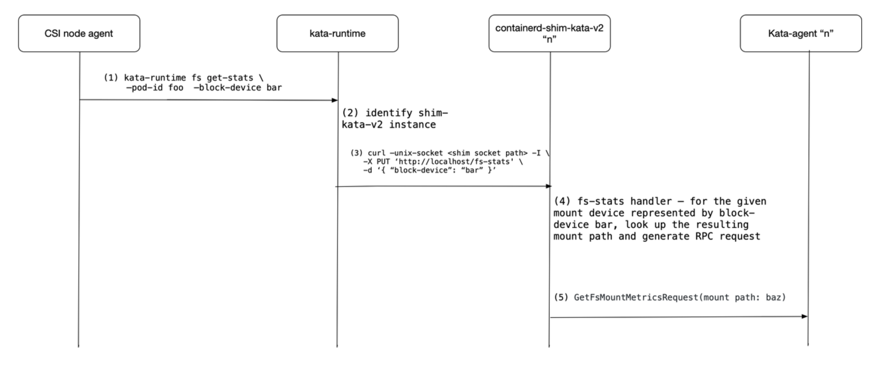

# Background 

Today, filesystem volumes are passed in to the guest VM utilizing virtio-fs. In a typical flow, a CSI controller
will make sure backing storage is attached to the node (often a block device), and then a CSI node driver will
create the filesystem (if needed) and mount it.



Ideally, for a VM, we will consume the block device itself and not utilize the host mount. This simplifies volume management
on the host, and is more efficient from a storage IO perspective. 



# Proposal - Introduce pattern for directly assigning block device for mounting in the guest

In the existing upstream, there is no direct communication between CSI and the container runtime. By the
time volume information is presented to the runtime, it is a path on the given host filesystem. We need a method to:
 - enlighten the CSI driver that a given PVC is to be utilized by Kata (or any other runtime that would prefer to mount the volume on their own).
 - communication path between the CSI node driver and the runtime to detail: what the backing block device is,
   what kind of filesystem it is, and where it should be mounted with respect to the container rootfs.

Ideally we'd be able to come up with a solution that would facilitate a runtime calling into CSI instead of Kubelet, as is done today for CNI. Working within the existing constraints that exist, we are proposing a pattern that can be used to facilitate direct-volume assignment, while working with other upstream projects for a more direct method. 

## Carrying out the mount

The CSI node driver will need to be enlightened that the volume will be consumed by a VM-based runtime, and will need 
to communicate with the runtime to describe where the block device lives, what filesystem is on it, and where it
should be mounted within the container(s).

### Specifiying that the volume will be consumed by a VM-friendly runtime

If a persistent volume [(PV)](https://kubernetes.io/docs/concepts/storage/persistent-volumes/) is intended to be consumed by a VM-based runtime, the user can specify this by adding an annotation to their respect persistent volume claim (PVC). Example:

```yaml
apiVersion: v1
kind: PersistentVolumeClaim
metadata:
  annotations:
    skip-hostmount: "true"
  name: amazing-kata-volume
spec:
  accessModes:
    - ReadWriteOnce
  resources:
    requests:
      storage: 4Gi
```

Based on this annotation, the CSI node driver would identify that the volume should not be mounted, and special handling is needed.

### Communicating block device details to the runtime

The runtime will need to identify that a mount is backed by a block device and that it needs to handle the direct-assignment use case.

When a volume is presented for direct-assignment, the CSI driver will create a particular file, `csiPlugin.json`
at the root of the volume on the host. The contents of this file will be defined as follows:

```go
type DiskMountInfo struct {
        // Device: source device for this volume
        Device string json:"device,omitempty"

        // VolumeType: type associated with this volume (ie, block)
        VolumeType string json:"volumeType,omitempty"

        // TargetPath: path which this device should be mounted within the guest
        TargetPath string json:"targetPath,omitempty"

        // FsType: filesystem that needs to be used to mount the storage inside the VM
        FsType string json:"fsType,omitempty"

        // Options: additional options that might be needed to mount the storage filesystem
        Options string json:options,omitempty"
}
```

The block device will be formatted, but not mounted on the host, by the CSI node driver. Through `csiPlugin.json`,
the runtime will identify that the existing mount should not be mounted into the guest by way of the shared filesystem,
but instead the described device should be attached to the VM, and volume mount information should be provided to the
agent for mounting the in-guest block device to the TargetPath in the guest for consumption by the container(s) in
the pod.

## Managing the mount

Normally any node agent, including the CSI node driver, would be able to directly check the status of the mountpath, 
and look at usage statistics. When the volume mount is not mounted on the host, this is no longer feasible. We need
to introduce a mechanism for gathering similar information on nodes that are utilizing Kata Containers with
direct-assigned volumes.

These actions will be achieved by interacting with a host binary, `kata-runtime`, which will in turn interact with
the applicable shim-kata-v2 instance on the host which will interact with the applicable in-guest kata-agent.

### kata-runtime changes:

The host agent (CSI node driver, as an example) will call into `kata-runtime`. kata-runtime behaves as the API for sandbox-level management interactions. In this case, we propose augmenting `kata-runtime` to include a filesystem, fs, command as follows:

```bash
kata-runtime fs —help
NAME:
kata-runtime fs [subcommand] [options]— interact with mounted filesystem volume

SUBCOMMANDS:
 - get-stats <pod-id> <host-blk-device-name> — show status and usage details for mounted filesystem in pod <pod-id> backed by the given block device, <host-blk-device-name>.
 - resize <pod-id> <host-blk-device-name> <size> — update the mounted volume to <size> for the mounted filesystem in pod <pod-id> backed by the given block device, <host-blk-device-name>.
 ```

Based on the sandbox id provided, the Kata-runtime handler will then interact with the appropriate sandbox to
either gather the filesystem stats for the provided block-device backed volume, or to facilitate resizing the
mounted volume.

### containerd-shim-kata-v2 changes:

`containerd-shim-kata-v2` provides an API for sandbox management through a unix domain socket. Two new handlers are proposed: 

 ```
 New handlers:
 /fs-stats
 /fs-resize

Example:
curl —unix-socket <shim socket path> -I \
 -X PUT ‘http://localhost/fs-stats' \
 -d ‘{ “block-device”: “bar” }’ 

curl —unix-socket <shim socket path> -I \
 -X PUT ‘http://localhost/fs-stats' \
 -d ‘{ “block-device”: “bar”,
 “volume-size”: “123123” 
 }’ 
 ```

The shim will then send a request to the kata-agent to gather the applicable stats, or to make the adjustment to
the volume. Currently we’re augmenting the kata-agent API to introduce a new request, GetFsMountMetricsRequest.

The proposed flow is shown below:




