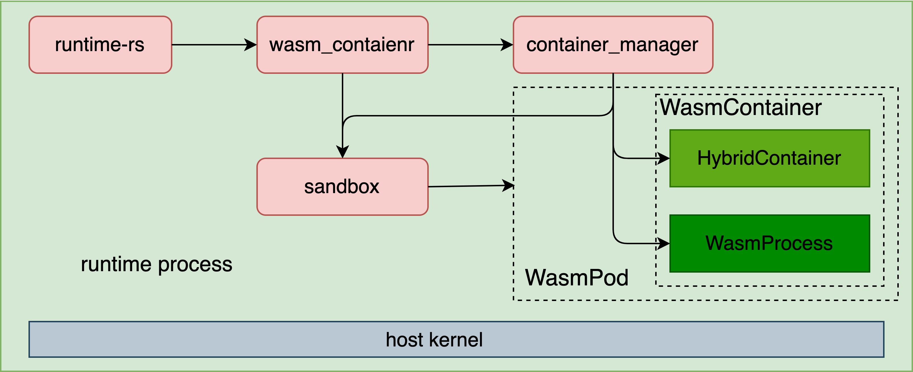

# Host Wasm Containers

## Overview

WebAssembly (Wasm) is a binary instruction format designed for a stack-based virtual machine. It serves as a portable compilation target for various programming languages. Given its efficiency, speed, safety, portability, and polyglot features, wasm is widely used not only in web browsers but also in serverless computing, containerization, and as a plugin host. Therefore, it is important to integrate wasm in kata-containers. Kata provides two methods to meet various needs, running directly on the host and running in MicroVM.

## Usage

1. Enable the the `wasm-runtime` feature to `runtime-rs` and Compile.

```shell
​$ sed -i -e 's/WASM_RUNTIME := no$/WASM_RUNTIME := yes$/g' src/runtime-rs/Makefile
```

2. Enable host wasm containers in `configuration.toml`.

```shell
$ sed -i -e 's/name="virt_container"$/name="wasm_container"/g' /path/to/configuration.toml
```

3. Deploy with the **annotation** `"io.katacontainers.platform.wasi/wasm32": "yes"` or `"true"`.

## Design

### Architecture

<br/>
<div  align="center">    
	
</div>
<br/>

`wasm_container` reuses `agent::rustjail::LinuxContainer` to manage containers and inner processes, and additionally adds `WasmProcess` for process management. Like `virt_container`, all components run in a single process. In addition to the main thread, each sandbox will create **an** additional signal processing thread. Each created container process will result in **three** additional threads for asynchronous I/O threads.

`container_manager` holds a reference to `sandbox` to obtain sandbox information for container configuration. Meanwhile,  `sandbox` holds a reference to `containers` inside `container_manager` forr updating the container status.

### Roadmap

| Component         | Feature                 | Status |
| ----------------- | ----------------------- | ------ |
| container_manager | **container lifecycle** | ✅      |
|                   | **process lifecycle**   | ✅      |
|                   | host systemd cgroup     | ✅      |
|                   | I/O copy                | ✅      |
|                   | rootfs setup            | ✅      |
|                   | oci hooks               | 🚧      |
|                   | persist                 | 🚧      |
| sandbox           | **sandbox lifecycle**   | ✅      |
|                   | shared namespace        | ✅      |
|                   | signal handler          | ✅      |
|                   | persist                 | 🚧      |
|                   | toml config             | 🚧      |
|                   | agent socket            | 🚫      |
|                   | iptables                | 🚫      |
|                   | direct volume           | 🚫      |

