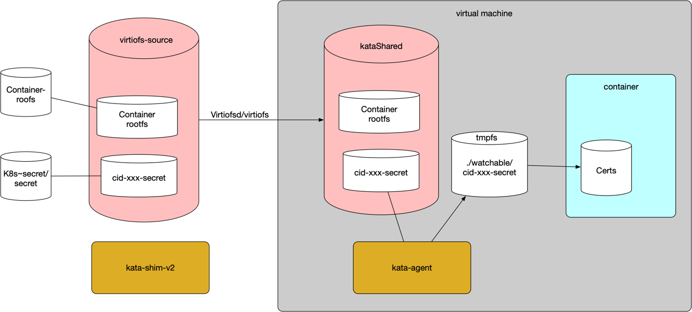

# Kata Containers support for `inotify`

## Background on `inotify` usage

A common pattern in Kubernetes is to watch for changes to files/directories passed in as `ConfigMaps`
or `Secrets`. Sidecar's normally use `inotify` to watch for changes and then signal the primary container to reload
the updated configuration. Kata Containers typically will pass these host files into the guest using `virtiofs`, which
does not support `inotify` today. While we work to enable this use case in `virtiofs`, we introduced a workaround in Kata Containers.
This document describes how Kata Containers implements this workaround.

### Detecting a `watchable` mount

Kubernetes creates `secrets` and `ConfigMap` mounts at very specific locations on the host filesystem. For container mounts,
the `Kata Containers` runtime will check the source of the mount to identify these special cases. For these use cases, only a single file
or very few would typically need to be watched. To avoid excessive overheads in making a mount watchable,
we enforce a limit of eight files per mount. If a `secret` or `ConfigMap` mount contains more than 8 files, it will not be
considered watchable. We similarly enforce a limit of 1 MB per mount to be considered watchable. Non-watchable mounts will
continue to propagate changes from the mount on the host to the container workload, but these updates will not trigger an
`inotify` event.

If at any point a mount grows beyond the eight file or 1MB limit, it will no longer be `watchable.`

### Presenting a `watchable` mount to the workload

For mounts that are considered `watchable`, inside the guest, the `kata-agent` will poll the mount presented from
the host through `virtiofs` and copy any changed files to a `tmpfs` mount that is presented to the container. In this way,
for `watchable` mounts, Kata will do the polling on behalf of the workload and existing workloads needn't change their usage
of `inotify`.

