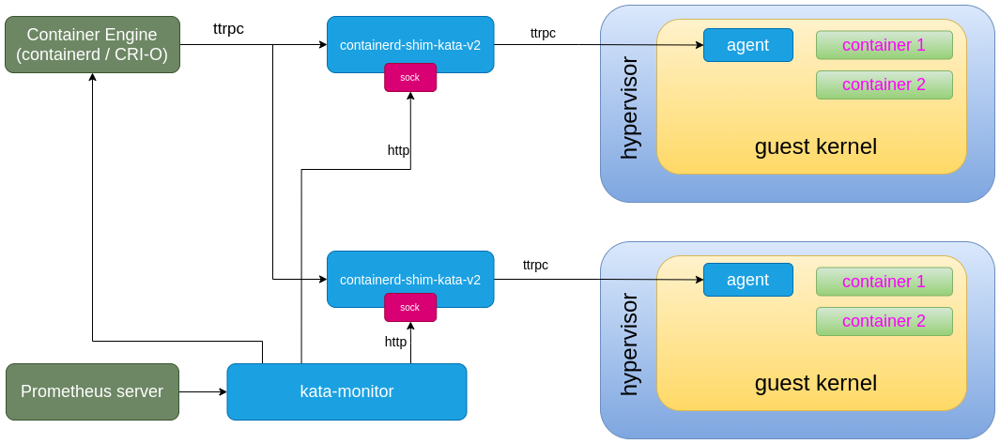
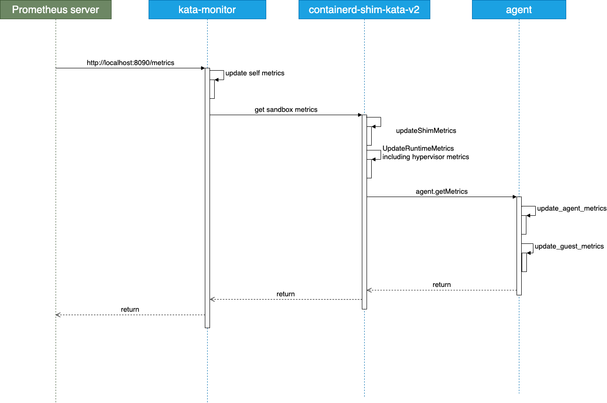

# Kata 2.0 Metrics Design

Kata implements CRI's API and supports [`ContainerStats`](https://github.com/kubernetes/kubernetes/blob/release-1.18/staging/src/k8s.io/cri-api/pkg/apis/runtime/v1alpha2/api.proto#L101) and [`ListContainerStats`](https://github.com/kubernetes/kubernetes/blob/release-1.18/staging/src/k8s.io/cri-api/pkg/apis/runtime/v1alpha2/api.proto#L103) interfaces to expose containers metrics. User can use these interfaces to get basic metrics about containers.

Unlike `runc`, Kata is a VM-based runtime and has a different architecture.

## Limitations of Kata 1.x and target of Kata 2.0

Kata 1.x has a number of limitations related to observability that may be obstacles to running Kata Containers at scale.

In Kata 2.0, the following components will be able to provide more details about the system:

- containerd shim v2 (effectively `kata-runtime`)
- Hypervisor statistics
- Agent process
- Guest OS statistics

> **Note**: In Kata 1.x, the main user-facing component was the runtime (`kata-runtime`). From 1.5, Kata introduced the Kata containerd shim v2 (`containerd-shim-kata-v2`) which is essentially a modified runtime that is loaded by containerd to simplify and improve the way VM-based containers are created and managed.
>
> For Kata 2.0, the main component is the Kata containerd shim v2, although the deprecated `kata-runtime` binary will be maintained for a period of time.
>
> Any mention of the "Kata runtime" in this document should be taken to refer to the Kata containerd shim v2 unless explicitly noted otherwise (for example by referring to it explicitly as the `kata-runtime` binary).

## Metrics architecture

Kata 2.0 metrics strongly depend on [Prometheus](https://prometheus.io/), a graduated project from CNCF.

Kata Containers 2.0 introduces a new Kata component called `kata-monitor` which is used to monitor the Kata components on the host. It's shipped with the Kata runtime to provide an interface to:

- Get metrics
- Get events

At present, `kata-monitor` supports retrieval of metrics only: this is what will be covered in this document.


This is the architecture overview of metrics in Kata Containers 2.0:




And the sequence diagram is shown below:



For a quick evaluation, you can check out [this how to](../how-to/how-to-set-prometheus-in-k8s.md).

### Kata monitor

The `kata-monitor` management agent should be started on each node where the Kata containers runtime is installed. `kata-monitor` will:

> **Note**: a *node* running Kata containers will be either a single host system or a worker node belonging to a K8s cluster capable of running Kata pods.

- Aggregate sandbox metrics running on the node, adding the `sandbox_id` label to them.
- Attach the additional `cri_uid`, `cri_name` and `cri_namespace` labels to the sandbox metrics, tracking the `uid`, `name` and `namespace` Kubernetes pod metadata.
- Expose a new Prometheus target, allowing all node metrics coming from the Kata shim to be collected by Prometheus indirectly. This simplifies the targets count in Prometheus and avoids exposing shim's metrics by `ip:port`.

Only one `kata-monitor` process runs in each node.

`kata-monitor` uses a different communication channel than the one used by the container engine (`containerd`/`CRI-O`) to communicate with the Kata shim. The Kata shim exposes a dedicated socket address reserved to `kata-monitor`.

The shim's metrics socket file is created under the virtcontainers sandboxes directory, i.e. `vc/sbs/${PODID}/shim-monitor.sock`.

> **Note**: If there is no Prometheus server configured, i.e., there are no scrape operations, `kata-monitor` will not collect any metrics.

### Kata runtime

Kata runtime is responsible for:

- Gather metrics about shim process
- Gather metrics about hypervisor process
- Gather metrics about running sandbox
- Get metrics from Kata agent (through `ttrpc`)

### Kata agent

Kata agent is responsible for:

- Gather agent process metrics
- Gather guest OS metrics

In Kata 2.0, the agent adds a new interface:

```protobuf
rpc GetMetrics(GetMetricsRequest) returns (Metrics);

message GetMetricsRequest {}

message Metrics {
	string metrics = 1;
}

```

The `metrics` field is Prometheus encoded content. This can avoid defining a fixed structure in protocol buffers.

### Performance and overhead

Metrics should not become a bottleneck for the system or downgrade the performance: they should run with minimal overhead.

Requirements:

* Metrics **MUST** be quick to collect
* Metrics **MUST** be small
* Metrics **MUST** be generated only if there are subscribers to the Kata metrics service
* Metrics **MUST** be stateless

In Kata 2.0, metrics are collected only when needed (pull mode), mainly from the `/proc` filesystem, and consumed by Prometheus. This means that if the Prometheus collector is not running (so no one cares about the metrics) the overhead will be zero.

The metrics service also doesn't hold any metrics in memory.

#### Metrics size ####

|\*|No Sandbox | 1 Sandbox | 2 Sandboxes |
|---|---|---|---|
|Metrics count| 39 | 106 | 173 |
|Metrics size (bytes)| 9K | 144K | 283K |
|Metrics size (`gzipped`, bytes)| 2K | 10K | 17K |

*Metrics size*: response size of one Prometheus scrape request.

It's easy to estimate the size of one metrics fetch request issued by Prometheus.
The formula to calculate the expected size when no gzip compression is in place is:  
9 + (144 - 9) * `number of kata sandboxes`

Prometheus supports `gzip compression`. When enabled, the response size of each request will be smaller:  
2 + (10 - 2) * `number of kata sandboxes`

**Example**  
We have 10 sandboxes running on a node. The expected size of one metrics fetch request issued by Prometheus against the kata-monitor agent running on that node will be:  
9 + (144 - 9) * 10 = **1.35M**

If `gzip compression` is enabled:  
2 + (10 - 2) * 10 = **82K**

#### Metrics delay ####

And here is some test data:

- End-to-end (from Prometheus server to `kata-monitor` and `kata-monitor` write response back): **20ms**(avg)
- Agent (RPC all from shim to agent): **3ms**(avg)

Test infrastructure:

- OS: Ubuntu 20.04
- Hardware: Intel(R) Core(TM) i5-8500 CPU @ 3.00GHz, 6 Cores, and 16GB memory.

**Scrape interval**

Prometheus default `scrape_interval` is 1 minute, but it is usually set to 15 seconds. A smaller `scrape_interval` causes more overhead, so users should set it depending on their monitoring needs.

## Metrics list

Here are listed all the metrics supported by Kata 2.0. Some metrics are dependent on the VM guest kernel, so the available ones may differ based on the environment.

Metrics are categorized by the component from/for which the metrics are collected.

* [Metric types](#metric-types)
* [Kata agent metrics](#kata-agent-metrics)
* [Firecracker metrics](#firecracker-metrics)
* [Kata guest OS metrics](#kata-guest-os-metrics)
* [Hypervisor metrics](#hypervisor-metrics)
* [Kata monitor metrics](#kata-monitor-metrics)
* [Kata containerd shim v2 metrics](#kata-containerd-shim-v2-metrics)

> **Note**:
>  * Labels here do not include the `instance` and `job` labels added by Prometheus.
>  * Notes about metrics unit
>    * `Kibibytes`, abbreviated `KiB`. 1 `KiB` equals 1024 B.
>    * For some metrics (like network devices statistics from file `/proc/net/dev`), unit depends on label( for example `recv_bytes` and `recv_packets` have different units).
>    * Most of these metrics are collected from the `/proc` filesystem, so the unit of each metric matches the unit of the relevant `/proc` entry. See the `proc(5)` manual page for further details.

### Metric types

Prometheus offers four core metric types.

- Counter: A counter is a cumulative metric that represents a single monotonically increasing counter whose value can only increase.

- Gauge: A gauge metric represents a single numerical value that can go up and down, typically used for measured values like current memory usage.

- Histogram: A histogram samples observations (usually things like request durations or response sizes) and counts them in configurable buckets.

- Summary: A summary samples observations like histogram, it can calculate configurable quantiles over a sliding time window.

See [Prometheus metric types](https://prometheus.io/docs/concepts/metric_types/) for detailed explanations about these metric types.

### Kata agent metrics

Agent's metrics contains metrics about agent process.

| Metric name | Type | Units | Labels | Introduced in Kata version |
|---|---|---|---|---|
| `kata_agent_io_stat`: <br> Agent process IO stat. | `GAUGE` |  | <ul><li>`item` (see `/proc/<pid>/io`)<ul><li>`cancelled_write_byte`</li><li>`rchar`</li><li>`read_bytes`</li><li>`syscr`</li><li>`syscw`</li><li>`wchar`</li><li>`write_bytes`</li></ul></li><li>`sandbox_id`</li></ul> | 2.0.0 |
| `kata_agent_proc_stat`: <br> Agent process stat. | `GAUGE` |  | <ul><li>`item` (see `/proc/<pid>/stat`)<ul><li>`cstime`</li><li>`cutime`</li><li>`stime`</li><li>`utime`</li></ul></li><li>`sandbox_id`</li></ul> | 2.0.0 |
| `kata_agent_proc_status`: <br> Agent process status. | `GAUGE` |  | <ul><li>`item` (see `/proc/<pid>/status`)<ul><li>`hugetlbpages`</li><li>`nonvoluntary_ctxt_switches`</li><li>`rssanon`</li><li>`rssfile`</li><li>`rssshmem`</li><li>`vmdata`</li><li>`vmexe`</li><li>`vmhwm`</li><li>`vmlck`</li><li>`vmlib`</li><li>`vmpeak`</li><li>`vmpin`</li><li>`vmpte`</li><li>`vmrss`</li><li>`vmsize`</li><li>`vmstk`</li><li>`vmswap`</li><li>`voluntary_ctxt_switches`</li></ul></li><li>`sandbox_id`</li></ul> | 2.0.0 |
| `kata_agent_process_cpu_seconds_total`: <br> Total user and system CPU time spent in seconds. | `COUNTER` | `seconds` | <ul><li>`sandbox_id`</li></ul> | 2.0.0 |
| `kata_agent_process_max_fds`: <br> Maximum number of open file descriptors. | `GAUGE` |  | <ul><li>`sandbox_id`</li></ul> | 2.0.0 |
| `kata_agent_process_open_fds`: <br> Number of open file descriptors. | `GAUGE` |  | <ul><li>`sandbox_id`</li></ul> | 2.0.0 |
| `kata_agent_process_resident_memory_bytes`: <br> Resident memory size in bytes. | `GAUGE` | `bytes` | <ul><li>`sandbox_id`</li></ul> | 2.0.0 |
| `kata_agent_process_start_time_seconds`: <br> Start time of the process since `unix` epoch in seconds. | `GAUGE` | `seconds` | <ul><li>`sandbox_id`</li></ul> | 2.0.0 |
| `kata_agent_process_virtual_memory_bytes`: <br> Virtual memory size in bytes. | `GAUGE` | `bytes` | <ul><li>`sandbox_id`</li></ul> | 2.0.0 |
| `kata_agent_scrape_count`: <br> Metrics scrape count | `COUNTER` |  | <ul><li>`sandbox_id`</li></ul> | 2.0.0 |
| `kata_agent_total_rss`: <br> Agent process total `rss` size | `GAUGE` |  | <ul><li>`sandbox_id`</li></ul> | 2.0.0 |
| `kata_agent_total_time`: <br> Agent process total time | `GAUGE` |  | <ul><li>`sandbox_id`</li></ul> | 2.0.0 |
| `kata_agent_total_vm`: <br> Agent process total `vm` size | `GAUGE` |  | <ul><li>`sandbox_id`</li></ul> | 2.0.0 |

### Firecracker metrics

Metrics for Firecracker vmm.

| Metric name | Type | Units | Labels | Introduced in Kata version |
|---|---|---|---|---|
| `kata_firecracker_api_server`: <br> Metrics related to the internal API server. | `GAUGE` |  | <ul><li>`item`<ul><li>`process_startup_time_cpu_us`</li><li>`process_startup_time_us`</li><li>`sync_response_fails`</li><li>`sync_vmm_send_timeout_count`</li></ul></li><li>`sandbox_id`</li></ul> | 2.0.0 |
| `kata_firecracker_block`: <br> Block Device associated metrics. | `GAUGE` |  | <ul><li>`item`<ul><li>`activate_fails`</li><li>`cfg_fails`</li><li>`event_fails`</li><li>`execute_fails`</li><li>`flush_count`</li><li>`invalid_reqs_count`</li><li>`no_avail_buffer`</li><li>`queue_event_count`</li><li>`rate_limiter_event_count`</li><li>`rate_limiter_throttled_events`</li><li>`read_bytes`</li><li>`read_count`</li><li>`update_count`</li><li>`update_fails`</li><li>`write_bytes`</li><li>`write_count`</li></ul></li><li>`sandbox_id`</li></ul> | 2.0.0 |
| `kata_firecracker_get_api_requests`: <br> Metrics specific to GET API Requests for counting user triggered actions and/or failures. | `GAUGE` |  | <ul><li>`item`<ul><li>`instance_info_count`</li><li>`instance_info_fails`</li><li>`machine_cfg_count`</li><li>`machine_cfg_fails`</li></ul></li><li>`sandbox_id`</li></ul> | 2.0.0 |
| `kata_firecracker_i8042`: <br> Metrics specific to the i8042 device. | `GAUGE` |  | <ul><li>`item`<ul><li>`error_count`</li><li>`missed_read_count`</li><li>`missed_write_count`</li><li>`read_count`</li><li>`reset_count`</li><li>`write_count`</li></ul></li><li>`sandbox_id`</li></ul> | 2.0.0 |
| `kata_firecracker_latencies_us`: <br> Performance metrics related for the moment only to snapshots. | `GAUGE` |  | <ul><li>`item`<ul><li>`diff_create_snapshot`</li><li>`full_create_snapshot`</li><li>`load_snapshot`</li><li>`pause_vm`</li><li>`resume_vm`</li><li>`vmm_diff_create_snapshot`</li><li>`vmm_full_create_snapshot`</li><li>`vmm_load_snapshot`</li><li>`vmm_pause_vm`</li><li>`vmm_resume_vm`</li></ul></li><li>`sandbox_id`</li></ul> | 2.0.0 |
| `kata_firecracker_logger`: <br> Metrics for the logging subsystem. | `GAUGE` |  | <ul><li>`item`<ul><li>`log_fails`</li><li>`metrics_fails`</li><li>`missed_log_count`</li><li>`missed_metrics_count`</li></ul></li><li>`sandbox_id`</li></ul> | 2.0.0 |
| `kata_firecracker_mmds`: <br> Metrics for the MMDS functionality. | `GAUGE` |  | <ul><li>`item`<ul><li>`connections_created`</li><li>`connections_destroyed`</li><li>`rx_accepted`</li><li>`rx_accepted_err`</li><li>`rx_accepted_unusual`</li><li>`rx_bad_eth`</li><li>`rx_count`</li><li>`tx_bytes`</li><li>`tx_count`</li><li>`tx_errors`</li><li>`tx_frames`</li></ul></li><li>`sandbox_id`</li></ul> | 2.0.0 |
| `kata_firecracker_net`: <br> Network-related metrics. | `GAUGE` |  | <ul><li>`item`<ul><li>`activate_fails`</li><li>`cfg_fails`</li><li>`event_fails`</li><li>`mac_address_updates`</li><li>`no_rx_avail_buffer`</li><li>`no_tx_avail_buffer`</li><li>`rx_bytes_count`</li><li>`rx_count`</li><li>`rx_event_rate_limiter_count`</li><li>`rx_fails`</li><li>`rx_packets_count`</li><li>`rx_partial_writes`</li><li>`rx_queue_event_count`</li><li>`rx_rate_limiter_throttled`</li><li>`rx_tap_event_count`</li><li>`tap_read_fails`</li><li>`tap_write_fails`</li><li>`tx_bytes_count`</li><li>`tx_count`</li><li>`tx_fails`</li><li>`tx_malformed_frames`</li><li>`tx_packets_count`</li><li>`tx_partial_reads`</li><li>`tx_queue_event_count`</li><li>`tx_rate_limiter_event_count`</li><li>`tx_rate_limiter_throttled`</li><li>`tx_spoofed_mac_count`</li></ul></li><li>`sandbox_id`</li></ul> | 2.0.0 |
| `kata_firecracker_patch_api_requests`: <br> Metrics specific to PATCH API Requests for counting user triggered actions and/or failures. | `GAUGE` |  | <ul><li>`item`<ul><li>`drive_count`</li><li>`drive_fails`</li><li>`machine_cfg_count`</li><li>`machine_cfg_fails`</li><li>`network_count`</li><li>`network_fails`</li></ul></li><li>`sandbox_id`</li></ul> | 2.0.0 |
| `kata_firecracker_put_api_requests`: <br> Metrics specific to PUT API Requests for counting user triggered actions and/or failures. | `GAUGE` |  | <ul><li>`item`<ul><li>`actions_count`</li><li>`actions_fails`</li><li>`boot_source_count`</li><li>`boot_source_fails`</li><li>`drive_count`</li><li>`drive_fails`</li><li>`logger_count`</li><li>`logger_fails`</li><li>`machine_cfg_count`</li><li>`machine_cfg_fails`</li><li>`metrics_count`</li><li>`metrics_fails`</li><li>`network_count`</li><li>`network_fails`</li></ul></li><li>`sandbox_id`</li></ul> | 2.0.0 |
| `kata_firecracker_rtc`: <br> Metrics specific to the RTC device. | `GAUGE` |  | <ul><li>`item`<ul><li>`error_count`</li><li>`missed_read_count`</li><li>`missed_write_count`</li></ul></li><li>`sandbox_id`</li></ul> | 2.0.0 |
| `kata_firecracker_seccomp`: <br> Metrics for the seccomp filtering. | `GAUGE` |  | <ul><li>`item`<ul><li>`num_faults`</li></ul></li><li>`sandbox_id`</li></ul> | 2.0.0 |
| `kata_firecracker_signals`: <br> Metrics related to signals. | `GAUGE` |  | <ul><li>`item`<ul><li>`sigbus`</li><li>`sigsegv`</li></ul></li><li>`sandbox_id`</li></ul> | 2.0.0 |
| `kata_firecracker_uart`: <br> Metrics specific to the UART device. | `GAUGE` |  | <ul><li>`item`<ul><li>`error_count`</li><li>`flush_count`</li><li>`missed_read_count`</li><li>`missed_write_count`</li><li>`read_count`</li><li>`write_count`</li></ul></li><li>`sandbox_id`</li></ul> | 2.0.0 |
| `kata_firecracker_vcpu`: <br> Metrics specific to VCPUs' mode of functioning. | `GAUGE` |  | <ul><li>`item`<ul><li>`exit_io_in`</li><li>`exit_io_out`</li><li>`exit_mmio_read`</li><li>`exit_mmio_write`</li><li>`failures`</li><li>`filter_cpuid`</li></ul></li><li>`sandbox_id`</li></ul> | 2.0.0 |
| `kata_firecracker_vmm`: <br> Metrics specific to the machine manager as a whole. | `GAUGE` |  | <ul><li>`item`<ul><li>`device_events`</li><li>`panic_count`</li></ul></li><li>`sandbox_id`</li></ul> | 2.0.0 |
| `kata_firecracker_vsock`: <br> VSOCK-related metrics. | `GAUGE` |  | <ul><li>`item`<ul><li>`activate_fails`</li><li>`cfg_fails`</li><li>`conn_event_fails`</li><li>`conns_added`</li><li>`conns_killed`</li><li>`conns_removed`</li><li>`ev_queue_event_fails`</li><li>`killq_resync`</li><li>`muxer_event_fails`</li><li>`rx_bytes_count`</li><li>`rx_packets_count`</li><li>`rx_queue_event_count`</li><li>`rx_queue_event_fails`</li><li>`rx_read_fails`</li><li>`tx_bytes_count`</li><li>`tx_flush_fails`</li><li>`tx_packets_count`</li><li>`tx_queue_event_count`</li><li>`tx_queue_event_fails`</li><li>`tx_write_fails`</li></ul></li><li>`sandbox_id`</li></ul> | 2.0.0 |

### Kata guest OS metrics

Guest OS's metrics in hypervisor.

| Metric name | Type | Units | Labels | Introduced in Kata version |
|---|---|---|---|---|
| `kata_guest_cpu_time`: <br> Guest CPU stat. | `GAUGE` |  | <ul><li>`cpu` (CPU no. and total for all CPUs)<ul><li>`0` (CPU 0)</li><li>`1` (CPU 1)</li><li>`total` (for all CPUs)</li></ul></li><li>`item` (Kernel/system statistics, from `/proc/stat`)<ul><li>`guest`</li><li>`guest_nice`</li><li>`idle`</li><li>`iowait`</li><li>`irq`</li><li>`nice`</li><li>`softirq`</li><li>`steal`</li><li>`system`</li><li>`user`</li></ul></li><li>`sandbox_id`</li></ul> | 2.0.0 |
| `kata_guest_diskstat`: <br> Disks stat in system. | `GAUGE` |  | <ul><li>`disk` (disk name)</li><li>`item` (see `/proc/diskstats`)<ul><li>`discards`</li><li>`discards_merged`</li><li>`flushes`</li><li>`in_progress`</li><li>`merged`</li><li>`reads`</li><li>`sectors_discarded`</li><li>`sectors_read`</li><li>`sectors_written`</li><li>`time_discarding`</li><li>`time_flushing`</li><li>`time_in_progress`</li><li>`time_reading`</li><li>`time_writing`</li><li>`weighted_time_in_progress`</li><li>`writes`</li><li>`writes_merged`</li></ul></li><li>`sandbox_id`</li></ul> | 2.0.0 |
| `kata_guest_load`: <br> Guest system load. | `GAUGE` |  | <ul><li>`item`<ul><li>`load1`</li><li>`load15`</li><li>`load5`</li></ul></li><li>`sandbox_id`</li></ul> | 2.0.0 |
| `kata_guest_meminfo`: <br> Statistics about memory usage on the system. | `GAUGE` |  | <ul><li>`item` (see `/proc/meminfo`)<ul><li>`active`</li><li>`active_anon`</li><li>`active_file`</li><li>`anon_hugepages`</li><li>`anon_pages`</li><li>`bounce`</li><li>`buffers`</li><li>`cached`</li><li>`cma_free`</li><li>`cma_total`</li><li>`commit_limit`</li><li>`committed_as`</li><li>`direct_map_1G`</li><li>`direct_map_2M`</li><li>`direct_map_4M`</li><li>`direct_map_4k`</li><li>`dirty`</li><li>`hardware_corrupted`</li><li>`high_free`</li><li>`high_total`</li><li>`hugepages_free`</li><li>`hugepages_rsvd`</li><li>`hugepages_surp`</li><li>`hugepages_total`</li><li>`hugepagesize`</li><li>`hugetlb`</li><li>`inactive`</li><li>`inactive_anon`</li><li>`inactive_file`</li><li>`k_reclaimable`</li><li>`kernel_stack`</li><li>`low_free`</li><li>`low_total`</li><li>`mapped`</li><li>`mem_available`</li><li>`mem_free`</li><li>`mem_total`</li><li>`mlocked`</li><li>`mmap_copy`</li><li>`nfs_unstable`</li><li>`page_tables`</li><li>`per_cpu`</li><li>`quicklists`</li><li>`s_reclaimable`</li><li>`s_unreclaim`</li><li>`shmem`</li><li>`shmem_hugepages`</li><li>`shmem_pmd_mapped`</li><li>`slab`</li><li>`swap_cached`</li><li>`swap_free`</li><li>`swap_total`</li><li>`unevictable`</li><li>`vmalloc_chunk`</li><li>`vmalloc_total`</li><li>`vmalloc_used`</li><li>`writeback`</li><li>`writeback_tmp`</li></ul></li><li>`sandbox_id`</li></ul> | 2.0.0 |
| `kata_guest_netdev_stat`: <br> Guest net devices stats. | `GAUGE` |  | <ul><li>`interface` (network device name)</li><li>`item` (see `/proc/net/dev`)<ul><li>`recv_bytes`</li><li>`recv_compressed`</li><li>`recv_drop`</li><li>`recv_errs`</li><li>`recv_fifo`</li><li>`recv_frame`</li><li>`recv_multicast`</li><li>`recv_packets`</li><li>`sent_bytes`</li><li>`sent_carrier`</li><li>`sent_colls`</li><li>`sent_compressed`</li><li>`sent_drop`</li><li>`sent_errs`</li><li>`sent_fifo`</li><li>`sent_packets`</li></ul></li><li>`sandbox_id`</li></ul> | 2.0.0 |
| `kata_guest_tasks`: <br> Guest system load. | `GAUGE` |  | <ul><li>`item`<ul><li>`cur`</li><li>`max`</li></ul></li><li>`sandbox_id`</li></ul> | 2.0.0 |
| `kata_guest_vm_stat`: <br> Guest virtual memory stat. | `GAUGE` |  | <ul><li>`item` (see `/proc/vmstat`)<ul><li>`allocstall_dma`</li><li>`allocstall_dma32`</li><li>`allocstall_movable`</li><li>`allocstall_normal`</li><li>`balloon_deflate`</li><li>`balloon_inflate`</li><li>`compact_daemon_free_scanned`</li><li>`compact_daemon_migrate_scanned`</li><li>`compact_daemon_wake`</li><li>`compact_fail`</li><li>`compact_free_scanned`</li><li>`compact_isolated`</li><li>`compact_migrate_scanned`</li><li>`compact_stall`</li><li>`compact_success`</li><li>`drop_pagecache`</li><li>`drop_slab`</li><li>`htlb_buddy_alloc_fail`</li><li>`htlb_buddy_alloc_success`</li><li>`kswapd_high_wmark_hit_quickly`</li><li>`kswapd_inodesteal`</li><li>`kswapd_low_wmark_hit_quickly`</li><li>`nr_active_anon`</li><li>`nr_active_file`</li><li>`nr_anon_pages`</li><li>`nr_anon_transparent_hugepages`</li><li>`nr_bounce`</li><li>`nr_dirtied`</li><li>`nr_dirty`</li><li>`nr_dirty_background_threshold`</li><li>`nr_dirty_threshold`</li><li>`nr_file_pages`</li><li>`nr_free_cma`</li><li>`nr_free_pages`</li><li>`nr_inactive_anon`</li><li>`nr_inactive_file`</li><li>`nr_isolated_anon`</li><li>`nr_isolated_file`</li><li>`nr_kernel_stack`</li><li>`nr_mapped`</li><li>`nr_mlock`</li><li>`nr_page_table_pages`</li><li>`nr_shmem`</li><li>`nr_shmem_hugepages`</li><li>`nr_shmem_pmdmapped`</li><li>`nr_slab_reclaimable`</li><li>`nr_slab_unreclaimable`</li><li>`nr_unevictable`</li><li>`nr_unstable`</li><li>`nr_vmscan_immediate_reclaim`</li><li>`nr_vmscan_write`</li><li>`nr_writeback`</li><li>`nr_writeback_temp`</li><li>`nr_written`</li><li>`nr_zone_active_anon`</li><li>`nr_zone_active_file`</li><li>`nr_zone_inactive_anon`</li><li>`nr_zone_inactive_file`</li><li>`nr_zone_unevictable`</li><li>`nr_zone_write_pending`</li><li>`oom_kill`</li><li>`pageoutrun`</li><li>`pgactivate`</li><li>`pgalloc_dma`</li><li>`pgalloc_dma32`</li><li>`pgalloc_movable`</li><li>`pgalloc_normal`</li><li>`pgdeactivate`</li><li>`pgfault`</li><li>`pgfree`</li><li>`pginodesteal`</li><li>`pglazyfree`</li><li>`pglazyfreed`</li><li>`pgmajfault`</li><li>`pgmigrate_fail`</li><li>`pgmigrate_success`</li><li>`pgpgin`</li><li>`pgpgout`</li><li>`pgrefill`</li><li>`pgrotated`</li><li>`pgscan_direct`</li><li>`pgscan_direct_throttle`</li><li>`pgscan_kswapd`</li><li>`pgskip_dma`</li><li>`pgskip_dma32`</li><li>`pgskip_movable`</li><li>`pgskip_normal`</li><li>`pgsteal_direct`</li><li>`pgsteal_kswapd`</li><li>`pswpin`</li><li>`pswpout`</li><li>`slabs_scanned`</li><li>`swap_ra`</li><li>`swap_ra_hit`</li><li>`unevictable_pgs_cleared`</li><li>`unevictable_pgs_culled`</li><li>`unevictable_pgs_mlocked`</li><li>`unevictable_pgs_munlocked`</li><li>`unevictable_pgs_rescued`</li><li>`unevictable_pgs_scanned`</li><li>`unevictable_pgs_stranded`</li><li>`workingset_activate`</li><li>`workingset_nodereclaim`</li><li>`workingset_refault`</li></ul></li><li>`sandbox_id`</li></ul> | 2.0.0 |

### Hypervisor metrics

Hypervisors metrics, collected mainly from `proc` filesystem of hypervisor process.

| Metric name | Type | Units | Labels | Introduced in Kata version |
|---|---|---|---|---|
| `kata_hypervisor_fds`: <br> Open FDs for hypervisor. | `GAUGE` |  | <ul><li>`sandbox_id`</li></ul> | 2.0.0 |
| `kata_hypervisor_io_stat`: <br> Process IO statistics. | `GAUGE` |  | <ul><li>`item` (see `/proc/<pid>/io`)<ul><li>`cancelledwritebytes`</li><li>`rchar`</li><li>`readbytes`</li><li>`syscr`</li><li>`syscw`</li><li>`wchar`</li><li>`writebytes`</li></ul></li><li>`sandbox_id`</li></ul> | 2.0.0 |
| `kata_hypervisor_netdev`: <br> Net devices statistics. | `GAUGE` |  | <ul><li>`interface` (network device name)</li><li>`item` (see `/proc/net/dev`)<ul><li>`recv_bytes`</li><li>`recv_compressed`</li><li>`recv_drop`</li><li>`recv_errs`</li><li>`recv_fifo`</li><li>`recv_frame`</li><li>`recv_multicast`</li><li>`recv_packets`</li><li>`sent_bytes`</li><li>`sent_carrier`</li><li>`sent_colls`</li><li>`sent_compressed`</li><li>`sent_drop`</li><li>`sent_errs`</li><li>`sent_fifo`</li><li>`sent_packets`</li></ul></li><li>`sandbox_id`</li></ul> | 2.0.0 |
| `kata_hypervisor_proc_stat`: <br> Hypervisor process statistics. | `GAUGE` |  | <ul><li>`item` (see `/proc/<pid>/stat`)<ul><li>`cstime`</li><li>`cutime`</li><li>`stime`</li><li>`utime`</li></ul></li><li>`sandbox_id`</li></ul> | 2.0.0 |
| `kata_hypervisor_proc_status`: <br> Hypervisor process status. | `GAUGE` |  | <ul><li>`item` (see `/proc/<pid>/status`)<ul><li>`hugetlbpages`</li><li>`nonvoluntary_ctxt_switches`</li><li>`rssanon`</li><li>`rssfile`</li><li>`rssshmem`</li><li>`vmdata`</li><li>`vmexe`</li><li>`vmhwm`</li><li>`vmlck`</li><li>`vmlib`</li><li>`vmpeak`</li><li>`vmpin`</li><li>`vmpmd`</li><li>`vmpte`</li><li>`vmrss`</li><li>`vmsize`</li><li>`vmstk`</li><li>`vmswap`</li><li>`voluntary_ctxt_switches`</li></ul></li><li>`sandbox_id`</li></ul> | 2.0.0 |
| `kata_hypervisor_threads`: <br> Hypervisor process threads. | `GAUGE` |  | <ul><li>`sandbox_id`</li></ul> | 2.0.0 |

### Kata monitor metrics

Metrics about monitor itself.

| Metric name | Type | Units | Labels | Introduced in Kata version |
|---|---|---|---|---|
| `kata_monitor_go_gc_duration_seconds`: <br> A summary of the pause duration of garbage collection cycles. | `SUMMARY` | `seconds` |  | 2.0.0 |
| `kata_monitor_go_goroutines`: <br> Number of goroutines that currently exist. | `GAUGE` |  |  | 2.0.0 |
| `kata_monitor_go_info`: <br> Information about the Go environment. | `GAUGE` |  | <ul><li>`version` (golang version)<ul><li>`go1.13.9` (environment dependent variable)</li></ul></li></ul> | 2.0.0 |
| `kata_monitor_go_memstats_alloc_bytes`: <br> Number of bytes allocated and still in use. | `GAUGE` | `bytes` |  | 2.0.0 |
| `kata_monitor_go_memstats_alloc_bytes_total`: <br> Total number of bytes allocated, even if freed. | `COUNTER` | `bytes` |  | 2.0.0 |
| `kata_monitor_go_memstats_buck_hash_sys_bytes`: <br> Number of bytes used by the profiling bucket hash table. | `GAUGE` | `bytes` |  | 2.0.0 |
| `kata_monitor_go_memstats_frees_total`: <br> Total number of frees. | `COUNTER` |  |  | 2.0.0 |
| `kata_monitor_go_memstats_gc_cpu_fraction`: <br> The fraction of this program's available CPU time used by the GC since the program started. | `GAUGE` |  |  | 2.0.0 |
| `kata_monitor_go_memstats_gc_sys_bytes`: <br> Number of bytes used for garbage collection system metadata. | `GAUGE` | `bytes` |  | 2.0.0 |
| `kata_monitor_go_memstats_heap_alloc_bytes`: <br> Number of heap bytes allocated and still in use. | `GAUGE` | `bytes` |  | 2.0.0 |
| `kata_monitor_go_memstats_heap_idle_bytes`: <br> Number of heap bytes waiting to be used. | `GAUGE` | `bytes` |  | 2.0.0 |
| `kata_monitor_go_memstats_heap_inuse_bytes`: <br> Number of heap bytes that are in use. | `GAUGE` | `bytes` |  | 2.0.0 |
| `kata_monitor_go_memstats_heap_objects`: <br> Number of allocated objects. | `GAUGE` |  |  | 2.0.0 |
| `kata_monitor_go_memstats_heap_released_bytes`: <br> Number of heap bytes released to OS. | `GAUGE` | `bytes` |  | 2.0.0 |
| `kata_monitor_go_memstats_heap_sys_bytes`: <br> Number of heap bytes obtained from system. | `GAUGE` | `bytes` |  | 2.0.0 |
| `kata_monitor_go_memstats_last_gc_time_seconds`: <br> Number of seconds since 1970 of last garbage collection. | `GAUGE` | `seconds` |  | 2.0.0 |
| `kata_monitor_go_memstats_lookups_total`: <br> Total number of pointer lookups. | `COUNTER` |  |  | 2.0.0 |
| `kata_monitor_go_memstats_mallocs_total`: <br> Total number of `mallocs`. | `COUNTER` |  |  | 2.0.0 |
| `kata_monitor_go_memstats_mcache_inuse_bytes`: <br> Number of bytes in use by `mcache` structures. | `GAUGE` | `bytes` |  | 2.0.0 |
| `kata_monitor_go_memstats_mcache_sys_bytes`: <br> Number of bytes used for `mcache` structures obtained from system. | `GAUGE` | `bytes` |  | 2.0.0 |
| `kata_monitor_go_memstats_mspan_inuse_bytes`: <br> Number of bytes in use by `mspan` structures. | `GAUGE` | `bytes` |  | 2.0.0 |
| `kata_monitor_go_memstats_mspan_sys_bytes`: <br> Number of bytes used for `mspan` structures obtained from system. | `GAUGE` | `bytes` |  | 2.0.0 |
| `kata_monitor_go_memstats_next_gc_bytes`: <br> Number of heap bytes when next garbage collection will take place. | `GAUGE` | `bytes` |  | 2.0.0 |
| `kata_monitor_go_memstats_other_sys_bytes`: <br> Number of bytes used for other system allocations. | `GAUGE` | `bytes` |  | 2.0.0 |
| `kata_monitor_go_memstats_stack_inuse_bytes`: <br> Number of bytes in use by the stack allocator. | `GAUGE` | `bytes` |  | 2.0.0 |
| `kata_monitor_go_memstats_stack_sys_bytes`: <br> Number of bytes obtained from system for stack allocator. | `GAUGE` | `bytes` |  | 2.0.0 |
| `kata_monitor_go_memstats_sys_bytes`: <br> Number of bytes obtained from system. | `GAUGE` | `bytes` |  | 2.0.0 |
| `kata_monitor_go_threads`: <br> Number of OS threads created. | `GAUGE` |  |  | 2.0.0 |
| `kata_monitor_process_cpu_seconds_total`: <br> Total user and system CPU time spent in seconds. | `COUNTER` | `seconds` |  | 2.0.0 |
| `kata_monitor_process_max_fds`: <br> Maximum number of open file descriptors. | `GAUGE` |  |  | 2.0.0 |
| `kata_monitor_process_open_fds`: <br> Number of open file descriptors. | `GAUGE` |  |  | 2.0.0 |
| `kata_monitor_process_resident_memory_bytes`: <br> Resident memory size in bytes. | `GAUGE` | `bytes` |  | 2.0.0 |
| `kata_monitor_process_start_time_seconds`: <br> Start time of the process since `unix` epoch in seconds. | `GAUGE` | `seconds` |  | 2.0.0 |
| `kata_monitor_process_virtual_memory_bytes`: <br> Virtual memory size in bytes. | `GAUGE` | `bytes` |  | 2.0.0 |
| `kata_monitor_process_virtual_memory_max_bytes`: <br> Maximum amount of virtual memory available in bytes. | `GAUGE` | `bytes` |  | 2.0.0 |
| `kata_monitor_running_shim_count`: <br> Running shim count(running sandboxes). | `GAUGE` |  |  | 2.0.0 |
| `kata_monitor_scrape_count`: <br> Scape count. | `COUNTER` |  |  | 2.0.0 |
| `kata_monitor_scrape_durations_histogram_milliseconds`: <br> Time used to scrape from shims | `HISTOGRAM` | `milliseconds` |  | 2.0.0 |
| `kata_monitor_scrape_failed_count`: <br> Failed scape count. | `COUNTER` |  |  | 2.0.0 |

### Kata containerd shim v2 metrics

Metrics about Kata containerd shim v2 process.

| Metric name | Type | Units | Labels | Introduced in Kata version |
|---|---|---|---|---|
| `kata_shim_agent_rpc_durations_histogram_milliseconds`: <br> RPC latency distributions. | `HISTOGRAM` | `milliseconds` | <ul><li>`action` (RPC actions of Kata agent)<ul><li>`grpc.CheckRequest`</li><li>`grpc.CloseStdinRequest`</li><li>`grpc.CopyFileRequest`</li><li>`grpc.CreateContainerRequest`</li><li>`grpc.CreateSandboxRequest`</li><li>`grpc.DestroySandboxRequest`</li><li>`grpc.ExecProcessRequest`</li><li>`grpc.GetMetricsRequest`</li><li>`grpc.GuestDetailsRequest`</li><li>`grpc.ListInterfacesRequest`</li><li>`grpc.ListProcessesRequest`</li><li>`grpc.ListRoutesRequest`</li><li>`grpc.MemHotplugByProbeRequest`</li><li>`grpc.OnlineCPUMemRequest`</li><li>`grpc.PauseContainerRequest`</li><li>`grpc.RemoveContainerRequest`</li><li>`grpc.ReseedRandomDevRequest`</li><li>`grpc.ResumeContainerRequest`</li><li>`grpc.SetGuestDateTimeRequest`</li><li>`grpc.SignalProcessRequest`</li><li>`grpc.StartContainerRequest`</li><li>`grpc.StatsContainerRequest`</li><li>`grpc.TtyWinResizeRequest`</li><li>`grpc.UpdateContainerRequest`</li><li>`grpc.UpdateInterfaceRequest`</li><li>`grpc.UpdateRoutesRequest`</li><li>`grpc.WaitProcessRequest`</li><li>`grpc.WriteStreamRequest`</li></ul></li><li>`sandbox_id`</li></ul> | 2.0.0 |
| `kata_shim_fds`: <br> Kata containerd shim v2 open FDs. | `GAUGE` |  | <ul><li>`sandbox_id`</li></ul> | 2.0.0 |
| `kata_shim_go_gc_duration_seconds`: <br> A summary of the pause duration of garbage collection cycles. | `SUMMARY` | `seconds` | <ul><li>`sandbox_id`</li></ul> | 2.0.0 |
| `kata_shim_go_goroutines`: <br> Number of goroutines that currently exist. | `GAUGE` |  | <ul><li>`sandbox_id`</li></ul> | 2.0.0 |
| `kata_shim_go_info`: <br> Information about the Go environment. | `GAUGE` |  | <ul><li>`sandbox_id`</li><li>`version` (golang version)<ul><li>`go1.13.9` (environment dependent variable)</li></ul></li></ul> | 2.0.0 |
| `kata_shim_go_memstats_alloc_bytes`: <br> Number of bytes allocated and still in use. | `GAUGE` | `bytes` | <ul><li>`sandbox_id`</li></ul> | 2.0.0 |
| `kata_shim_go_memstats_alloc_bytes_total`: <br> Total number of bytes allocated, even if freed. | `COUNTER` | `bytes` | <ul><li>`sandbox_id`</li></ul> | 2.0.0 |
| `kata_shim_go_memstats_buck_hash_sys_bytes`: <br> Number of bytes used by the profiling bucket hash table. | `GAUGE` | `bytes` | <ul><li>`sandbox_id`</li></ul> | 2.0.0 |
| `kata_shim_go_memstats_frees_total`: <br> Total number of frees. | `COUNTER` |  | <ul><li>`sandbox_id`</li></ul> | 2.0.0 |
| `kata_shim_go_memstats_gc_cpu_fraction`: <br> The fraction of this program's available CPU time used by the GC since the program started. | `GAUGE` |  | <ul><li>`sandbox_id`</li></ul> | 2.0.0 |
| `kata_shim_go_memstats_gc_sys_bytes`: <br> Number of bytes used for garbage collection system metadata. | `GAUGE` | `bytes` | <ul><li>`sandbox_id`</li></ul> | 2.0.0 |
| `kata_shim_go_memstats_heap_alloc_bytes`: <br> Number of heap bytes allocated and still in use. | `GAUGE` | `bytes` | <ul><li>`sandbox_id`</li></ul> | 2.0.0 |
| `kata_shim_go_memstats_heap_idle_bytes`: <br> Number of heap bytes waiting to be used. | `GAUGE` | `bytes` | <ul><li>`sandbox_id`</li></ul> | 2.0.0 |
| `kata_shim_go_memstats_heap_inuse_bytes`: <br> Number of heap bytes that are in use. | `GAUGE` | `bytes` | <ul><li>`sandbox_id`</li></ul> | 2.0.0 |
| `kata_shim_go_memstats_heap_objects`: <br> Number of allocated objects. | `GAUGE` |  | <ul><li>`sandbox_id`</li></ul> | 2.0.0 |
| `kata_shim_go_memstats_heap_released_bytes`: <br> Number of heap bytes released to OS. | `GAUGE` | `bytes` | <ul><li>`sandbox_id`</li></ul> | 2.0.0 |
| `kata_shim_go_memstats_heap_sys_bytes`: <br> Number of heap bytes obtained from system. | `GAUGE` | `bytes` | <ul><li>`sandbox_id`</li></ul> | 2.0.0 |
| `kata_shim_go_memstats_last_gc_time_seconds`: <br> Number of seconds since 1970 of last garbage collection. | `GAUGE` | `seconds` | <ul><li>`sandbox_id`</li></ul> | 2.0.0 |
| `kata_shim_go_memstats_lookups_total`: <br> Total number of pointer lookups. | `COUNTER` |  | <ul><li>`sandbox_id`</li></ul> | 2.0.0 |
| `kata_shim_go_memstats_mallocs_total`: <br> Total number of `mallocs`. | `COUNTER` |  | <ul><li>`sandbox_id`</li></ul> | 2.0.0 |
| `kata_shim_go_memstats_mcache_inuse_bytes`: <br> Number of bytes in use by `mcache` structures. | `GAUGE` | `bytes` | <ul><li>`sandbox_id`</li></ul> | 2.0.0 |
| `kata_shim_go_memstats_mcache_sys_bytes`: <br> Number of bytes used for `mcache` structures obtained from system. | `GAUGE` | `bytes` | <ul><li>`sandbox_id`</li></ul> | 2.0.0 |
| `kata_shim_go_memstats_mspan_inuse_bytes`: <br> Number of bytes in use by `mspan` structures. | `GAUGE` | `bytes` | <ul><li>`sandbox_id`</li></ul> | 2.0.0 |
| `kata_shim_go_memstats_mspan_sys_bytes`: <br> Number of bytes used for `mspan` structures obtained from system. | `GAUGE` | `bytes` | <ul><li>`sandbox_id`</li></ul> | 2.0.0 |
| `kata_shim_go_memstats_next_gc_bytes`: <br> Number of heap bytes when next garbage collection will take place. | `GAUGE` | `bytes` | <ul><li>`sandbox_id`</li></ul> | 2.0.0 |
| `kata_shim_go_memstats_other_sys_bytes`: <br> Number of bytes used for other system allocations. | `GAUGE` | `bytes` | <ul><li>`sandbox_id`</li></ul> | 2.0.0 |
| `kata_shim_go_memstats_stack_inuse_bytes`: <br> Number of bytes in use by the stack allocator. | `GAUGE` | `bytes` | <ul><li>`sandbox_id`</li></ul> | 2.0.0 |
| `kata_shim_go_memstats_stack_sys_bytes`: <br> Number of bytes obtained from system for stack allocator. | `GAUGE` | `bytes` | <ul><li>`sandbox_id`</li></ul> | 2.0.0 |
| `kata_shim_go_memstats_sys_bytes`: <br> Number of bytes obtained from system. | `GAUGE` | `bytes` | <ul><li>`sandbox_id`</li></ul> | 2.0.0 |
| `kata_shim_go_threads`: <br> Number of OS threads created. | `GAUGE` |  | <ul><li>`sandbox_id`</li></ul> | 2.0.0 |
| `kata_shim_io_stat`: <br> Kata containerd shim v2 process IO statistics. | `GAUGE` |  | <ul><li>`item` (see `/proc/<pid>/io`)<ul><li>`cancelledwritebytes`</li><li>`rchar`</li><li>`readbytes`</li><li>`syscr`</li><li>`syscw`</li><li>`wchar`</li><li>`writebytes`</li></ul></li><li>`sandbox_id`</li></ul> | 2.0.0 |
| `kata_shim_netdev`: <br> Kata containerd shim v2 network devices statistics. | `GAUGE` |  | <ul><li>`interface` (network device name)</li><li>`item` (see `/proc/net/dev`)<ul><li>`recv_bytes`</li><li>`recv_compressed`</li><li>`recv_drop`</li><li>`recv_errs`</li><li>`recv_fifo`</li><li>`recv_frame`</li><li>`recv_multicast`</li><li>`recv_packets`</li><li>`sent_bytes`</li><li>`sent_carrier`</li><li>`sent_colls`</li><li>`sent_compressed`</li><li>`sent_drop`</li><li>`sent_errs`</li><li>`sent_fifo`</li><li>`sent_packets`</li></ul></li><li>`sandbox_id`</li></ul> | 2.0.0 |
| `kata_shim_pod_overhead_cpu`: <br> Kata Pod overhead for CPU resources(percent). | `GAUGE` | percent | <ul><li>`sandbox_id`</li></ul> | 2.0.0 |
| `kata_shim_pod_overhead_memory_in_bytes`: <br> Kata Pod overhead for memory resources(bytes). | `GAUGE` | `bytes` | <ul><li>`sandbox_id`</li></ul> | 2.0.0 |
| `kata_shim_proc_stat`: <br> Kata containerd shim v2 process statistics. | `GAUGE` |  | <ul><li>`item` (see `/proc/<pid>/stat`)<ul><li>`cstime`</li><li>`cutime`</li><li>`stime`</li><li>`utime`</li></ul></li><li>`sandbox_id`</li></ul> | 2.0.0 |
| `kata_shim_proc_status`: <br> Kata containerd shim v2 process status. | `GAUGE` |  | <ul><li>`item` (see `/proc/<pid>/status`)<ul><li>`hugetlbpages`</li><li>`nonvoluntary_ctxt_switches`</li><li>`rssanon`</li><li>`rssfile`</li><li>`rssshmem`</li><li>`vmdata`</li><li>`vmexe`</li><li>`vmhwm`</li><li>`vmlck`</li><li>`vmlib`</li><li>`vmpeak`</li><li>`vmpin`</li><li>`vmpmd`</li><li>`vmpte`</li><li>`vmrss`</li><li>`vmsize`</li><li>`vmstk`</li><li>`vmswap`</li><li>`voluntary_ctxt_switches`</li></ul></li><li>`sandbox_id`</li></ul> | 2.0.0 |
| `kata_shim_process_cpu_seconds_total`: <br> Total user and system CPU time spent in seconds. | `COUNTER` | `seconds` | <ul><li>`sandbox_id`</li></ul> | 2.0.0 |
| `kata_shim_process_max_fds`: <br> Maximum number of open file descriptors. | `GAUGE` |  | <ul><li>`sandbox_id`</li></ul> | 2.0.0 |
| `kata_shim_process_open_fds`: <br> Number of open file descriptors. | `GAUGE` |  | <ul><li>`sandbox_id`</li></ul> | 2.0.0 |
| `kata_shim_process_resident_memory_bytes`: <br> Resident memory size in bytes. | `GAUGE` | `bytes` | <ul><li>`sandbox_id`</li></ul> | 2.0.0 |
| `kata_shim_process_start_time_seconds`: <br> Start time of the process since `unix` epoch in seconds. | `GAUGE` | `seconds` | <ul><li>`sandbox_id`</li></ul> | 2.0.0 |
| `kata_shim_process_virtual_memory_bytes`: <br> Virtual memory size in bytes. | `GAUGE` | `bytes` | <ul><li>`sandbox_id`</li></ul> | 2.0.0 |
| `kata_shim_process_virtual_memory_max_bytes`: <br> Maximum amount of virtual memory available in bytes. | `GAUGE` | `bytes` | <ul><li>`sandbox_id`</li></ul> | 2.0.0 |
| `kata_shim_rpc_durations_histogram_milliseconds`: <br> RPC latency distributions. | `HISTOGRAM` | `milliseconds` | <ul><li>`action` (Kata shim v2 actions)<ul><li>`checkpoint`</li><li>`close_io`</li><li>`connect`</li><li>`create`</li><li>`delete`</li><li>`exec`</li><li>`kill`</li><li>`pause`</li><li>`pids`</li><li>`resize_pty`</li><li>`resume`</li><li>`shutdown`</li><li>`start`</li><li>`state`</li><li>`stats`</li><li>`update`</li><li>`wait`</li></ul></li><li>`sandbox_id`</li></ul> | 2.0.0 |
| `kata_shim_threads`: <br> Kata containerd shim v2 process threads. | `GAUGE` |  | <ul><li>`sandbox_id`</li></ul> | 2.0.0 |


