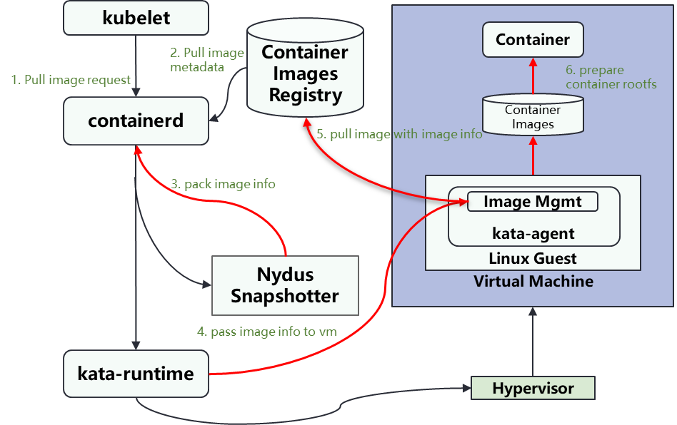
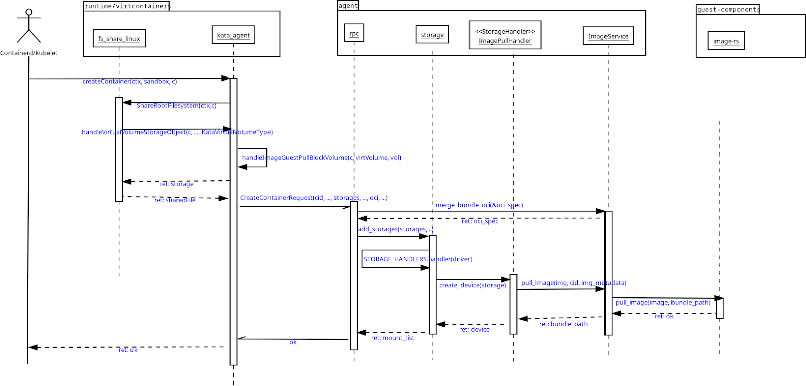

# Kata Containers Guest Image Management Design

To safeguard the integrity of container images and prevent tampering from the host side, we propose guest image management. This method, employed for Confidential Containers, ensures container images remain unaltered and secure.

## Introduction to remote snapshot
Containerd 1.7 introduced `remote snapshotter` feature which is the foundation for pulling images in the guest for Confidential Containers.

While it's beyond the scope of this document to fully explain how the container rootfs is created to the point it can be executed,  a fundamental grasp of the snapshot concept is essential. Putting it in a simple way, containerd fetches the image layers from an OCI registry into its local content storage. However, they cannot be mounted as is (e.g. the layer can be tar+gzip compressed) as well as they should be immutable so the content can be shared among containers. Thus containerd leverages snapshots of those layers to build the container's rootfs. 

The role of `remote snapshotter` is to reuse snapshots that are stored in a remotely shared place, thus enabling containerd to prepare the container’s rootfs in a manner similar to that of a local `snapshotter`. The key behavior that makes this the building block of Kata's guest image management for Confidential Containers is that containerd will not pull the image layers from registry, instead it assumes that `remote snapshotter` and/or an external entity will perform that operation on his behalf.

Maybe the simplest example of `remote snapshotter` in Confidential Containers is the pulling of images in the guest VM. Once ensuring the VM is part of a Trusted Computing Base (TCB) and  throughout a chain of delegations involving containerd, `remote snapshotter` and kata-runtime, it is possible for the kata-agent to pull the image directly.
## `Remote snapshotter` implementations
`Remote snapshotter` is containerd plug-ins that should implement the [Snapshot Interface](https://pkg.go.dev/github.com/containerd/containerd/v2/snapshots?utm_source=godoc#Snapshotter).

The following `remote snapshotter` is leveraged by Kata Containers:
- `nydus snapshotter`
### `Nydus snapshotter`
This `snapshotter` is implemented as an external containerd proxy plug-in for [`Nydus`](https://nydus.dev/).

Currently it supports a couple of runtime backend, notably, `FUSE`, `virtiofs`, and `EROFS`, being the former leveraged on the tested Kata Containers CI.

## `Nydus snapshotter` and containerd-shim-v2 integration

```go
// KataVirtualVolume encapsulates information for extra mount options and direct volumes.
type KataVirtualVolume struct {
   VolumeType   string                `json:"volume_type"`
   Source       string                `json:"source,omitempty"`
   FSType       string                `json:"fs_type,omitempty"`
   Options      []string              `json:"options,omitempty"`
   DirectVolume *DirectAssignedVolume `json:"direct_volume,omitempty"`
   ImagePull    *ImagePullVolume      `json:"image_pull,omitempty"`   //<-Used for pulling images in the guest
   NydusImage   *NydusImageVolume     `json:"nydus_image,omitempty"`
   DmVerity     *DmVerityInfo         `json:"dm_verity,omitempty"`
}
```

## Guest image management implementations
### Guest pull with `nydus snapshotter`
Pull the container image directly from the guest VM using `nydus snapshotter` backend.
#### General Characteristics
- Container image pulled in the guest
- Pause image should be built in the guest's rootfs
- Confidentiality for image manifest and config: No
- Confidentiality for blob data: Yes
- Use `nydus snapshotter` as `remote snapshotter` configured with the FUSE runtime backend

#### Architecture

The following diagram provides an overview of the architecture for pulling image in the guest with key components. 


#### Sequence diagrams

The following sequence diagram depicted below offers a detailed overview of the messages/calls exchanged to pull an unencrypted unsigned image from an unauthenticated container registry. This involves the kata-runtime, kata-agent, and the guest-components’ image-rs to use the guest pull mechanism.



First and foremost, the guest pull code path is only activated when `nydus snapshotter` requires the handling of a volume which type is `image_guest_pull`, as can be seen on the message below:
```json
{
  {
  "volume_type": "image_guest_pull",
  "source":"quay.io/kata-containers/confidential-containers:unsigned",
  "fs_type":"overlayfs"
  "options": [
    "containerd.io/snapshot/cri.layer-digest=sha256:24fb2886d6f6c5d16481dd7608b47e78a8e92a13d6e64d87d57cb16d5f766d63",
    "containerd.io/snapshot/nydus-proxy-mode=true"
  ],
  "image_pull": {
    "metadata": {
      "containerd.io/snapshot/cri.layer-digest": "sha256:24fb2886d6f6c5d16481dd7608b47e78a8e92a13d6e64d87d57cb16d5f766d63",
      "containerd.io/snapshot/nydus-proxy-mode": "true"
         }
       }
  }
}
```
In other words, `VolumeType` of `KataVirtualVolumeType` is set to `image_guest_pull`.

Next the `handleImageGuestPullBlockVolume()` is called to build the Storage object that will be attached to the message later sent to kata-agent via the `CreateContainerRequest()` RPC. It is in the `handleImageGuestPullBlockVolume()` that it will begin the handling of the pause image if the request is for a sandbox container type (see more about pause image below).

Below is an example of storage information packaged in the message sent to the kata-agent:

```json
"driver": "image_guest_pull", 
    "driver_options": [
        "image_guest_pull"{
            "metadata":{
                "containerd.io/snapshot/cri.layer-digest": "sha256:24fb2886d6f6c5d16481dd7608b47e78a8e92a13d6e64d87d57cb16d5f766d63",
                "containerd.io/snapshot/nydus-proxy-mode": "true",
                "io.katacontainers.pkg.oci.bundle_path": "/run/containerd/io.containerd.runtime.v2.task/k8s.io/cb0b47276ea66ee9f44cc53afa94d7980b57a52c3f306f68cb034e58d9fbd3c6",
                "io.katacontainers.pkg.oci.container_type": "pod_container",
                "io.kubernetes.cri.container-name": "coco-container",
                "io.kubernetes.cri.container-type": "container",
                "io.kubernetes.cri.image-name": "quay.io/kata-containers/confidential-containers:unsigned",
                "io.kubernetes.cri.sandbox-id":"7a0d058477e280604ae02de6a016959e8a05fcd3165c47af41eabcf205b55517",
                "io.kubernetes.cri.sandbox-name": "coco-pod","io.kubernetes.cri.sandbox-namespace": "default",
                "io.kubernetes.cri.sandbox-uid": "de7c6a0c-79c0-44dc-a099-69bb39f180af",
            }
        }
    ], 
    "source": "quay.io/kata-containers/confidential-containers:unsigned", 
    "fstype": "overlay", 
    "options": [], 
    "mount_point": "/run/kata-containers/cb0b47276ea66ee9f44cc53afa94d7980b57a52c3f306f68cb034e58d9fbd3c6/rootfs",
```
Next, the kata-agent's RPC module will handle the create container request which, among other things, involves adding storages to the sandbox. The storage module contains implementations of `StorageHandler` interface for various storage types, being the `ImagePullHandler` in charge of handling the storage object for the container image (the storage manager instantiates the handler based on the value of the "driver").

`ImagePullHandler` delegates the image pulling operation to the `ImageService.pull_image()` that is going to create the image's bundle directory on the guest filesystem and, in turn, class the image-rs to in fact fetch and uncompress the image's bundle. 

> **Notes:**
> In this flow, `ImageService.pull_image()` parses the image metadata, looking for either the `io.kubernetes.cri.container-type: sandbox` or `io.kubernetes.cri-o.ContainerType: sandbox` (CRI-IO case) annotation, then it never calls the `image-rs.pull_image()` because the pause image is expected to already be inside the guest's filesystem, so instead `ImageService.unpack_pause_image()` is called.

## Using guest image pull with `nerdctl`

When running a workload, add the `--label io.kubernetes.cri.image-name=<image>` option e.g.:
```sh
nerdctl run --runtime io.containerd.kata.v2 --snapshotter nydus --label io.kubernetes.cri.image-name=docker.io/library/busybox:latest --rm docker.io/library/busybox:latest uname -r
```

References:
[1] [[RFC] Image management proposal for hosting sharing and peer pods](https://github.com/confidential-containers/confidential-containers/issues/137)
[2] https://github.com/containerd/containerd/blob/main/docs/content-flow.md

