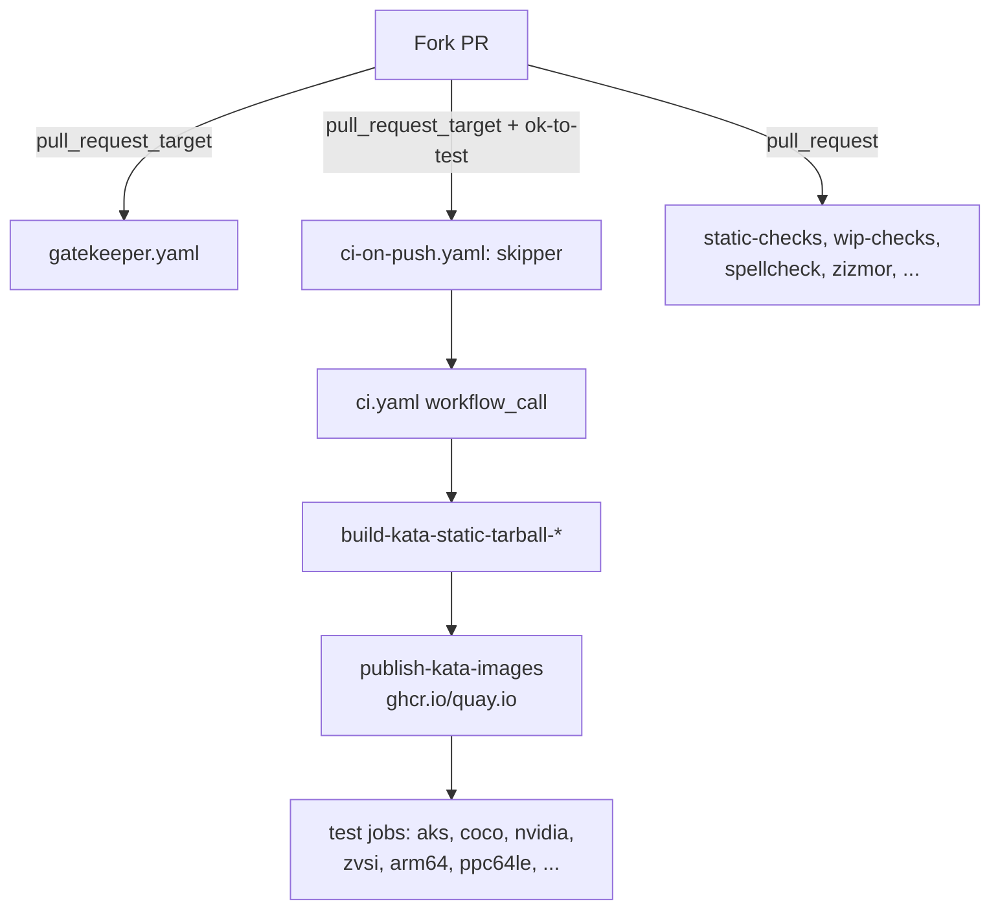
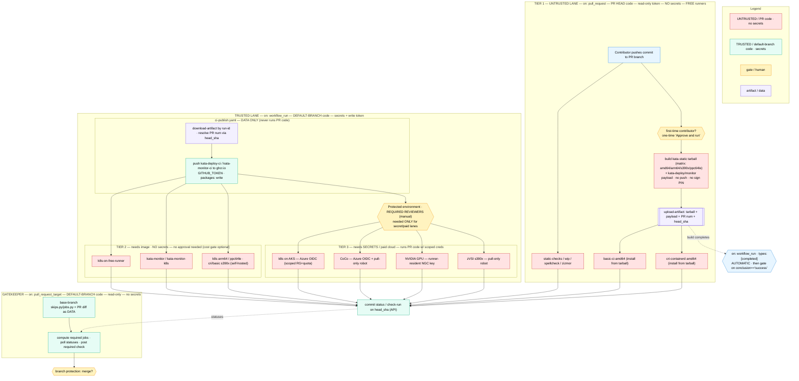

# CI without `pull_request_target`

!!! abstract "Status"
    Proposal. Once accepted and implemented, this document should be moved to
    `docs/design/ci-without-pull-request-target.md`.

## Summary

The Kata Containers CI is triggered from `pull_request_target` in two workflows
(`ci-on-push.yaml` and `gatekeeper.yaml`). This trigger runs in the context of
the **base** repository, so it has access to repository secrets and a
write-scoped `GITHUB_TOKEN`, which is precisely what the build-and-test pipeline
needs. It is also the single most dangerous GitHub Actions trigger: it exposes
those secrets to a workflow that ultimately builds and tests **untrusted code
from a fork's pull request**.

This is no longer only a best-practice concern: as of `actions/checkout` v7
(2026-06-18, backported to supported majors on 2026-07-16) GitHub **refuses by
default** to check out fork pull-request code in `pull_request_target` /
`workflow_run` workflows, so the current pattern will require an explicit
`allow-unsafe-pr-checkout` opt-out to keep working (see Motivation).

This document inventories every reason the CI currently depends on
`pull_request_target`, and for each one proposes concrete alternatives so that
the project can move to a model where untrusted PR code never runs in the same
job that holds privileged credentials.

## Motivation

!!! danger "GitHub now blocks this pattern by default — there is a deadline"
    The primary driver for this work is [Safer `pull_request_target` defaults for
    GitHub Actions checkout](https://github.blog/changelog/2026-06-18-safer-pull_request_target-defaults-for-github-actions-checkout/).
    As of **2026-06-18**, `actions/checkout` **v7** is GA and, by default,
    **refuses to check out fork pull-request code** in `pull_request_target`
    (and `workflow_run`) workflows — precisely the "pwn request" pattern Kata's
    CI relies on today (`ref: ${{ github.event.pull_request.head.sha }}`). On
    **2026-07-16** GitHub backports the enforcement to *all* supported major
    versions, so any workflow pinned to a floating tag (e.g.
    `actions/checkout@v6`) picks it up automatically.

    Kata currently pins `checkout` to a specific SHA (`v6.0.2`), so it is **not
    auto-broken** by the backport — but that is a reprieve, not a fix. The moment
    `checkout` is bumped (Dependabot, a routine upgrade, or a move to v7) the CI
    breaks unless we either:

    - add the deliberately-conspicuous **`allow-unsafe-pr-checkout`** input to
      every offending `checkout` step — an explicit, auditable acceptance of the
      pwn-request risk; or
    - **stop running fork code in privileged workflows** — which is what this
      proposal does.

    The target architecture below checks out *base* code in every privileged
    job and treats PR-derived inputs as data, so it is inherently compatible
    with the new `checkout` defaults and needs **no** `allow-unsafe-pr-checkout`
    opt-out.

`pull_request_target` is flagged as a `dangerous-trigger` by `zizmor` and both
call sites carry an explicit `# zizmor: ignore[dangerous-triggers] See #11332`
suppression. The concern is real:

- The trigger runs with the base repo's secrets in scope.
- The CI checks out the PR head SHA and builds/runs it.
- Any step that runs attacker-controlled code (build scripts, `Makefile`
  targets, test harnesses, or even a compromised third-party action) can, in
  principle, read those secrets or use the write-scoped token.

Today the only thing standing between a fork PR and the secrets is a human
gate: a maintainer must add the `ok-to-test` label before the privileged CI
runs. That is a social control, not a technical boundary — once the label is
applied, subsequent pushes to the same PR re-run the privileged pipeline
against whatever code the fork now contains.

The goal of this proposal is to make the secret-holding parts of the CI
**structurally** unable to run untrusted code, rather than relying on a label.

## Background: how the CI is wired today

Only `ci-on-push.yaml` and `gatekeeper.yaml` use `pull_request_target`.
Everything that runs on plain `pull_request` (`static-checks.yaml`,
`PR-wip-checks.yaml`, `zizmor.yaml`, `commit-message-check.yaml`,
`spellcheck.yaml`, `darwin-tests.yaml`, `editorconfig-checker.yaml`,
`cargo-deny.yaml`, `shellcheck_required.yaml`, `actionlint.yaml`,
`osv-scanner-pr.yaml`, `static-checks-self-hosted.yaml`) needs neither
repository secrets nor a write token, and is out of scope here.

The dependency therefore reduces to two categories: an **elevated
`GITHUB_TOKEN`** and a set of **named secrets**.

## Inventory of what forces `pull_request_target`

### Elevated `GITHUB_TOKEN` permissions

`ci-on-push.yaml` grants, and `ci.yaml` consumes:

| Permission | What it is used for | Where | On the fork-PR path? |
| --- | --- | --- | --- |
| `packages: write` | Push `kata-deploy-ci` / `kata-monitor-ci` payloads (and the `test-images` unencrypted CoCo image) to `ghcr.io`, which the test jobs then pull | `publish-kata-images.yaml` (`push` defaults to `true`), `build-and-publish-tee-confidential-unencrypted-image` | **Yes** — required for kata-deploy testing |
| `id-token: write` | (a) OIDC federation to Azure; (b) SLSA build provenance attestation | (a) `run-k8s-tests-on-aks.yaml`, `run-kata-coco-tests.yaml`; (b) `build-kata-static-tarball-*` | (a) **Yes**; (b) no — release/nightly only |
| `attestations: write` | `actions/attest-build-provenance` on the pushed OCI artifacts | `build-kata-static-tarball-*` | **No** — release/nightly only |
| `contents: read` | Checkout | all | Yes |

`gatekeeper.yaml` additionally consumes `secrets.GITHUB_TOKEN` with
`actions: read`, `issues: read`, `pull-requests: read` to query workflow-run
status and PR/issue labels.

!!! note
    On a `pull_request` event coming from a fork, `GITHUB_TOKEN` is
    **read-only** and repository secrets are **not** injected. That is the
    core reason `pull_request_target` is used: it is the only PR-driven trigger
    that yields a write-scoped token and secret access.

!!! info "Attestation is post-merge, so it is not a fork-PR concern"
    The build jobs gate attestation on `PERFORM_ATTESTATION`, which is
    `${{ inputs.push-to-registry == 'yes' }}`. `push-to-registry` defaults to
    `no` and `ci.yaml` does not set it on the PR path, so on a fork PR the
    attestation steps (and their `attestations: write` + the attestation use of
    `id-token: write`, plus the quay.io login) are **skipped entirely**. They
    only run for `stage: release` builds (release/nightly), which are not
    fork-triggered. Consequently `attestations: write` can be dropped from the
    fork-PR permission set, and the only `id-token: write` consumer left on the
    PR path is Azure OIDC (usage 4). The registry **push** for kata-deploy
    images, however, is genuinely needed on the PR path — see usage 1.

### Named secrets

Declared as required in `ci.yaml` and forwarded from `ci-on-push.yaml`:

| Secret | Purpose | Consuming workflow(s) | PR-path or release/nightly only? |
| --- | --- | --- | --- |
| `GITHUB_TOKEN` (implicit) | `ghcr.io` login/push, ORAS build cache (`ARTEFACT_REGISTRY_PASSWORD`), attestations, gatekeeper API reads | `build-kata-static-tarball-*`, `publish-kata-images.yaml`, `static-checks.yaml`, `gatekeeper.yaml` | PR path |
| `QUAY_DEPLOYER_PASSWORD` | Login/push to `quay.io` | `build-kata-static-tarball-*` (`push-to-registry==yes`), `publish-kata-images.yaml` (`registry==quay.io && push==true`) | Mostly release/nightly |
| `KBUILD_SIGN_PIN` | Sign NVIDIA GPU driver kernel modules | `build-kata-static-tarball-{amd64,arm64}`, only when `contains(matrix.asset, 'nvidia')` | PR path (nvidia assets) |
| `AZ_APPID` | Azure OIDC client id — create/tear down AKS clusters | `run-k8s-tests-on-aks.yaml`, `run-kata-coco-tests.yaml`, `cleanup-resources.yaml` | PR path |
| `AZ_TENANT_ID` | Azure OIDC tenant id | same as above | PR path |
| `AZ_SUBSCRIPTION_ID` | Azure subscription id | same as above | PR path |
| `NGC_API_KEY` | NVIDIA GPU Cloud API key for GPU tests | `run-k8s-tests-on-nvidia-gpu.yaml` | PR path |
| `AUTHENTICATED_IMAGE_PASSWORD` | `quay.io` creds for the "pull from an authenticated registry" CoCo test | `run-kata-coco-tests.yaml`, `run-kata-coco-tests-arm64-k8s.yaml`, `run-k8s-tests-on-zvsi.yaml` | PR path |

!!! info
    The three `AZ_*` values are identifiers used with OIDC federated
    credentials rather than long-lived passwords, but they are stored as
    secrets and therefore carry the same fork-visibility restriction.

## Threat model and design constraints

What we are protecting against, in rough priority order:

1. **Secret exfiltration** — a fork PR reads `QUAY_DEPLOYER_PASSWORD`,
   `NGC_API_KEY`, `AUTHENTICATED_IMAGE_PASSWORD`, `KBUILD_SIGN_PIN`, or mints an
   Azure OIDC token, and leaks it.
2. **Registry poisoning** — a fork PR uses the write-scoped token to push a
   malicious image to `ghcr.io/kata-containers/*` that later runs on trusted
   infrastructure or is consumed by users.
3. **Infrastructure abuse** — a fork PR uses Azure credentials to spin up
   arbitrary resources (crypto-mining, lateral movement).

Design constraints that any alternative must respect:

- **Fork contributors must still get meaningful CI.** The build and the bulk of
  the tests should run for external PRs, ideally without a maintainer babysitting
  every push.
- **Multi-arch reality.** Builds and tests span `amd64`, `arm64`, `s390x`,
  `ppc64le`, plus bare-metal self-hosted runners (NVIDIA GPU, zVSI). Not every
  alternative is available on every runner class.
- **Don't regress the release path.** SLSA provenance attestation runs only for
  `stage: release` (post-merge), not on fork PRs, so it is unaffected by this
  work — but changes to the shared build workflows must not break it.

## General strategies

The alternatives below draw from a small set of building blocks. Most per-usage
recommendations are combinations of these.

!!! note "These compose; C is never standalone"
    Strategies A (`workflow_run` split) and B (protected environments) are the
    two ways to obtain a **trusted execution context**. Strategies C (OIDC), D
    (runner-resident credentials), and E (ephemeral credentials) only change
    **what kind of credential** that trusted context wields — they reduce blast
    radius but do not, by themselves, create the trusted context. In particular
    C requires `id-token: write`, which a fork `pull_request` cannot hold (see
    below), so it must always be paired with A or B.

### A. The `workflow_run` split (build untrusted, publish/test trusted)

Split each privileged operation into two workflows:

1. A `pull_request` workflow (no secrets, read-only token) that builds artifacts
   from the fork code and uploads them with `actions/upload-artifact`.
2. A `workflow_run` workflow (triggered `on: workflow_run: completed`) that runs
   from the **base** repo's default branch, holds the secrets, downloads the
   artifacts, and does the privileged step (push to registry, run paid tests).

The trusted workflow never executes fork code — it only moves bytes the
untrusted workflow produced. This is GitHub's recommended replacement for
`pull_request_target` when secrets are needed.

!!! warning
    The trusted `workflow_run` half must treat downloaded artifacts as
    untrusted **data**, never as code to execute. It also must resolve and pin
    the PR head SHA itself (from the triggering run's metadata) rather than
    trusting attacker-supplied inputs.

### B. GitHub Environments with required reviewers

Attach secrets to a protected `environment:` that requires manual approval for
runs from forks. This keeps the current "maintainer green-lights it" model but
makes it a **technical** gate enforced by GitHub, with per-secret scoping and an
audit trail, instead of a label that anyone with triage rights can add.

### C. OIDC federation instead of static secrets

Replace long-lived registry/cloud passwords with short-lived OIDC tokens
scoped by claims (repo, ref, environment). Azure already uses this
(`azure/login` with `id-token: write`). The same pattern can replace
`QUAY_DEPLOYER_PASSWORD` (Quay supports robot accounts + OIDC via an identity
broker) and `ghcr.io` (native `GITHUB_TOKEN` OIDC).

!!! warning "OIDC needs `id-token: write`, which forks don't get"
    Minting a GitHub OIDC token requires the job to hold `id-token: write`.
    That permission is one of the elevated scopes GitHub **refuses to grant to
    a fork-originated `pull_request` run** — the `GITHUB_TOKEN` is forced
    read-only for forks. So OIDC is **not** a standalone replacement for
    `pull_request_target`: the token still has to be minted from a trusted
    context (strategy A's `workflow_run` half, or a protected environment from
    strategy B). What OIDC buys us is **blast-radius reduction** — the minted
    credential is short-lived and claim-scoped (repo/ref/environment), so even
    an approved run cannot mint something reusable elsewhere — not an escape
    from needing a trusted trigger in the first place.

### D. Trusted self-hosted runners with pre-provisioned credentials

For bare-metal test classes (NVIDIA GPU, s390x zVSI, ppc64le), the credentials
(`NGC_API_KEY`, registry pull secrets) can live on the runner/host or in a
runner-scoped secret store, so they never transit a `pull_request_target`
workflow at all. Combine with runner labels + `if:` guards so fork PRs can only
land on these runners after approval.

### E. Ephemeral / disposable credentials

For anything that must remain a static secret, prefer credentials that are
cheap to rotate and tightly scoped (push-only to a single CI namespace,
pull-only robot accounts, subscription-scoped Azure roles with hard quotas), so
that a leak is contained and recoverable.

## Per-usage design

### 1. `ghcr.io` writes (`packages: write` + `GITHUB_TOKEN`)

**Today.** `publish-kata-images.yaml` pushes the `kata-deploy-ci` /
`kata-monitor-ci` payloads (`push` defaults to `true`), and
`build-and-publish-tee-confidential-unencrypted-image` pushes
`ghcr.io/kata-containers/test-images`. All downstream test jobs *pull* these
from the registry.

!!! note "The registry push is a hard requirement — not something to skip"
    kata-deploy testing works by deploying the `kata-deploy-ci` image into the
    test cluster, so the image **must** live in a registry the cluster can pull
    from. This is true on the fork-PR path, so removing the push (e.g. handing
    images around purely as workflow artifacts) is **not** an acceptable option;
    the goal is to move the push into a **trusted context**, not to eliminate
    it.

!!! info "Build-artifact attestation is out of scope here"
    The SLSA provenance attestation produced by `build-kata-static-tarball-*`
    only runs for `stage: release` (`push-to-registry == yes`), i.e.
    post-merge. It does not run on the fork-PR path, so it imposes no
    `attestations: write` / `id-token: write` requirement on the code we are
    trying to de-privilege here. See the inventory note above.

**Why it needs `pull_request_target`.** A fork `pull_request` gets a read-only
token and cannot push to `ghcr.io`.

**Alternatives.**

- **Preferred: strategy A (`workflow_run` split).** Build the kata-deploy /
  kata-monitor payloads on `pull_request` with no token and upload them as
  workflow artifacts. A trusted `workflow_run` job (default branch, base-repo
  context) downloads those artifacts and performs the `ghcr.io` **push**. The
  registry is still populated exactly as today — the difference is that the push
  (and the `packages: write` token) lives in a job that never executes fork
  code. Downstream test jobs continue to pull `kata-deploy-ci` from `ghcr.io`
  unchanged.
- **Alternative: environment-gated push (strategy B).** Keep the current flow but
  move `packages: write` behind a protected environment requiring approval.
  Smaller change, weaker guarantee (still runs fork code with the token once
  approved).

**Recommendation.** Keep pushing `kata-deploy-ci` to `ghcr.io`, but do the push
from a trusted `workflow_run` job (strategy A) so the write token is never
exposed to fork code. The image tag scheme (`<pr>-<sha>-<arch>`) is unchanged,
so the test jobs need no change.

### 2. `quay.io` push (`QUAY_DEPLOYER_PASSWORD`)

**Today.** Login to `quay.io` in `build-kata-static-tarball-*` (only when
`push-to-registry==yes`) and `publish-kata-images.yaml` (only when
`registry==quay.io && push==true`).

**Why it needs `pull_request_target`.** Static secret not available to fork PRs.

**Alternatives.**

- **Confirm it is release/nightly only.** The PR CI path does not appear to set
  `push-to-registry==yes` / `registry==quay.io`; if verified, `quay.io` pushes
  never happen on the PR path and this secret can simply be **dropped from
  `ci.yaml`/`ci-on-push.yaml`** and kept only in the release/nightly workflows
  (which are not fork-triggered). This is the cleanest fix and likely applies.
- If any PR-path `quay.io` push is required, route it through a trusted
  `workflow_run` job (strategy A) or replace the password with a Quay robot
  account brokered via OIDC (strategy C).

**Recommendation.** Verify and remove from the PR path. Treat as release-only.

### 3. NVIDIA kernel-module signing (`KBUILD_SIGN_PIN`)

**Today.** Passed to `build-kata-static-tarball-{amd64,arm64}` only for
`nvidia` assets, to sign out-of-tree GPU driver kernel modules.

**Why it needs `pull_request_target`.** Static secret; the signing happens
inside the (untrusted) build.

**Alternatives.**

- **Preferred: don't sign on the PR path.** Use an ephemeral, throwaway signing
  key generated in-job for PR builds (modules load on the CI test kernel because
  the CI guest kernel trusts the ephemeral key, or Secure Boot enforcement is off
  for the test guest). The real `KBUILD_SIGN_PIN` is used only for
  release/nightly builds that run outside fork context. This removes the secret
  from fork-triggered runs entirely.
- **Alternative: strategy A** — build unsigned modules on the PR path, sign in a
  trusted `workflow_run` job. More complex; only worth it if PR tests genuinely
  require production-signed modules.

**Recommendation.** Ephemeral per-build signing key on the PR path; keep the
production PIN in release/nightly only.

### 4. Azure AKS provisioning (`AZ_APPID` / `AZ_TENANT_ID` / `AZ_SUBSCRIPTION_ID`)

**Today.** `azure/login` (OIDC, `id-token: write`) creates and tears down AKS
clusters for `run-k8s-tests-on-aks.yaml` and `run-kata-coco-tests.yaml`.

**Why it needs `pull_request_target`.** The identifiers live in secrets, and the
OIDC token is minted inside a workflow that also runs fork code.

**Alternatives.**

- **Preferred: environment-scoped OIDC (strategy B + C).** These are already
  OIDC, not passwords — the leverage is in **constraining the federated
  credential**. Bind the Azure federated credential to a protected `environment`
  (e.g. `aks-ci`) whose subject claim only matches runs approved to use it, and
  scope the Azure role to a dedicated, quota-limited resource group. A fork PR
  then cannot mint a usable token without approval, and even an approved token
  can only touch the CI resource group.
- **Alternative: strategy A** — provision/own the cluster from a trusted job and
  hand only a kubeconfig (or run tests against a long-lived, isolated CI cluster)
  to the untrusted job. The untrusted job never holds Azure credentials, only
  Kubernetes access to a sandboxed namespace/cluster.
- **Alternative: move AKS tests off the fork-PR path** and run them
  post-merge/nightly, keeping only free-runner k8s tests on PRs.

**Recommendation.** Keep OIDC, but gate it behind a protected environment and a
tightly-scoped, quota-capped Azure role; longer term, hand tests a scoped
kubeconfig from a trusted provisioning job.

### 5. NVIDIA GPU tests (`NGC_API_KEY`)

**Today.** `run-k8s-tests-on-nvidia-gpu.yaml` exports `NGC_API_KEY` to
`gha-run.sh run-nv-tests` on self-hosted `amd64-nvidia-a100` runners.

**Why it needs `pull_request_target`.** Static secret used inside the test job.

**Alternatives.**

- **Preferred: strategy D (runner-resident credential).** Because these run on
  trusted bare-metal self-hosted runners, provision `NGC_API_KEY` on the
  runner/host (env file, or a runner-scoped secret) so it never flows through a
  fork-triggered workflow. Gate fork PRs onto these runners behind approval.
- **Alternative: OIDC/short-lived NGC token** if NGC supports federation, minted
  per approved run.

**Recommendation.** Store on the trusted GPU runner; drop `NGC_API_KEY` from the
workflow secret set.

### 6. Authenticated-registry CoCo test (`AUTHENTICATED_IMAGE_PASSWORD`)

**Today.** `quay.io` credentials so CoCo tests can exercise pulling from an
authenticated registry (`run-kata-coco-tests*.yaml`,
`run-k8s-tests-on-zvsi.yaml`).

**Why it needs `pull_request_target`.** Static secret consumed by the test.

**Alternatives.**

- **Preferred: pull-only, low-value robot account.** This secret only needs to
  **pull** a fixed busybox-based test image. Replace it with a dedicated
  pull-only robot account whose scope is a single throwaway repo. A leak of a
  pull-only credential to a public test image is low impact, which makes it
  acceptable to expose even under the current model — or to inject via a
  protected environment (strategy B).
- **Alternative: host a local registry in-cluster** seeded during the trusted
  setup phase, so the test authenticates against an ephemeral registry with
  in-job-generated credentials and no shared secret at all.

**Recommendation.** Downgrade to a pull-only robot account (contain the blast
radius), or serve the image from an ephemeral in-cluster registry.

### 7. Gatekeeper status reporting (`GITHUB_TOKEN` + read scopes)

**Today.** `gatekeeper.yaml` runs on `pull_request_target` (types `opened`,
`synchronize`, `reopened`, `edited`, `labeled`, `unlabeled`), checks out the
**PR head SHA**, and runs `tools/testing/gatekeeper/skips.py` / `jobs.py` with a
read-scoped `GITHUB_TOKEN` (`actions`, `issues`, `pull-requests`) to compute the
set of required jobs and report a single aggregated required-check status.

**Why it needs a trusted trigger — and why it is *not* like the others.** The
gatekeeper is a **merge gate**, not a secret consumer. Its concern is
**integrity**, not confidentiality:

- It holds **no repository secrets** and only ever needs **read** API scopes.
  Those read scopes are available on a plain fork `pull_request` too, so — unlike
  the CI — the gatekeeper does not need `pull_request_target` to *get a token*.
- What `pull_request_target` (and `workflow_run`, and `push`/`schedule`) give it
  that plain `pull_request` does **not** is a **trusted workflow definition**:
  the workflow file is taken from the base branch, so a PR author cannot edit
  `gatekeeper.yaml` to make their own gate pass. On `pull_request`, the workflow
  file comes from the PR head — a malicious PR could rewrite the gate to always
  succeed. This is the real reason a merge gate must run in a base-repo context.

!!! bug "The current gap: trusted workflow, untrusted logic"
    Although the *workflow file* is trusted (base branch), gatekeeper then
    checks out the **PR head** and executes the PR's copy of `skips.py` /
    `jobs.py`. Those scripts decide which jobs are required and whether the gate
    passes. A malicious PR can therefore edit `skips.py`/`jobs.py` (or
    `required-tests.yaml`) to declare *nothing* required and rig its own gate to
    green — the `pull_request_target` trigger's integrity guarantee is undone by
    running head-authored code. The read-only token limits data exposure, but
    the **gate-bypass** risk is the more serious issue.

**What the scripts actually consume.** `skips.py` reads the in-repo
`required-tests.yaml` and computes enabled features from the **diff of changed
paths** against the target branch; `jobs.py` polls workflow-run status via the
API. The only genuinely PR-derived input is the **list of changed files** — pure
data that `git diff` can produce from a fetched commit range without executing
any fork code.

**What we do with the gatekeeper.**

- **Keep it in a trusted, base-repo context, but stop running PR-authored
  code.** Check out the **base branch** (`github.event.pull_request.base.sha` /
  the default branch) for the scripts *and* `required-tests.yaml`, then obtain
  the PR's changed-file list as **data** — either via `git fetch` of the head
  SHA followed by a `git diff base...head` (fetch without checkout/execute), or
  via the compare/files REST API. Run the base-branch `skips.py`/`jobs.py`
  against that diff. This closes the gate-bypass gap while preserving today's
  behavior.
- **Trigger choice — two acceptable options:**
    - **Stay on `pull_request_target`.** Once it executes only base-branch code,
      holds no secrets, and keeps a read-only token, this is the *canonical,
      sanctioned* use of `pull_request_target` (trusted base-repo code that needs
      read-level API access) — `zizmor` flags the trigger, but this pattern is
      exactly the safe one. It also naturally keeps the `labeled` / `unlabeled` /
      `edited` re-evaluation the gate relies on.
    - **Move to `workflow_run`.** React to the CI workflow's `completed` event
      from the default branch (always trusted) and post the check result. Cleaner
      isolation, but `workflow_run` does not fire on label changes, so
      label-driven re-evaluation (`ok-to-test` and any `required-labels`) would
      need a small companion `pull_request` (or `pull_request_target`) job — so
      this doesn't fully eliminate the trigger anyway.

**Recommendation.** Treat the gatekeeper separately from the secret-bearing CI.
Its fix is an **integrity** fix, not a secret-removal fix: run **only
base-branch code**, feed it the PR diff as data, and keep the read-only token.
Given that, **keeping the gatekeeper on `pull_request_target` is acceptable** —
it is the textbook-safe use of the trigger — and the effort is better spent
removing `pull_request_target` from the CI path (usages 1–6). If the project
prefers zero `pull_request_target` occurrences for policy/lint cleanliness, move
the aggregation to `workflow_run` and keep a minimal label-events shim.

## Proposed target architecture

The right way to partition the pipeline is **not** "build vs. test". It is a
2×2 on two questions: *does the job need the registry image?* and *does it need
secrets / paid infrastructure?* That yields three tiers:

| Tier | Needs registry image? | Needs secrets / paid infra? | Runs in | Example jobs | Gate |
| --- | --- | --- | --- | --- | --- |
| **1** | No | No | Untrusted `pull_request`, free runners | build + payload, static-checks/wip/spellcheck, `basic-ci-amd64`, `cri-containerd` amd64 | none — automatic for forks |
| **2** | Yes | No | After the trusted publish (or via image-from-artifact, in Tier 1) | `k8s-on-free-runner`, `kata-monitor(-k8s)`, k8s `arm64`/`ppc64le`, `basic`/`cri` `s390x` | none for *security*; optional *cost* gate |
| **3** | Yes | Yes | Trusted lane, behind approval | `run-k8s-tests-on-aks`, `run-kata-coco-tests`, `run-k8s-tests-on-nvidia-gpu`, `run-k8s-tests-on-zvsi` | protected environment + scoped creds |

The consequence: the manual approval gate is strictly required **only for
Tier 3**. Tier 1 runs free and automatically (real coverage for forks with no
secrets); Tier 2 is a capacity/cost decision, not a security one. Tier-1
membership can be *grown*: if the kata-deploy image is loaded into the test
cluster from the build **artifact** (containerd/kind import) instead of pulled
from a registry, the Tier-2 free-runner lanes collapse into Tier 1 and the
trusted publish is needed only to feed self-hosted-arch and Tier-3 lanes.

!!! info "What is automatic vs. what needs a human"
    The `workflow_run` trigger is **fully automatic**: the Trusted lane starts on
    its own the instant the Untrusted build workflow completes — there is no
    manual dispatch, and it runs from the default branch with secrets + a write
    token regardless of the fork origin. It fires on **any** conclusion, so
    "did the build succeed" is a `workflow_run.conclusion == 'success'` check,
    not the trigger itself. The **only** manual step is optional and deliberate:
    any job attached to a protected **environment** with *required reviewers*
    pauses until a maintainer approves it. That is where today's `ok-to-test`
    gate would move to. Two notes: (1) the build+push lane is safe to run
    automatically because it never executes fork code; the approval gate exists
    to avoid spending **paid test infrastructure** on every fork push, not to
    protect secrets. (2) GitHub still shows a one-time "Approve and run" button
    on the Untrusted `pull_request` side for *first-time contributors* — a
    platform default, unrelated to this design.

### Trust boundary: publish is data-only, test lanes are not

!!! danger "The test lanes still run PR code — the trigger alone does not fix that"
    It is tempting to say "the trusted lane never runs fork code", but that is
    only true of the **publish** step and the **gatekeeper**, which run
    default-branch code and treat every PR-derived input (`head_sha`, the diff,
    the downloaded artifact) as inert **data**. The **test lanes are
    different**: to test a PR they must deploy the PR-built image *and* run the
    PR's test harness (`tests/…/gha-run.sh`, bats, genpolicy testdata) on
    runners that hold credentials. That is unavoidable — testing untrusted code
    means running untrusted code near secrets. `workflow_run` does **not** make
    that safe; the guardrails for the test lanes are the **approval gate**
    (a human reviews the PR, including its test/workflow diff) plus
    **minimized, scoped, ephemeral credentials** (short-lived OIDC scoped to a
    quota-capped resource group, pull-only robot accounts, runner-resident keys,
    disposable clusters/namespaces).

Key properties:

- Fork code runs in the **Untrusted** lane (no secrets, read-only token) **and**
  in the Tier-2/Tier-3 **test lanes** (which deploy PR-built product and run the
  PR test harness).
- The **publish** step and the **gatekeeper** run only default-branch code and
  consume PR inputs as data — they never execute fork code.
- A PR **cannot** subvert the trusted lane by editing workflow files: `ci-publish`
  (`workflow_run`) and `gatekeeper` (`pull_request_target`) always run the
  **default-branch** copy; the untrusted build runs the PR's copy but sandboxed.
- The manual approval gate is strictly required **only for Tier 3**.
- Static, high-value secrets are replaced with OIDC / runner-resident /
  pull-only / ephemeral credentials so an approved test-lane run cannot exfiltrate
  anything reusable.
- **Compatible with `actions/checkout` v7 defaults**: every privileged job
  checks out *base* (default-branch) code and never the fork head, so it needs
  no `allow-unsafe-pr-checkout` opt-out. The untrusted build lane checks out the
  PR head as intended for a plain `pull_request`, which is unaffected by the new
  defaults.

## Migration plan

A phased rollout that keeps CI green throughout:

1. **Reduce the secret surface first (low risk, high value).**
   - Confirm and remove `QUAY_DEPLOYER_PASSWORD` from the PR path (usage 2).
   - Switch NVIDIA PR builds to an ephemeral signing key (usage 3).
   - Move `NGC_API_KEY` onto the GPU runner (usage 5).
   - Downgrade `AUTHENTICATED_IMAGE_PASSWORD` to pull-only (usage 6).
2. **Harden gatekeeper** to run only base-branch code fed the PR diff as data
   (usage 7). This is an **integrity** fix (closes the gate-bypass gap), not a
   secret change, and it is independent of the CI work below — it can land
   first. The gatekeeper may **remain on `pull_request_target`** afterwards.
3. **Introduce protected environments** for the remaining privileged operations
   (Azure OIDC, any required registry push), replacing the `ok-to-test` label as
   the technical gate (usages 1, 4).
4. **Split build/publish via `workflow_run`** (usage 1): build the kata-deploy /
   monitor payloads on `pull_request` (no token), then push them to `ghcr.io`
   from a trusted `workflow_run` job. The registry push is retained (kata-deploy
   testing needs it); only `packages: write` moves out of the fork-triggered
   path.
5. **Drop `pull_request_target` from the CI path** (`ci-on-push.yaml`) once every
   secret/token consumer has moved, and remove its `zizmor` suppression. The
   gatekeeper's `pull_request_target` (now safe: base-branch code, no secrets,
   read-only token) can stay; only move it to `workflow_run` + a label shim if a
   zero-`pull_request_target` policy is desired.

## Risks and open questions

- **`workflow_run` ergonomics.** Two-stage pipelines complicate status
  reporting and required-check configuration. If the gatekeeper stays on
  `pull_request_target` (the recommended path) it must still learn to correlate
  the CI's `workflow_run`-based jobs; if it is moved to `workflow_run`, it also
  needs a label-events shim for `ok-to-test` / `required-labels`.
- **`workflow_run` artifact hand-off.** The build (untrusted) and push (trusted)
  halves must agree on artifact names and the image tag scheme, and the trusted
  half must resolve the PR head SHA from the trigger metadata rather than trust
  any attacker-supplied input.
- **Which secrets are truly exercised on the PR path vs only nightly/release?**
  This should be measured (not assumed) before removing any secret from
  `ci.yaml`, to avoid silently disabling coverage.
- **Environment approval fatigue.** Protected environments re-introduce a manual
  step; the project should decide which lanes require approval for forks vs. run
  freely.

## References

- **Primary driver:** [Safer `pull_request_target` defaults for GitHub Actions
  checkout](https://github.blog/changelog/2026-06-18-safer-pull_request_target-defaults-for-github-actions-checkout/)
  — `actions/checkout` v7 refuses fork-PR checkouts under
  `pull_request_target`/`workflow_run` by default (GA 2026-06-18; backport to
  supported majors 2026-07-16); introduces the `allow-unsafe-pr-checkout`
  opt-out.
- Kata CI overview: `ci/README.md`
- Entry workflows: `.github/workflows/ci-on-push.yaml`,
  `.github/workflows/gatekeeper.yaml`, `.github/workflows/ci.yaml`
- GitHub Security Lab, "Keeping your GitHub Actions and workflows secure:
  Preventing pwn requests" — the canonical writeup on `pull_request_target`
  risks and the `workflow_run` mitigation.
