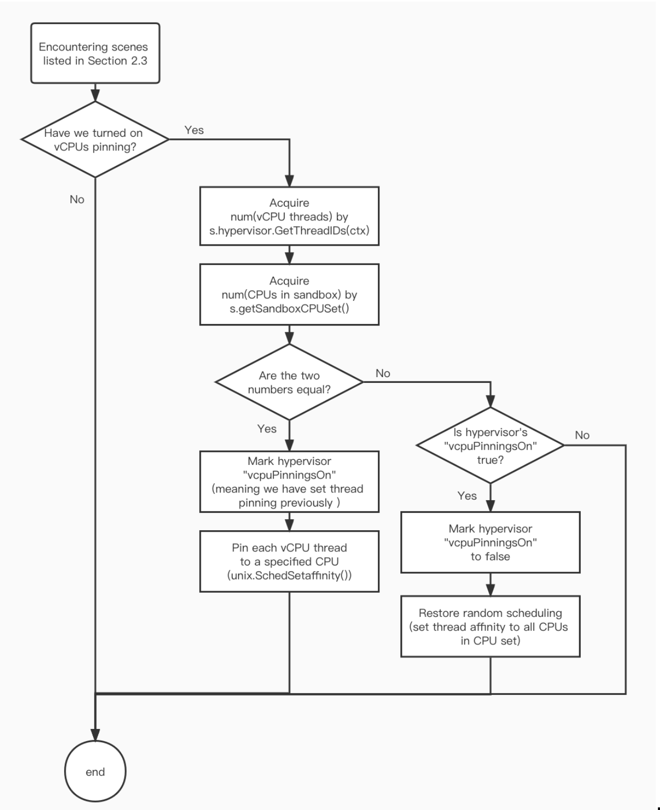

# Design Doc for Kata Containers' VCPUs Pinning Feature

## Background
By now, vCPU threads of Kata Containers are scheduled randomly to CPUs. And each pod would request a specific set of CPUs which we call it CPU set (just the CPU set meaning in Linux cgroups).    

If the number of vCPU threads are equal to that of CPUs claimed in CPU set, we can then pin each vCPU thread to one specified CPU, to reduce the cost of random scheduling. 

## Detailed Design

### Passing Config Parameters
Two ways are provided to use this vCPU thread pinning feature: through `QEMU` configuration file and through annotations. Finally the pinning parameter is passed to `HypervisorConfig`.

### Related Linux Thread Scheduling API

| API Info          | Value                                                     |
|-------------------|-----------------------------------------------------------|
| Package           | `golang.org/x/sys/unix`                                     |
| Method            | `unix.SchedSetaffinity(thread_id, &unixCPUSet)`             |
| Official Doc Page | https://pkg.go.dev/golang.org/x/sys/unix#SchedSetaffinity |

### When is VCPUs Pinning Checked?

As shown in Section 1, when `num(vCPU threads) == num(CPUs in CPU set)`, we shall pin each vCPU thread to a specified CPU. And when this condition is broken, we should restore to the original random scheduling pattern.  
So when may `num(CPUs in CPU set)` change? There are 5 possible scenes:

| Possible scenes                   | Related Code                               |
|-----------------------------------|--------------------------------------------|
| when creating a container         | File Sandbox.go, in method `CreateContainer`  |
| when starting a container         | File Sandbox.go, in method `StartContainer`   |
| when deleting a container         | File Sandbox.go, in method `DeleteContainer`  |
| when updating a container         | File Sandbox.go, in method `UpdateContainer`  |
| when creating multiple containers | File Sandbox.go, in method `createContainers` |

### Core Pinning Logics

We can split the whole process into the following steps. Related methods are `checkVCPUsPinning` and `resetVCPUsPinning`, in file Sandbox.go.
 