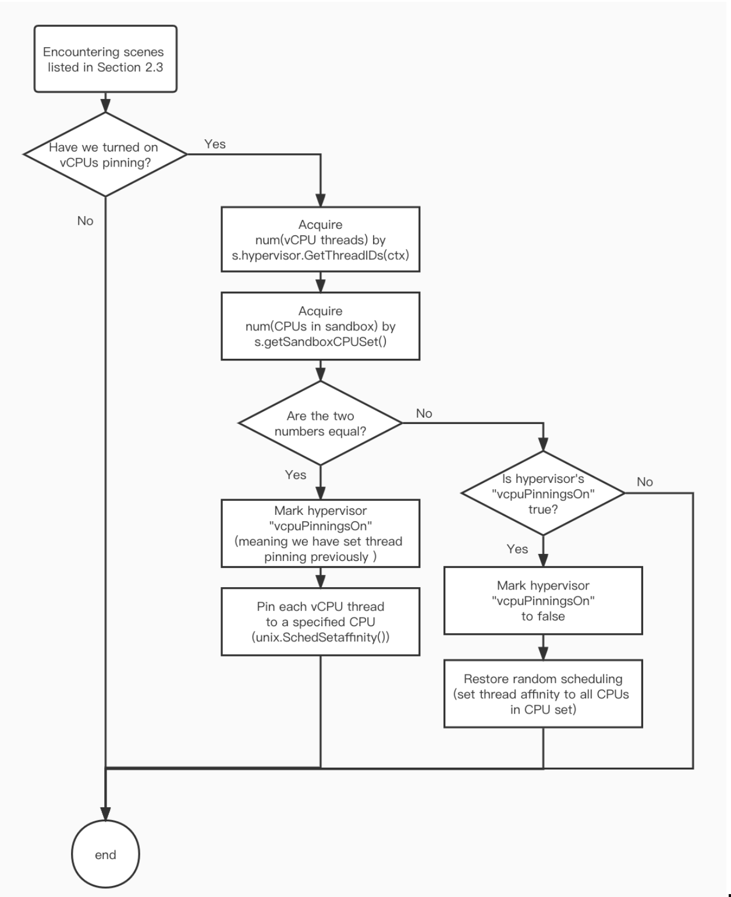

# Design Doc for Kata Containers VCPUs Pinning Feature

## Background
By now, vCPU threads of Kata Containers are scheduled randomly to CPUs. And each pod would request a specific set of CPUs which we call it CPU set (just the CPU set meaning in Linux cgroups).

If the number of vCPU threads are equal to that of CPUs claimed in CPU set, we can then pin each vCPU thread to one specified CPU, to reduce the cost of random scheduling.

## Detailed Design

### Passing Config Parameters
Two ways are provided to use this vCPU thread pinning feature: through `QEMU` configuration file and through annotations. Finally the pinning parameter is passed to `HypervisorConfig`.

### Related Linux Thread Scheduling API

| API Info          | Value                                                     |
|-------------------|-----------------------------------------------------------|
| Package           | `golang.org/x/sys/unix`                                     |
| Method            | `unix.SchedSetaffinity(thread_id, &unixCPUSet)`             |
| Official Doc Page | https://pkg.go.dev/golang.org/x/sys/unix#SchedSetaffinity |

### When is VCPUs Pinning Checked?

As shown in Section 1, when `num(vCPU threads) == num(CPUs in CPU set)`, we shall pin each vCPU thread to a specified CPU. And when this condition is broken, we should restore to the original random scheduling pattern.
So when may `num(CPUs in CPU set)` change? There are 5 possible scenes:

| Possible scenes                   | Related Code                               |
|-----------------------------------|--------------------------------------------|
| when creating a container         | File Sandbox.go, in method `CreateContainer`  |
| when starting a container         | File Sandbox.go, in method `StartContainer`   |
| when deleting a container         | File Sandbox.go, in method `DeleteContainer`  |
| when updating a container         | File Sandbox.go, in method `UpdateContainer`  |
| when creating multiple containers | File Sandbox.go, in method `createContainers` |

### Core Pinning Logics

We can split the whole process into the following steps. Related methods are `checkVCPUsPinning` and `resetVCPUsPinning`, in file Sandbox.go.

### NUMA-Aware Placement

When the sandbox has a guest NUMA topology (`enable_numa`), `checkVCPUsPinning` hands the work to `checkVCPUsPinningNUMA`, which keeps every vCPU thread on the host NUMA node that the vCPU's guest node maps to, so that a vCPU and the memory of its node stay local to each other.

Inside that node, the placement depends on what the sandbox owns:

| Condition | Placement |
|-----------|-----------|
| The sandbox owns its CPU set and a CPU of it is still unclaimed | the vCPU thread is pinned to a host CPU of its own, taken from its node, or borrowed from the CPUs no node claimed once every node has served its own vCPUs |
| Otherwise | the vCPU thread gets the CPUs of its node as an affinity mask |

The two conditions are evaluated per vCPU, so a CPU set that cannot back the whole guest pins the vCPUs it can and leaves the surplus threads to the host scheduler within their node. That is the common case under static sizing, which boots the guest with `default_vcpus` on top of the pod's CPU limit while the kubelet reserves only the limit. Sharing a node beats the alternative of pinning two vCPU threads to one CPU, which would make them time-share it for good; the scheduler can instead move such a thread to whichever CPU of the node has slack.

The mask is also all a sandbox that does not own its CPU set can get — no cpuset was assigned to it, so the CPUs are derived from the NUMA topology and shared with every other sandbox on the host, which gives no basis for claiming individual CPUs: each sandbox would claim the same ones and its vCPU threads would then time-share CPUs with the vCPU threads of the others. The `num(vCPU threads) == num(CPUs in CPU set)` equality of the non-NUMA path does not apply here: a CPU set larger than the vCPU count is fine, the surplus CPUs simply stay unused by this sandbox.

Ownership is read off the sandbox's own cpuset: a sandbox that has one is taken to hold it alone. That is what a cpuset means under Kubernetes, where the kubelet assigns one only to a Guaranteed pod under `cpuManagerPolicy=static` and removes those CPUs from the shared pool; a pod under `cpuManagerPolicy=none` has no cpuset of its own at all. Outside Kubernetes it is the caller's to uphold: a cpuset given on the command line (`--cpuset-cpus`) restricts a container to those CPUs without reserving them, so two sandboxes started that way can pin their vCPU threads onto the same host CPUs. Enable the feature where the CPU sets it places from are exclusive.

See [How to use NUMA with Kata](../how-to/how-to-use-numa-with-kata.md) for the configuration and verification steps.
