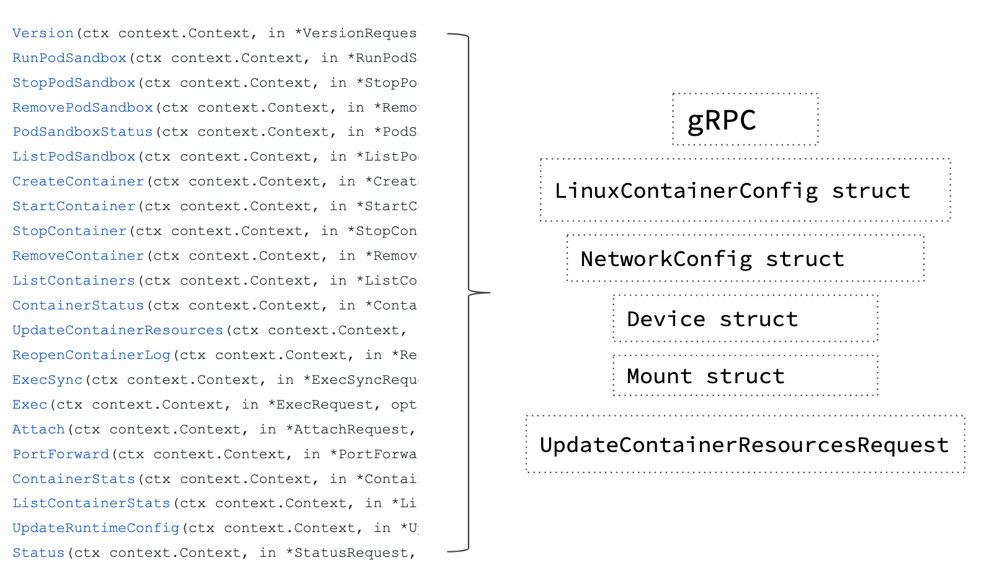
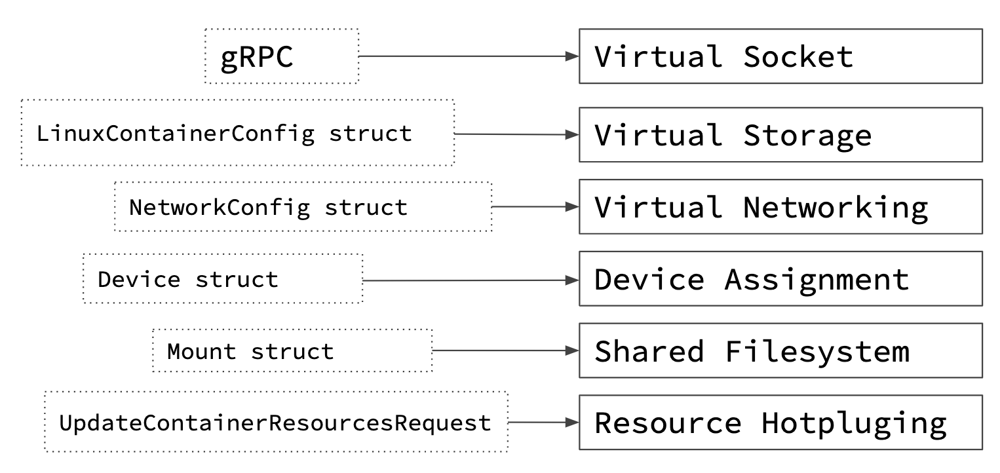
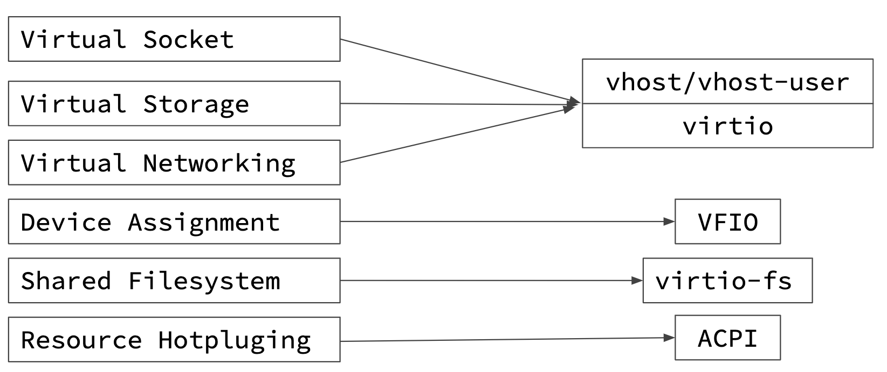

# Virtualization in Kata Containers

## Overview

Kata Containers creates a second layer of isolation on top of traditional namespace-based containers using hardware virtualization. Kata launches a lightweight virtual machine (VM) and uses the guest Linux kernel to create container workloads. In Kubernetes, the sandbox is implemented at the pod level using VMs.

This document describes:

- How Kata Containers maps container technologies to virtualization technologies
- The multiple hypervisors and Virtual Machine Monitors (VMMs) supported by Kata
- Guidance for selecting the appropriate hypervisor for your use case

### Architecture

A typical Kata Containers deployment integrates with Kubernetes through a Container Runtime Interface (CRI) implementation:

```
Kubelet → CRI (containerd/CRI-O) → Kata Containers (OCI runtime) → VM → Containers
```

The CRI API requires Kata to support the following constructs:

| CRI Construct | VM Equivalent | Virtualization Technology |
|---------------|---------------|---------------------------|
| Pod Sandbox | VM | Hypervisor/VMM |
| Container | Process in VM | Namespace/Cgroup in guest |
| Network | Network Interface | virtio-net, vhost-net, physical, etc. |
| Storage | Block/File Device | virtio-block, virtio-scsi, virtio-fs |
| Compute | vCPU/Memory | KVM, ACPI hotplug |

### Mapping Container Concepts to Virtualization Technologies

Kata Containers implements the Kubernetes Container Runtime Interface (CRI) to provide pod and container lifecycle management. The CRI API defines abstractions that Kata must translate into virtualization primitives.

The mapping from CRI constructs to virtualization technologies follows a three-layer model:

```
CRI API Constructs → VM Abstractions → Para-virtualized Devices
```

**Layer 1: CRI API Constructs**

The CRI API ([kubernetes/cri-api](https://github.com/kubernetes/cri-api)) defines the following abstractions that Kata must implement:

| Construct | Description |
|-----------|-------------|
| Pod Sandbox | Isolated execution environment for containers |
| Container | Process workload within a sandbox |
| Network | Pod and container networking interfaces |
| Storage | Volume mounts and image storage |
| RuntimeConfig | Resource constraints (CPU, memory, cgroups) |



**Layer 2: VM Abstractions**

Kata translates CRI constructs into VM-level concepts:

| CRI Construct | VM Equivalent |
|---------------|---------------|
| Pod Sandbox | Virtual Machine |
| Container | Process/namespace in guest OS |
| Network | Virtual NIC (vNIC) |
| Storage | Virtual block device or filesystem |
| RuntimeConfig | VM resources (vCPU, memory) |



**Layer 3: Para-virtualized Devices**

VM abstractions are realized through para-virtualized drivers for optimal performance:

| VM Concept | Device Technology |
|------------|-------------------|
| vNIC | virtio-net, vhost-net, macvtap |
| Block Storage | virtio-block, virtio-scsi |
| Shared Filesystem | virtio-fs |
| Agent Communication | virtio-vsock |
| Device Passthrough | VFIO with IOMMU |



> **Note:** Each hypervisor implements these mappings differently based on its device model and feature set. See the [Hypervisor Details](#hypervisor-details) section for specific implementations.

### Device Mapping

Container constructs map to para-virtualized devices:

| Construct | Device Type | Technology |
|-----------|-------------|------------|
| Network | Network Interface | virtio-net, vhost-net |
| Storage (ephemeral) | Block Device | virtio-block, virtio-scsi |
| Storage (shared) | Filesystem | virtio-fs |
| Communication | Socket | virtio-vsock |
| GPU/Passthrough | PCI Device | VFIO, IOMMU |

## Supported Hypervisors and VMMs

Kata Containers supports multiple hypervisors, each with different characteristics:

| Hypervisor | Language | Architectures | Type |
|------------|----------|---------------|------|
| [QEMU] | C | x86_64, aarch64, ppc64le, s390x, risc-v | Type 2 (KVM) |
| [Cloud Hypervisor] | Rust | x86_64, aarch64 | Type 2 (KVM) |
| [Firecracker] | Rust | x86_64, aarch64 | Type 2 (KVM) |
| `Dragonball` | Rust | x86_64, aarch64 | Type 2 (KVM) Built-in |

> **Note:** All supported hypervisors use KVM (Kernel-based Virtual Machine) as the underlying hardware virtualization interface on Linux.

## Hypervisor Details

### QEMU/KVM

QEMU is the most mature and feature-complete hypervisor option for Kata Containers.

**Machine Types:**

- `q35` (x86_64, default)
- `s390x` (s390x)
- `virt` (aarch64)
- `pseries` (ppc64le)
- `risc-v` (riscv64, experimental)

**Devices and Features:**

- virtio-vsock (agent communication)
- virtio-block or virtio-scsi (storage)
- virtio-net/vhost-net/vhost-user-net (networking)
- virtio-fs (shared filesystem, virtio-fs recommended)
- VFIO (device passthrough)
- CPU and memory hotplug
- NVDIMM (x86_64, for rootfs as persistent memory)

**Use Cases:**

- Production workloads requiring full CRI API compatibility
- Scenarios requiring device passthrough (VFIO)
- Multi-architecture deployments

**Configuration:** See [`configuration-qemu.toml`](../../src/runtime/config/configuration-qemu.toml.in)

### Dragonball (Built-in VMM)

Dragonball is a Rust-based VMM integrated directly into the Kata Containers Rust runtime as a library.

**Advantages:**

- **Zero IPC overhead**: VMM runs in the same process as the runtime
- **Unified lifecycle**: Simplified resource management and error handling
- **Optimized for containers**: Purpose-built for container workloads
- **Upcall support**: Direct VMM-to-Guest communication for efficient hotplug operations
- **Low resource overhead**: Minimal CPU and memory footprint

**Architecture:**
```
┌─────────────────────────────────────────┐
│     Kata Containers Runtime (Rust)      │
│  ┌─────────────────────────────────┐    │
│  │      Dragonball VMM Library     │    │
│  └─────────────────────────────────┘    │
└─────────────────────────────────────────┘
```

**Features:**

- Built-in virtio-fs/nydus support
- Async I/O via Tokio
- Single binary deployment
- Optimized startup latency

**Use Cases:**

- Default choice for most container workloads
- High-density container deployments and low resource overhead scenarios
- Scenarios requiring optimal startup performance

**Configuration:** See [`configuration-dragonball.toml`](../../src/runtime-rs/config/configuration-dragonball.toml.in)

### Cloud Hypervisor/KVM

Cloud Hypervisor is a Rust-based VMM designed for modern cloud workloads with a focus on performance and security.

**Features:**

- CPU and memory resize
- Device hotplug (disk, VFIO)
- virtio-fs (shared filesystem)
- virtio-pmem (persistent memory)
- virtio-block (block storage)
- virtio-vsock (agent communication)
- Fine-grained seccomp filters per VMM thread
- HTTP OpenAPI for management

**Use Cases:**

- High-performance cloud-native workloads
- Applications requiring memory/CPU resizing
- Security-sensitive deployments (seccomp isolation)

**Configuration:** See [`configuration-cloud-hypervisor.toml`](../../src/runtime-rs/config/configuration-cloud-hypervisor.toml.in)

### Firecracker/KVM

Firecracker is a minimalist VMM built on rust-vmm crates, optimized for serverless and FaaS workloads.

**Devices:**

- virtio-vsock (agent communication)
- virtio-block (block storage)
- virtio-net (networking)

**Limitations:**

- No filesystem sharing (virtio-fs not supported)
- No device hotplug
- No VFIO/passthrough support
- No CPU/memory hotplug
- Limited CRI API support

**Use Cases:**

- Serverless/FaaS workloads
- Single-tenant microVMs
- Scenarios prioritizing minimal attack surface

**Configuration:** See [`configuration-fc.toml`](../../src/runtime/config/configuration-fc.toml.in)

## Hypervisor Comparison Summary

| Feature | QEMU | Cloud Hypervisor | Firecracker | Dragonball |
|---------|------|------------------|-------------|------------|
| Maturity | Excellent | Good | Good | Good |
| CRI Compatibility | Full | Full | Partial | Full |
| Filesystem Sharing | ✓ | ✓ | ✗ | ✓ |
| Device Hotplug | ✓ | ✓ | ✗ | ✓ |
| VFIO/Passthrough | ✓ | ✓ | ✗ | ✓ |
| CPU/Memory Hotplug | ✓ | ✓ | ✗ | ✓ |
| Security Isolation | Good | Excellent (seccomp) | Excellent | Excellent |
| Startup Latency | Good | Excellent | Excellent | Best |
| Resource Overhead | Medium | Low | Lowest | Lowest |

## Choosing a Hypervisor

### Decision Matrix

| Requirement | Recommended Hypervisor |
|-------------|------------------------|
| Full CRI API compatibility | QEMU, Cloud Hypervisor, Dragonball |
| Device passthrough (VFIO) | QEMU, Cloud Hypervisor, Dragonball |
| Minimal resource overhead | Dragonball, Firecracker |
| Fastest startup time | Dragonball, Firecracker |
| Serverless/FaaS | Dragonball, Firecracker |
| Production workloads | Dragonball, QEMU |
| Memory/CPU resizing | Dragonball, Cloud Hypervisor, QEMU |
| Maximum security isolation | Cloud Hypervisor (seccomp), Firecracker, Dragonball |
| Multi-architecture | QEMU |

### Recommendations

**For Most Users:** Use the default Dragonball VMM with the Kata Containers Rust runtime. It provides the best balance of performance, security, and container density.

**For Device Passthrough:** Use QEMU, Cloud Hypervisor, or Dragonball if you require VFIO device assignment.

**For Serverless:** Use Dragonball or Firecracker for ultra-lightweight, single-tenant microVMs.

**For Legacy/Ecosystem Compatibility:** Use QEMU for its extensive hardware emulation and multi-architecture support.

## Hypervisor Configuration

### Configuration Files

Each hypervisor has a dedicated configuration file:

| Hypervisor | Rust Runtime Configuration | Go Runtime Configuration |
|------------|----------------|-----------------|
| QEMU |`configuration-qemu-runtime-rs.toml` |`configuration-qemu.toml` |
| Cloud Hypervisor | `configuration-cloud-hypervisor.toml` | `configuration-clh.toml` |
| Firecracker | `configuration-fc-rs.toml` | `configuration-fc.toml` |
| Dragonball | `configuration-dragonball.toml` (default) | `No` |

> **Note:** Configuration files are typically installed in `/opt/kata/share/defaults/kata-containers/` or  `/opt/kata/share/defaults/kata-containers/runtime-rs/` or `/usr/share/defaults/kata-containers/`.

### Switching Hypervisors

Use the `kata-manager` tool to switch the configured hypervisor:

```bash
# List available hypervisors
$ kata-manager -L

# Switch to a different hypervisor
$ sudo kata-manager -S <hypervisor-name>
```

For detailed instructions, see the [`kata-manager` documentation](../../utils/README.md).

## Hypervisor Versions

The following versions are used in this release (from [versions.yaml](../../versions.yaml)):

| Hypervisor | Version | Repository |
|------------|---------|------------|
| Cloud Hypervisor | v51.1 | https://github.com/cloud-hypervisor/cloud-hypervisor |
| Firecracker | v1.12.1 | https://github.com/firecracker-microvm/firecracker |
| QEMU | v10.2.1 | https://github.com/qemu/qemu |
| Dragonball | builtin | https://github.com/kata-containers/kata-containers/tree/main/src/dragonball |

> **Note:** Dragonball is integrated into the Kata Containers Rust runtime and does not have a separate version number.
> For the latest hypervisor versions, see the [versions.yaml](../../versions.yaml) file in the Kata Containers repository.

## References

- [Kata Containers Architecture](./architecture/README.md)
- [Configuration Guide](../../src/runtime/README.md#configuration)
- [QEMU Documentation](https://www.qemu.org/documentation/)
- [Cloud Hypervisor Documentation](https://github.com/cloud-hypervisor/cloud-hypervisor/blob/main/docs/api.md)
- [Firecracker Documentation](https://github.com/firecracker-microvm/firecracker/tree/main/docs)
- [Dragonball Source](https://github.com/kata-containers/kata-containers/tree/main/src/dragonball)

[KVM]: https://en.wikipedia.org/wiki/Kernel-based_Virtual_Machine
[QEMU]: https://www.qemu.org
[Cloud Hypervisor]: https://github.com/cloud-hypervisor/cloud-hypervisor
[Firecracker]: https://github.com/firecracker-microvm/firecracker
[`Dragonball`]: https://github.com/kata-containers/kata-containers/tree/main/src/dragonball
