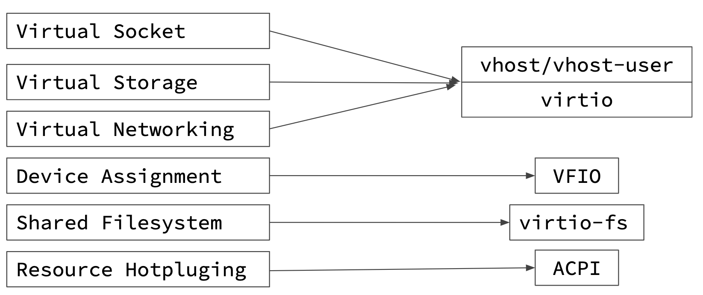

# Virtualization in Kata Containers

- [Virtualization in Kata Containers](#virtualization-in-kata-containers)
  - [Mapping container concepts to virtual machine technologies](#mapping-container-concepts-to-virtual-machine-technologies)
  - [Kata Containers Hypervisor and VMM support](#kata-containers-hypervisor-and-vmm-support)
    - [QEMU/KVM](#qemukvm)
      - [Machine accelerators](#machine-accelerators)
      - [Hotplug devices](#hotplug-devices)
    - [Firecracker/KVM](#firecrackerkvm)
    - [Cloud Hypervisor/KVM](#cloud-hypervisorkvm)
    - [Summary](#summary)

Kata Containers, a second layer of isolation is created on top of those provided by traditional namespace-containers. The
hardware virtualization interface is the basis of this additional layer. Kata will launch a lightweight virtual machine,
and use the guest’s Linux kernel to create a container workload, or workloads in the case of multi-container pods. In Kubernetes
and in the Kata implementation, the sandbox is carried out at the pod level. In Kata, this sandbox is created using a virtual machine.

This document describes how Kata Containers maps container technologies to virtual machines technologies, and how this is realized in
the multiple hypervisors and virtual machine monitors that Kata supports.

## Mapping container concepts to virtual machine technologies

A typical deployment of Kata Containers will be in Kubernetes by way of a Container Runtime Interface (CRI) implementation. On every node,
Kubelet will interact with a CRI implementer (such as containerd or CRI-O), which will in turn interface with Kata Containers (an OCI based runtime).

The CRI API, as defined at the [Kubernetes CRI-API repo](https://github.com/kubernetes/cri-api/), implies a few constructs being supported by the
CRI implementation, and ultimately in Kata Containers. In order to support the full [API](https://github.com/kubernetes/cri-api/blob/a6f63f369f6d50e9d0886f2eda63d585fbd1ab6a/pkg/apis/runtime/v1alpha2/api.proto#L34-L110) with the CRI-implementer, Kata must provide the following constructs:

These constructs can then be further mapped to what devices are necessary for interfacing with the virtual machine:

Ultimately, these concepts map to specific para-virtualized devices or virtualization technologies.

Each hypervisor or VMM varies on how or if it handles each of these.

## Kata Containers Hypervisor and VMM support

Kata Containers [supports multiple hypervisors](../hypervisors.md).

Details of each solution and a summary are provided below.

### QEMU/KVM

Kata Containers with QEMU has complete compatibility with Kubernetes.

Depending on the host architecture, Kata Containers supports various machine types,
for example `pc` and `q35` on x86 systems, `virt` on ARM systems and `pseries` on IBM Power systems. The default Kata Containers
machine type is `pc`. The machine type and its [`Machine accelerators`](#machine-accelerators) can
be changed by editing the runtime [`configuration`](./architecture.md/#configuration) file.

Devices and features used:
- virtio VSOCK or virtio serial
- virtio block or virtio SCSI
- [virtio net](https://www.redhat.com/en/virtio-networking-series)
- virtio fs or virtio 9p (recommend: virtio fs)
- VFIO
- hotplug
- machine accelerators

Machine accelerators and hotplug are used in Kata Containers to manage resource constraints, improve boot time and reduce memory footprint. These are documented below.

#### Machine accelerators

Machine accelerators are architecture specific and can be used to improve the performance
and enable specific features of the machine types. The following machine accelerators
are used in Kata Containers:

- NVDIMM: This machine accelerator is x86 specific and only supported by `pc` and
`q35` machine types. `nvdimm` is used to provide the root filesystem as a persistent
memory device to the Virtual Machine.

#### Hotplug devices

The Kata Containers VM starts with a minimum amount of resources, allowing for faster boot time and a reduction in memory footprint.  As the container launch progresses,
devices are hotplugged to the VM. For example, when a CPU constraint is specified which includes additional CPUs, they can be hot added.  Kata Containers has support
for hot-adding the following devices:
- Virtio block
- Virtio SCSI
- VFIO
- CPU

### Firecracker/KVM

Firecracker, built on many rust crates that are within [rust-VMM](https://github.com/rust-vmm),  has a very limited device model, providing a lighter
footprint and attack surface, focusing on function-as-a-service like use cases. As a result, Kata Containers with Firecracker VMM supports a subset of the CRI API.
Firecracker does not support file-system sharing, and as a result only block-based storage drivers are supported. Firecracker does not support device
hotplug nor does it support VFIO. As a result, Kata Containers with Firecracker VMM does not support updating container resources after boot, nor
does it support device passthrough.

Devices used:
- virtio VSOCK
- virtio block
- virtio net

### Cloud Hypervisor/KVM

[Cloud Hypervisor](https://github.com/cloud-hypervisor/cloud-hypervisor), based
on [rust-vmm](https://github.com/rust-vmm), is designed to have a
lighter footprint and smaller attack surface for running modern cloud
workloads. Kata Containers with Cloud
Hypervisor provides mostly complete compatibility with Kubernetes
comparable to the QEMU configuration. As of the 1.12 and 2.0.0 release
of Kata Containers, the Cloud Hypervisor configuration supports both CPU
and memory resize, device hotplug (disk and VFIO), file-system sharing through virtio-fs,
block-based volumes, booting from VM images backed by pmem device, and
fine-grained seccomp filters for each VMM threads (e.g. all virtio
device worker threads). Please check [this GitHub Project](https://github.com/orgs/kata-containers/projects/21)
for details of ongoing integration efforts.

Devices and features used:
- virtio VSOCK or virtio serial
- virtio block
- virtio net
- virtio fs
- virtio pmem
- VFIO
- hotplug
- seccomp filters
- [HTTP OpenAPI](https://github.com/cloud-hypervisor/cloud-hypervisor/blob/master/vmm/src/api/openapi/cloud-hypervisor.yaml)

### Summary

| Solution | release introduced | brief summary |
|-|-|-|
| Cloud Hypervisor | 1.10 | upstream Cloud Hypervisor with rich feature support, e.g. hotplug, VFIO and FS sharing|
| Firecracker | 1.5 | upstream Firecracker, rust-VMM based, no VFIO, no FS sharing, no memory/CPU hotplug |
| QEMU | 1.0 | upstream QEMU, with support for hotplug and filesystem sharing |
