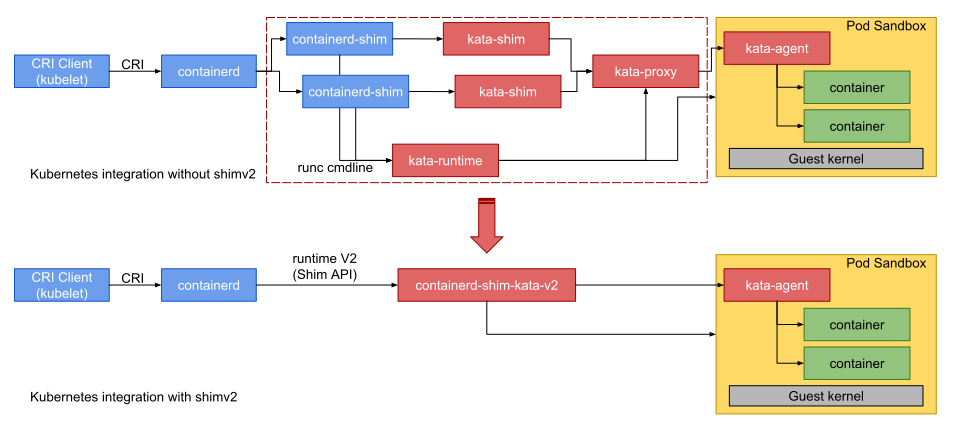

# How to use Kata Containers and Containerd(1.7+)

This document covers the installation and configuration of [containerd](https://containerd.io/)
and [Kata Containers](https://katacontainers.io). The containerd provides not only the `ctr`
command line tool, but also the [CRI](https://kubernetes.io/blog/2016/12/container-runtime-interface-cri-in-kubernetes/)
interface for [Kubernetes](https://kubernetes.io) and other CRI clients.

This document is primarily written for Kata Containers v3.25 or above, and containerd v1.7.30 or above.
Previous versions are addressed here, but we suggest users upgrade to the newer versions for better support.

## Concepts

### Kubernetes `RuntimeClass`

[`RuntimeClass`](https://kubernetes.io/docs/concepts/containers/runtime-class/) is a Kubernetes feature first
introduced in Kubernetes 1.12 as alpha. It is the feature for selecting the container runtime configuration to
use to run a pod’s containers. This feature is supported in `containerd` since [v1.2.0](https://github.com/containerd/containerd/releases/tag/v1.2.0).

Before the `RuntimeClass` was introduced, Kubernetes was not aware of the difference of runtimes on the node. `kubelet`
creates Pod sandboxes and containers through CRI implementations, and treats all the Pods equally. 

To eliminate the complexity of user configuration introduced by the non-standardized annotations and provide
extensibility, `RuntimeClass` was introduced. This gives users the ability to affect the runtime behavior
through `RuntimeClass` without the knowledge of the CRI daemons. We suggest that users with multiple runtimes
use `RuntimeClass` instead of the deprecated annotations.

### Containerd Runtime V2 API: Shim V2 API

The [`containerd-shim-kata-v2` (short as `shimv2` in this documentation)](../../src/runtime/cmd/containerd-shim-kata-v2/)
implements the [Containerd Runtime V2 (Shim API)](https://github.com/containerd/containerd/tree/main/core/runtime/v2) for Kata.
With `shimv2`, Kubernetes can launch Pod and OCI-compatible containers with one shim per Pod. Prior to `shimv2`, `2N+1`
shims (i.e. a `containerd-shim` and a `kata-shim` for each container and the Pod sandbox itself) and no standalone `kata-proxy`
process were used, even with VSOCK not available.




## Install

### Install Kata Containers

Follow the instructions to [install Kata Containers](../install/README.md).

### Install containerd with CRI plugin

> **Note:** `cri` is a native plugin of containerd 1.1 and above. It is built into containerd and enabled by default.
> You do not need to install `cri` if you have containerd 1.1 or above. Just remove the `cri` plugin from the list of
> `disabled_plugins` in the containerd configuration file (`/etc/containerd/config.toml`).

Follow the instructions from the [CRI installation guide](https://github.com/containerd/containerd/blob/main/docs/cri/crictl.md#install-crictl).

Then, check if `containerd` is now available:

```bash
$ command -v containerd
```

### Install CNI plugins

> If you have installed Kubernetes with `kubeadm`, you might have already installed the CNI plugins.

You can manually install CNI plugins as follows:

```bash
$ git clone https://github.com/containernetworking/plugins.git
$ pushd plugins
$ ./build_linux.sh
$ sudo mkdir /opt/cni
$ sudo cp -r bin /opt/cni/
$ popd
```

### Install `cri-tools`

> **Note:** `cri-tools` is a set of tools for CRI used for development and testing. Users who only want
> to use containerd with Kubernetes can skip the `cri-tools`.

You can install the `cri-tools` from source code:

```bash
$ git clone https://github.com/kubernetes-sigs/cri-tools.git
$ pushd cri-tools
$ make
$ sudo -E make install
$ popd
```

## Configuration

### Configure containerd to use Kata Containers

By default, the configuration of containerd is located at `/etc/containerd/config.toml`, and the
`cri` plugins are placed in the following section:

```toml
...
      [plugins."io.containerd.grpc.v1.cri".containerd.runtimes]

        [plugins."io.containerd.grpc.v1.cri".containerd.runtimes.kata]
          runtime_type = "io.containerd.kata.v2"

          [plugins."io.containerd.grpc.v1.cri".containerd.runtimes.kata.options]
...
```

The following sections outline how to add Kata Containers to the configurations.

#### Kata Containers as a `RuntimeClass`

For
- Kata Containers v3.25 or above (including `v3.25`)
- Containerd v1.7+ or above
- Kubernetes v1.18.0 or above

The `RuntimeClass` is suggested.

The following configuration includes two runtime classes:
- `plugins.cri.containerd.runtimes.runc`: the runc, and it is the default runtime.
- `plugins.cri.containerd.runtimes.kata`: The function in containerd (reference [the document here](https://github.com/containerd/containerd/tree/main/core/runtime/v2))
  where the dot-connected string `io.containerd.kata.v2` is translated to `containerd-shim-kata-v2` (i.e. the
  binary name of the Kata implementation of [Containerd Runtime V2 (Shim API)](https://github.com/containerd/containerd/tree/main/core/runtime/v2)).

```toml
...
      [plugins."io.containerd.grpc.v1.cri".containerd.runtimes]

        [plugins."io.containerd.grpc.v1.cri".containerd.runtimes.kata]
          base_runtime_spec = ""
          cni_conf_dir = ""
          cni_max_conf_num = 0
          pod_annotations = ["io.katacontainers.*"]
          container_annotations = ["io.katacontainers.*"]
          privileged_without_host_devices = false
          privileged_without_host_devices_all_devices_allowed = false
          runtime_engine = ""
          runtime_path = ""
          runtime_root = ""
          runtime_type = "io.containerd.kata.v2"
          sandbox_mode = ""
          snapshotter = ""

          [plugins."io.containerd.grpc.v1.cri".containerd.runtimes.kata.options]
            BinaryName = ""
            CriuImagePath = ""
            CriuPath = ""
            CriuWorkPath = ""
            IoGid = 0
            IoUid = 0
            NoNewKeyring = false
            NoPivotRoot = false
            Root = ""
            ShimCgroup = ""
            SystemdCgroup = false
...
```

`privileged_without_host_devices` tells containerd that a privileged Kata container should not have direct access to all host devices. If unset, containerd will pass all host devices to Kata container, which may cause security issues.

`pod_annotations` is the list of pod annotations passed to both the pod sandbox as well as container through the OCI config.

`container_annotations` is the list of container annotations passed through to the OCI config of the containers.

By default, shimv2 first tries to get the configuration file from paths (`/etc/kata-containers/configuration.toml` and `/usr/share/defaults/kata-containers/configuration.toml`). If not set, shimv2 will use the Kata configuration file with the environment variable `KATA_CONF_FILE`, but within this method, you should create a shell script as `containerd-shim-kata-v2` which is located under that path of `/usr/local/bin/` or `/usr/bin/`:

```shell
~# cat /usr/local/bin/containerd-shim-kata-v2 
#!/bin/bash
# KATA_CONF_FILE=/your-specified-path/kata/share/defaults/kata-containers/runtime-rs/configuration-dragonball.toml /your-path/kata/runtime-rs/bin/containerd-shim-kata-v2 $@
KATA_CONF_FILE=/opt/kata/share/defaults/kata-containers/configuration-qemu-runtime-rs.toml /opt/kata/bin/containerd-shim-kata-v2 $@
```

> **Note:** The environment variable `KATA_CONF_FILE` can be configured according to specific use cases, and the `containerd-shim-kata-v2` executable path (it's a golang or rust binary path) can also be specified based on your specific environment requirements.

### Configuration for `cri-tools`

> **Note:** If you skipped the [Install `cri-tools`](#install-cri-tools) section, you can skip this section too.

First, add the CNI configuration in the containerd configuration.

The following is the configuration if you installed CNI as the *[Install CNI plugins](#install-cni-plugins)* section outlined.

Put the CNI configuration as `/etc/cni/net.d/10-mynet.conf`:

```json
{
	"cniVersion": "0.2.0",
	"name": "mynet",
	"type": "bridge",
	"bridge": "cni0",
	"isGateway": true,
	"ipMasq": true,
	"ipam": {
		"type": "host-local",
		"subnet": "172.19.0.0/24",
		"routes": [
			{ "dst": "0.0.0.0/0" }
		]
	}
}
```

Next, reference the configuration directory through containerd `config.toml`:

```toml
[plugins.cri.cni]
    # conf_dir is the directory in which the admin places a CNI conf.
    conf_dir = "/etc/cni/net.d"
```

The configuration file of `crictl` command line tool in `cri-tools` locates at `/etc/crictl.yaml`:

```yaml
runtime-endpoint: unix:///var/run/containerd/containerd.sock
image-endpoint: unix:///var/run/containerd/containerd.sock
timeout: 10
debug: true
```

## Run

### Launch containers with `ctr` command line

To run a container with Kata Containers through the containerd command line, you can run the following:

```bash
$ sudo ctr image pull docker.io/library/busybox:latest
$ sudo ctr run --cni --runtime io.containerd.run.kata.v2 -t --rm docker.io/library/busybox:latest hello sh
```

This launches a BusyBox container named `hello`, and it will be removed by `--rm` after it quits.
The `--cni` flag enables CNI networking for the container. Without this flag, a container with just a
loopback interface is created.

### Launch containers using `ctr` command line with rootfs bundle

#### Get rootfs
Use the script to create rootfs
```bash
ctr i pull quay.io/prometheus/busybox:latest
ctr i export rootfs.tar quay.io/prometheus/busybox:latest

rootfs_tar=rootfs.tar
bundle_dir="./bundle"
mkdir -p "${bundle_dir}"

# extract busybox rootfs
rootfs_dir="${bundle_dir}/rootfs"
mkdir -p "${rootfs_dir}"
layers_dir="$(mktemp -d)"
tar -C "${layers_dir}" -pxf "${rootfs_tar}"
for ((i=0;i<$(cat ${layers_dir}/manifest.json | jq -r ".[].Layers | length");i++)); do
  tar -C ${rootfs_dir} -xf ${layers_dir}/$(cat ${layers_dir}/manifest.json | jq -r ".[].Layers[${i}]")
done
```
#### Get `config.json`
Use runc spec to generate `config.json`
```bash
cd ./bundle/rootfs
runc spec
mv config.json ../
```
Change the root `path` in `config.json` to the absolute path of rootfs

```JSON
"root":{
    "path":"/root/test/bundle/rootfs",
    "readonly": false
},
```

#### Run container
```bash
sudo ctr run -d --runtime io.containerd.run.kata.v2 --config bundle/config.json hello
sudo ctr t exec --exec-id ${ID} -t hello sh
```
### Launch Pods with `crictl` command line

With the `crictl` command line of `cri-tools`, you can specify runtime class with `-r` or `--runtime` flag.
 Use the following to launch Pod with `kata` runtime class with the pod in [the example](https://github.com/kubernetes-sigs/cri-tools/tree/master/docs/examples)
of `cri-tools`:

```bash
$ sudo crictl runp -r kata podsandbox-config.yaml
36e23521e8f89fabd9044924c9aeb34890c60e85e1748e8daca7e2e673f8653e
```

You can add container to the launched Pod with the following:

```bash
$ sudo crictl create 36e23521e8f89 container-config.yaml podsandbox-config.yaml
1aab7585530e62c446734f12f6899f095ce53422dafcf5a80055ba11b95f2da7
```

Now, start it with the following:

```bash
$ sudo crictl start 1aab7585530e6
1aab7585530e6
```

In Kubernetes, you need to create a `RuntimeClass` resource and add the `RuntimeClass` field in the Pod Spec
(see this [document](https://kubernetes.io/docs/concepts/containers/runtime-class/) for more information).

If `RuntimeClass` is not supported, you can use the following annotation in a Kubernetes pod to identify as an untrusted workload:

```yaml
annotations:
   io.kubernetes.cri.untrusted-workload: "true"
```
