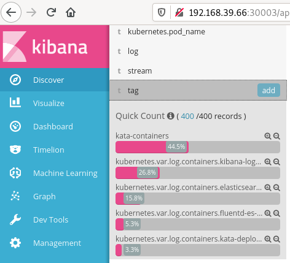
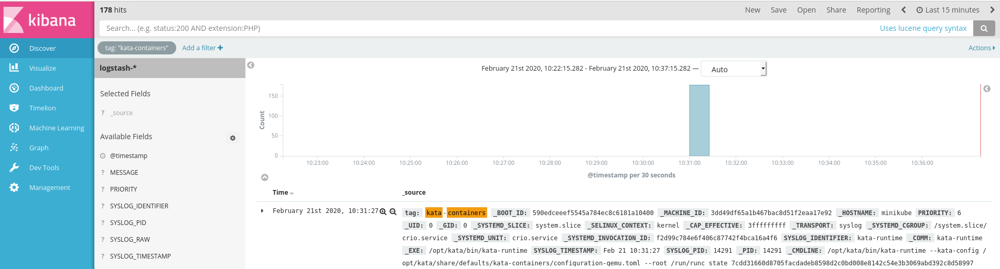
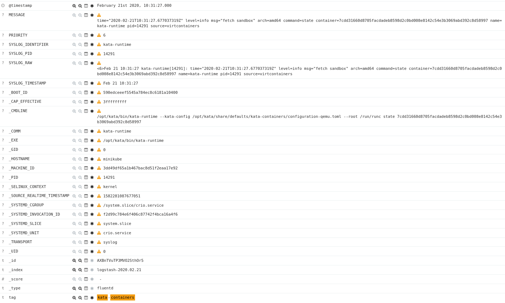
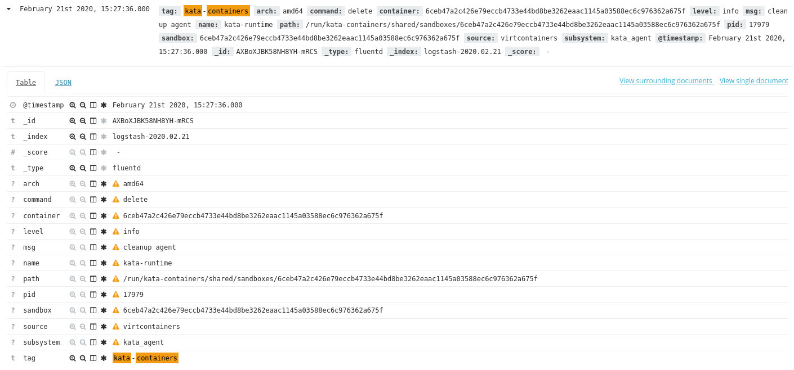
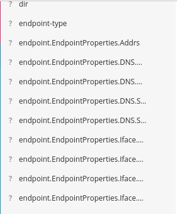

# Importing Kata Containers logs with Fluentd

# Introduction

This document describes how to import Kata Containers logs into [Fluentd](https://www.fluentd.org/),
typically for importing into an
Elastic/Fluentd/Kibana([EFK](https://github.com/kubernetes-sigs/instrumentation-addons/tree/master/fluentd-elasticsearch#running-efk-stack-in-production))
or Elastic/Logstash/Kibana([ELK](https://www.elastic.co/elastic-stack)) stack.

The majority of this document focusses on CRI-O based (classic) Kata runtime. Much of that information
also applies to the Kata `shimv2` runtime.  Differences pertaining to Kata `shimv2` can be found in their
[own section](#kata-shimv2).

> **Note:** This document does not cover any aspect of "log rotation". It is expected that any production
> stack already has a method in place to control node log growth.

# Overview

Kata generates logs. The logs can come from numerous parts of the Kata stack (the runtime, proxy, shim
and even the agent). By default the logs
[go to the system journal](../../src/runtime/README.md#logging),
but they can also be configured to be stored in files.

The logs default format is in [`logfmt` structured logging](https://brandur.org/logfmt), but can be switched to
be JSON with a command line option.

Provided below are some examples of Kata log import and processing using
[Fluentd](https://www.fluentd.org/).

## Test stack

Some of the testing we can perform locally, but other times we really need a live stack for testing.
We will use a [`minikube`](https://github.com/kubernetes/minikube/) stack with EFK enabled and Kata
installed to do our tests. Some details such as specific paths and versions of components may need
to be adapted to your specific installation.

The [Kata minikube installation guide](../install/minikube-installation-guide.md) was used to install
`minikube` with Kata Containers enabled.

The minikube EFK stack `addon` is then enabled:

```bash
$ minikube addons enable efk
```

> *Note*: Installing and booting EFK can take a little while - check progress with
> `kubectl get pods -n=kube-system` and wait for all the pods to get to the `Running` state.

## Importing the logs

Kata offers us two choices to make when storing the logs:
- Do we store them to the system log, or to separate files?
- Do we store them in `logfmt` format, or `JSON`?

We will start by examining the Kata default setup (`logfmt` stored in the system log), and then look
at other options.

## Direct import `logfmt` from `systemd`

Fluentd contains both a component that can read the `systemd` system journals, and a component
that can parse `logfmt` entries. We will utilise these in two separate steps to evaluate how well
the Kata logs import to the EFK stack.

### Configuring `minikube`

> **Note:** Setting up, configuration and deployment of `minikube` is not covered in exacting
> detail in this guide. It is presumed the user has the abilities and their own Kubernetes/Fluentd
> stack they are able to utilise in order to modify and test as necessary.

Minikube by default
[configures](https://github.com/kubernetes/minikube/blob/master/deploy/iso/minikube-iso/board/minikube/x86_64/rootfs-overlay/etc/systemd/journald.conf)
 the `systemd-journald` with the
[`Storage=volatile`](https://www.freedesktop.org/software/systemd/man/journald.conf.html) option,
which results in the journal being stored in `/run/log/journal`. Unfortunately, the Minikube EFK
Fluentd install extracts most of its logs in `/var/log`, and therefore does not mount `/run/log`
into the Fluentd pod by default. This prevents us from reading the system journal by default.

This can be worked around by patching the Minikube EFK `addon` YAML to mount `/run/log` into the
Fluentd container:

```patch
diff --git a/deploy/addons/efk/fluentd-es-rc.yaml.tmpl b/deploy/addons/efk/fluentd-es-rc.yaml.tmpl
index 75e386984..83bea48b9 100644
--- a/deploy/addons/efk/fluentd-es-rc.yaml.tmpl
+++ b/deploy/addons/efk/fluentd-es-rc.yaml.tmpl
@@ -44,6 +44,8 @@ spec:
         volumeMounts:
         - name: varlog
           mountPath: /var/log
+        - name: runlog
+          mountPath: /run/log
         - name: varlibdockercontainers
           mountPath: /var/lib/docker/containers
           readOnly: true
@@ -57,6 +59,9 @@ spec:
       - name: varlog
         hostPath:
           path: /var/log
+      - name: runlog
+        hostPath:
+          path: /run/log
       - name: varlibdockercontainers
         hostPath:
           path: /var/lib/docker/containers
```

> **Note:** After making this change you will need to build your own `minikube` to encapsulate
> and use this change, or fine another method to (re-)launch the Fluentd containers for the change
> to take effect.

### Pull from `systemd`

We will start with testing Fluentd pulling the Kata logs directly from the system journal with the
Fluentd [systemd plugin](https://github.com/fluent-plugin-systemd/fluent-plugin-systemd).

We modify the Fluentd config file with the following fragment. For reference, the Minikube
YAML can be found
[on GitHub](https://github.com/kubernetes/minikube/blob/master/deploy/addons/efk/fluentd-es-configmap.yaml):

> **Note:** The below Fluentd config fragment is in the "older style" to match  the Minikube version of
> Fluentd. If using a more up to date version of Fluentd, you may need to update some parameters, such as
> using `matches` rather than `filters` and placing `@` before `type`. Your Fluentd should warn you in its
> logs if such updates are necessary.

```
<source>
  type systemd
  tag kata-containers
  path /run/log/journal
  pos_file /run/log/journal/kata-journald.pos
  filters [{"SYSLOG_IDENTIFIER": "kata-runtime"}, {"SYSLOG_IDENTIFIER": "kata-shim"}]
  read_from_head true
</source>
```

We then apply the new YAML, and restart the Fluentd pod (by killing it, and letting the `ReplicationController`
start a new instance, which will pick up the new `ConfigurationMap`):

```bash
$ kubectl apply -f new-fluentd-cm.yaml
$ kubectl delete pod -n=kube-system fluentd-es-XXXXX
```

Now open the Kibana UI to the Minikube EFK `addon`, and launch a Kata QEMU based test pod in order to
generate some Kata specific log entries:

```bash
$ minikube addons open efk
$ cd $GOPATH/src/github.com/kata-containers/kata-containers/tools/packaging/kata-deploy
$ kubectl apply -f examples/nginx-deployment-qemu.yaml
```

Looking at the Kibana UI, we can now see that some `kata-runtime` tagged records have appeared:



If we now filter on that tag, we can see just the Kata related entries



If we expand one of those entries, we can see we have imported useful information. You can then
sub-filter on, for instance, the `SYSLOG_IDENTIFIER` to differentiate the Kata components, and
on the `PRIORITY` to filter out critical issues etc.

Kata generates a significant amount of Kata specific information, which can be seen as
[`logfmt`](../../src/tools/log-parser/README.md#logfile-requirements).
data contained in the `MESSAGE` field. Imported as-is, there is no easy way to filter on that data
in Kibana:

.

We can however further sub-parse the Kata entries using the
[Fluentd plugins](https://docs.fluentbit.io/manual/pipeline/parsers/logfmt) that will parse
`logfmt` formatted data. We can utilise these to parse the sub-fields using a Fluentd filter
section. At the same time, we will prefix the new fields with `kata_` to make it clear where
they have come from:

```
<filter kata-containers>
  @type parser
  key_name MESSAGE
  format logfmt
  reserve_data true
  inject_key_prefix kata_
</filter>
```

The Minikube Fluentd version does not come with the `logfmt` parser installed, so we will run a local
test to check the parsing works. The resulting output from Fluentd is:

```
2020-02-21 10:31:27.810781647 +0000 kata-containers:
{"_BOOT_ID":"590edceeef5545a784ec8c6181a10400",
  "_MACHINE_ID":"3dd49df65a1b467bac8d51f2eaa17e92",
  "_HOSTNAME":"minikube",
  "PRIORITY":"6",
  "_UID":"0",
  "_GID":"0",
  "_SYSTEMD_SLICE":"system.slice",
  "_SELINUX_CONTEXT":"kernel",
  "_CAP_EFFECTIVE":"3fffffffff",
  "_TRANSPORT":"syslog",
  "_SYSTEMD_CGROUP":"/system.slice/crio.service",
  "_SYSTEMD_UNIT":"crio.service",
  "_SYSTEMD_INVOCATION_ID":"f2d99c784e6f406c87742f4bca16a4f6",
  "SYSLOG_IDENTIFIER":"kata-runtime",
  "_COMM":"kata-runtime",
  "_EXE":"/opt/kata/bin/kata-runtime",
  "SYSLOG_TIMESTAMP":"Feb 21 10:31:27 ",
  "_CMDLINE":"/opt/kata/bin/kata-runtime --config /opt/kata/share/defaults/kata-containers/configuration-qemu.toml --root /run/runc state 7cdd31660d8705facdadeb8598d2c0bd008e8142c54e3b3069abd392c8d58997",
  "SYSLOG_PID":"14314",
  "_PID":"14314",
  "MESSAGE":"time=\"2020-02-21T10:31:27.810781647Z\" level=info msg=\"release sandbox\" arch=amd64 command=state container=7cdd31660d8705facdadeb8598d2c0bd008e8142c54e3b3069abd392c8d58997 name=kata-runtime pid=14314 sandbox=1c3e77cad66aa2b6d8cc846f818370f79cb0104c0b840f67d0f502fd6562b68c source=virtcontainers subsystem=sandbox",
  "SYSLOG_RAW":"<6>Feb 21 10:31:27 kata-runtime[14314]: time=\"2020-02-21T10:31:27.810781647Z\" level=info msg=\"release sandbox\" arch=amd64 command=state container=7cdd31660d8705facdadeb8598d2c0bd008e8142c54e3b3069abd392c8d58997 name=kata-runtime pid=14314 sandbox=1c3e77cad66aa2b6d8cc846f818370f79cb0104c0b840f67d0f502fd6562b68c source=virtcontainers subsystem=sandbox\n",
  "_SOURCE_REALTIME_TIMESTAMP":"1582281087810805",
  "kata_level":"info",
  "kata_msg":"release sandbox",
  "kata_arch":"amd64",
  "kata_command":"state",
  "kata_container":"7cdd31660d8705facdadeb8598d2c0bd008e8142c54e3b3069abd392c8d58997",
  "kata_name":"kata-runtime",
  "kata_pid":14314,
  "kata_sandbox":"1c3e77cad66aa2b6d8cc846f818370f79cb0104c0b840f67d0f502fd6562b68c",
  "kata_source":"virtcontainers",
  "kata_subsystem":"sandbox"}
```

Here we can see that the `MESSAGE` field has been parsed out and pre-pended into the `kata_*` fields,
which contain usefully filterable fields such as `kata_level`, `kata_command` and `kata_subsystem` etc.

### Systemd Summary

We have managed to configure Fluentd to capture the Kata logs entries from the system
journal, and further managed to then parse out the `logfmt` message into JSON to allow further analysis
inside Elastic/Kibana.

## Directly importing JSON

The underlying basic data format used by Fluentd and Elastic is JSON. If we output JSON
directly from Kata, that should make overall import and processing of the log entries more efficient.

There are potentially two things we can do with Kata here:

- Get Kata to [output its logs in `JSON` format](../../src/runtime/README.md#logging) rather
  than `logfmt`.
- Get Kata to log directly into a file, rather than via the system journal. This would allow us to not need
  to parse the systemd format files, and capture the Kata log lines directly. It would also avoid Fluentd
  having to potentially parse or skip over many non-Kata related systemd journal that it is not at all
  interested in.

In theory we could get Kata to post its messages in JSON format to the systemd journal by adding the
`--log-format=json` option to the Kata runtime, and then swapping the `logfmt` parser for the `json`
parser, but we would still need to parse the systemd files. We will skip this setup in this document, and
go directly to a full Kata specific JSON format logfile test.

### JSON in files

Kata runtime has the ability to generate JSON logs directly, rather than its default `logfmt` format. Passing
the `--log-format=json` argument to the Kata runtime enables this. The easiest way to pass in this extra
parameter from a [Kata deploy](../../tools/packaging/kata-deploy) installation
is to edit the `/opt/kata/bin/kata-qemu` shell script.

At the same time, we will add the `--log=/var/log/kata-runtime.log` argument to store the Kata logs in their
own file (rather than into the system journal).

```bash
#!/usr/bin/env bash
/opt/kata/bin/kata-runtime --config "/opt/kata/share/defaults/kata-containers/configuration-qemu.toml" --log-format=json --log=/var/log/kata-runtime.log $@
```

And then we'll add the Fluentd config section to parse that file. Note, we inform the parser that Kata is
generating timestamps in `iso8601` format. Kata places these timestamps into a field called `time`, which
is the default field the Fluentd parser looks for:

```
    <source>
      type tail
      tag kata-containers
      path /var/log/kata-runtime.log
      pos_file /var/log/kata-runtime.pos
      format json
      time_format %iso8601
      read_from_head true
    </source>
```

This imports the `kata-runtime` logs, with the resulting records looking like:



Something to note here is that we seem to have gained an awful lot of fairly identical looking fields in the
elastic database:



In reality, they are not all identical, but do come out of one of the Kata log entries - from the
`kill` command. A JSON fragment showing an example is below:

```json
{
...
    "EndpointProperties": {
      "Iface": {
        "Index": 4,
        "MTU": 1460,
        "TxQLen": 0,
        "Name": "eth0",
        "HardwareAddr": "ClgKAQAL",
        "Flags": 19,
        "RawFlags": 69699,
        "ParentIndex": 15,
        "MasterIndex": 0,
        "Namespace": null,
        "Alias": "",
        "Statistics": {
          "RxPackets": 1,
          "TxPackets": 5,
          "RxBytes": 42,
          "TxBytes": 426,
          "RxErrors": 0,
          "TxErrors": 0,
          "RxDropped": 0,
          "TxDropped": 0,
          "Multicast": 0,
          "Collisions": 0,
          "RxLengthErrors": 0,
          "RxOverErrors": 0,
          "RxCrcErrors": 0,
          "RxFrameErrors": 0,
          "RxFifoErrors": 0,
          "RxMissedErrors": 0,
          "TxAbortedErrors": 0,
          "TxCarrierErrors": 0,
          "TxFifoErrors": 0,
          "TxHeartbeatErrors": 0,
          "TxWindowErrors": 0,
          "RxCompressed": 0,
          "TxCompressed": 0
...
```

If these new fields are not required, then a Fluentd
[`record_transformer` filter](https://docs.fluentd.org/filter/record_transformer#remove_keys)
could be used to delete them before they are injected into Elastic.

#### Prefixing all keys

It may be noted above that all the fields are imported with their base native name, such as
`arch` and `level`. It may be better for data storage and processing if all the fields were
identifiable as having come from Kata, and avoid namespace clashes with other imports.
This can be achieved by prefixing all the keys with, say, `kata_`. It appears `fluend` cannot
do this directly in the input or match phases, but can in the filter/parse phase (as was done
when processing `logfmt` data for instance).  To achieve this, we can first input the Kata
JSON data as a single line, and then add the prefix using a JSON filter section:

```
# Pull in as a single line...
<source>
  @type tail
  path /var/log/kata-runtime.log
  pos_file /var/log/kata-runtime.pos
  read_from_head true
  tag kata-runtime
  <parse>
    @type none
  </parse>
</source>

<filter kata-runtime>
  @type parser
  key_name message
  # drop the original single line `message` entry
  reserve_data false
  inject_key_prefix kata_
  <parse>
    @type json
  </parse>
</filter>
```

# Kata `shimv2`

When using the Kata `shimv2` runtime with `containerd`, as described in this
[how-to guide](containerd-kata.md#containerd-runtime-v2-api-shim-v2-api), the Kata logs are routed
differently, and some adjustments to the above methods will be necessary to filter them in Fluentd.

The Kata `shimv2` logs are different in two primary ways:

- The Kata logs are directed via `containerd`, and will be captured along with the `containerd` logs,
  such as on the containerd stdout or in the system journal.
- In parallel, Kata `shimv2` places its logs into the system journal under the systemd name of `kata`.

Below is an example Fluentd configuration fragment showing one possible method of extracting and separating
the `containerd` and Kata logs from the system journal by filtering on the Kata `SYSLOG_IDENTIFIER` field,
using the [Fluentd v0.12 rewrite_tag_filter](https://docs.fluentd.org/v/0.12/output/rewrite_tag_filter):

```yaml
    <source>
      type systemd
      path /path/to/journal
      # capture the containerd logs
      filters [{ "_SYSTEMD_UNIT": "containerd.service" }]
      pos_file /tmp/systemd-containerd.pos
      read_from_head true
      # tag those temporarily, as we will filter them and rewrite the tags
      tag containerd_tmp_tag
    </source>

    # filter out and split between kata entries and containerd entries
    <match containerd_tmp_tag>
      @type rewrite_tag_filter
      # Tag Kata entries
      <rule>
        key SYSLOG_IDENTIFIER
        pattern kata
        tag kata_tag
      </rule>
      # Anything that was not matched so far, tag as containerd
      <rule>
        key MESSAGE
        pattern /.+/
        tag containerd_tag
      </rule>
    </match>
```

# Caveats

> **Warning:** You should be aware of the following caveats, which may disrupt or change what and how
> you capture and process the Kata Containers logs.

The following caveats should be noted:

- There is a [known issue](https://github.com/kata-containers/runtime/issues/985) whereby enabling
  full debug in Kata, particularly enabling agent kernel log messages, can result in corrupt log lines
  being generated by Kata (due to overlapping multiple output streams).
- Presently only the `kata-runtime` can generate JSON logs, and direct them to files. Other components
  such as the `proxy` and `shim` can only presently report to the system journal. Hopefully these
  components will be extended with extra functionality.

# Summary

We have shown how native Kata logs using the systemd journal and `logfmt` data can be import, and also
how Kata can be instructed to generate JSON logs directly, and import those into Fluentd.

We have detailed a few known caveats, and leave it to the implementer to choose the best method for their
system.
