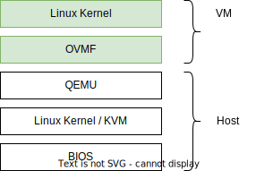

# Kata Containers with AMD SEV-SNP VMs

## Disclaimer

This guide is designed for developers and is - same as the Developer Guide - not intended for production systems or end users. It is advisable to only follow this guide on non-critical development systems.

## Prerequisites

To run  Kata Containers in SNP-VMs, the following software stack is used.



The host BIOS and kernel must be capable of supporting AMD SEV-SNP and configured accordingly. For Kata Containers, the host kernel with branch [`sev-snp-iommu-avic_5.19-rc6_v3`](https://github.com/AMDESE/linux/tree/sev-snp-iommu-avic_5.19-rc6_v3) and commit [`3a88547`](https://github.com/AMDESE/linux/commit/3a885471cf89156ea555341f3b737ad2a8d9d3d0) is known to work in conjunction with SEV Firmware version 1.51.3 (0xh\_1.33.03) available on AMD's [SEV developer website](https://developer.amd.com/sev/). See [AMD's guide](https://github.com/AMDESE/AMDSEV/tree/sev-snp-devel) to configure the host accordingly. Verify that you are able to run SEV-SNP encrypted VMs first. The guest components required for Kata Containers are built as described below.

**Tip**: It is easiest to first have Kata Containers running on your system and then modify it to run containers in SNP-VMs. Follow the [Developer guide](../Developer-Guide.md#warning) and then follow the below steps. Nonetheless, you can just follow this guide from the start.

## How to build

Follow all of the below steps to install Kata Containers with SNP-support from scratch. These steps mostly follow the developer guide with modifications to support SNP

__Steps from the Developer Guide:__
- Get all the [required components](../Developer-Guide.md#requirements-to-build-individual-components) for building the kata-runtime
- [Build the and install kata-runtime](../Developer-Guide.md#build-and-install-the-kata-containers-runtime)
- [Build a custom agent](../Developer-Guide.md#build-a-custom-kata-agent---optional)
- [Create an initrd image](../Developer-Guide.md#create-an-initrd-image---optional) by first building a rootfs, then building the initrd based on the rootfs, use a custom agent and install. `ubuntu` works as the distribution of choice.
- Get the [required components](../../tools/packaging/kernel/README.md#requirements) to build a custom kernel

__SNP-specific steps:__
- Build the SNP-specific kernel as shown below (see this [guide](../../tools/packaging/kernel/README.md#build-kata-containers-kernel) for more information)
```bash
$ pushd kata-containers/tools/packaging/
$ ./kernel/build-kernel.sh -a x86_64 -x snp setup
$ ./kernel/build-kernel.sh -a x86_64 -x snp build
$ sudo -E PATH="${PATH}" ./kernel/build-kernel.sh -x snp install
$ popd
```
- Build a current OVMF capable of SEV-SNP:
```bash
$ pushd kata-containers/tools/packaging/static-build/ovmf
$ ./build.sh
$ tar -xvf edk2-x86_64.tar.gz
$ popd
```
- Build a custom QEMU
```bash
$ source kata-containers/tools/packaging/scripts/lib.sh
$ qemu_url="$(get_from_kata_deps ".assets.hypervisor.qemu-snp-experimental.url")"
$ qemu_tag="$(get_from_kata_deps ".assets.hypervisor.qemu-snp-experimental.tag")"
$ git clone "${qemu_url}"
$ pushd qemu
$ git checkout "${qemu_tag}"
$ ./configure --enable-virtfs --target-list=x86_64-softmmu --enable-debug
$ make -j "$(nproc)"
$ popd
```

### Kata Containers Configuration for SNP

The configuration file located at `/etc/kata-containers/configuration.toml` must be adapted as follows to support SNP-VMs:
- Use the SNP-specific kernel for the guest VM (change path)
```toml
kernel = "/usr/share/kata-containers/vmlinuz-snp.container"
```
- Enable the use of an initrd (uncomment)
```toml
initrd = "/usr/share/kata-containers/kata-containers-initrd.img"
```
- Disable the use of a rootfs (comment out)
```toml
# image = "/usr/share/kata-containers/kata-containers.img"
```
- Use the custom QEMU capable of SNP (change path)
```toml
path = "/path/to/qemu/build/qemu-system-x86_64"
```
- Use `virtio-9p` device since `virtio-fs` is unsupported due to bugs / shortcomings in QEMU version [`snp-v3`](https://github.com/AMDESE/qemu/tree/snp-v3) for SEV and SEV-SNP (change value)
```toml
shared_fs = "virtio-9p"
```
- Disable `virtiofsd` since it is no longer required (comment out)
```toml
# virtio_fs_daemon = "/usr/libexec/virtiofsd"
```
- Disable NVDIMM (uncomment)
```toml
disable_image_nvdimm = true
```
- Disable shared memory (uncomment)
```toml
file_mem_backend = ""
```
- Enable confidential guests (uncomment)
```toml
confidential_guest = true
```
- Enable SNP-VMs (uncomment)
```toml
sev_snp_guest = true
```
  - Configure an OVMF (add path)
```toml
firmware = "/path/to/kata-containers/tools/packaging/static-build/ovmf/opt/kata/share/ovmf/OVMF.fd"
```

## Test Kata Containers with Containerd

With Kata Containers configured to support SNP-VMs, we use containerd to test and deploy containers in these VMs.

### Install Containerd
If not already present, follow [this guide](./containerd-kata.md#install) to install containerd and its related components including `CNI` and the `cri-tools` (skip Kata Containers since we already installed it)

### Containerd Configuration

Follow [this guide](./containerd-kata.md#configuration) to configure containerd to use Kata Containers

## Run Kata Containers in SNP-VMs

Run the below commands to start a container. See [this guide](./containerd-kata.md#run) for more information
```bash
$ sudo ctr image pull docker.io/library/busybox:latest
$ sudo ctr run --cni --runtime io.containerd.run.kata.v2 -t --rm docker.io/library/busybox:latest hello sh
```

### Check for active SNP:

Inside the running container, run the following commands to check if SNP is active. It should look something like this:
```
/ # dmesg | grep -i sev
[    0.299242] Memory Encryption Features active: AMD SEV SEV-ES SEV-SNP
[    0.472286] SEV: Using SNP CPUID table, 31 entries present.
[    0.514574] SEV: SNP guest platform device initialized.
[    0.885425] sev-guest sev-guest: Initialized SEV guest driver (using vmpck_id 0)
```

### Obtain an SNP Attestation Report

To obtain an attestation report inside the container, the `/dev/sev-guest` must first be configured. As of now, the VM does not perform this step, however it can be performed inside the container, either in the terminal or in code.

Example for shell:
```
/ # SNP_MAJOR=$(cat /sys/devices/virtual/misc/sev-guest/dev | awk -F: '{print $1}')
/ # SNP_MINOR=$(cat /sys/devices/virtual/misc/sev-guest/dev | awk -F: '{print $2}')
/ # mknod -m 600 /dev/sev-guest c "${SNP_MAJOR}" "${SNP_MINOR}"
```

## Known Issues

- Support for cgroups v2 is still [work in progress](https://github.com/kata-containers/kata-containers/issues/927). If issues occur due to cgroups v2 becoming the default in newer systems, one possible solution is to downgrade cgroups to v1:
```bash
sudo sed -i 's/^\(GRUB_CMDLINE_LINUX=".*\)"/\1 systemd.unified_cgroup_hierarchy=0"/' /etc/default/grub
sudo update-grub
sudo reboot
```
- If both SEV and SEV-SNP are supported by the host, Kata Containers uses SEV-SNP by default. You can verify what features are enabled by checking `/sys/module/kvm_amd/parameters/sev` and `sev_snp`. This means that Kata Containers can not run both SEV-SNP-VMs and SEV-VMs at the same time. If SEV is to be used by Kata Containers instead, reload the `kvm_amd` kernel module without SNP-support, this will disable SNP-support for the entire platform.
```bash
sudo rmmod kvm_amd && sudo modprobe kvm_amd sev_snp=0
```

