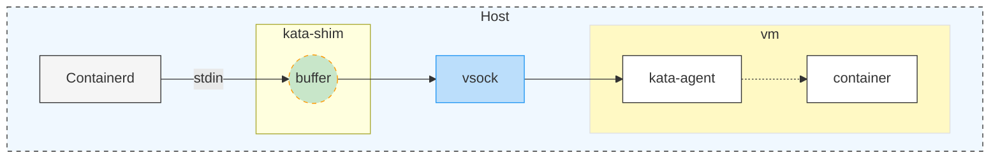
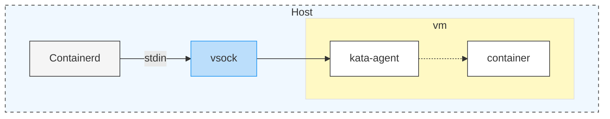
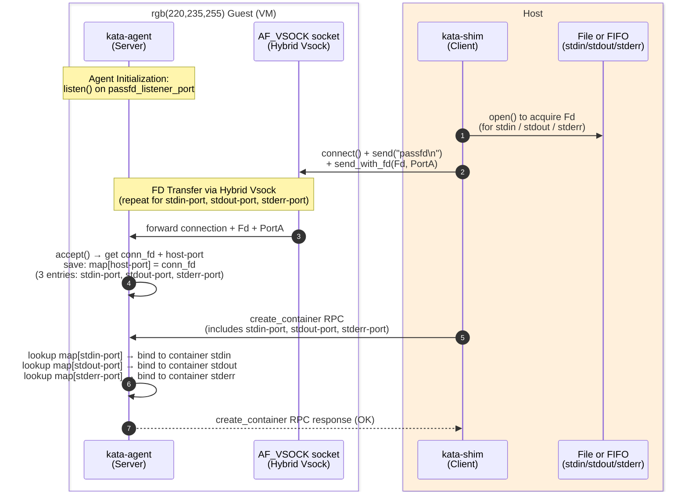

# How to Use Passthrough-FD IO within Runtime-rs and Dragonball

This document describes the Passthrough-FD (pass-fd) technology implemented in Kata Containers to optimize IO performance. By bypassing the intermediate proxy layers, this technology significantly reduces latency and CPU overhead for container IO streams.

## Important Limitation

Before diving into the technical details, please note the following restriction:

- Exclusive Support for Dragonball VMM: This feature is currently implemented only for Kata Containers' built-in VMM, Dragonball.
- Unsupported VMMs: Other VMMs such as QEMU, Cloud Hypervisor, and Firecracker do not support this feature at this time.

## Overview

The original IO implementation in Kata Containers suffered from an excessively long data path, leading to poor efficiency. For instance, copying a 10GB file could take as long as 10 minutes.

To address this, Kata AC member @lifupan and @frezcirno introduced a series of optimizations using passthrough-fd technology. This approach allows the VMM to directly handle file descriptors (FDs), dramatically improving IO throughput.

## Traditional IO Path

Before the introduction of Passthrough-FD, Kata's IO streams were implemented using `ttrpc + virtio-vsock`.

The data flow was as follows:



The kata-shim (containerd-shim-kata-v2) on the Host opens the FIFO pipes provided by containerd via the shimv2 interface.
This results in three FDs (stdin, stdout, and stderr).
The kata-shim manages three separate threads to handle these streams.
The Bottleneck: kata-shim acts as a "middleman," maintaining three internal buffers. It must read data from the FDs into its own buffers before forwarding them via ttrpc over vsock to the destination.
This multi-threaded proxying and buffering in the shim layer introduced significant overhead.


## What is Passthrough-FD?

Passthrough-FD technology enhances the Dragonball VMM's hybrid-vsock implementation with support for recv-fd.



Instead of requiring an intermediate layer to read and forward data, the hybrid-vsock module can now directly receive file descriptors from the Host. This allows the system to "pass through" the host's FDs directly to the kata-agent. By eliminating the proxying logic in kata-shim, the IO stream is effectively connected directly to the guest environment.

## Technical Details

The end-to-end process follows these steps:



1. Agent Initialization: The kata-agent starts a server listening on the port specified by passfd_listener_port.
2. FD Transfer: During the container creation phase, the kata-shim sends the FDs for stdin, stdout, and stderr to the Dragonball hybrid-vsock module using the sendfd mechanism.
3. Connection Establishment: Through hybrid-vsock, these FDs connect to the server started by the agent in Step 1.
4. Identification: The agent's server calls accept() to obtain the connection FD and a corresponding host-port. It saves the connection using the host-port as a unique identifier. At this stage, the agent has three established connections (identified by stdin-port, stdout-port, and stderr-port).
5. RPC Mapping: When kata-shim invokes the create_container RPC, it includes these three port identifiers in the request.
6. Final Binding: Upon receiving the RPC, the agent retrieves the saved connections using the provided ports and binds them directly to the container's standard IO streams.


## How to enable PassthroughFD IO within Configuration?

The Passthrough-FD feature is controlled by two main parameters in the Kata configuration file:

- use_passfd_io: A boolean flag to enable or disable the Passthrough-FD IO feature.
- passfd_listener_port: Specifies the port on which the kata-agent listens for FD connections. The default value is 1027.
To enable Passthrough-FD IO, set use_passfd_io to true in the configuration file:

```toml
...
# If enabled, the runtime will attempt to use fd passthrough feature for process io.
# Note: this feature is only supported by the Dragonball hypervisor.
use_passfd_io = true

# If fd passthrough io is enabled, the runtime will attempt to use the specified port instead of the default port.
passfd_listener_port = 1027
```
