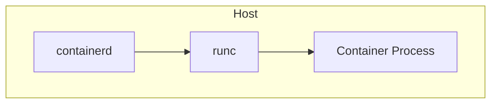
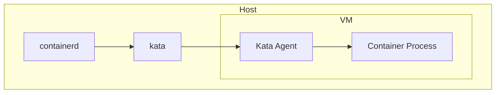

# Kata Containers

Kata Containers is an open source community working to build a secure container runtime with lightweight virtual machines (VM's) that feel and perform like standard Linux containers, but provide stronger workload isolation using hardware virtualization technology as a second layer of defense.

## How it Works

Kata implements the [Open Containers Runtime Specification](https://github.com/opencontainers/runtime-spec). More specifically, it implements a containerd shim that implements the expected interface for managing container lifecycles. The default containerd runtime of `runc` spawns a container like this:



When containerd receives a request to spawn a container, it will pull the container image down and then call out to the runc shim (usually located at `/usr/local/bin/containerd-shim-runc-v2`). runc will then create various process isolation resources like Linux namespaces (networking, PIDs, mounts etc), seccomp filters, Linux capability reductions, and then spawn the process inside of those resources. This process runs in the host kernel.

Kata spawns containers like this:



The container process spawned inside of the VM allows us to isolate the guest kernel from the host system. This is the fundamental principle of how Kata achieves its isolation boundaries.

## Example

When Kata is installed in a system, a number of artifacts are laid down. containerd's config will be modified as such:

```toml title="/etc/containerd/config.toml"
imports = ["/opt/kata/containerd/config.d/kata-deploy.toml"]
```

This file will contain configuration for various flavors of Kata runtimes. We can see the vanilla CPU runtime config here:

```toml title="/opt/kata/containerd/config.d/kata-deploy.toml"
[plugins."io.containerd.cri.v1.runtime".containerd.runtimes.kata-qemu]
runtime_type = "io.containerd.kata-qemu.v2"
runtime_path = "/opt/kata/bin/containerd-shim-kata-v2"
privileged_without_host_devices = true
pod_annotations = ["io.katacontainers.*"]

[plugins."io.containerd.cri.v1.runtime".containerd.runtimes.kata-qemu.options]
ConfigPath = "/opt/kata/share/defaults/kata-containers/configuration-qemu.toml"
```

Because containerd's CRI is aware of the Kata runtimes, we can spawn Kubernetes pods:

```yaml
apiVersion: v1
kind: Pod
metadata:
  name: test
spec:
  runtimeClassName: kata-qemu
  containers:
    - name: test
      image: "quay.io/libpod/ubuntu:latest"
      command: ["/bin/bash", "-c"]
      args: ["echo hello"]
```

We can also spawn a Kata container by submitting a request to containerd like so:

<div class="annotate" markdown>

```sh
$ ctr image pull quay.io/libpod/ubuntu:latest
$ ctr run --runtime "io.containerd.kata.v2" --runtime-config-path /opt/kata/share/defaults/kata-containers/configuration-qemu.toml --rm -t "quay.io/libpod/ubuntu:latest" foo sh
# echo hello
hello
```

</div>

!!! tip

    `ctr` is not aware of the CRI config in `/etc/containerd/config.toml`. This is why you must specify the `--runtime-config-path`. Additionally, the `--runtime` value is converted into a specific binary name which containerd then searches for in its `PATH`. See the [containerd docs](https://github.com/containerd/containerd/blob/release/2.2/core/runtime/v2/README.md#usage) for more details.
