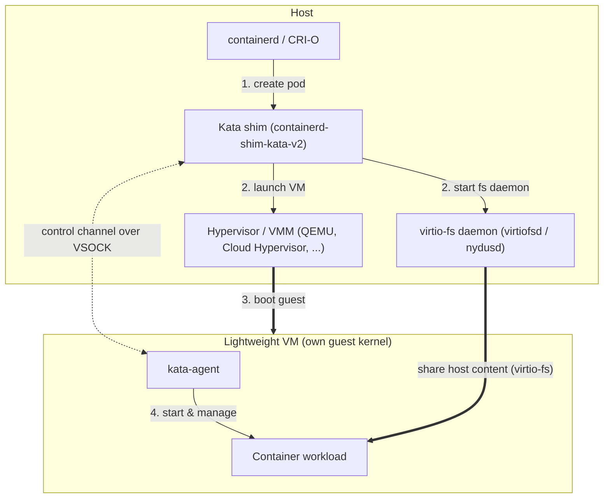

# Kata Containers Quick Start Guide

New to Kata Containers? This guide gives you just enough context and
terminology to understand what the project is, then points you at the fastest
way to install it and try it out. It should take only a few minutes to read.

For full installation instructions (prerequisites, all installation methods,
Docker, building from source, and troubleshooting), see the
[installation guide](installation.md). For a deeper understanding of how
everything fits together, see the [overview](index.md) and the
[architecture documentation](design/architecture_4.0/architecture.md).

## What is Kata Containers?

Kata Containers is an open source runtime that runs each container (or
Kubernetes pod) inside its own lightweight virtual machine (VM). You get a
workflow that feels and performs like standard Linux containers, but with the
stronger workload isolation of hardware virtualization.

With the default `runc` runtime, containers share the host kernel and are
isolated only by Linux primitives such as namespaces, cgroups, and seccomp.
With Kata, each pod runs in a VM with its own guest kernel, adding a second
layer of defense between the workload and the host.

When you schedule a Kata pod, the container manager hands it off to the Kata
shim, which launches a hypervisor to boot a lightweight VM. The container then
runs inside that VM, on its own guest kernel. The container's files (including
its image's root filesystem) are shared into the guest over virtio-fs, typically
served on the host by `virtiofsd` (`nydusd` can act as a virtio-fs daemon
drop-in). The [nydus snapshotter](how-to/how-to-use-virtio-fs-nydus-with-kata.md)
is a separate mechanism for lazy guest-side image pulling:



!!! note
    The diagram shows the shim, VMM, and virtio-fs daemon as separate host
    processes, which is the case for external hypervisors such as QEMU and Cloud
    Hypervisor. With the built-in **Dragonball** VMM, the shim, the VMM, and the
    virtio-fs daemon all run inside a *single* process.

## Why use Kata Containers?

- **Stronger isolation by default.** Each pod runs in its own VM with a
  dedicated guest kernel. A container break-out or guest-kernel exploit is
  contained inside the VM, instead of exposing the host kernel that every other
  workload shares.
- **A building block for running untrusted or multi-tenant workloads.** The
  hardware virtualization boundary is much harder to cross than namespaces and
  cgroups alone, so you can run third-party code or mutually distrusting tenants
  on shared infrastructure with more confidence.
- **Drop-in compatibility.** Kata implements the OCI and CRI shim interface, so
  it works with Kubernetes, containerd, CRI-O, and Docker. You opt in per
  workload via a `RuntimeClass` (or Docker's `--runtime`) — no application
  changes required.
- **Reduced host attack surface and flexibility.** Workloads never talk
  directly to the host kernel, and each guest can run its own kernel version
  and configuration.

!!! warning "Isolation is not multi-tenancy on its own"
    Kata is a *tool* that helps you achieve multi-tenancy — it strengthens
    workload isolation, but it does not on its own guarantee multi-tenancy,
    which also depends on network, storage, and control-plane isolation.

## Why use Kata Containers with a TEE?

Kata can boot its lightweight VMs inside a hardware Trusted Execution
Environment (TEE) — such as Intel TDX, AMD SEV-SNP, or IBM Secure Execution — so
the guest's memory is encrypted and integrity-protected by the CPU. This
protects data *in use*: even a compromised or malicious host, hypervisor, or
cloud operator cannot read or tamper with the workload, and remote attestation
lets you cryptographically verify the environment before secrets are released to
it.

This is the foundation of the [Confidential Containers](https://confidentialcontainers.org/)
project, which builds on Kata Containers. For how to deploy and attest
confidential workloads, see the
[Confidential Containers documentation](https://confidentialcontainers.org/docs/).

## Key terminology

Runtime / shim
:   The `containerd-shim-kata-v2` process that the container manager calls to
    create and manage the VM that backs a pod. Starting with the 4.0 release,
    the default and recommended runtime is
    [`runtime-rs`](https://github.com/kata-containers/kata-containers/blob/main/src/runtime-rs/README.md),
    the Rust implementation.

Agent
:   The `kata-agent` process running *inside* the guest VM, managing the
    container's lifecycle on behalf of the runtime.

Hypervisor
:   The VMM that boots the guest — QEMU, Cloud Hypervisor, Firecracker, or
    the built-in Dragonball. See the [hypervisors document](hypervisors.md).

virtio-fs
:   How Kata shares files (including the container's root filesystem) from the
    host into the guest. Typically served by `virtiofsd`; `nydusd` can
    substitute as the virtio-fs daemon. The
    [nydus snapshotter](how-to/how-to-use-virtio-fs-nydus-with-kata.md) is a
    separate path for lazy guest-side image pulling.

`RuntimeClass`
:   The Kubernetes object that tells the cluster to schedule a pod with Kata.
    Select it per pod with `runtimeClassName` (for example,
    `kata-qemu-runtime-rs`).

`kata-deploy`
:   The recommended installer. It is a DaemonSet that lays down all of the Kata
    binaries and artifacts on each node and wires up the container manager and
    `RuntimeClass` objects for you.

## Try it out

The fastest way to try Kata Containers is the `kata-deploy` Helm chart on a
Kubernetes cluster. The steps below are the condensed happy path; the
[installation guide](installation.md) covers the
[prerequisites](installation.md#prerequisites) (hardware virtualization,
KVM, kernel modules), other installation methods, and verification in full.

!!! tip "Before you start"
    Confirm your host supports hardware virtualization and that `/dev/kvm` is
    available. On `x86_64`, `grep -E -o '(vmx|svm)' /proc/cpuinfo | sort -u`
    should print `vmx` (Intel) or `svm` (AMD).

1. **Install the chart** ([details and options](installation.md#install-on-kubernetes-with-helm-recommended)):

    ```sh
    export VERSION=$(curl -sSL https://api.github.com/repos/kata-containers/kata-containers/releases/latest | jq -r .tag_name)
    export CHART="oci://ghcr.io/kata-containers/kata-deploy-charts/kata-deploy"

    helm install kata-deploy "${CHART}" --version "${VERSION}" --namespace kata-system --create-namespace
    ```

2. **Run a pod** with a Kata `RuntimeClass`:

    ```yaml title="kata-quickstart.yaml"
    apiVersion: v1
    kind: Pod
    metadata:
      name: kata-quickstart
    spec:
      runtimeClassName: kata-qemu-runtime-rs
      containers:
        - name: test
          image: quay.io/libpod/ubuntu:latest
          command: ["uname", "-r"]
    ```

    ```sh
    kubectl apply -f kata-quickstart.yaml
    kubectl logs kata-quickstart
    ```

The kernel version printed is the Kata guest kernel, which is normally
different from the host kernel (`uname -r`) — confirming the workload is
running inside a lightweight VM.

For Docker installs, hypervisor selection, and known differences compared with
the default `runc` runtime, continue with the
[installation guide](installation.md), the [hypervisors](hypervisors.md)
document, and the [Limitations](Limitations.md) page.
