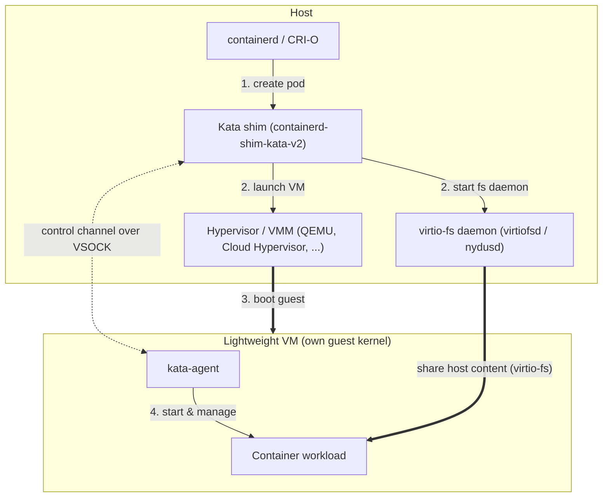

# Kata Containers Quick Start Guide

New to Kata Containers? This guide gives you just enough context and
terminology to understand the project, then points you at the fastest way to
try it.

For full installation steps see the [installation guide](installation.md);
for deeper background see the [overview](index.md) and the
[architecture documentation](design/architecture).

## What is Kata Containers?

Kata Containers is an open source runtime that runs each container (or
Kubernetes pod) inside its own lightweight virtual machine. Unlike `runc`,
where containers share the host kernel and are isolated only by namespaces,
cgroups, and seccomp, each Kata pod gets its own guest kernel — a second layer
of defense between the workload and the host.

When you schedule a Kata pod, the container manager hands it off to the Kata
shim, which launches a hypervisor to boot a VM. The container runs inside that
VM on its own guest kernel. Its files (including the image's root filesystem)
are shared into the guest over virtio-fs, served by a host daemon (`virtiofsd`,
or `nydusd` with the nydus snapshotter):



!!! note
    The diagram shows the shim, VMM, and virtio-fs daemon as separate host
    processes — the case for QEMU and Cloud Hypervisor. With the built-in
    **Dragonball** VMM, all three run inside a *single* process.

## Why use Kata Containers?

- **Stronger isolation by default.** Each pod runs in its own VM with a
  dedicated guest kernel, so a container breakout or guest-kernel exploit stays
  in the VM rather than reaching the kernel shared by every other workload on
  the node.
- **A building block for untrusted or multi-tenant workloads.** The hardware
  virtualization boundary is much harder to cross than namespaces and cgroups
  alone, making it safer to run third-party code or mutually distrusting tenants
  on shared infrastructure.
- **Drop-in compatibility.** Kata implements the OCI and CRI shim interface, so
  it works with Kubernetes, containerd, CRI-O, and Docker. Opt in per workload
  via a `RuntimeClass` (or Docker's `--runtime`) — no application changes.
- **Reduced host attack surface and flexibility.** Workloads never talk
  directly to the host kernel, and each guest can run its own kernel version
  and configuration.

!!! warning "Isolation is not multi-tenancy on its own"
    Kata strengthens workload isolation, but multi-tenancy also depends on
    network, storage, and control-plane isolation.

## Why use Kata Containers with a TEE?

Kata can boot its VMs inside a hardware Trusted Execution Environment (TEE) —
Intel TDX, AMD SEV-SNP, or IBM Secure Execution — so the guest's memory is
encrypted and integrity-protected by the CPU. This protects data *in use*:
even a compromised host, hypervisor, or cloud operator cannot read or tamper
with the workload, and remote attestation lets you cryptographically verify
the environment before secrets are released to it.

This is the foundation of the [Confidential Containers](https://confidentialcontainers.org/)
project. For how to deploy and attest confidential workloads, see its
[documentation](https://confidentialcontainers.org/docs/).

## Key terminology

Runtime / shim
:   The `containerd-shim-kata-v2` process the container manager calls to
    create and manage the VM behind a pod. Since the 4.0 release the default
    and recommended runtime is [`runtime-rs`](../src/runtime-rs/README.md),
    the Rust implementation.

Agent
:   The `kata-agent` process running *inside* the guest VM, managing the
    container's lifecycle on behalf of the runtime.

Hypervisor
:   The VMM that boots the guest — QEMU, Cloud Hypervisor, Firecracker, or
    the built-in Dragonball. See the [hypervisors document](hypervisors.md).

virtio-fs
:   How Kata shares files (including the container's root filesystem) from the
    host into the guest. Served by `virtiofsd`, or `nydusd` with the
    [nydus](how-to/how-to-use-virtio-fs-nydus-with-kata.md) snapshotter for
    lazy image pulling.

`RuntimeClass`
:   The Kubernetes object that tells the cluster to schedule a pod with Kata.
    Select it per pod with `runtimeClassName` (for example,
    `kata-qemu-runtime-rs`).

`kata-deploy`
:   The recommended installer — a DaemonSet that lays down the Kata binaries
    on each node and wires up the container manager and `RuntimeClass`
    objects.

## Try it out

The fastest way to try Kata is the `kata-deploy` Helm chart on a Kubernetes
cluster. The [installation guide](installation.md) covers prerequisites,
other installation methods, and verification in full.

!!! tip "Before you start"
    Confirm your host supports hardware virtualization and that `/dev/kvm` is
    available. On `x86_64`, `grep -E -o '(vmx|svm)' /proc/cpuinfo | sort -u`
    should print `vmx` (Intel) or `svm` (AMD).

1. **Install the chart:**

    ```sh
    export VERSION=$(curl -sSL https://api.github.com/repos/kata-containers/kata-containers/releases/latest | jq -r .tag_name)
    export CHART="oci://ghcr.io/kata-containers/kata-deploy-charts/kata-deploy"

    helm install kata-deploy "${CHART}" --version "${VERSION}" --namespace kata-system --create-namespace
    ```

2. **Run a pod** with a Kata `RuntimeClass`:

    ```yaml title="kata-quickstart.yaml"
    apiVersion: v1
    kind: Pod
    metadata:
      name: kata-quickstart
    spec:
      runtimeClassName: kata-qemu-runtime-rs
      containers:
        - name: test
          image: quay.io/libpod/ubuntu:latest
          command: ["uname", "-r"]
    ```

    ```sh
    kubectl apply -f kata-quickstart.yaml
    kubectl logs kata-quickstart
    ```

The printed kernel version is the Kata guest kernel, normally different from
the host's (`uname -r`) — confirming the workload ran inside a VM.
