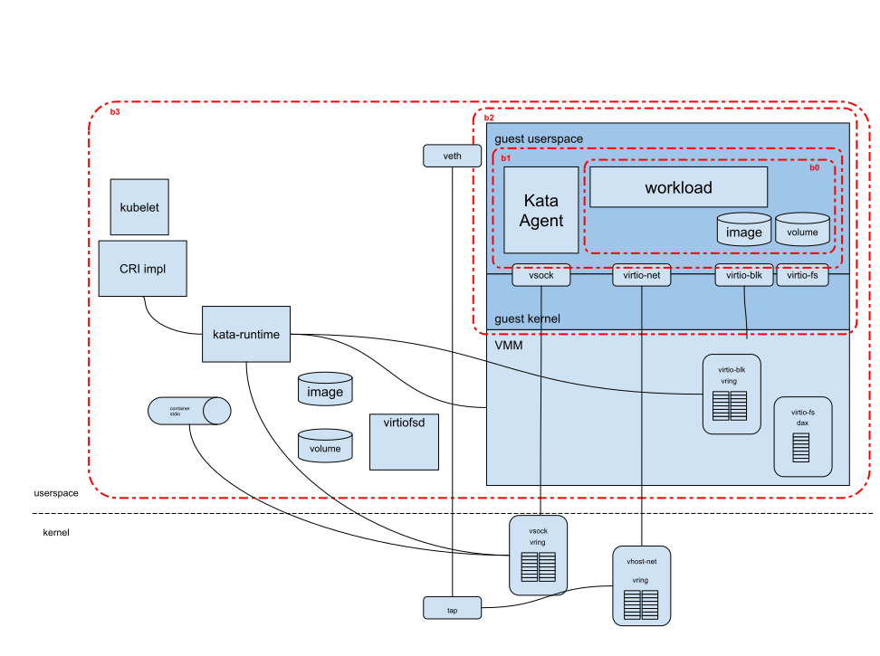

# Kata Containers threat model

This document discusses threat models associated with the Kata Containers
project. Kata was designed to provide additional isolation of container
workloads, protecting the host infrastructure from potentially malicious
container users or workloads. Since Kata Containers adds a level of isolation on
top of traditional containers, the focus is on the additional layer provided,
not on traditional container security.

This document provides a brief background on containers and layered security,
describes the interface to Kata from CRI runtimes, a review of utilized virtual
machine interfaces, and then a review of threats.

## Kata security objective

Kata seeks to prevent an untrusted container workload or user of that container
workload to gain control of, obtain information from, or tamper with the host
infrastructure.

In our scenario, an asset is anything on the host system, or elsewhere in the
cluster infrastructure. The attacker is assumed to be either a malicious user or
the workload itself running within the container. The goal of Kata is to prevent
attacks which would allow any access to the defined assets.

## Background on containers, layered security

Traditional containers leverage several key Linux kernel features to provide
isolation and a view that the container workload is the only entity running on
the host. Key features include `Namespaces`, `cgroups`, `capablities`, `SELinux`
and `seccomp`. The canonical runtime for creating such a container is `runc`. In
the remainder of the document, the term `traditional-container` will be used to
describe a container workload created by runc.

Kata Containers provides a second layer of isolation on top of those provided by
traditional-containers. The hardware virtualization interface is the basis of
this additional layer. Kata launches a lightweight virtual machine, and uses the
guest’s Linux kernel to create a container workload, or workloads in the case of
multi-container pods. In Kubernetes and in the Kata implementation, the sandbox
is carried out at the pod level. In Kata, this sandbox is created using a
virtual machine.

## Interface to Kata Containers: CRI, v2-shim, OCI

A typical Kata Containers deployment uses Kubernetes with a CRI implementation.
On every node, Kubelet will interact with a CRI implementor, which will in turn
interface with an OCI based runtime, such as Kata Containers. Typical CRI
implementors are `cri-o` and `containerd`.

The CRI API, as defined at the Kubernetes [CRI-API
repo](https://github.com/kubernetes/cri-api/), results in a few constructs being
supported by the CRI implementation, and ultimately in the OCI runtime creating
the workloads.

In order to run a container inside of the Kata sandbox, several virtual machine
devices and interfaces are required. Kata translates sandbox and container
definitions to underlying virtualization technologies provided by a set of
virtual machine monitors (VMMs) and hypervisors. These devices and their
underlying implementations are discussed in detail in the following section.

## Interface to the Kata sandbox/virtual machine

In case of Kata, today the devices which we need in the guest are:
 - Storage: In the current design of Kata Containers, we are reliant on the CRI
 implementor to assist in image handling and volume management on the host. As a
 result, we need to support a way of passing to the sandbox the container
 rootfs, volumes requested by the workload, and any other volumes created to
 facilitate sharing of secrets and `configmaps` with the containers. Depending
 on how these are managed, a block based device or file-system sharing is
 required. Kata Containers does this by way of `virtio-blk` and/or `virtio-fs`.
 - Networking: A method for enabling network connectivity with the workload is
 required. Typically this will be done providing a `TAP` device to the VMM, and
 this will be exposed to the guest as a `virtio-net` device. It is feasible to
 pass in a NIC device directly, in which case `VFIO` is leveraged and the device
 itself will be exposed to the guest.
 - Control: In order to interact with the guest agent and retrieve `STDIO` from
 containers, a medium of communication is required. This is available via
 `virtio-vsock`.
 - Devices: `VFIO` is utilized when devices are passed directly to the virtual
   machine and exposed to the container.
- Dynamic Resource Management: `ACPI` is utilized to allow for dynamic VM
 resource management (for example: CPU, memory, device hotplug). This is
 required when containers are resized, or more generally when containers are
 added to a pod. 
 
How these devices are utilized varies depending on the VMM utilized. We clarify
the default settings provided when integrating Kata with the QEMU, Dragonball,
Firecracker and Cloud Hypervisor VMMs in the following sections.

### Virtual Machine Monitor(s)

In a KVM/QEMU (any other VMM utilizing KVM) virtualization setup, all virtual
machines (VMs) share the same host kernel. This shared environment can lead to
scenarios where one VM could potentially impact the performance or stability of
other VMs, including the possibility of a Denial of Service attack.

- Kernel Vulnerabilities: Since all VMs rely on the host's kernel, a
vulnerability in the kernel could be exploited by a process running within one
VM to affect the entire system. This could lead to scenarios where the
compromised VM impacts other VMs or even takes down the host.

- Improper Isolation and Containment: If the virtualization environment is not
correctly configured, processes in one VM might impact other VMs. This could
occur through improper isolation of network traffic, shared file systems, or
other inter-VM communication channels.

- Hypervisor Vulnerabilities: Flaws in the KVM hypervisor or QEMU could be
exploited to cause information disclosure, data tampering, elevation of
privileges, denial of service, and others. Since KVM/QEMU leverages the host
kernel for its operation, any exploit at this level can have widespread impacts.

- Malicious or Flawed Guest Operating Systems: A guest operating system that is
maliciously designed or has serious flaws could engage in activities that
disrupt the normal operation of the host or other guests. This might include
aggressive network activity or interactions with the virtualization stack that
lead to instability.

- Resource Exhaustion: A VM could consume excessive shared resources such as
CPU, memory, or I/O bandwidth, leading to resource starvation for other VMs.
This could be due to misconfiguration, a runaway process, or a deliberate
denial of service attack from a compromised VM.

### Devices

Each virtio device is implemented by a backend, which may execute within
userspace on the host (vhost-user), the VMM itself, or within the host kernel
(vhost). While it may provide enhanced performance, vhost devices are often seen
as higher risk since an exploit would be already running within the kernel
space. While VMM and vhost-user are both in userspace on the host, `vhost-user`
generally allows for the back-end process to require less system calls and
capabilities compared to a full VMM.

#### `virtio-blk` and `virtio-scsi`

The backend for `virtio-blk` and `virtio-scsi` are based in the VMM itself
(ring3 in the context of x86) by default for Cloud Hypervisor, Firecracker and
QEMU. While `vhost` based back-ends are available for QEMU, it is not
recommended. `vhost-user` back-ends are being added for Cloud Hypervisor, they
are not utilized in Kata today.

#### `virtio-fs`

`virtio-fs` is supported in Cloud Hypervisor and QEMU. `virtio-fs`'s interaction
with the host filesystem is done through a vhost-user daemon, `virtiofsd`. The
`virtio-fs` client, running in the guest, will generate requests to access
files. `virtiofsd` will receive requests, open the file, and request the VMM to
`mmap` it into the guest. When DAX is utilized, the guest will access the host's
page cache, avoiding the need for copy and duplication. DAX is still an
experimental feature, and is not enabled by default.

From the `virtiofsd` [documentation](https://gitlab.com/virtio-fs/virtiofsd/-/blob/main/README.md):
```This program must be run as the root user. Upon startup the program will switch into a new file system namespace with the shared directory tree as its root. This prevents “file system escapes” due to symlinks and other file system objects that might lead to files outside the shared directory. The program also sandboxes itself using seccomp(2) to prevent ptrace(2) and other vectors that could allow an attacker to compromise the system after gaining control of the virtiofsd process.```

DAX-less support for `virtio-fs` is available as of the 5.4 Linux kernel. QEMU
VMM supports virtio-fs as of v4.2. Cloud Hypervisor supports `virtio-fs`.

#### `virtio-net`

`virtio-net` has many options, depending on the VMM and Kata configurations.

##### QEMU networking

While QEMU has options for `vhost`, `virtio-net` and `vhost-user`, the
`virtio-net` backend for Kata defaults to `vhost-net` for performance reasons.
The default configuration is being reevaluated.

##### Firecracker networking

For Firecracker, the `virtio-net` backend is within Firecracker's VMM.

##### Cloud Hypervisor networking

For Cloud Hypervisor, the current backend default is within the VMM.
`vhost-user-net` support is being added (written in rust, Cloud Hypervisor
specific).

##### Dragonball networking

For Dragonball, the `virtio-net` backend default is within Dragonbasll's VMM.


#### virtio-vsock

##### QEMU vsock

In QEMU, vsock is backed by `vhost_vsock`, which runs within the kernel itself.

##### Dragonball, Firecracker and Cloud Hypervisor

In Dragonball, Firecracker and Cloud Hypervisor, vsock is backed by a unix-domain-socket in
the hosts userspace.

#### VFIO

Utilizing VFIO, devices can be passed through to the virtual machine. Exposure
to the host is limited to gaps in device pass-through handling. This is
supported in QEMU and Cloud Hypervisor, but not Firecracker.

- Device Isolation Failure: One of the primary risks associated with VFIO is the
failure to isolate the physical device. If a VM can affect the operation of the
physical device in a way that impacts other VMs or the host system, it could
lead to security breaches or system instability.

- DMA Attacks: Direct Memory Access (DMA) attacks are a significant concern with
VFIO. Since the device has direct access to the system's memory, there's a risk
that a compromised VM could use its assigned device to read or write memory
outside of its allocated space, potentially accessing sensitive information or
affecting the host or other VMs.

- Firmware Vulnerabilities: Devices attached via VFIO rely on their firmware,
which can have vulnerabilities. A compromised device firmware could be exploited
to gain unauthorized access or to disrupt the system. Resource Starvation:
Improperly managed, a VM with direct access to hardware resources could
monopolize those resources, leading to performance degradation or denial of
service for other VMs or the host system.

- Escalation of Privileges: If a VM with VFIO access is compromised, it could
potentially be used to gain higher privileges than intended, especially if the
I/O devices have capabilities that are not adequately controlled or monitored.

- Improper Configuration and Management: Human errors in configuring VFIO, such
as incorrect group or user permissions, can expose the system to risks.
Additionally, inadequate monitoring and management of the VMs and their devices
can lead to security lapses.

- Software Vulnerabilities: Like any software, the components of VFIO (like the
kernel modules, device drivers, and management tools) can have vulnerabilities
that might be exploited by an attacker to compromise the security of the system.
Inter-VM Interference and Side-Channel Attacks: Even with device assignment,
there could be side-channel attacks where an attacker VM infers sensitive
information from the physical device's behavior or through shared resources like
cache.

#### ACPI (Dragonball uses Upcall)

ACPI is necessary for hotplugging of CPU, memory and devices. ACPI is available
in QEMU and Cloud Hypervisor. Device, CPU and memory hotplug are not available
in Firecracker.

- Hypervisor Vulnerabilities: In virtualized environments, the hypervisor
manages ACPI calls for virtual machines (VMs). If the hypervisor has
vulnerabilities in handling ACPI requests, it could lead to escalated privileges
or other security breaches.

- VM Escape: A sophisticated attack could exploit ACPI functionality to achieve
a VM escape, where malicious code in a VM breaks out to the host system or other
VMs. Firmware Attacks in a Virtualized Context: Similar to physical
environments, firmware-based attacks (including those targeting ACPI) in
virtualized systems can be persistent and difficult to detect. In a virtualized
environment, such attacks might not only compromise the host system but also all
the VMs running on it.

- Resource Starvation Attacks: ACPI functionality could be exploited to
manipulate power management features, causing denial of service through
resource starvation. For example, an attacker could force a VM into a low-power
state, degrading its performance or availability.

- Compromised VMs Affecting Host ACPI Settings: If a VM is compromised, it might
be used to alter ACPI settings on the host, affecting all VMs on that host. This
could lead to various impacts, from performance degradation to system
instability.

- Supply Chain Risks: As with non-virtualized environments, the firmware,
including ACPI firmware used in virtualized environments, could be compromised
during the supply chain process, leading to vulnerabilities that affect all VMs
running on the hardware.


## Devices and threat model


