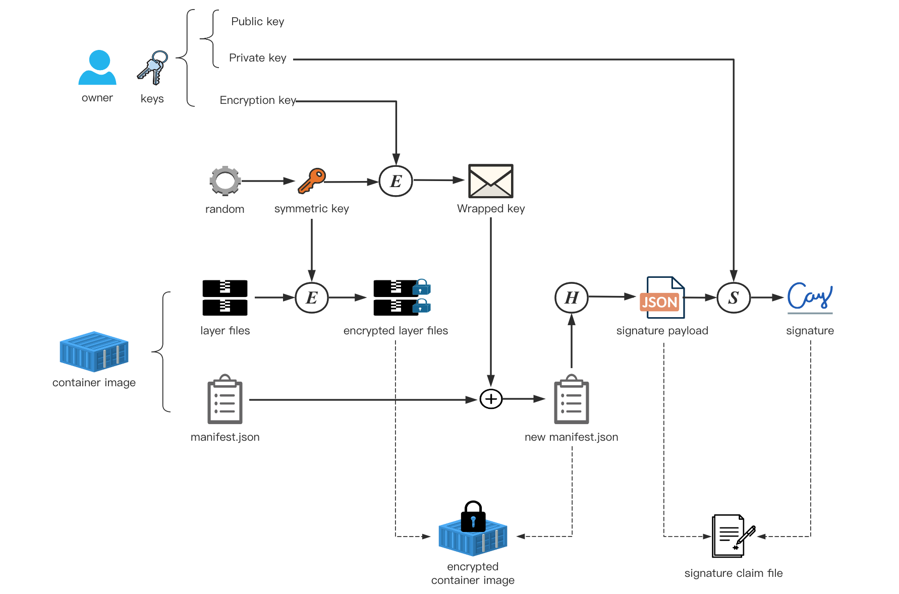

# CCv1 Image Security Design

## Backgrounds

- [CC Security Solution Explained #1](https://github.com/confidential-containers/documentation/issues/18)
- [Confidential Containers Trust Model](https://github.com/magowan/documentation/blob/TrustModel/TrustModel.md)
- [Confidential Containers Threat Model](https://github.com/magowan/documentation/blob/ThreatModel/ThreatModel.md)

## Components

- image encryption and signing tools, such as [`skopeo`](https://github.com/containers/skopeo)
- [`image-rs`](https://github.com/confidential-containers/image-rs)
- [`ocicrypt-rs`](https://github.com/containers/ocicrypt-rs)
- [`attestation-agent`](https://github.com/confidential-containers/`attestation-agent`)
- Key Broker Service ([KBS](https://github.com/confidential-containers/`attestation-agent`/blob/main/docs/IMPLEMENTATION.md#kbs) for short) such as [`Verdictd`](https://github.com/alibaba/inclavare-containers/tree/master/verdictd)

# Production of protected container image

The so-called "protected container image" refers to the container image encrypted and signed by the owner.

**Note**:
- the encryption process must be carried out before the signing process,
in other words, when an image is encrypted and signed,
the signed object is actually the encrypted container image.
- Ideally the image creation, encryption and signing need to happen "atomically" and each steps progresses immediately after the previous step.
(if not so, there is a large window of opportunity for someone to potentially modify the image)

Container image encryption/decryption and signing are currently [under development](https://github.com/opencontainers/image-spec/pull/775).
For encryption/decryption, we will rely on the Rust implementation of [`ocicrypt`](https://github.com/containers/ocicrypt), [`ocicrypt-rs`](https://github.com/containers/ocicrypt-rs),
which itself is supposed to be compatible with `ocicrypt`.
For signing, we will rely on the standard [image library](https://github.com/containers/image) or aim to be compatible with it.

An overview of encrypting and signing a container image is as follows:



On the owner side, the key used for encryption and the private key used for signature may be the same key,
depending on what strategy the owner adopts to manage his keys, which is not the focus of this document.

## Image encryption

Image encryption is based on layer granularity.

### Steps

The steps of encrypting an image layer is as follows:

1. Dynamically generate a random symmetric key.

2. Encrypt container image layer with symmetric key.

3. Encrypt the symmetric key with the owner's key.

4. Write the symmetric key encrypted by the owner's key into the container image manifest
as the content of the annotation of the container image layer.

The owner can use any custom image encryption tool to implement the above process
(such as [`skopeo`](https://github.com/containers/skopeo) integrated with [`ocicrypt`](https://github.com/containers/ocicrypt)),
as long as the tool meets the implementation specs described below.

### Implementation specs

#### initialization

After dynamically generating the random symmetric key and encrypting the image layer,
two special JSON structures need to be generated, One is used to record public encrypted information
(such as encryption algorithm),
which is called [`PublicLayerBlockCipherOptions`](https://github.com/opencontainers/image-spec/pull/775/commits/bc0fcd698946be7e8bb1fa88f178ed2c66274aa2#diff-ecf63e7090e873922f62c4749c01f63f7eccd42912c1465fbee515cb7c4916c1R362), and the other is used to record secret information
(such as symmetric key used for encryption), which is called [`PrivateLayerBlockCipherOptions`](https://github.com/opencontainers/image-spec/pull/775/commits/bc0fcd698946be7e8bb1fa88f178ed2c66274aa2#diff-ecf63e7090e873922f62c4749c01f63f7eccd42912c1465fbee515cb7c4916c1R362).
The example are as follows:

- `PublicLayerBlockCipherOptions`:

  ```json
  {
      "cipher": "AES_256_CTR_HMAC_SHA256",
      "hmac": “M0M5OTA5QUZFQzI1MzU0RDU1MURBR…”
      "cipheroptions": {}
  }
  ```

- `PrivateLayerBlockCipherOptions`:

  ```json
  {
      "symkey": "54kiln1USEaKnlYhKdz+aA==",
      "cipheroptions": {
          "nonce": "AdcRPTAEhXx6uwuYcOquNA=="
      }
  }
  ```

#### Key Wrapping

The `PrivateLayerBlockCipherOptions` needs to be encrypted through the [key provider protocol](https://github.com/containers/ocicrypt/blob/main/docs/keyprovider.md) with a "key provider program",
this action is usually called "Key Wrapping".
The key provider program here also allows the owner to customize the implementation,
as long as it meets the implementation specs described here.

The key provider program should encrypt the `PrivateLayerBlockCipherOptions` with the owner's key.
After that, it should Base64 encode the encrypted `PrivateLayerBlockCipherOptions` and then package it into a owner customized JSON structure.
In the confidential container design, this JSON structure is called "annotation packet", it record some additional information,
such as the ID of the owner's key, for example:

```
{
    "key_id":"1234",
    "wrapped_data":#base64encode(Enc(PrivateLayerBlockCipherOptions)),
    "wrap_type":"",
}
```

The specific format of the annotation packet can be determined by the customized key provider program used by the owner,
but it is necessary to ensure that the key provider program used by the decryptor
(i.e. the `attestation-agent` integrated with the specified [Key Broker Client](https://github.com/confidential-containers/`attestation-agent`/blob/main/docs/IMPLEMENTATION.md#kbc))
supports parsing annotation packets of the same format.
(In CCv1, when decrypting the image, the decryption of `PrivateLayerBlockCipherOptions` will be carried out by `ocicrypt-rs` through the [key provider protocol with the `attestation-agent`](https://github.com/confidential-containers/attestation-agent/blob/main/docs/IMPLEMENTATION.md#keyprovider-protocol) (as a key provider program).)

#### Update manifest

The container image manifest provides two new [annotations](https://github.com/opencontainers/image-spec/blob/main/annotations.md)
to record the encrypted information and the wrapped symmetric key of one layer:

- [`org.opencontainers.image.enc.pubopts`](https://github.com/opencontainers/image-spec/pull/775/commits/bc0fcd698946be7e8bb1fa88f178ed2c66274aa2#diff-72e9137f36414ba79825f6da71afcba1c6dbf72a1f35686e12e6b07d9914066dR55): record base64-encoded `PublicLayerBlockCipherOptions`.

- [`org.opencontainers.image.enc.keys.[key_protocol]`](https://github.com/opencontainers/image-spec/pull/775/commits/bc0fcd698946be7e8bb1fa88f178ed2c66274aa2#diff-72e9137f36414ba79825f6da71afcba1c6dbf72a1f35686e12e6b07d9914066dR52): record annotation packet. In CC V1 design, `[key_protocol]` is specified as `provider.attestation-agent`.

Then, add the ["+encrypted" suffix](https://github.com/opencontainers/image-spec/pull/775/commits/bc0fcd698946be7e8bb1fa88f178ed2c66274aa2#diff-ecf63e7090e873922f62c4749c01f63f7eccd42912c1465fbee515cb7c4916c1R7) to the `mediaType` field of this layer.

For example, the `manifest.json` of a container image with only one layer (and this layer is encrypted) is as follows,
From its `layers` field, we can see the changes we stated above.

```json
{
    "schemaVersion": 2,
    "config": {
        "mediaType": "application/vnd.oci.image.config.v1+json",
        "digest": "sha256:ef87d9f0...",
        "size": 1510
    },
    "layers": [
        {
            "mediaType": "application/vnd.oci.image.layer.v1.tar+gzip+encrypted",
            "digest": "sha256:f69ae40...",
            "size": 204812,
            "annotations": {
                "org.opencontainers.image.enc.pubopts": "eyJjaXBoZXIiOi...",
                "org.opencontainers.image.enc.keys.provider.attestation-agent": "eyJwcm9..."
            }
        }
    ]
}
```

## Image signing

There are multiple image signing and verification protocols/solutions in the field.

The signing scheme is specified by `type` field by the owner of the image
security [policy file](https://github.com/confidential-containers/image-rs/blob/main/docs/ccv1_image_security_design.md#policy) distributed to image-rs.

When verifying the signature, image-rs can select the appropriate scheme for signature verification according to this field.

In CC V1, we start by supporting the [Red Hat simple signing format](https://www.redhat.com/en/blog/container-image-signing).
This is a simple and direct signature system,
which uses the key of OpenPGP([RFC 4880](https://datatracker.ietf.org/doc/html/rfc4880#section-5.4))
and a simple signature [payload format](https://github.com/containers/image/blob/main/docs/containers-signature.5.md).

In the future, confidential containers will gradually support a variety of image signature schemes.
The differences between these schemes are as follows:

1. Signature payload format.

2. Signature algorithm.

3. Signature storage and signature distribution.

We make modular design for the above three during signature verification,
and select the appropriate signature verification method according to the configuration of policy.

## Image distribution

After the encryption and signing are completed, we obtain two products:
the encrypted container image itself and the signature.
In the design of CC V1, the distribution schemes of the two are as follows:

- container image:
  - When using the protected boot image scheme,
the container image can be directly placed in the rootfs of boot image or pushed to a remote registry;
  - When using the unprotected boot image scheme,
the owner must push the container image to the remote registry.

- signature:
  - If image is pushed to a remote registry:
Stored in different places according to the different signature schemes used.
  - If image is placed in the boot image rootfs:
Store it in the specified `sigstore` (a customized local Dir in boot image rootfs).


# Deployment of protected container image

In the confidential container V1 design, security functions will be performed when `image-rs` pulls the container image,
including checking the registry allow list, verifying the container image signature (if needed),
and decrypting the container image layers.
The steps are as follows:

1. Obtain the policy set matching the image from the `policy.json` file.
   - If it is rejected, the pull action will be terminated directly;
   - If it is unconditional acceptance, skip the second and third steps;
   - If it is a signature verification requirement, proceed to the following steps

2. (if signature verification is needed in policy) Get the signature of the container image.

3. (if signature verification is needed in policy) Verify the signature of the container image according to the configuration of the policy.

4. Pull the container image layer by layer. If an encrypted container image layer is encrypted, decrypt it.

After the image is pulled, the subsequent deployment process is consistent with that of the normal container image.

## Policy

The policy file here comes from the signature verification [policy configuration file](https://github.com/containers/image/blob/main/docs/containers-policy.json.5.md)
introduced in the implementation of Red Hat simple signing in the [containers/image](https://github.com/containers/image) project.
This policy file can not only be used for Red Hat simple signing, in the confidential container design,
we will continue to customize and expand the content of the policy file as
a general signature verification configuration file compatible with different signature schemes.

Its main functions are as follows:

- Declare a allow list of container images with "transport-scope" granularity

- Declare the signature scheme used to verify the signature of various images

- (Optional) Specify the public key (path, data, ID, ...) which should to be used when verifying the image signature

At present, the following two types of transport is supported in confidential containers:

- `docker`: used to match the image in the container registry that implements the docker registry HTTP API V2 protocol.

- `dir`: used to match images located in the local file system.

In the V1 design of the confidential containers, a safe and reasonable `policy.json` file may look like the following example:

```json
{
    "default": [{"type": "reject"}],
    "transports": {
        "docker": {
            "docker.io/my_private_registry": [
                {
                    "type": "signedBy",
                    "keyType": "GPGKeys",
                    "keyData": "<public Key>",
                }
            ],
            "registry.access.redhat.com": [
                {
                    "type": "signedBy",
                    "keyType": "GPGKeys",
                    "keyPath": "/etc/pki/rpm-gpg/RPM-GPG-KEY-redhat-release",
                }
            ],
        },
        "dir": {
            "": [{"type": "insecureAcceptAnything"}]
        }
    }
}
```

Before pulling the container image layers,
match the policy in the following order according to the [container image reference](https://github.com/containers/image/blob/main/docker/reference/reference.go):

- Match single specific scopes under each member in `transport`, for example:
  - For the image from the container registry that implements the Docker Registry HTTP API V2 protocol,
  match each scope under the `docker` member;
  - For the image from local file system, match each scope under the `dir` member;
- Match the default scope under the member in the transport. for example, the `""` scope of the transport `dir`.
- Match the global default scope, such as the `default` field in the first line of the above example.

After the matching is successful, the policy set under the corresponding scope is executed, as described in
[Policy Requirements](https://github.com/containers/image/blob/main/docs/containers-policy.json.5.md#policy-requirements),

In order to flexibly support different signature schemes, we will check the field `type` to see whether it is a
signing scheme, as what [Policy Requirements](https://github.com/containers/image/blob/main/docs/containers-policy.json.5.md#policy-requirements)
does.

Currently, the values of `type` showing signature verification should be involved is:

- `signedBy`: Red Hat simple signing scheme.

In the future, more signature schemes will be supported, and this field will have more allowed values.

For the example of the policy file given above, the meaning of it is as follows:

1. For images from the local file system, they are allowed to pull and run no matter there is a valid signature or not.

2. For images from the `docker.io/my_private_registry` registry,
there must exist at least one signature under simple signing scheme that can be verified by the keys in `keyData`.

3. For images from the `registry.access.redhat.com`,
there must exist at least one signature under simple signing scheme that can be verified by the keys in `/etc/pki/rpm-gpg/RPM-GPG-KEY-redhat-release`.

4. Reject all other images.

The above example provides a secure and robust policy configuration,
but the policy file still provides sufficient configuration flexibility for weak security requirements.
For example, if the owner needs to completely disable the container image signature verification function
(for example, the owner thinks that encryption alone is enough to meet his security requirements),
policy file can be:

```json
{
  "default": [
    {
      "type": "insecureAcceptAnything"
    }
  ],
}
```

**Warning**: this configuration will make the pod accept all unsigned container images.

If the owner want to unconditionally accept an image from a specific registry,
he just need to change the policy of the member matching the registry under the corresponding scope to `insecureAcceptAnything`.

## Signatures verification

### Get signatures

Different signature schemes generally use different signature storage locations.
When image-rs need to verify the signature, it first need to obtain the signature of the image.
The storage location may be:

1. Local file system.

2. Container registry.

3. Customized remote server. Such as a http/https web server.

4. Image metadata.

### Verification steps

A single signature's verification action is divided into the following steps:

1. Get and parse the signature blob.

2. Read the `policy.json`'s policy, select the scheme to use when verifying the signature according to the `type` field.

3. Get public key.

3. Use the public key to verify the cryptographic signature.

4. Compare whether the infomation in the signature payload is consistend with the actual infomation of the image.

## Image layer decryption

After verifying the container image signature, `image-rs` will start the actual image pulling.
for each encrypted image layer,
image-rs calls the container image cryptography operation APIs provided by `ocicrypt-rs`
to decrypt the encrypted image layer. `ocicrypt-rs` perform the following steps:

1. Read the annotations of this layer in the image manifest.
The `org.opencontainers.image.enc.keys.provider.attestation` field is the "annotation packet" mentioned above,
which contains `PrivateLayerBlockCipherOptions` encrypted by the owner's encryption key.
2. Call the key provider gRPC service provided by the `attestation-agent`
and sends the annotation packet to the `attestation-agent`.
3. The `attestation-agent` performs remote attestation to the relying KBS deployed by the owner.
After attestation, it interacts with KBS through the encrypted channel,
and decrypts the `PrivateLayerBlockCipherOptions` using the owner's decryption key in the KBS.
4. Obtain the decrypted `PrivateLayerBlockCipherOptions` from the `attestation-agent`,
reads the symmetric key used to decrypt the container image layer from it, then completes the decryption.

# Attestation Agent

The [`attestation-agent`](https://github.com/confidential-containers/`attestation-agent`) is an indispensable core component in the confidential containers architecture.
It undertakes the trust distribution function of the confidential container.
In the process of signature verification and decryption of the protected image,
the `attestation-agent` serves as the source of the owner's confidential information,
and a key provider program of `ocicrypt-rs`: it helps `ocicrypt-rs` to decrypt the `PrivateLayerBlockCipherOptions`.

`attestation-agent` provides two gRPC services at present: `GetResource` and `KeyProvider`.

The `GetResource` gRPC service is for image-rs supporting the signature verification functions,
As stated earlier in this document, four necessary materials are required to verify the signature of the container image:
policy file, `sigstore` configuration file, public key ring (can be included in the `keyData` field of the policy file) and signature itself.
Depending on the owner's different configurations of the pod,
these materials may be dynamically distributed remotely at runtime,
or these materials cached in the pod may be updated regularly,
the get resource API of the attention agent provides a reliable distribution way for the remote acquisition of these materials.

The `KeyProvider` gRPC service is for `ocicrypt-rs` to support the image layer decryption.
Through this service, the `attestation-agent` can serve `ocicrypt-rs` as a key provider program.

### Get-Resource service

The `GetResource` gRPC service interface provided by the attestation agent
is used to obtain various confidential resources from the relying party (KBS).
In the process of protected image deployment,
it is usually used to obtain `policy.json` config file.

Attestation-agent performs attestation to the KBS,
establish an encrypted channel after negotiating the key,
and download the required confidential resources through the encrypted channel.
The `GetResource` gRPC service interface `protobuf` is defined as follows:

```protobuf
message getResourceRequest {
    string KbcName = 1;
    string KbsUri = 2;
    string ResourceDescription = 3;
}

message getResourceResponse {
    bytes resource = 1;
}

service GetResource {
    rpc GetResource(getResourceRequest) returns (getResourceResponse) {};
}
```

`ResourceDescription` is a JSON string used to describe resources, and its format is defined as follows:

```json
{
    "name":"resource_name",
    "optional":{}
}
```

`optional` is a reserved key value pair JSON string.
It can be used to pass some additional description information when requesting resources in the future.
Its key words and values can be customized by the caller.
It only needs to ensure that the KBC specified in the evaluation agent can be parsed.

### Key-Provider service

The key provider gRPC interface provided by the `attestation-agent`
is used to decrypt `PrivateLayerBlockCipherOptions` for `ocicrypt-rs`.
The `protobuf` of this gRPC service is defined as follows:

```protobuf
message keyProviderKeyWrapProtocolInput {
    bytes KeyProviderKeyWrapProtocolInput = 1;
}

message keyProviderKeyWrapProtocolOutput {
    bytes KeyProviderKeyWrapProtocolOutput = 1;
}

service KeyProviderService {
    rpc UnWrapKey(keyProviderKeyWrapProtocolInput) returns (keyProviderKeyWrapProtocolOutput) {};
}
```

The input JSON string format is:

```json
{
    "op":"keyunwrap",
    "keyunwrapparams":{
        "dc":{
            "Parameters":{
                "`attestation-agent`":[
                    "KBC_NAME::KBS_URI <base64encode>"
                ],
                "DecryptConfig":{"Parameters":{}}
            }
        }
    },
    "annotation": #annotation-packet,
}
```

The output JSON string format is:

```json
{
    "keyunwrapresults": {
        "optsdata": #PrivateLayerBlockCipherOptions,
    }
}
```
