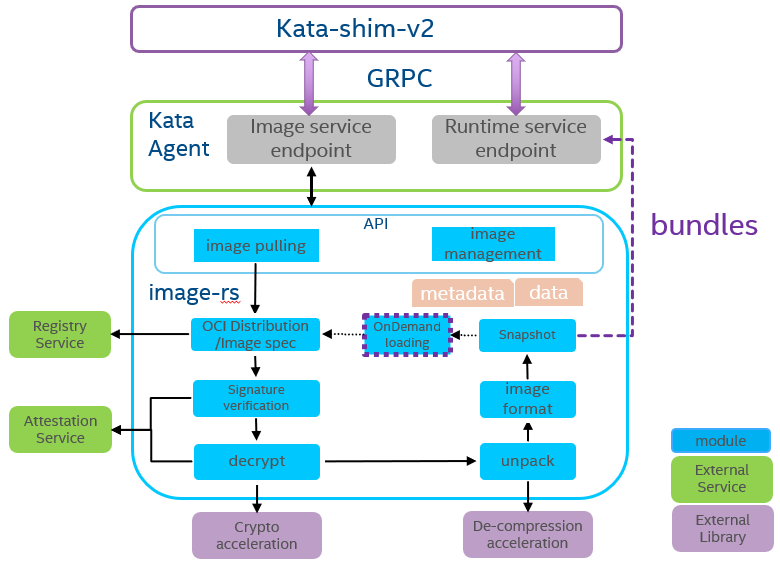

# Design and architecture

## Authors
 * [Arron Wang](https://github.com/arronwy)
 * [Jiang Liu](https://github.com/jiangliu)

## Design
The `image-rs` crate is a rustified and tailored version of [containers/image](https://github.com/containers/image),
to provide a small, simple, secure, lightweight and high performance OCI container image management library.
The crate development is driven by the [Confidential Containers](https://github.com/confidential-containers)
project scope but it might be used in a more generic fashion.

Currently the `image-rs` crate focuses on usage scenarios to run Confidential Containers on Kubernetes clusters with
[Kata Containers](https://katacontainers.io/). It may also be enhanced to support other Confidential container runtimes
on demand. So it implements the
[CRI Image Service](https://github.com/kubernetes/cri-api/blob/master/pkg/apis/runtime/v1alpha2/api.proto#L119)
interface to be easily integrated with the K8s ecosystem. Among the container image `Build`, `Ship` and `Run` stages,
it focuses on the `Run` stage instead of `Build` and `Ship`. `Run` stage will mostly cover `Pull` and `Unpack`
operations, which will provide interfaces to prepare container images for running in a confidential environment.
Users may use any OCI image/distribution spec compatible tools to build and distribute
encrypted/plaintext container images with or without signatures.

The `image-rs` crate supports both unencrypted and encrypted container images since
[Encrypted Container Image](https://github.com/opencontainers/artifacts/pull/15)
is mandatory for many confidential container usage scenarios. It also supports image signature verification to ensure
integrity. Depending on the threat modeling of confidential containers, it should be configurable for which types of
images are supported. The policy may like below, currently we support image level signature and layer level encryption,
whether need per-layer signature support is still TBD:

 1. encrypted with signature, mandatory
 2. encrypted without signature, mandatory
 3. unencrypted with signature, configurable and should be enabled
 4. unencrypted without signature, configurable and may be disabled

### Goals
 * Support pulling OCI/docker v2 images from registries with or without authentication
 * Support downloading OCI images from local [OCI layout compatiable](https://github.com/opencontainers/image-spec/blob/main/image-layout.md) storage
 * Support OCI image decryption
 * Support OCI image signature verification
 * Support configurable security policies for allowed OCI images
 * Support seamlessly integration with Kata Agent and Attestation Agent
 * Provide a command-line utility for debug
 * Explore image decryption and decompression acceleration technologies
 * Explore image on demand loading technologies
 * Explore technologies to share image data among containers/pods with confidentiality and integrity.

### Non-Goals
 * Image push, content discovery/management operations for remote registries
 * Image encryption and signing
 * Image export to local storage
 * Image import from other service daemon or other local storage format

### Existing Solutions
 * [containers-image-proxy-rs](https://github.com/containers/containers-image-proxy-rs): a rust bindings for skopeo,
   which doesn't meet our requirements of small TCB and lightweight.
 * [oci-distribution](https://github.com/krustlet/oci-distribution): a crate from
   [krustlet](https://github.com/krustlet/krustlet) to run wasm application with K8S. Since wasm is platform agnostic
   and small code size, `oci-distribution` does not support manifest lists for different platforms and internal data
   struct is not friend to generic container workload.
 * [oci-registry-client](https://github.com/ecarrara/oci-registry-client): a very simple client for OCI image registries
   with limited features and latest commit is one and half years ago.

These projects focus on image distribution and do not support image unpack and storage management features.

## Architecture
The following diagram demonstrates the overall architecture and how to
integrate with Kata Agent:

Diagram source file: [architecture.pptx](images/architecture.pptx)

The `image-rs` crate provides an API that covers the container image pulling and management parts of the OCI specification.

For image pulling part, it will follow OCI distribution and image spec to
interact with remote registries to download container image metadata
and blob data, these info will be consumed by the image management module.
After container image is downloaded, `image-rs` will talk with remote
attestation service to verify the image signature and decrypt the image
if needed. After image is unpacked, for support image caching inside the guest,
the image format module can handle the format conversion between oci v1 and docker v2.

The image pulling module cooperates with the
[Attestation-agent](https://github.com/confidential-containers/attestation-agent)
to fetch secrets for decryption/verification from the remote attestation and key management server.

Snapshot module will prepare the rootfs together with the container
configuration and metadata, the bundles can be generated for the
runtime service to consume. The snapshot module can also support different
snapshotters which can support image on demand pulling.

As container image layers decryption and decompression can be time consuming,
image-rs will support different acceleration libraries to accelerate these process
like Intel storage acceleration library:
[isa-l](https://github.com/intel/isa-l)
[isa-l_crypto](https://github.com/intel/isa-l_crypto).

## Reference
 * [Nydus Image Service](https://github.com/dragonflyoss/image-service) for data on demand loading, data deduplication and encryption.
 * [stargz](https://github.com/containerd/stargz-snapshotter) for data on demand loading.
