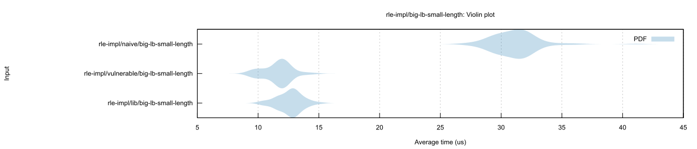
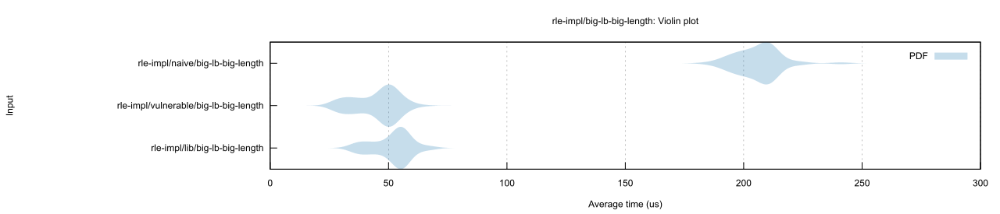

# rle-decode-fast

**THE** fastest way to implement any kind of decoding for **R**un **L**ength **E**ncoded data in Rust.

Writing a fast decoder that is also safe can be quite challenging, so this crate is here to save you the
hassle of maintaining and testing your own implementation.

## Usage

Of course, you need to depend on this crate:
```toml
rle-decode-fast = "1.0"
```

There is only a single function to use, `rle_decode<T>(&mut Vec<T>, lookbehind_size: usize, fill_length: usize)`. 
It takes :
* a vector to modify, 
* the number of items to copy from said vector (basically `vector[(vector.len() - lookbehind)..])`
* the number of items to append.
Afterwards the vector will contain an extra `fill_length` items.
```rust
use rle_decode_fast::rle_decode;

let mut decode_buffer = vec![0, 0, 1, 1, 0, 2, 3];
let lookbehind_length = 4;
let output_length = 10;
rle_decode(&mut decode_buffer, lookbehind_length, output_length);
assert_eq!(decode_buffer, [0, 0, 1, 1, 0, 2, 3, 1, 0, 2, 3, 1, 0, 2, 3, 1, 0]);
```

### Panics
There are cases where the decode functions panics
* The lookbehind length is 0
* The lookbehind length is bigger than the Vec's length
* The output length + Vec's length would overflow

## Background
The idea for this crate first originated from [this pre-RFC](https://internals.rust-lang.org/t/pre-rfc-fixed-capacity-view-of-vec/8413).
It brought to attention a weak-point in the standard library, which lead some crates writing their own unsafe by-pass.

During the exploration happening in the pre-RFC, some experimentation was conducted. For examples see [here](https://github.com/WanzenBug/rust-fixed-capacity-vec) and [here](https://docs.rs/buffer/0.1.8/buffer/).

## Some Stats
There is a benchmark comparing a naive (repeated push) implementation, a vulnerable implementation that might lead to
uninitialized memory and this crate.

The results for a very small fill length

and for a bigger fill lengths


## License

Licensed under either of

 * Apache License, Version 2.0
   [LICENSE-APACHE](LICENSE-APACHE)
 * MIT license
   [LICENSE-MIT](LICENSE-MIT)

at your option.

## Contribution

Unless you explicitly state otherwise, any contribution intentionally submitted
for inclusion in the work by you, as defined in the Apache-2.0 license, shall be
dual licensed as above, without any additional terms or conditions.
