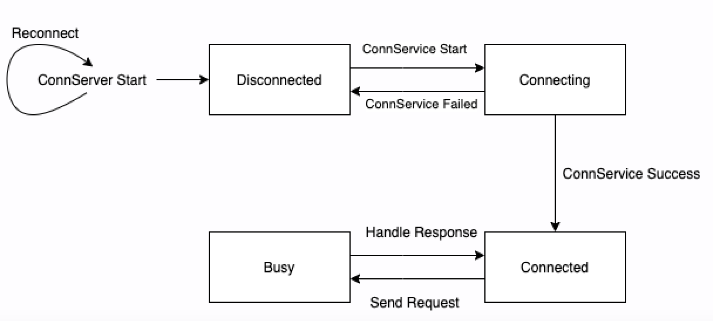

# dbs-upcall

`dbs-upcall` is a direct communication tool between VMM and guest developed upon VSOCK. The server side of the upcall is a driver in guest kernel (kernel patches are needed for this feature) and it'll start to serve the requests after the kernel starts. And the client side is in VMM , it'll be a thread that communicates with VSOCK through UDS.

We have accomplished device hotplug / hot-unplug directly through upcall in order to avoid virtualization of ACPI to minimize virtual machines overhead. And there could be many other usage through this direct communication channel. 

## Design

### Server Design

The server side of upcall is a driver in guest kernel and the VSOCK port is 0xDB.
After the VSOCK is connected, upcall related service will be registered and a kernel thread providing corresponding service will be created.
The upcall service thread will first send a message with message type Connect to try to connect with the client side (VMM). After service successfully connects, the service thread will get into a loop for continuously receiving requests from the client side and processing the requests until the service stops.

The service we currently support:
1. device manager : supports CPU hotplug / hot-unplug, virtio-mmio devices hotplug / hot-unplug

### Client Design
The client side is in VMM and we abstract related logic into this crate `dbs-upcall`.

The upcall state machine for the client side:

The client side's workflow:
1. [Current State: `WaitingServer`] Check the connection with VSOCK server.
2. [Current State: `WaitingService`]Check the connection with upcall server side in the guest kernel for message type Connect and magic version.
3. [Current State: `ServiceConnected`] The request could be sent through upcall in this state.

If step 1 and 2 failed, upcall will try to reconnect.
If request is sent in step 3, upcall state will change to `ServiceBusy` and upcall will not process other requests in this state.

### Message Design
There are two parts for the upcall request message : message header and message load.
And there are three parts for the upcall reply message: message header, result and message load.

Message Header contains following information and it remains the same for the request and the reply : 
1. magic_version(u32): magic version for identifying upcall and the service type
2. msg_size(u32): size of the message load
3. msg_type(u32): type for the message to identify its usage  (e.g. ADD_CPU)
4. msg_flags(u32): reserved

For the upcall request message, message load currently contains two kinds of msg_load.
msg_load type 1: add_mmio_dev - for virtio-mmio hotplug / hot-unplug request:
1. mmio_base
2. mmio_size
3. mmio_irq

msg_load type 2: `cpu_dev_info`` - for CPU hotplug / hot-unplug request:
1. count
2. `apic_ver`
3. `apic_ids[256]`
   
For the upcall reply message, reply contains result and two kinds of msg_load.
If result is 0, the operation is successful.
If result is not 0, result refers to the error code.

msg_load type 1: add_mmio_dev - for virtio-mmio reply:
currently empty

msg_load type 2: `cpu_dev_reply_info`` - for CPU hotplug / hot-unplug reply:
1. `apic_index`

## Kernel Patches

Kernel patches are needed for dbs-upcall. You could go to [Upcall Kernel Patches](/tools/packaging/kernel/patches/5.10.x/dragonball-experimental) to get the upcall patches.

## License

This project is licensed under [Apache License, Version 2.0](http://www.apache.org/licenses/LICENSE-2.0).