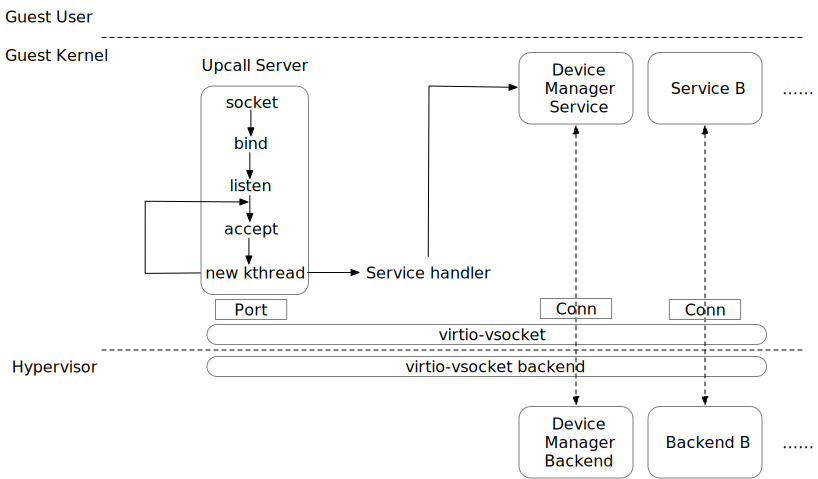

# `Upcall`

## What is `Upcall`?

`Upcall` is a direct communication tool between VMM and guest developed upon `vsock`. The server side of the `upcall` is a driver in guest kernel (kernel patches are needed for this feature) and it'll start to serve the requests after the kernel starts. And the client side is in Dragonball VMM , it'll be a thread that communicates with `vsock` through `uds`.

We want to keep the lightweight of the VM through the implementation of the `upcall`.

## What can `upcall` do?

We define specific operations in the device manager service (one of the services in `upcall` we developed) to perform device hotplug / hot-unplug including vCPU hotplug, `virtio-mmio` hotplug, and memory hotplug. We have accomplished device hotplug / hot-unplug directly through `upcall` in order to avoid the virtualization of ACPI to minimize virtual machines overhead. And there could be many other uses if other services are implemented.

## How to enable `upcall`?

`Upcall` needs a server in the guest kernel which will be several kernel patches for the `upcall` server itself and different services registered in the `upcall` server. It's currently tested on upstream Linux kernel 5.10.

To make it easy for users to use, we have open-source the `upcall` guest patches in [Dragonball experimental guest patches](../../../tools/packaging/kernel/patches/5.10.x/dragonball-experimental) and develop `upcall` support in [Kata guest kernel building script](../../../tools/packaging/kernel/build-kernel.sh).

You could use following command to download the upstream kernel (currently Dragonball uses 5.10.25) and put the `upcall` patches and other Kata patches into kernel code.

`sh build-kernel.sh -e -t dragonball -f setup`

`-e` here means experimental, mainly because `upcall` patches are not in upstream Linux kernel.
`-t dragonball` is for specifying hypervisor type
`-f` is for generating `.config` file

After this command, the kernel code with `upcall` and related `.config` file are all set up in the directory `kata-linux-dragonball-experimental-5.10.25-[config version]`. You can either manually compile the kernel with `make` command or following [Document for build-kernel.sh](../../../tools/packaging/kernel/README.md) to build and use this guest kernel.

Also, a client-side is also needed in VMM. Dragonball has already open-source the way to implement `upcall` client and Dragonball compiled with `dbs-upcall` feature will enable Dragonball client side.