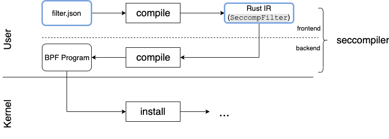

# Seccompiler

Provides easy-to-use Linux [seccomp-bpf][1] jailing.

Seccomp is a Linux kernel security feature which enables a tight control over
what kernel-level mechanisms a process has access to. This is typically used to
reduce the attack surface and exposed resources when running untrusted code.
This works by allowing users to write and set a BPF (Berkeley Packet Filter)
program for each process or thread, that intercepts syscalls and decides
whether the syscall is safe to execute.

Writing BPF programs by hand is difficult and error-prone. This crate provides
high-level wrappers for working with system call filtering.

## Supported platforms

Due to the fact that seccomp is a Linux-specific feature, this crate is
supported only on Linux systems.

Supported host architectures:
- Little-endian x86_64
- Little-endian aarch64

## Short seccomp tutorial

Linux supports seccomp filters as BPF programs, that are interpreted by the
kernel before each system call.

They are installed in the kernel using [`prctl(PR_SET_SECCOMP)`][2] or
[`seccomp(SECCOMP_SET_MODE_FILTER)`][3].

As input, the BPF program receives a C struct of the following type:

```C
struct seccomp_data {
    int nr; // syscall number.
    __u32 arch; // arch-specific value for validation purposes.
    __u64 instruction_pointer; // as the name suggests..
    __u64 args[6]; // syscall arguments.
};
```

In response, a filter returns an action, that can be either one of:

```C
#define SECCOMP_RET_KILL_PROCESS 0x80000000U /* kill the process */
#define SECCOMP_RET_KILL_THREAD  0x00000000U /* kill the thread */
#define SECCOMP_RET_TRAP         0x00030000U /* disallow and force a SIGSYS */
#define SECCOMP_RET_ERRNO        0x00050000U /* returns an errno */
#define SECCOMP_RET_TRACE        0x7ff00000U /* pass to a tracer or disallow */
#define SECCOMP_RET_LOG          0x7ffc0000U /* allow after logging */
#define SECCOMP_RET_ALLOW        0x7fff0000U /* allow */
```

## Design

The core concept of the library is the **filter**. It is an abstraction that
models a collection of syscall-mapped rules, coupled with on-match and
default actions, that logically describes a policy for dispatching actions
(e.g. Allow, Trap, Errno) for incoming system calls.

Seccompiler provides constructs for defining filters, compiling them into
loadable BPF programs and installing them in the kernel.

Filters are defined either with a JSON file or using Rust code, with
library-defined structures. Both representations are semantically equivalent
and model the rules of the filter. Choosing one or the other depends on the use
case and preference.

The core of the package is the module responsible for the BPF compilation.
It compiles seccomp filters expressed as Rust code, into BPF filters, ready to
be loaded into the kernel. This is the seccompiler **backend**.

The process of translating JSON filters into BPF goes through an extra step of
deserialization and validation (the **JSON frontend**), before reaching the
same backend for BPF codegen.

The Rust representation is therefore also an Intermediate Representation (IR)
of the JSON filter.
This modular implementation allows for extendability in regards to file
formats. All that is needed is a compatible frontend.

The diagram below illustrates the steps required for the JSON and Rust filters
to be compiled into BPF. The blue boxes represent potential user input.



### Filter definition

Let us take a closer look at what a filter is composed of, and how it is
defined:

The smallest unit of the filter is the `SeccompCondition`, which is a
comparison operation applied to the current system call. It’s parametrised by
the argument index, the length of the argument, the operator and the actual
expected value.

Going one step further, a `SeccompRule` is a vector of `SeccompCondition`s,
that must all match for the rule to be considered matched. In other words, a
rule is a collection of **and-bound** conditions for a system call.

Finally, at the top level, there’s the `SeccompFilter`. The filter can be
viewed as a collection of syscall-associated rules, with a predefined on-match
action and a default action that is returned if none of the rules match.

In a filter, each system call number maps to a vector of **or-bound** rules.
In order for the filter to match, it is enough that one rule associated to the
system call matches. A system call may also map to an empty rule vector, which
means that the system call will match, regardless of the actual arguments.

The following diagram models a simple filter, that only allows `accept4`,
`fcntl(any, F_SETFD, FD_CLOEXEC, ..)` and `fcntl(any, F_GETFD, ...)`.
For any other system calls, the process will be killed.


As specified earlier, there are two ways of expressing the filters:

1. JSON (documented in [json_format.md](docs/json_format.md));
2. Rust code (documented by the library).

See below examples of both representation methods, for a filter equivalent to
the diagram above:

#### Example JSON filter

```json
{
    "main_thread": {
        "mismatch_action": "kill_process",
        "match_action": "allow",
        "filter": [
            {
                "syscall": "accept4"
            },
            {
                "syscall": "fcntl",
                "args": [
                    {
                        "index": 1,
                        "type": "dword",
                        "op": "eq",
                        "val": 2,
                        "comment": "F_SETFD"
                    },
                    {
                        "index": 2,
                        "type": "dword",
                        "op": "eq",
                        "val": 1,
                        "comment": "FD_CLOEXEC"
                    }
                ]
            },
            {
                "syscall": "fcntl",
                "args": [
                    {
                        "index": 1,
                        "type": "dword",
                        "op": "eq",
                        "val": 1,
                        "comment": "F_GETFD"
                    }
                ]
            }
        ]
    }
}
```

Note that JSON files need to specify a name for each filter. While in the
example above there is only one (`main_thread`), other programs may be using
multiple filters.

#### Example Rust-based filter

```rust
SeccompFilter::new(
    // rule set - BTreeMap<i64, Vec<SeccompRule>>
    vec![
        (libc::SYS_accept4, vec![]),
        (
            libc::SYS_fcntl,
            vec![
                SeccompRule::new(vec![
                    Cond::new(1,
                        SeccompCmpArgLen::Dword,
                        SeccompCmpOp::Eq,
                        libc::F_SETFD as u64
                    )?,
                    Cond::new(
                        2,
                        SeccompCmpArgLen::Dword,
                        SeccompCmpOp::Eq,
                        libc::FD_CLOEXEC as u64,
                    )?,
                ])?,
                SeccompRule::new(vec![
                    Cond::new(
                        1,
                        SeccompCmpArgLen::Dword,
                        SeccompCmpOp::Eq,
                        libc::F_GETFD as u64,
                    )?
                ])?
            ]
        )
    ].into_iter().collect(),
    // mismatch_action
    SeccompAction::KillProcess,
    // match_action
    SeccompAction::Allow,
    // target architecture of filter
    TargetArch::x86_64,
)?
```

## Example usage

Using seccompiler in an application is a two-step process:

1. Compiling filters (into BPF)
2. Installing filters

### Compiling filters

A user application can compile the seccomp filters into loadable BPF either at
**runtime** or at **build time**.

At **runtime**, the process is straightforward, leveraging the seccompiler
library functions on hardcoded/file-based filters.

At **build-time,** an application can use a [cargo build script][4] that adds
seccompiler as a build-dependency and outputs at a predefined location
(e.g. using `env::var("OUT_DIR")`) the compiled filters, that have been
serialized to a binary format (e.g. [bincode][5]).
They can then be ingested by the application using `include_bytes!` and
deserialized before getting installed.
This build-time option can be used to shave off the filter compilation time
from the app startup time, if using a low-overhead binary format.

Regardless of the compilation moment, the process is the same:

For **JSON filters**, the compilation to loadable BPF is performed using the
`compile_from_json()` function:

```rust
let filters: BpfMap = seccompiler::compile_from_json(
    File::open("/path/to/json")?, // Accepts generic Read objects.
    seccompiler::TargetArch::x86_64,
)?;
```

`BpfMap` is another type exposed by the library, which maps thread
categories to BPF programs.

```rust
pub type BpfMap = HashMap<String, BpfProgram>;
```

Note that, in order to use the JSON functionality, you need to add the `json`
feature when importing the library.

For **Rust filters**, it’s enough to perform a `try_into()` cast, from a
`SeccompFilter` to a `BpfProgram`:

```rust
let seccomp_filter = SeccompFilter::new(
    rules,
    SeccompAction::Trap,
    SeccompAction::Allow,
    seccompiler::TargetArch::x86_64
)?;

let bpf_prog: BpfProgram = seccomp_filter.try_into()?;
```

### Installing filters

```rust
let bpf_prog: BpfProgram; // Assuming it was initialized with a valid filter.

seccompiler::apply_filter(&bpf_prog)?;
```

It’s interesting to note that installing the filter does not take ownership or
invalidate the BPF program, thanks to the kernel which performs a
`copy_from_user` on the program before installing it.

### Feature documentation

The documentation on [docs.rs](https://docs.rs/seccompiler/)
does not include the feature-gated json functionality.

In order to view the documentation including the optional json feature, you may
run:
`cargo doc --open --all-features`

## Seccomp best practices

- Before installing a filter, make sure that the current kernel version
supports the actions of the filter. This can be checked by inspecting the
output of: `cat /proc/sys/kernel/seccomp/actions_avail` or by calling the
`seccomp(SECCOMP_GET_ACTION_AVAIL)` syscall.

- The recommendation is to use an allow-list approach for the seccomp filter,
only allowing the bare minimum set of syscalls required for your application.
This is safer and more robust than a deny-list, which would need updating
whenever a new, dangerous system call is added to the kernel.

- When determining the set of system calls needed by an application, it is
recommended to exhaustively run all the code paths, while tracing with `strace`
or `perf`. It is also important to note that applications rarely use the system
call interface directly. They usually use libc wrappers which, depending on the
implementation, use different system calls for the same functionality
(e.g. `open` vs `openat`).

- Linux supports installing multiple seccomp filters on a thread/process. They
are all evaluated in-order and the most restrictive action is chosen. Unless
your application needs to install multiple filters on a thread, it is
recommended to deny the `prctl` and `seccomp` system calls, to avoid having
malicious actors further restrict the installed filters.

- The Linux vDSO usually causes some system calls to run entirely in userspace,
bypassing the seccomp filters (for example `clock_gettime`). This can lead to
failures when running on machines that don't support the same vDSO system
calls, if the said syscalls are used but not allowed. It is recommended to also
test the seccomp filters on a machine that doesn't have vDSO, if possible.

- For minimising system call overhead, it is recommended to enable the BPF Just
in Time (JIT) compiler. After the BPF program is loaded, the kernel will
translate the BPF code into native CPU instructions, for maximum efficieny.
It can be configured via: `/proc/sys/net/core/bpf_jit_enable`.

[1]: https://www.kernel.org/doc/html/latest/userspace-api/seccomp_filter.html
[2]: https://man7.org/linux/man-pages/man2/prctl.2.html
[3]: https://man7.org/linux/man-pages/man2/seccomp.2.html
[4]: https://doc.rust-lang.org/cargo/reference/build-scripts.html
[5]: https://github.com/bincode-org/bincode
