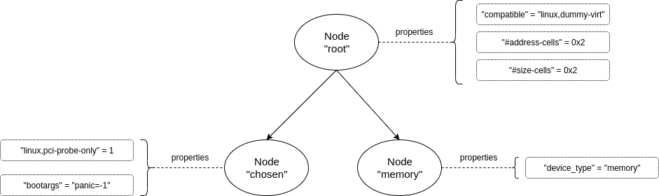

# vm-fdt

The vm-fdt crate provides the ability to write Flattened Devicetree blobs as
defined in the
[Devicetree specification](https://devicetree-specification.readthedocs.io/en/stable/flattened-format.html).

In projects such as
[Crosvm](https://chromium.googlesource.com/chromiumos/platform/crosvm/) and
[Firecracker](https://github.com/firecracker-microvm/firecracker) the device
tree is used to specify the virtual machine topology (memory, vcpu, caches,
interrupts, and others) when booting the OS.

## Design

In vm-fdt we define and work with the following primitives:

- FDT writer (`FdtWriter`),
- nodes (`FdtWriterNode`), and
- properties (defined as key-value pairs).

An FDT has one or multiple nodes, and each node can optionally have
properties and child nodes, creating a tree structure.

The [`FdtWriter` structure](src/writer.rs) provides an interface suitable
for dynamically generating a Devicetree blob at runtime. The supported
operations are:

1. **Creating a node**. This is done by calling `begin_node` on the `FdtWriter`.
   The call returns an object of type `FdtWriterNode` on which we can set
   properties (using the `property_*` functions as defined below), or add
   child nodes (via nested calls to `begin_node`). Properties for the node
   can only be added *before* creating child nodes (as defined in the
   specification). Each node must end with a call to the `end_node` function.
1. **Create properties**. Properties are key-value pairs, where the key is a
   string, and the value is a raw bytes array. To make it easier to use, such
   that the caller of the FDT interface does not need to create a raw byte
   array, we define wrappers over common property types as follows:
  * `property_null` (an empty property)
  * `property_string`
  * `property_string_list`
  * `property_u32`
  * `property_u64`
  * `property_array_u32`
  * `property_array_u64`
  * `property` (raw byte array)

## Threat Model

*Input*: The caller of the vm-fdt public interface is trusted.

*Output*: The content of the FDT blob resides in memory, and it’s trusted. The
memory allocated by this crate is directly proportional with the number of
nodes and properties defined by the user (through the `property*` and
`begin_node` functions).

|#NR	|Threat	|Mitigation	|
|---	|---	|---	|
|1	|Due to a programming error the FDT code causes large memory allocations.|The operator of the vm-fdt interface is trusted, and the memory allocations are directly proportional to the number of calls to the public FDT interface. At the vm-fdt level, the maximum size allowed for the blob is 4.3 GB. This is enforced by checking that the length of the data blob fits in an u32, and the maximum value of an u32 is 4294967295 (~4.3 GB). The caller of the vm-fdt interface can check the size of the FDT blob upon calling the finish function.	|
|2	|Passing large arrays of memory reservations when initializing the FdtWriter leads to undefined behavior.	|The length of the memory reservations is checked. All subsequent operations based on input are checked for overflows.	|
|3	|Passing overlapping memory reservations when initializing the FdtWriter leads to undefined behavior when loading the blob in guest memory	|The FDT specification explicitly defines that the memory reservation entries MUST not overlap. This is enforced by the FdtWriter, and checked in the [unit tests.](https://github.com/rust-vmm/vm-fdt/blob/c89583fa4975cd80a232bd4cdd0efd74c2ca219d/src/writer.rs#L897)	|

## Usage

The following code is creating an FDT blob with a root node that has 3
properties ("compatible", "#address-cells", and "#size-cells"), and contains
2 child nodes:

1. "chosen", which has 2 properties ("linux,pci-probe-only" and "bootargs").
1. "memory", which has one property ("device_type")

Below is a graphic representation of the FDT.



```rust
use vm_fdt::{FdtWriter, Error};

fn create_fdt() -> Result<Vec<u8>, Error> {
   let mut fdt = FdtWriter::new()?;

   let root_node = fdt.begin_node("root")?;
   fdt.property_string("compatible", "linux,dummy-virt")?;
   fdt.property_u32("#address-cells", 0x2)?;
   fdt.property_u32("#size-cells", 0x2)?;

   let chosen_node = fdt.begin_node("chosen")?;
   fdt.property_u32("linux,pci-probe-only", 1)?;
   fdt.property_string("bootargs", "panic=-1 console=hvc0")?;
   fdt.end_node(chosen_node)?;

   let memory_node = fdt.begin_node("memory")?;
   fdt.property_string("device_type", "memory")?;
   fdt.end_node(memory_node)?;

   fdt.end_node(root_node)?;

   fdt.finish()
}
```

### Features

This crate defines a development feature: `long_running_test`. This feature
SHOULD NOT be used in production as it might enable functionality that is safe
only for development use cases.

## License

This project is licensed under either of

- [Apache License](http://www.apache.org/licenses/LICENSE-2.0), Version 2.0
- [BSD-3-Clause License](https://opensource.org/licenses/BSD-3-Clause)
