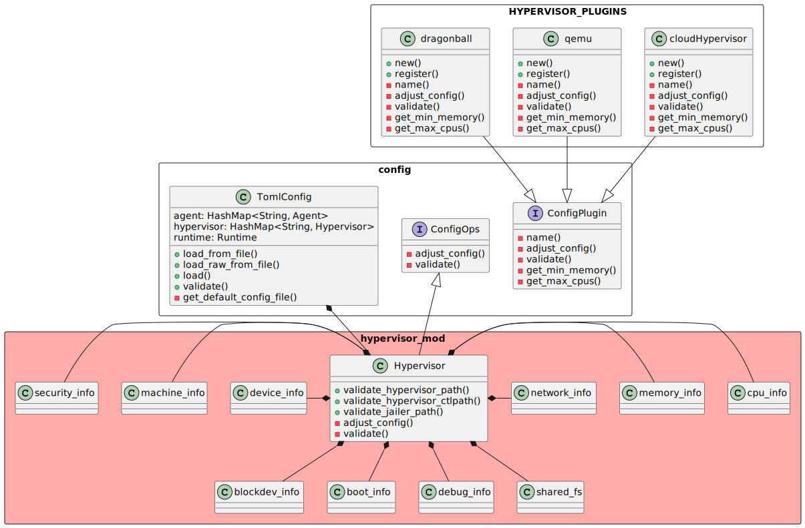
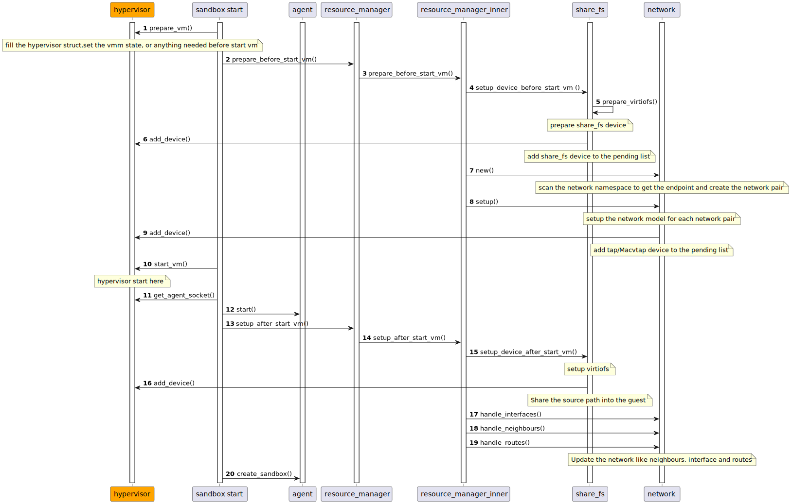

# Multi-VMM Support for runtime-rs

## 0. Status

Multiple external hypervisors are supported in the Rust runtime, including QEMU, Firecracker, and Cloud Hypervisor. This document outlines the key implementation details for multi-VMM support in the Rust runtime.

## 1. Hypervisor Configuration

The diagram below provides an overview of the hypervisor configuration:



VMM configuration information is loaded during runtime instance initialization. The following key functions are critical to this process:

### `VirtContainer::init()`

This function initializes the runtime handler and registers plugins into the `HYPERVISOR_PLUGINS` registry. Different hypervisors require different plugins:

```rust
#[async_trait]
impl RuntimeHandler for VirtContainer {
    fn init() -> Result<()> {
        // register
        let dragonball_config = Arc::new(DragonballConfig::new());
        register_hypervisor_plugin("dragonball", dragonball_config);
        Ok(())
    }
}
```

Currently, the QEMU plugin is fully implemented, we can take it as an example. The QEMU plugin defines methods to adjust and validate the hypervisor configuration file. These methods can be customized as needed.

Details of the QEMU plugin implementation can be found in [QEMU Plugin Implementation](../../../libs/kata-types/src/config/hypervisor/qemu.rs)

When loading the TOML configuration, the registered plugins are invoked to adjust and validate the configuration file:

```rust
async fn try_init(&mut self, spec: &oci::Spec) -> Result<()> {
    ...
    let config = load_config(spec).context("load config")?;
    ...
}
```

### `new_instance`

This function creates a runtime instance that manages container and sandbox operations. During this process, a hypervisor instance is created. For QEMU, the hypervisor instance is instantiated and configured with the appropriate configuration file:

```rust
async fn new_hypervisor(toml_config: &TomlConfig) -> Result<Arc<dyn Hypervisor>> {
    let hypervisor_name = &toml_config.runtime.hypervisor_name;
    let hypervisor_config = toml_config
        .hypervisor
        .get(hypervisor_name)
        .ok_or_else(|| anyhow!("failed to get hypervisor for {}", &hypervisor_name))
        .context("get hypervisor")?;

    // TODO: support other hypervisor
    match hypervisor_name.as_str() {
        HYPERVISOR_DRAGONBALL => {
            let mut hypervisor = Dragonball::new();
            hypervisor
                .set_hypervisor_config(hypervisor_config.clone())
                .await;
            Ok(Arc::new(hypervisor))
        }
        _ => Err(anyhow!("Unsupported hypervisor {}", &hypervisor_name)),
    }
}
```

## 2. Hypervisor Trait

[The hypervisor trait must be implemented to support multi-VMM architectures.](./src/lib.rs)

```rust
pub trait Hypervisor: Send + Sync {
    // vm manager
    async fn prepare_vm(&self, id: &str, netns: Option<String>) -> Result<()>;
    async fn start_vm(&self, timeout: i32) -> Result<()>;
    async fn stop_vm(&self) -> Result<()>;
    async fn pause_vm(&self) -> Result<()>;
    async fn save_vm(&self) -> Result<()>;
    async fn resume_vm(&self) -> Result<()>;

    // device manager
    async fn add_device(&self, device: device::Device) -> Result<()>;
    async fn remove_device(&self, device: device::Device) -> Result<()>;

    // utils
    async fn get_agent_socket(&self) -> Result<String>;
    async fn disconnect(&self);
    async fn hypervisor_config(&self) -> HypervisorConfig;
    async fn get_thread_ids(&self) -> Result<VcpuThreadIds>;
    async fn get_pids(&self) -> Result<Vec<u32>>;
    async fn cleanup(&self) -> Result<()>;
    async fn check(&self) -> Result<()>;
    async fn get_jailer_root(&self) -> Result<String>;
    async fn save_state(&self) -> Result<HypervisorState>;
   }
```

In the current design, the VM startup process follows these steps:


