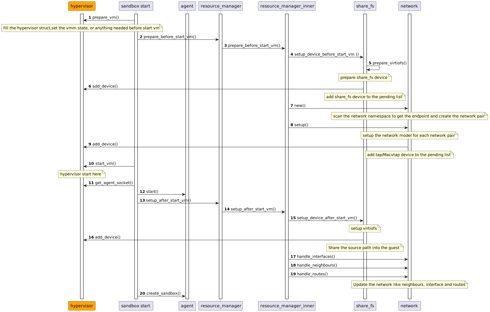

# Multi-vmm support for runtime-rs

## 0. Status

External hypervisor support is currently being developed.

See [the main tracking issue](https://github.com/kata-containers/kata-containers/issues/4634)
for further details.

Some key points for supporting multi-vmm in rust runtime.
## 1. Hypervisor Config

The diagram below gives an overview for the hypervisor config


VMM's config info will be loaded when initialize the runtime instance, there are some important functions need to be focused on. 
### `VirtContainer::init()`

This function initialize the runtime handler. It will register the plugins into the HYPERVISOR_PLUGINS. Different plugins are needed for different hypervisors. 
```rust
#[async_trait]
impl RuntimeHandler for VirtContainer {
    fn init() -> Result<()> {
        // register
        let dragonball_config = Arc::new(DragonballConfig::new());
        register_hypervisor_plugin("dragonball", dragonball_config);
        Ok(())
    }
}
```

[This is the plugin method for QEMU. Other VMM plugin methods haven't support currently.](../../../libs/kata-types/src/config/hypervisor/qemu.rs)
QEMU plugin defines the methods to adjust and validate the hypervisor config file, those methods could be modified if it is needed.

After that, when loading the TOML config, the plugins will be called to adjust and validate the config file.
```rust
async fn try_init(&mut self, spec: &oci::Spec) -> Result<()> {、
    ...
    let config = load_config(spec).context("load config")?;
    ...
}
```

### new_instance

This function will create a runtime_instance which include the operations for container and sandbox.  At the same time, a hypervisor instance will be created.  QEMU instance will be created here as well, and set the hypervisor config file
```rust
async fn new_hypervisor(toml_config: &TomlConfig) -> Result<Arc<dyn Hypervisor>> {
    let hypervisor_name = &toml_config.runtime.hypervisor_name;
    let hypervisor_config = toml_config
        .hypervisor
        .get(hypervisor_name)
        .ok_or_else(|| anyhow!("failed to get hypervisor for {}", &hypervisor_name))
        .context("get hypervisor")?;

    // TODO: support other hypervisor
    match hypervisor_name.as_str() {
        HYPERVISOR_DRAGONBALL => {
            let mut hypervisor = Dragonball::new();
            hypervisor
                .set_hypervisor_config(hypervisor_config.clone())
                .await;
            Ok(Arc::new(hypervisor))
        }
        _ => Err(anyhow!("Unsupported hypervisor {}", &hypervisor_name)),
    }
}
```

## 2. Hypervisor Trait

[To support multi-vmm, the hypervisor trait need to be implemented.](./src/lib.rs)
```rust
pub trait Hypervisor: Send + Sync {
    // vm manager
    async fn prepare_vm(&self, id: &str, netns: Option<String>) -> Result<()>;
    async fn start_vm(&self, timeout: i32) -> Result<()>;
    async fn stop_vm(&self) -> Result<()>;
    async fn pause_vm(&self) -> Result<()>;
    async fn save_vm(&self) -> Result<()>;
    async fn resume_vm(&self) -> Result<()>;
    
    // device manager
    async fn add_device(&self, device: device::Device) -> Result<()>;
    async fn remove_device(&self, device: device::Device) -> Result<()>;
    
    // utils
    async fn get_agent_socket(&self) -> Result<String>;
    async fn disconnect(&self);
    async fn hypervisor_config(&self) -> HypervisorConfig;
    async fn get_thread_ids(&self) -> Result<VcpuThreadIds>;
    async fn get_pids(&self) -> Result<Vec<u32>>;
    async fn cleanup(&self) -> Result<()>;
    async fn check(&self) -> Result<()>;
    async fn get_jailer_root(&self) -> Result<String>;
    async fn save_state(&self) -> Result<HypervisorState>;
   }
```
In current design, VM will be started in the following steps.


