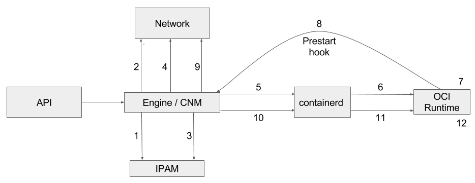

Table of Contents
=================

* [What is it?](#what-is-it)
* [Background](#background)
* [Out of scope](#out-of-scope)
    * [virtcontainers and Kubernetes CRI](#virtcontainers-and-kubernetes-cri)
* [Design](#design)
    * [Sandboxes](#sandboxes)
    * [Hypervisors](#hypervisors)
    * [Agents](#agents)
* [API](#api)
* [Networking](#networking)
    * [CNM](#cnm)
* [Storage](#storage)
* [Devices](#devices)
    * [How to pass a device using VFIO-PCI passthrough](#how-to-pass-a-device-using-vfio-pci-passthrough)
    * [How to pass a device using VFIO-AP passthrough](#how-to-pass-a-device-using-vfio-ap-passthrough)
* [Developers](#developers)
* [Persistent storage plugin support](#persistent-storage-plugin-support)
* [Experimental features](#experimental-features)

# What is it?

`virtcontainers` is a Go library that can be used to build hardware-virtualized container
runtimes.

# Background

The few existing VM-based container runtimes (Clear Containers, runV, rkt's
KVM stage 1) all share the same hardware virtualization semantics but use different
code bases to implement them. `virtcontainers`'s goal is to factorize this code into
a common Go library.

Ideally, VM-based container runtime implementations would become translation
layers from the runtime specification they implement (e.g. the [OCI runtime-spec][oci]
or the [Kubernetes CRI][cri]) to the `virtcontainers` API.

`virtcontainers` was used as a foundational package for the [Clear Containers][cc] [runtime][cc-runtime] implementation.

[oci]: https://github.com/opencontainers/runtime-spec
[cri]: https://git.k8s.io/community/contributors/devel/sig-node/container-runtime-interface.md
[cc]: https://github.com/clearcontainers/
[cc-runtime]: https://github.com/clearcontainers/runtime/

# Out of scope

Implementing a container runtime is out of scope for this project. Any
tools or executables in this repository are only provided for demonstration or
testing purposes.

## virtcontainers and Kubernetes CRI

`virtcontainers`'s API is loosely inspired by the Kubernetes [CRI][cri] because
we believe it provides the right level of abstractions for containerized sandboxes.
However, despite the API similarities between the two projects, the goal of
`virtcontainers` is _not_ to build a CRI implementation, but instead to provide a
generic, runtime-specification agnostic, hardware-virtualized containers
library that other projects could leverage to implement CRI themselves.

# Design

## Sandboxes

The `virtcontainers` execution unit is a _sandbox_, i.e. `virtcontainers` users start sandboxes where
containers will be running.

`virtcontainers` creates a sandbox by starting a virtual machine and setting the sandbox
up within that environment. Starting a sandbox means launching all containers with
the VM sandbox runtime environment.

## Hypervisors

The `virtcontainers` package relies on hypervisors to start and stop virtual machine where
sandboxes will be running. An hypervisor is defined by an Hypervisor interface implementation,
and the default implementation is the QEMU one.

### Update cloud-hypervisor client code

See [docs](pkg/cloud-hypervisor/README.md)

## Agents

During the lifecycle of a container, the runtime running on the host needs to interact with
the virtual machine guest OS in order to start new commands to be executed as part of a given
container workload, set new networking routes or interfaces, fetch a container standard or
error output, and so on.
There are many existing and potential solutions to resolve that problem and `virtcontainers` abstracts
this through the Agent interface.

# API

The high level `virtcontainers` API includes `Sandbox API` and `Container API`.
For further details, see the [API documentation](documentation/api/1.0/api.md).

# Networking

`virtcontainers` supports the 2 major container networking models: the [Container Network Model (CNM)][cnm] and the [Container Network Interface (CNI)][cni].

Typically the former is the Docker default networking model while the later is used on Kubernetes deployments.

[cnm]: https://github.com/docker/libnetwork/blob/master/docs/design.md
[cni]: https://github.com/containernetworking/cni/

## CNM



__CNM lifecycle__

1.  `RequestPool`

2.  `CreateNetwork`

3.  `RequestAddress`

4.  `CreateEndPoint`

5.  `CreateContainer`

6.  Create `config.json`

7.  Create PID and network namespace

8.  `ProcessExternalKey`

9.  `JoinEndPoint`

10. `LaunchContainer`

11. Launch

12. Run container


__Runtime network setup with CNM__

1. Read `config.json`

2. Create the network namespace ([code](https://github.com/containers/virtcontainers/blob/0.5.0/cnm.go#L108-L120))

3. Call the prestart hook (from inside the netns) ([code](https://github.com/containers/virtcontainers/blob/0.5.0/api.go#L46-L49))

4. Scan network interfaces inside netns and get the name of the interface created by prestart hook ([code](https://github.com/containers/virtcontainers/blob/0.5.0/cnm.go#L70-L106))

5. Create bridge, TAP, and link all together with network interface previously created ([code](https://github.com/containers/virtcontainers/blob/0.5.0/network.go#L123-L205))

6. Start VM inside the netns and start the container ([code](https://github.com/containers/virtcontainers/blob/0.5.0/api.go#L66-L70))

__Drawbacks of CNM__

There are three drawbacks about using CNM instead of CNI:
* The way we call into it is not very explicit: Have to re-exec `dockerd` binary so that it can accept parameters and execute the prestart hook related to network setup.
* Implicit way to designate the network namespace: Instead of explicitly giving the netns to `dockerd`, we give it the PID of our runtime so that it can find the netns from this PID. This means we have to make sure being in the right netns while calling the hook, otherwise the VETH pair will be created with the wrong netns.
* No results are back from the hook: We have to scan the network interfaces to discover which one has been created inside the netns. This introduces more latency in the code because it forces us to scan the network in the `CreateSandbox` path, which is critical for starting the VM as quick as possible.

# Storage

See [Kata Containers Architecture](../../../docs/design/architecture.md#storage).

# Devices

Support has been added to pass [VFIO](https://www.kernel.org/doc/Documentation/vfio.txt) 
assigned devices on the docker command line with --device.
Support for passing other devices including block devices with --device has
not been added yet. [PCI](#how-to-pass-a-device-using-vfio-pci-passthrough) and
[AP](#how-to-pass-a-device-using-vfio-ap-passthrough) (IBM Z Crypto Express
cards) devices can be passed.

## How to pass a device using VFIO-PCI passthrough

1. Requirements

IOMMU group represents the smallest set of devices for which the IOMMU has
visibility and which is isolated from other groups.  VFIO uses this information
to enforce safe ownership of devices for userspace. 

You will need Intel VT-d capable hardware. Check if IOMMU is enabled in your host
kernel by verifying `CONFIG_VFIO_NOIOMMU` is not in the kernel configuration. If it is set,
you will need to rebuild your kernel.

The following kernel configuration options need to be enabled:
```
CONFIG_VFIO_IOMMU_TYPE1=m 
CONFIG_VFIO=m
CONFIG_VFIO_PCI=m
```

In addition, you need to pass `intel_iommu=on` on the kernel command line.

2. Identify BDF(Bus-Device-Function) of the PCI device to be assigned.


```
$ lspci -D | grep -e Ethernet -e Network
0000:01:00.0 Ethernet controller: Intel Corporation Ethernet Controller 10-Gigabit X540-AT2 (rev 01)

$ BDF=0000:01:00.0
```

3. Find vendor and device id.

```
$ lspci -n -s $BDF
01:00.0 0200: 8086:1528 (rev 01)
```

4. Find IOMMU group.

```
$ readlink /sys/bus/pci/devices/$BDF/iommu_group
../../../../kernel/iommu_groups/16
```

5. Unbind the device from host driver.

```
$ echo $BDF | sudo tee /sys/bus/pci/devices/$BDF/driver/unbind
```

6. Bind the device to `vfio-pci`.

```
$ sudo modprobe vfio-pci
$ echo 8086 1528 | sudo tee /sys/bus/pci/drivers/vfio-pci/new_id
$ echo $BDF | sudo tee --append /sys/bus/pci/drivers/vfio-pci/bind
```

7. Check `/dev/vfio`

```
$ ls /dev/vfio
16 vfio
```

8. Start a Clear Containers container passing the VFIO group on the docker command line.

```
docker run -it --device=/dev/vfio/16 centos/tools bash
```

9. Running `lspci` within the container should show the device among the 
PCI devices. The driver for the device needs to be present within the
Clear Containers kernel. If the driver is missing,  you can add it to your
custom container kernel using the [osbuilder](https://github.com/clearcontainers/osbuilder)
tooling.

## How to pass a device using VFIO-AP passthrough

IBM Z mainframes (s390x) use the AP (Adjunct Processor) bus for their Crypto
Express hardware security modules. Such devices can be passed over VFIO, which
is also supported in Kata. Pass-through happens separated by adapter and
domain, i.e. a passable VFIO device has one or multiple adapter-domain
combinations.

1. You must follow the [kernel documentation for preparing VFIO-AP passthrough](https://www.kernel.org/doc/html/latest/s390/vfio-ap.html).
In short, your host kernel should have the following enabled or available as
module (in case of modules, load the modules accordingly, e.g. through
`modprobe`). If one is missing, you will have to update your kernel
accordingly, e.g. through recompiling.

```
CONFIG_VFIO_AP
CONFIG_VFIO_IOMMU_TYPE1
CONFIG_VFIO
CONFIG_VFIO_MDEV
CONFIG_VFIO_MDEV_DEVICE
CONFIG_S390_AP_IOMMU
```

2. Set the AP adapter(s) and domain(s) you want to pass in `/sys/bus/ap/apmask`
and `/sys/bus/ap/aqmask` by writing their negative numbers. Assuming you
want to pass 06.0032, you'd run

```sh
$ echo -0x6 | sudo tee /sys/bus/ap/apmask > /dev/null
$ echo -0x32 | sudo tee /sys/bus/ap/aqmask > /dev/null
```

3. Create one or multiple mediated devices -- one per container you want to
pass to. You must write a UUID for the device to
`/sys/devices/vfio_ap/matrix/mdev_supported_types/vfio_ap-passthrough/create`.
You can use `uuidgen` for generating the UUID, e.g.

```sh
$ uuidgen | sudo tee /sys/devices/vfio_ap/matrix/mdev_supported_types/vfio_ap-passthrough/create
a297db4a-f4c2-11e6-90f6-d3b88d6c9525
```

4. Set the AP adapter(s) and domain(s) you want to pass per device by writing
their numbers to `/sys/devices/vfio_ap/matrix/${UUID}/assign_adapter` and
`assign_domain` in the same directory. For the UUID from step 3, that would be

```sh
$ echo 0x6 | sudo tee /sys/devices/vfio_ap/matrix/a297db4a-f4c2-11e6-90f6-d3b88d6c9525/assign_adapter > /dev/null
$ echo 0x32 | sudo tee /sys/devices/vfio_ap/matrix/a297db4a-f4c2-11e6-90f6-d3b88d6c9525/assign_domain > /dev/null
```

5. Find the IOMMU group of the mediated device by following the link from
`/sys/devices/vfio_ap/matrix/${UUID}/iommu_group`. There should be a
correspondent VFIO device in `/dev/vfio`.

```sh
$ readlink /sys/devices/vfio_ap/matrix/a297db4a-f4c2-11e6-90f6-d3b88d6c9525/iommu_group
../../../../kernel/iommu_groups/0
$ ls /dev/vfio
0 vfio
```

6. This device can now be passed. To verify the cards are there, you can use
`lszcrypt` from `s390-tools` (`s390-tools` in Alpine, Debian, and Ubuntu,
`s390utils` in Fedora). With `lszcrypt`, you can see the cards after the
[configuration time](https://www.ibm.com/support/knowledgecenter/en/linuxonibm/com.ibm.linux.z.ubdd/ludd_t_crypt_add.html)
has passed.

```sh
$ sudo docker run -it --device /dev/vfio/0 ubuntu
$ lszcrypt
CARD.DOMAIN TYPE  MODE        STATUS  REQUESTS
----------------------------------------------
06          CEX7C CCA-Coproc  online         1
06.0032     CEX7C CCA-Coproc  online         1
```

# Developers

For information on how to build, develop and test `virtcontainers`, see the
[developer documentation](documentation/Developers.md).

# Persistent storage plugin support

See the [persistent storage plugin documentation](persist/plugin).

# Experimental features

See the [experimental features documentation](experimental).
