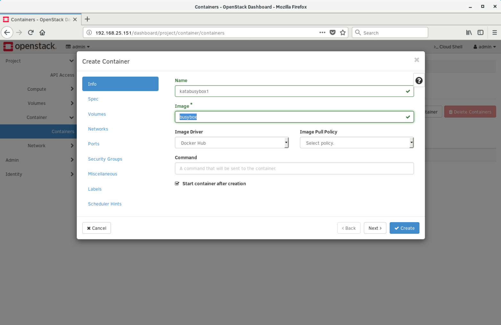
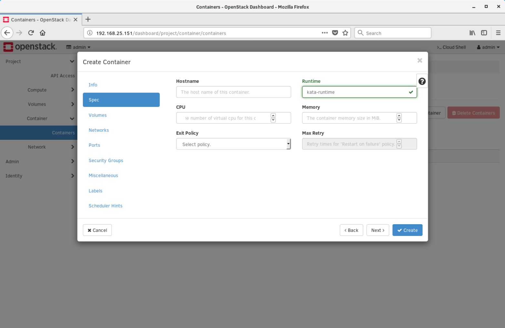
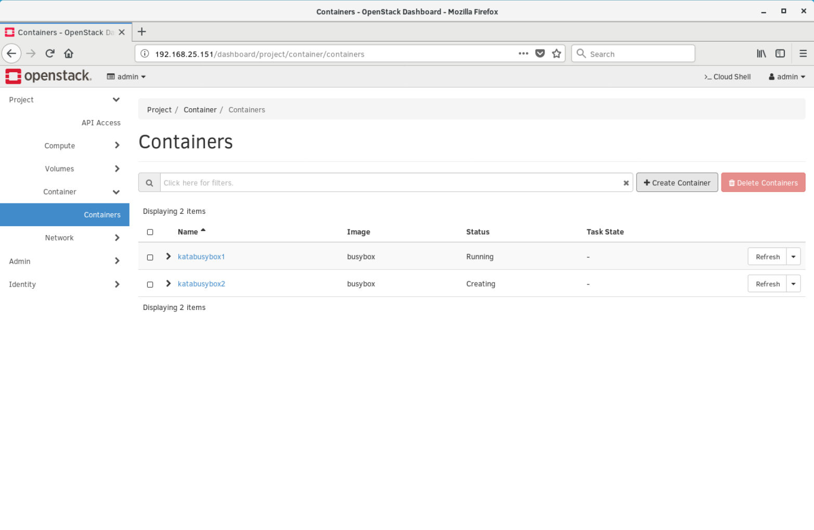
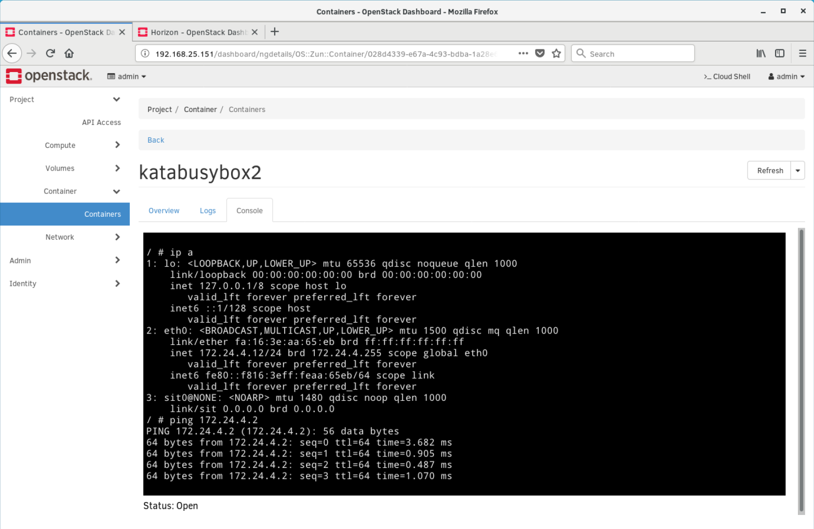
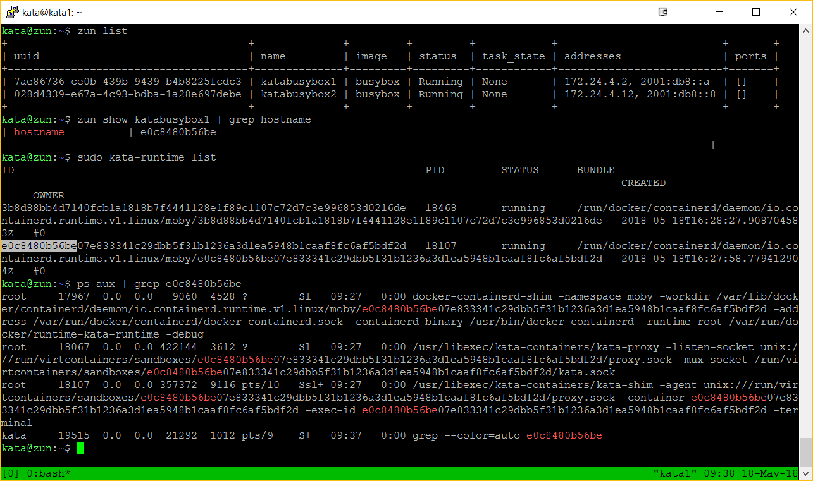

# OpenStack Zun DevStack working with Kata Containers
## Introduction

This guide describes how to get Kata Containers to work with OpenStack Zun
using DevStack on Ubuntu 16.04. Running DevStack with this guide will setup
Docker and Clear Containers 2.0, which you replace with Kata Containers.
Currently, the instructions are based on the following links:

- https://docs.openstack.org/zun/latest/contributor/quickstart.html

- https://docs.openstack.org/zun/latest/admin/clear-containers.html

- https://github.com/kata-containers/documentation/blob/master/install/ubuntu-installation-guide.md


## Install Git to use with DevStack

```
sudo apt install git
```

## Setup OpenStack DevStack
The following commands will sync DevStack from GitHub, create your
`local.conf` file, assign your host IP to this file, enable Clear
Containers, start DevStack, and set the environment variables to use
`zun` on the command line.
```
sudo mkdir -p /opt/stack
sudo chown $USER /opt/stack
git clone https://git.openstack.org/openstack-dev/devstack /opt/stack/devstack
HOST_IP="$(ip addr | grep 'state UP' -A2 | tail -n1 | awk '{print $2}' | cut -f1 -d'/')"
git clone https://git.openstack.org/openstack/zun /opt/stack/zun
cat /opt/stack/zun/devstack/local.conf.sample \
    | sed "s/HOST_IP=.*/HOST_IP=$HOST_IP/" \
    > /opt/stack/devstack/local.conf
sed -i "s/KURYR_CAPABILITY_SCOPE=.*/KURYR_CAPABILITY_SCOPE=local/" /opt/stack/devstack/local.conf
echo "ENABLE_CLEAR_CONTAINER=true" >> /opt/stack/devstack/local.conf
/opt/stack/devstack/stack.sh
source /opt/stack/devstack/openrc admin admin
```

The previous commands start OpenStack DevStack with Zun support. You can test
it using `runc` as shown by the following commands to make sure everything
installed correctly and is working.

```
zun run --name test cirros ping -c 4 8.8.8.8
zun list
zun logs test
zun delete test
```

## Install `kata-runtime`, `kata-shim`, and `kata-proxy`

```
sudo sh -c "echo 'deb http://download.opensuse.org/repositories/home:/katacontainers:/release/xUbuntu_$(lsb_release -rs)/ /' >> /etc/apt/sources.list.d/kata-containers.list"
curl -sL  https://download.opensuse.org/repositories/home:/katacontainers:/release/xUbuntu_$(lsb_release -rs)/Release.key | sudo apt-key add -
sudo -E apt-get update
sudo -E apt-get -y install kata-runtime kata-proxy kata-shim
```

## Update Docker with new Kata Containers runtime

The following commands replace the Clear Containers 2.x runtime setup with
DevStack, with Kata Containers:

```
sudo sed -i 's/"cor"/"kata-runtime"/' /etc/docker/daemon.json
sudo sed -i 's/"\/usr\/bin\/cc-oci-runtime"/"\/usr\/bin\/kata-runtime"/' /etc/docker/daemon.json
sudo systemctl daemon-reload
sudo systemctl restart docker
```

## Test that everything works in both Docker and OpenStack Zun

```
sudo docker run -ti --runtime kata-runtime busybox sh
zun run --name kata --runtime kata-runtime cirros ping -c 4 8.8.8.8
zun list
zun logs kata

zun delete kata
```

## Stop DevStack and clean up system (Optional)

```
/opt/stack/devstack/unstack.sh
/opt/stack/devstack/clean.sh
```

## Restart DevStack and reset CC 2.x runtime to `kata-runtime`

Run the following commands if you already setup Kata Containers and want to
restart DevStack:

```
/opt/stack/devstack/unstack.sh
/opt/stack/devstack/clean.sh
/opt/stack/devstack/stack.sh
source /opt/stack/devstack/openrc admin admin
sudo sed -i 's/"cor"/"kata-runtime"/' /etc/docker/daemon.json
sudo sed -i 's/"\/usr\/bin\/cc-oci-runtime"/"\/usr\/bin\/kata-runtime"/' /etc/docker/daemon.json
sudo systemctl daemon-reload
sudo systemctl restart docker
```



Figure 1: Create a busybox container image



Figure 2: Select `kata-runtime` to use



Figure 3: Two busybox containers successfully launched



Figure 4: Test connectivity between Kata Containers



Figure 5: CLI for Zun
